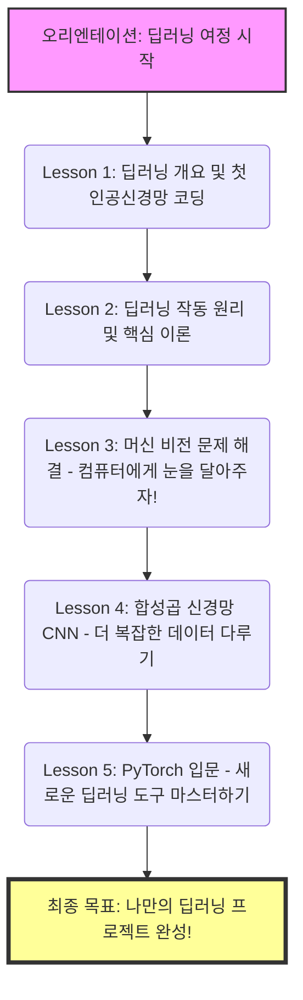

# 딥러닝 입문: Introduction (오리엔테이션)

안녕하세요! 딥러닝의 세계에 오신 것을 환영합니다. 🎉
방금 공유해주신 트랜스크립트는 이 강의의 **'오리엔테이션(Introduction)'**에 해당합니다. 강사인 Jon Krohn이 자신을 소개하고, 앞으로 우리가 이 강의를 통해 무엇을 배우게 될지(커리큘럼)를 안내하는 내용입니다.

아직 본격적인 이론이나 코드가 등장하지는 않았지만, 딥러닝을 처음 배우시는 입장에서 앞으로의 여정을 한눈에 파악하실 수 있도록 알기 쉽게 풀어서 설명해 드릴게요.

---

## 🗺️ 앞으로의 여정 (Course Roadmap)

강사가 말한 커리큘럼을 시각적으로 쉽게 이해할 수 있도록 마인드맵 형태의 다이어그램으로 정리해 보았습니다. 우리가 딥러닝이라는 높은 산을 어떻게 등반할지 미리 지도를 그려보는 것과 같습니다.



### 각 레슨별 미리보기 🔍
*   **Lesson 1**: 딥러닝이 도대체 무엇인지 감을 잡고, 아주 간단한 '인공 신경망'을 직접 코드로 짜봅니다. (맛보기 단계!)
*   **Lesson 2**: 딥러닝이 내부적으로 어떻게 학습을 하는지, 그 핵심 원리를 배웁니다. 자동차로 치면 엔진이 어떻게 돌아가는지 원리를 살짝 들여다보는 시간입니다.
*   **Lesson 3**: 배운 이론을 바탕으로 '머신 비전(Machine Vision)' 문제를 풉니다. 즉, 컴퓨터가 이미지를 보고 무엇인지 맞히게 하는 방법을 배웁니다.
*   **Lesson 4**: 이미지를 분석하는 데 특화된 **합성곱 신경망(CNN)**이라는 고급 기술을 배워서, 더 크고 복잡한 데이터를 다룹니다.
*   **Lesson 5**: 지금까지 사용하던 도구(TensorFlow, Keras) 외에 요즘 가장 핫한 도구인 **PyTorch**를 배웁니다. 도구를 다양하게 쓸 줄 알면 실력이 훨씬 좋아집니다.

---

## 🛠️ 실습 환경 세팅 가이드 (준비 운동)

오늘 강의 영상에서는 코드가 나오지 않았지만, 앞으로의 실습을 위해 미리 **도마와 칼(개발 환경)**을 준비해두어야 합니다. 딥러닝 요리를 하기 위한 주방을 꾸며보겠습니다.

가장 추천하는 초보자용 환경은 **Google Colab(구글 코랩)**입니다. 내 컴퓨터 성능이 좋지 않아도, 구글의 강력한 컴퓨터를 무료로 빌려서 인터넷 창에서 바로 실습할 수 있습니다. (설치 과정이 필요 없어서 초보자에게 최고입니다!)

### [Step-by-Step] 구글 코랩 시작하기
1. **구글 크롬 브라우저**를 엽니다.
2. 구글 계정으로 **로그인**합니다.
3. 주소창에 `https://colab.research.google.com/` 를 입력하고 접속합니다.
4. 팝업창에서 우측 하단의 **[새 노트]** 파란색 버튼을 클릭합니다.
5. 빈 화면(노트북)이 열립니다. 이제 여기에 코드를 적고 실행할 수 있습니다!

**💡 첫 번째 코드 실행해보기 (테스트)**
방금 열린 코랩 화면의 회색 네모 박스(코드 셀)에 아래 코드를 복사해서 붙여넣고, 박스 왼쪽의 ▶️(재생 버튼)을 눌러보세요.

```python
# 내 환경에 설치된 텐서플로우(TensorFlow) 버전 확인하기
import tensorflow as tf
print("TensorFlow Version:", tf.__version__)
```
*(설명: `tensorflow`라는 딥러닝 전용 도구 상자를 가져와서(`import`), 그 도구 상자의 버전이 몇인지 화면에 출력해줘(`print`)라는 뜻입니다.)*

재생 버튼을 누르면 박스 밑에 `TensorFlow Version: 2.x.x` 처럼 숫자가 나타납니다. 만약 잘 나타난다면 실습 환경 준비 완료입니다! 🎉

---

## ✍️ 요약 및 이해도 점검

오늘은 **오리엔테이션**이었습니다. 강사는 여러분이 이 강의를 마치면 **"나만의 딥러닝 프로젝트를 처음부터 끝까지 혼자 만들 수 있게 될 것"**이라고 든든하게 약속했습니다. 

**🤔 점검 질문:**
1. 앞으로 우리가 만들게 될 딥러닝 모델을 위해, 별도의 설치 없이 코드를 작성하고 실행할 '웹 스케치북' 같은 역할을 하는 구글의 서비스 이름은 무엇인가요?
2. 강의 후반부(Lesson 5)에서 다루게 될, 최근 가장 인기 있는 새로운 딥러닝 도구(라이브러리)의 이름은 무엇인가요? (트랜스크립트 후반부에 힌트가 있습니다!)

---
**💬 튜터의 한마디:**
혹시 구글 코랩에 접속해보시는 과정에서 막히는 부분이 있으셨나요? 
아니면 딥러닝을 배우려는 특별한 목적(예: 이미지 속 고양이 찾기, 주가 예측 등)이 있으신가요? 

목적을 알려주시면 앞으로 비유를 들어 설명할 때, 회원님께 딱 맞는 맞춤형 예시를 들어드릴 수 있습니다. 준비가 되셨다면 답변과 함께 다음 트랜스크립트를 올려주세요! 본격적인 Lesson 1으로 넘어가겠습니다. 🚀
