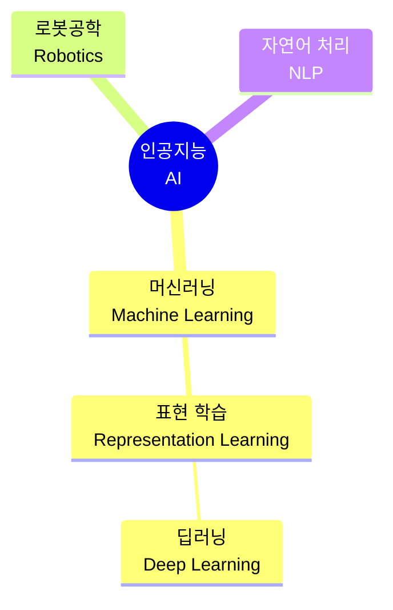

# Lesson 1.1: 인공지능, 머신러닝, 그리고 신경망 (Part 1)

안녕하세요! 지난 시간 오리엔테이션에서 전체적인 지도를 그려보았죠? 오늘은 드디어 본격적인 첫걸음, **Lesson 1**의 첫 번째 시간입니다. 

오늘은 우리가 흔히 헷갈려 하는 용어들인 **인공지능(AI), 머신러닝(ML), 그리고 딥러닝(DL)**이 정확히 어떤 관계인지, 그리고 딥러닝이 왜 그렇게 특별한지 '고양이 사진 판별기'라는 하나의 예시를 통해 아주 쉽게 알아보겠습니다.

---

## 🎯 1. 인공지능 용어 정리: 마트료시카 인형처럼 쏙쏙!

이 세 가지 용어는 러시아 인형(마트료시카)처럼 가장 큰 개념 안에 작은 개념이 포함되는 구조입니다. 이것을 다이어그램으로 먼저 확인해 볼까요?



### 1) 인공지능 (Artificial Intelligence, AI)
가장 넓은 의미입니다. **"주변 환경을 인식하고, 원하는 목표를 이루기 위해 결정을 내리는 기계"**를 말합니다. 쉽게 말해 기계가 사람처럼 똑똑한 행동을 하면 다 AI라고 부릅니다. 
*   **ANI (좁은 인공지능)**: 현재 우리가 보는 대부분의 AI입니다. 체스만 잘 두거나, 번역만 잘하거나, 운전만 잘하는 등 **특정 한 가지 일**만 잘합니다.
*   **AGI (범용 인공지능)**: 사람처럼 모든 일을 다 잘하는 AI입니다. (2040년쯤 등장할 것으로 전문가들은 예상합니다.)
*   **ASI (초인공지능)**: 사람의 지능을 아득히 뛰어넘는 AI입니다.

### 2) 머신러닝 (Machine Learning, ML)
인공지능 안에 포함되는 개념으로, **"프로그래머가 일일이 규칙을 정해주지 않아도, 기계(소프트웨어)가 스스로 데이터에서 패턴을 학습하는 기술"**입니다.

### 3) 딥러닝 (Deep Learning, DL)
머신러닝 중에서도 가장 발전된 형태이며, 오늘날 AI 열풍의 주역입니다. 딥러닝을 이해하기 위해서는 머신러닝과의 차이점을 알아야 합니다.

---

## 🆚 2. 전통적인 머신러닝 vs 딥러닝 (핵심 차이!)

**공통 예시: "이 사진 속 동물이 고양이인지 강아지인지 맞히기"**

이 문제를 해결하기 위해 과거의 머신러닝과 현재의 딥러닝은 접근 방식이 완전히 다릅니다.

### 👨‍💻 전통적인 머신러닝의 방식 (수동 특징 추출)
과거에는 개발자(사람)가 엄청나게 고생을 해야 했습니다. 컴퓨터는 사진을 그저 '숫자의 나열(픽셀)'로만 봅니다. 그래서 개발자가 직접 다음과 같은 규칙을 컴퓨터에게 알려줘야 했습니다.
*   "귀가 뾰족하고 세모 모양이면 고양이일 확률이 높아."
*   "동공이 세로로 길쭉하면 고양이야."
*   "수염이 이렇게 뻗어있으면 고양이야."

이렇게 사람이 직접 데이터에서 특징(Feature)을 뽑아내는 과정을 거쳐야 했기 때문에, 고양이에 대해 아주 잘 아는 전문가가 필요했고 시간도 아주 오래 걸렸습니다.

### 🧠 딥러닝의 방식 (표현 학습, Representation Learning)
딥러닝 개발자는 이런 특징을 일일이 알려주지 않습니다! 대신 고양이 사진 1만 장, 강아지 사진 1만 장을 그냥 컴퓨터(딥러닝 모델)에 던져줍니다.
*   **딥러닝**: (사진들을 보며 스스로 학습) "음.. 고양이 사진들에는 공통적으로 뾰족한 세모 모양(귀)이 있고, 길쭉한 선(수염)이 있네? 내가 스스로 특징을 찾아낼게!"

이렇게 데이터만 충분히 주면 **기계가 스스로 특징(Representation)을 찾아내어 학습**하는 것을 **'표현 학습(Representation Learning)'**이라고 하며, 딥러닝이 바로 이 표현 학습의 끝판왕입니다. 개발자는 고양이의 특징을 찾는 대신, 기계가 스스로 잘 학습할 수 있는 '뇌 구조(모델)'를 만드는 데 집중합니다.

---

## 🕸️ 3. 인공 신경망 (Artificial Neural Networks)

그렇다면 딥러닝은 어떻게 기계가 스스로 특징을 찾게 만들까요? 바로 사람의 뇌 구조를 흉내 냈기 때문입니다.

*   **생물학적 뉴런**: 우리 뇌에는 수십억 개의 뇌세포(뉴런)가 서로 연결되어 신호를 주고받으며 생각하고 행동하게 만듭니다.
*   **인공 뉴런**: 이를 흉내 내어 컴퓨터 프로그램으로 만든 아주 단순한 수학 공식(알고리즘)입니다. 여러 곳에서 정보를 받아 계산한 뒤, 하나의 결과를 내놓습니다.

**인공 신경망**은 이 인공 뉴런들을 수없이 많이 연결해 놓은 거대한 거미줄 같은 네트워크입니다.

### 🍰 딥러닝이란? (가장 명확한 정의)
딥러닝의 정의는 아주 명확합니다. **"인공 뉴런의 층(Layer)이 여러 겹으로 깊게(Deep) 쌓여 있는 인공 신경망"**입니다.

```mermaid
graph LR
    A[입력층<br/>(Input Layer)] --> B((은닉층 1))
    A --> C((은닉층 1))
    B --> D((은닉층 2))
    C --> D
    D --> E((은닉층 3))
    E --> F[출력층<br/>(Output Layer)]
    
    style A fill:#e1f5fe,stroke:#01579b
    style B fill:#fff3e0,stroke:#e65100
    style C fill:#fff3e0,stroke:#e65100
    style D fill:#fff3e0,stroke:#e65100
    style E fill:#fff3e0,stroke:#e65100
    style F fill:#e8f5e9,stroke:#1b5e20
```

1.  **입력층 (Input Layer)**: 데이터가 들어오는 입구입니다. (예: 고양이 사진의 픽셀들)
2.  **은닉층 (Hidden Layers)**: 여기서 스스로 특징을 찾고 학습합니다. 이 층이 3개 이상 겹겹이 쌓여 있으면(총 5개 층 이상) 우리는 그것을 '딥(Deep) 러닝'이라고 부릅니다.
3.  **출력층 (Output Layer)**: 최종 결론을 내는 출구입니다. (예: "이 사진은 99% 확률로 고양이입니다!")

층이 깊어질수록 점점 더 복잡하고 추상적인 특징(단순한 선 -> 동그라미 -> 고양이 얼굴 모양)을 스스로 조합해 냅니다.

---

## 🚀 실무 활용 및 앞으로의 학습 연결

오늘 배운 '기계가 스스로 특징을 찾는다(표현 학습)'는 개념과 '인공 신경망의 층(Layer) 구조'는 딥러닝 실무의 알파이자 오메가입니다. 

*   **실무 활용**: 현업에서는 이미지 분류(고양이 vs 강아지)뿐만 아니라, 자율주행 자동차가 도로의 보행자를 인식하거나, 스마트폰의 음성 비서가 내 목소리를 알아듣는 데 바로 이 깊은 신경망(딥러닝)이 쓰입니다. 개발자는 데이터의 특징을 일일이 분석하는 대신, 양질의 데이터를 많이 모으고 모델의 '층(Layer)'을 어떻게 설계할지 고민하는 데 시간을 쏟습니다.
*   **앞으로의 학습 연결**: 오늘 배운 '입력층 -> 은닉층 -> 출력층' 구조는 당장 이번 Lesson 1의 후반부 실습(1.5 ~ 1.8)에서 우리가 코드로 직접 구현하게 됩니다. 코랩에서 `Dense`라는 코드를 사용해 은닉층을 직접 한 층 한 층 쌓아 올리면서, 오늘 배운 이론이 어떻게 실제 프로그램으로 돌아가는지 눈으로 확인하시게 될 것입니다!

---

## ✍️ 핵심 요약 및 실전 이해도 점검

**[핵심 요약]**
1. **AI > ML > DL**: 인공지능이 가장 넓은 개념, 그 안에서 기계가 스스로 학습하는 것이 머신러닝, 머신러닝 중에서도 사람의 뇌 구조(신경망)를 깊게 쌓아 모방한 것이 딥러닝입니다.
2. **딥러닝의 진정한 강점**: 개발자가 특징을 직접 찾아줄 필요 없이(전통적 머신러닝의 한계 극복), 모델 스스로 데이터 속에서 특징을 찾아내는 **표현 학습(Representation Learning)**이 가능합니다.
3. **딥러닝의 구조**: 입력층, 은닉층(보통 3개 이상), 출력층으로 이루어지며, 총 5개 층 이상일 때 흔히 '딥러닝'이라고 부릅니다.

**🤔 실전 점검 질문:**
당신은 방대한 양의 '의료 X-ray 사진'을 보고 암세포가 있는지 판단하는 인공지능을 개발하려는 실무자입니다. 
전통적인 머신러닝 방식과 오늘 배운 딥러닝 방식을 사용할 때, 개발자인 당신의 역할은 어떻게 달라지게 될까요? (어떤 방식이 당신의 수고를 어떻게 덜어주는지, 배운 개념인 '표현 학습'의 관점에서 생각해 보세요!)

---
**💬 튜터의 한마디:**
단순 암기가 아닌, 실무적인 관점에서 고민해 볼 수 있도록 점검 질문을 수정해 보았습니다! 현업 개발자의 입장에서 한 번 상상해 보시고 편하게 답변을 남겨주세요. 
답변을 남겨주시면 바로 다음 트랜스크립트(1.2 Part 2)에 대한 설명으로 넘어가겠습니다. 🚀
