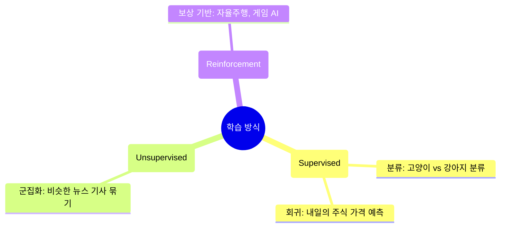

# Lesson 1.2: 딥러닝의 활용 분야와 3가지 학습 방식 (Part 2)

지난 시간에 우리는 딥러닝이 어떻게 '스스로 특징을 찾아내는지(표현 학습)' 알아보았습니다. 이번 시간에는 딥러닝이 구체적으로 어떤 분야에서 활약하고 있는지, 그리고 기계를 학습시키는 3가지 대표적인 방법론에 대해 알아보겠습니다.

---

## 🌟 1. 딥러닝이 지배하는 3대 주요 분야

현대 딥러닝 기술은 크게 시각, 언어, 그리고 행동이라는 세 가지 영역에서 폭발적인 성과를 내고 있습니다.

### 👁️ 1) 머신 비전 (Machine Vision) - 컴퓨터의 '눈'
컴퓨터가 사물을 시각적으로 인식하고 이해하는 분야입니다. 현재 딥러닝이 가장 압도적인 성능을 자랑하는 영역입니다.
*   **핵심 기술**: **CNN (합성곱 신경망)**
*   **활용 사례**: 자율주행 자동차의 보행자 인식, 스마트폰의 얼굴 인식 잠금 해제, 사진 앱의 인물 자동 태그.
*   **심화 기술 (GAN)**: 단순히 보는 것을 넘어, 가짜 유명인의 얼굴을 만들어내거나 피카소 화풍의 그림을 스스로 '창작'해내는 생성형 AI 기술도 여기에 포함됩니다.

### 🗣️ 2) 자연어 처리 (NLP) - 컴퓨터의 '입과 귀'
사람의 언어를 이해하고 구사하는 분야입니다.
*   **핵심 기술**: **RNN (순환 신경망)**, LSTM 등 (순서가 있는 데이터를 처리하는 데 특화)
*   **활용 사례**: 구글 어시스턴트나 아마존 알렉사 같은 음성 인식, 실시간 번역, 검색어 자동 완성 등.

### 🎮 3) 강화 학습 (Reinforcement Learning) - 컴퓨터의 '행동 방식'
에이전트(주인공)가 환경과 상호작용하며 경험을 통해 스스로 목표를 달성하는 방법을 배우는 분야입니다. (알파고가 바둑을 두는 방식을 떠올리시면 됩니다.)

---

## 🧠 2. 머신러닝을 학습시키는 3가지 방법 (패러다임)

기계를 가르치는 방식은 크게 정답의 유무와 상호작용 여부에 따라 세 가지로 나뉩니다. (강사님이 강조했듯, 이 세 가지 방식은 전통적인 머신러닝과 딥러닝 양쪽 모두에 똑같이 쓰일 수 있습니다!)

### 1) 지도 학습 (Supervised Learning)
*   **특징**: **정답(Label)이 있는 데이터**를 주입합니다. "이 사진(입력 x)은 고양이(정답 y)야"라고 알려주면서 가르치는 방식입니다.
*   **종류**: 
    *   **분류(Classification)**: 사진을 보고 0~9 중 무슨 숫자인지 맞히기, 영화 리뷰가 긍정인지 부정인지 분류하기. (정해진 카테고리 중 하나를 고름)
    *   **회귀(Regression)**: 내일의 주식 가격, 다음 달의 아파트 가격처럼 '연속적인 숫자 값'을 예측하기.

### 2) 비지도 학습 (Unsupervised Learning)
*   **특징**: **정답(Label)이 없는 데이터**만 무더기로 던져줍니다.
*   **목적**: 기계가 스스로 데이터 안에 숨겨진 패턴이나 구조를 찾아냅니다.
*   **활용 사례**: 정치, 경제, 스포츠 태그가 없는 수만 건의 뉴스 기사를 던져주면, 알아서 비슷한 주제의 기사끼리 그룹(군집)으로 묶어주는 작업.

### 3) 강화 학습 (Reinforcement Learning)
*   **특징**: 주어진 데이터만 수동적으로 먹는 것이 아니라, 가상 환경에서 직접 행동을 취하고 그 결과로 **'보상'이나 '피드백'**을 받습니다. 자전거 타기를 배울 때 넘어지면서(피드백) 균형 잡는 법을 배우는 것과 같습니다.
*   **심층 강화 학습 (Deep Reinforcement Learning)**: 눈/귀(감각) 역할을 하는 딥러닝과 뇌(결정) 역할을 하는 강화학습이 결합된 강력한 기술입니다. 딥러닝이 복잡한 환경 상황의 노이즈를 걸러내고 파악하면, 강화학습 알고리즘이 최적의 행동을 선택합니다. 
*   **급성장 배경**: 방대한 시뮬레이션(게임 환경 등), 강력한 GPU 병렬 컴퓨팅 발전, 활발한 산학 연계(연구 생태계) 덕분에 최근 눈부시게 발전했습니다.

---

## 🚀 실무 활용 및 앞으로의 학습 연결

오늘 배운 3가지 학습 패러다임은 여러분이 앞으로 딥러닝 프로젝트를 기획할 때 방향을 설정하는 '첫 단추'가 됩니다.

*   **실무에서의 프로젝트 기획**: 현업에서 새로운 AI를 기획할 때, 데이터 분석가는 가장 먼저 **"우리가 가진 데이터에 정답(Label)이 있는가?"**를 묻습니다. 만약 불량품 사진과 '정상/불량'이라는 정답 라벨이 모두 기록되어 있다면 '지도 학습 - 분류' 모델을 설계합니다. 정답이 없다면 '비지도 학습'으로 패턴을 분석하게 되죠.
*   **앞으로의 커리큘럼 연결**: 
    *   당장 이번 **Lesson 1 후반부 실습(1.5 ~ 1.8)**에서는 가장 기초적이면서 널리 쓰이는 **지도 학습(분류)** 신경망 코드를 코랩에서 직접 짜봅니다. (손글씨 숫자를 0~9 중 하나로 구별하는 AI 만들기)
    *   **Lesson 3, 4**에서는 오늘 언급된 컴퓨터의 눈, **CNN(합성곱 신경망)**의 원리를 깊게 파헤치고 실습합니다. 오늘 등장한 CNN, RNN, GAN 같은 전문 용어들은 "아, 이런 분야에서 쓰이는 기술이구나" 정도만 기억하셔도, 추후 실습하면서 자연스럽게 체득하시게 될 것입니다!

---

## ✍️ 핵심 요약 및 실전 이해도 점검

**[핵심 요약]**
1. **딥러닝 3대 분야**: 머신 비전(시각, CNN), 자연어 처리(언어, RNN), 강화 학습(에이전트의 상호작용).
2. **학습의 3가지 방법**: 정답을 주고 가르치는 **지도 학습**(분류/회귀), 정답 없이 구조를 스스로 찾는 **비지도 학습**, 행동에 대한 피드백(보상)으로 배우는 **강화 학습**.
3. **학습 방식에 대한 오해**: 지도/비지도/강화 학습은 딥러닝만의 전유물이 아니며, 전통적인 머신러닝에서도 동일하게 사용되는 패러다임입니다.

**🤔 실전 점검 질문:**
당신은 유명 온라인 쇼핑몰의 AI 기획자입니다. CEO가 당신에게 다음 두 가지 AI 시스템을 만들어 달라고 지시했습니다. 각각의 미션에 대해 오늘 배운 세 가지 학습 방식(지도 학습, 비지도 학습, 강화 학습) 중 어떤 방식을 선택하는 것이 가장 적합할지, 실무 기획자의 입장에서 그 이유와 함께 설명해 보세요.

*   **미션 A**: 고객들이 최근 3개월간 구매한 내역 데이터가 방대하게 쌓여 있습니다. (단, 우리가 미리 정해둔 고객 등급이나 그룹 이름(정답)은 없습니다). 이 데이터를 분석해서 알아서 구매 패턴이 비슷한 고객들끼리 몇 개의 그룹으로 묶어주는 타겟 마케팅용 시스템을 만들어주세요.
*   **미션 B**: 수만 개의 상품 리뷰 데이터가 있고, 다행히 아르바이트생들이 일일이 해당 리뷰가 '긍정'인지 '부정'인지 정답 라벨을 달아두었습니다. 앞으로 새로 달리는 리뷰가 긍정인지 부정인지 자동으로 판별해주는 시스템을 만들어주세요.

---
---
**💬 튜터의 한마디:**
실무 AI 기획자가 되었다고 생각하시고, 미션 A와 B에 가장 어울리는 모델 설계 방식이 무엇일지 상상해 보세요! 틀려도 괜찮습니다. 
생각하신 기획안(정답)과 함께 다음 트랜스크립트(1.3 & 1.4 등)를 올려주시면 이어서 코드를 향해 즐겁게 나아가겠습니다! 🚀

---

### 💡 이전 실전 점검 질문 모범 답안 (Lesson 1.2)

*   **미션 A 모범 기획안 (선택: 비지도 학습)**: 정답 라벨(고객 등급 등)이 없는 상태에서 데이터의 숨겨진 구조를 찾아 그룹(군집)으로 묶어야 하므로 **비지도 학습(Unsupervised Learning)**이 적합합니다. 
*   **미션 B 모범 기획안 (선택: 지도 학습 - 분류)**: '긍정', '부정'이라는 명확한 정답 라벨이 이미 존재하고, 새로운 데이터가 들어왔을 때 둘 중 하나의 카테고리로 나누어야 하므로 **지도 학습(Supervised Learning) 중 분류(Classification)** 방식이 완벽하게 들어맞습니다.
