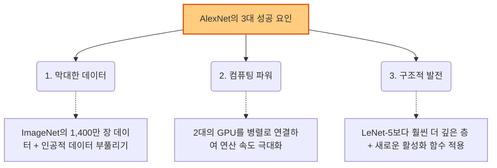

# Lesson 1.4: 딥러닝 비전의 역사와 2012년의 대폭발

지난 시간에 배운 고양이 뇌의 '단순 세포와 복잡 세포' 원리가 어떻게 오늘날의 압도적인 인공지능으로 발전했을까요? 이번 시간에는 딥러닝의 흥망성쇠와, 세상을 완전히 뒤바꿔놓은 2012년의 결정적 사건을 다룹니다.

---

## 🏛️ 1. 생물학적 영감에서 최초의 성공까지

1980년대부터 과학자들은 뇌의 시각 처리 방식을 컴퓨터로 모방하기 시작했습니다.

*   **네오코그니트론 (Neocognitron, 1980)**: 후쿠시마 박사가 휴벨과 위젤의 '단순/복잡 세포' 개념을 그대로 차용하여 만든 인공 신경망입니다. 첫 번째 층은 단순한 선분을, 깊은 층은 복잡한 추상적 모양을 인식했습니다.
*   **LeNet-5 (1998)**: 얀 르쿤(Yann LeCun)이 개발한 전설적인 모델입니다. **'역전파(Backpropagation)'**라는 획기적인 학습 알고리즘을 도입하여, 미국 우체국의 우편번호(손글씨 숫자)를 자동으로 인식하는 데 성공하며 최초의 상업적 성공을 거두었습니다. (우리가 곧 실습에서 직접 만들어볼 모델입니다!)

---

## ❄️ 2. 딥러닝의 빙하기와 '수동 특징 추출'의 한계

LeNet-5의 훌륭한 성공에도 불구하고, 딥러닝은 곧 사람들의 관심에서 멀어집니다. 당시에는 컴퓨터 성능도 부족했고, 모델을 깊게 쌓으면 학습이 잘 안 되는 기술적 한계가 있었기 때문입니다. 

대신 사람들은 **전통적인 머신러닝(수동 특징 추출)**에 집중했습니다.
*   **비올라-존스 알고리즘 (2000년대 초)**: 개발자가 직접 명암의 차이(예: 눈은 어둡고 코는 밝다)를 계산하는 필터를 일일이 수학적으로 설계하여 사람의 얼굴을 인식했습니다. 디지털 카메라의 '얼굴 자동 초점' 기능에 널리 쓰였습니다.
*   **치명적인 단점**: 얼굴을 인식하는 필터를 만드는 데 수년간의 전문가 연구가 필요했습니다. 만약 얼굴이 아니라 '강아지'나 '자동차'를 인식하고 싶다면? 또다시 수년을 바쳐 완전히 새로운 필터를 처음부터 다시 설계해야만 했습니다.

---

## 🌋 3. 2012년 ImageNet 대폭발: AlexNet의 등장

2010년부터 **ImageNet**이라는 대규모 이미지 인식 대회(ILSVRC)가 열렸습니다. 무려 1,400만 장의 사진을 1,000개의 카테고리(개 품종까지 세밀하게 분류)로 맞히는 엄청난 스케일의 대회였습니다.

2011년까지는 모두가 '전통적인 머신러닝(수동 특징 추출)'으로 참가했고, 1년간의 성능 발전은 미미했습니다. 그런데 2012년, 제프 힌튼 교수 팀의 **AlexNet**이라는 딥러닝 모델이 혜성처럼 등장하여 기존의 모든 기록을 박살 내고 압도적인 우승을 차지합니다. 인공지능의 역사가 바뀐 순간입니다.

---

## 🚀 실무 활용 및 앞으로의 학습 연결

AlexNet의 성공은 실무 AI 개발의 패러다임을 완전히 바꿨습니다. **"이제 특정 도메인(분야)의 전문가가 될 필요가 없다"**는 것이 핵심입니다.

*   **실무 패러다임의 변화**: 예전에는 자율주행 AI를 만들려면 자동차의 시각적 형태를 수학적으로 꿰뚫고 있는 '자동차 형태 전문가'가 필요했습니다. 하지만 이제는 양질의 데이터와 딥러닝 기술만 있으면 됩니다. 기계가 알아서 자동차의 특징을 스스로 찾아내기 때문입니다. 언어 번역기(NLP)나 게임 AI(강화학습)를 만들 때도 언어학자나 프로게이머 수준의 지식이 더 이상 필수적이지 않게 되었습니다.
*   **앞으로의 학습 연결**: 오늘 우리는 LeNet-5와 AlexNet이 입력된 픽셀을 어떻게 확률(예: 99% 확률로 2번 숫자)로 바꾸는지 이론적인 흐름을 보았습니다. 바로 다음 파트(1.5 TensorFlow Playground)에서는 이 내부 과정이 시각적으로 어떻게 돌아가는지 웹 화면을 통해 직접 눈으로 확인하게 될 것입니다!

---

## ✍️ 핵심 요약 및 실전 이해도 점검

**[핵심 요약]**
1. 딥러닝 모델(LeNet-5 등)은 기계가 스스로 특징을 찾지만, 과거에는 기술적 한계로 빙하기를 겪었습니다.
2. 대신 유행했던 전통적인 머신러닝(수동 특징 추출)은 새로운 대상을 인식할 때마다 필터를 사람이 매번 다시 설계해야 하는 끔찍한 비효율성이 있었습니다.
3. 2012년 AlexNet(딥러닝)이 데이터, GPU, 깊어진 구조를 바탕으로 대회를 휩쓸면서, '특정 분야 전문가' 대신 '딥러닝 기술'이 대우받는 시대가 열렸습니다.

**🤔 실전 점검 질문 (시나리오):**
당신은 농장에서 사과, 배, 복숭아의 품질(특등급, 1등급, 불량)을 자동으로 분류해 주는 AI 기계를 납품하는 개발자입니다. 
경쟁사는 여전히 전통적인 머신러닝 방식(개발자가 과일의 색상값, 둥근 정도 등을 일일이 수학 공식으로 짜서 필터를 만드는 방식)을 사용하고 있고, 당신은 오늘 배운 **딥러닝(AlexNet 등) 방식**을 사용하고 있습니다. 
어느 날 갑자기 농장 주인이 **"내친김에 딸기와 포도도 분류해 주는 기능을 추가해 주시오!"**라고 요청했습니다. 
이때, 경쟁사 대비 당신의 딥러닝 방식이 갖는 가장 압도적인 장점(비즈니스적 무기)은 무엇일까요? '특징 추출(Feature Extraction)'의 주체가 누구인지에 초점을 맞춰 설명해 보세요.

---
**💬 튜터의 한마디:**
갑작스러운 고객의 요구사항 추가! 실무에서 정말 흔한 일이죠? 😅 
딥러닝이 왜 2012년 이후로 세상을 지배하게 되었는지 완벽하게 이해하실 수 있는 문제이니, 자유롭게 정답을 상상해 보시고 아래의 모범 답안과 비교해 보세요!

---

### 💡 실전 점검 질문 모범 답안 및 보충 설명 (Lesson 1.4)

*   **모범 답안**: 전통적 방식을 쓰는 경쟁사는 딸기와 포도의 새로운 특징(씨앗의 패턴, 작은 둥근 형태 등)을 찾아내는 수학 공식을 처음부터 0에서 다시 연구하고 개발(수동 특징 추출)해야 하므로 엄청난 시간과 비용이 깨집니다. 반면 딥러닝을 쓰는 저는 새로운 알고리즘을 짤 필요가 없습니다. 그저 **딸기와 포도 사진 데이터만 대량으로 구해서 기존 딥러닝 모델에 추가로 넣어주면 끝**입니다. 기계가 스스로 딸기와 포도의 특징을 찾아내기(자동 특징 추출) 때문입니다.
*   **보충 설명**: AlexNet이 증명한 딥러닝의 위대함은 바로 "특정 분야의 전문 지식(Domain Expertise)에 과도하게 의존하지 않아도 된다"는 점입니다. 사과 전문가, 포도 전문가가 아니더라도 양질의 '데이터'와 '딥러닝 모델 구조'만 잘 세우면 어떤 사물이든 인식하는 모델을 뚝딱 만들어낼 수 있는 엄청난 범용성과 효율성이 오늘날 AI 혁명을 이끌었습니다.

---

### 🔥 [전공자/전문가용] 심화 보충 설명 (Deep Dive)

강의에서 아주 짧게 스쳐 지나간 용어들과, 딥러닝이 잠시 암흑기(AI Winter)를 겪어야만 했던 기술적 한계들, 그리고 AlexNet이 그것을 어떻게 극복했는지 전공자 수준으로 깊게 파헤쳐 봅니다.

#### 1. Neocognitron과 LeNet-5의 결정적 차이: 역전파(Backpropagation)
*   **Neocognitron**: 최초로 시각 피질의 계층 구조를 모방했지만, 네트워크 전체를 효율적으로 학습시킬 수 있는 전역 최적화 알고리즘이 없었습니다. (초기에는 비지도 학습 기반의 헤브 학습법(Hebbian Learning)과 유사한 방식을 사용했습니다.)
*   **LeNet-5의 위대함**: 얀 르쿤은 여기에 **역전파(Backpropagation)** 알고리즘을 성공적으로 적용했습니다. 미분의 연쇄 법칙(Chain Rule)을 이용하여, 출력층의 오차(Loss)를 역방향으로 전파하며 네트워크의 모든 가중치(Weight)를 한 번에 업데이트(End-to-End Learning)할 수 있게 만든 혁명적인 사건이었습니다.

#### 2. 딥러닝 빙하기의 원인 (전통적 머신러닝으로의 회귀)
강사가 언급한 "최적화의 걸림돌(Stumbling blocks associated with optimizing)"의 정체는 다음과 같습니다.
*   **기울기 소실 (Vanishing Gradients)**: 당시 주로 사용하던 활성화 함수는 시그모이드(Sigmoid)나 탄젠트 함수(Tanh)였습니다. 이 함수들은 미분값의 최대치가 0.25 혹은 1 이하이기 때문에, 역전파 과정에서 층을 깊게 쌓을수록 기울기(Gradient)가 0에 수렴하여 앞쪽 층이 전혀 학습되지 않는 치명적인 문제가 있었습니다.
*   **가중치 초기화 (Weight Initialization)**: 가중치를 어떻게 초기화해야 하는지에 대한 연구가 부족하여, 학습이 시작되자마자 지역 최소점(Local Minima)이나 안장점(Saddle Point)에 빠져버리는 현상이 잦았습니다.
*   **공변량 변화 (Covariate Shift)**: 학습이 진행될 때마다 각 층에 입력되는 데이터의 분포가 계속해서 변하는 문제로, 학습의 불안정성을 초래했습니다. (이는 훗날 2015년에 **배치 정규화(Batch Normalization)** 기법이 등장하며 해결됩니다.)

#### 3. AlexNet은 2012년에 어떻게 이 한계를 극복했는가?
AlexNet이 전통적 머신러닝을 압살할 수 있었던 기술적 '필살기'들은 다음과 같습니다.
1.  **ReLU (Rectified Linear Unit) 활성화 함수 도입**: 시그모이드 대신 $f(x) = \max(0, x)$ 형태의 ReLU를 사용하여 기울기 소실 문제를 획기적으로 해결했습니다. (Tanh 대비 6배 빠른 수렴 속도를 보였습니다.)
2.  **드롭아웃 (Dropout)을 통한 과적합 방지**: 파라미터가 6천만 개에 달하는 거대한 모델이었기에 과적합(Overfitting)의 위험이 컸습니다. 학습 과정에서 무작위로 일부 뉴런을 끄고 학습하는 Dropout 기법을 적용하여 모델의 일반화(Generalization) 성능을 극한으로 끌어올렸습니다.
3.  **데이터 증강 (Data Augmentation)**: 1,400만 장의 ImageNet 데이터로도 부족하다고 판단하여, 이미지를 자르거나(Cropping), 좌우로 뒤집고(Flipping), PCA를 이용해 색상을 변경(Fancy PCA)하는 방식으로 데이터를 인공적으로 뻥튀기했습니다.
4.  **다중 GPU 분산 학습**: 당시 GPU(GTX 580)의 메모리가 3GB밖에 되지 않았기 때문에, 거대한 모델을 두 개의 GPU에 나누어 병렬로 학습시키는 아키텍처를 직접 프로그래밍했습니다.
