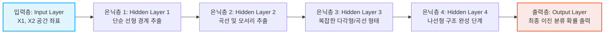
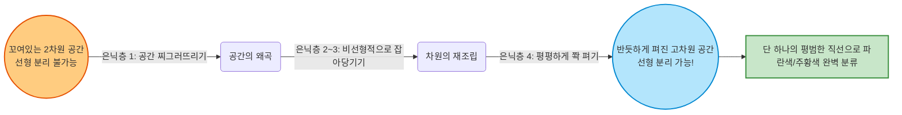

# Lesson 1.5: 딥러닝의 학습 과정을 눈으로 확인하기 (TensorFlow Playground) 완벽 해부

지금까지 우리는 딥러닝이 '단순한 선에서 시작해 복잡한 추상적 모양을 스스로 학습한다'는 것을 이론적으로만 다루었습니다. 
하지만 실제 연구자나 인공지능 전공자들은 이 추상적인 과정을 어떻게 시각적으로 직관화(Visualize)하고 이해할까요?

이번 시간에는 구글(Google)이 제공하는 무료 시각화 교육 툴인 **TensorFlow Playground**를 통해, 
인공 신경망의 내부 구조, 가중치(Weight)의 변화 흐름, 손실 함수(Loss Function)의 감소 과정, 그리고 기계학습의 가장 중요한 덕목인 일반화(Generalization)의 개념을 밑바닥부터 전공자 수준까지 아주 깊게 파헤쳐 보겠습니다.

단순히 화면에서 재생 버튼을 누르는 것을 넘어서, 이 시각화 화면 뒤에서 대체 어떤 수학적이고 알고리즘적인 마법들이 벌어지고 있는지 철저하게 해부해 드립니다. 
기존의 요약만으로는 부족했던 핵심 디테일들을 하나도 빠짐없이 짚고 넘어가겠습니다.

---

## 🎮 1. TensorFlow Playground의 본질: 우리는 무엇을 풀고자 하는가?

강사가 언급한 링크([bit.ly/TFplayground](http://playground.tensorflow.org/))로 접속하면 웹 브라우저에서 신경망을 구동할 수 있습니다. 
화면에 나타나는 점들과 층들은 그저 예쁜 그림이 아니라, 고도의 수학적 문제를 시각화한 것입니다.

### 1.1 해결하고자 하는 문제 (The Problem Statement: 이진 분류)
이 화면에서 우리의 '목표(미션)'는 수학적으로 **'이진 분류(Binary Classification)'** 문제입니다.
*   화면 오른쪽에 무작위로 섞여 있는 **파란색 점(긍정 클래스 / Positive Class)**과 **주황색 점(부정 클래스 / Negative Class)**을 완벽하게 구별해 내는 결정 경계(Decision Boundary)를 찾는 것입니다. 
*   주의 깊게 보시면, 데이터의 분포가 '태극 문양' 혹은 '나선형(Spiral)' 구조로 꼬여 있습니다. 
*   이는 선 하나로는 절대 나눌 수 없는 **비선형(Non-linear) 문제**의 대표적인 데이터셋입니다. 
*   과거 1970년대의 단층 퍼셉트론(Single-layer Perceptron) 시절, 단순한 XOR 문제조차 선 하나로 풀지 못해 인공지능의 첫 번째 겨울(AI Winter)을 맞이했던 것과 궤를 같이하는 아주 복잡하고 풀기 까다로운 비선형 분류 문제입니다.

### 1.2 입력 특징 공간 (Input Feature Space: 차원의 이해)
모델에게 주어지는 데이터는 기하학적 평면 위의 단순한 2차원 좌표값뿐입니다.
*   **$X_1$**: 점의 가로 위치 (X축 좌표값)
*   **$X_2$**: 점의 세로 위치 (Y축 좌표값)
우리는 신경망에게 "이건 파란색 나선형 모양이야"라고 친절하게 알려주지 않습니다. 
단지 $(X_1, X_2)$라는 아주 무미건조한 2차원 벡터(Vector) 정보만 입력층(Input Layer)에 계속 밀어 넣습니다. 
기계는 이 숫자로 된 좌표 정보만으로 점이 속한 색상의 공간적 패턴과 기하학적 모양을 '스스로' 찾아내어 매핑(Mapping)해야만 합니다.

---

## 🏗️ 2. 신경망 아키텍처 깊게 파보기 (Deep Network Architecture)

강사의 화면에 나타난 모델은 총 6개의 층(Layer)으로 이루어진 심층 신경망(Deep Neural Network)입니다. 
이 구조가 비선형 문제를 어떻게 해결하는지 단계별로 살펴보겠습니다.



### 2.1 은닉층(Hidden Layers)의 수학적 역할과 비선형성(Non-linearity)
은닉층은 입력된 정보를 바탕으로 점들의 패턴을 학습하는 핵심 두뇌 공간입니다. 강사의 화면에는 무려 4개의 은닉층이 연속으로 쌓여 있습니다.
수학적으로 한 은닉층에서 다음 은닉층으로 신호가 넘어갈 때는 반드시 다음과 같은 선형 대수적 연산과 비선형 함수가 결합되어 일어납니다:

$$ H^{(l)} = \sigma(W^{(l)} \cdot H^{(l-1)} + b^{(l)}) $$

*   **$W$ (가중치 행렬, Weights)**: 이전 층의 신호들을 어떻게 조합할지 결정하는 선형 변환 역할.
*   **$b$ (편향 벡터, Biases)**: 기준점을 이동시키는 평행 이동 역할.
*   **$\sigma$ (활성화 함수, Activation Function)**: 딥러닝의 핵심! 선형적으로 계산된 결과에 **비선형성(Non-linearity)**을 부여합니다. (예: ReLU, Tanh 등). 
*   **전문가 관점**: 만약 이 비선형 활성화 함수 $\sigma$가 없다면? 은닉층을 100개, 1000개를 쌓아도 결국 수학적으로는 단 하나의 선형 변환 곱셈으로 붕괴해버립니다. 즉, 나선형 데이터를 영원히 분류할 수 없게 됩니다. 비선형 함수가 있기 때문에 공간을 구부리고 휠 수 있는 것입니다.

### 2.2 계층적 특징 추출 (Hierarchical Feature Extraction)의 실체
트랜스크립트에서 강사가 마우스를 각 은닉층 뉴런에 올려보며 흥분하여 설명한 부분의 실체는 다음과 같습니다:

1.  **첫 번째 은닉층 (단순 세포 / Simple Cells의 역할)**: 화면 상의 뉴런(네모 박스)들은 공간을 오직 하나의 직선(|, ㅡ, / 등)으로만 양분하려고 시도합니다. 이는 1차 선형 방정식과 활성화 함수가 만들어내는 가장 기초적인 결정 경계입니다.
2.  **두 번째 ~ 세 번째 은닉층 (특징의 조합)**: 앞선 1층에서 만들어진 직선들이 마치 레고 블록처럼 결합됩니다. AND / OR 논리 연산처럼 작동하여 공간을 삼각형 모양으로 자르거나 약간 둥근 곡선 모양으로 꺾어내기 시작합니다.
3.  **네 번째 은닉층 (복잡 세포 / Complex Cells의 역할)**: 얕은 층의 자잘한 직선/곡선 특징들이 고차원적으로 융합되어, 최종적으로 파란색과 주황색 점이 복잡하게 섞인 '나선형(소용돌이)'이라는 고차원적 형태를 캔버스 위에 거의 완벽하게 그려냅니다.

---

## 📉 3. 학습의 동력: 손실(Loss)과 최적화(Optimization)

화면 좌측 상단의 **▶️ 재생 버튼(Play)**을 누르는 순간, 화면 내부에서는 수천 번의 미분 계산과 **역전파(Backpropagation)**, 그리고 **경사 하강법(Gradient Descent)**이 맹렬하게 돌아갑니다.

### 3.1 손실 함수 (Loss Function) 란 무엇인가?
Loss(손실)는 기계 모델의 현재 예측값이 실제 정답(Ground Truth)과 얼마나 차이 나는지를 단 하나의 수치로 묶어낸 '오답 노트 점수'입니다. 
분류 문제에서는 주로 수학적으로 **교차 엔트로피(Cross-Entropy Loss)**라는 방식을 사용합니다.
*   모델이 파란 점을 파란 점이라고 아주 강하게 확신하면 확신할수록, Loss는 0에 가깝게 떨어집니다.
*   반대로 모델이 주황 점을 파란 점이라고 확신하여 오만하게 틀린 예측을 내뱉으면, Loss 값은 폭발적으로 수직 상승합니다.
*   신경망 학습의 궁극적인 목표는 미분을 통해 이 Loss라는 거대한 지형(Loss Landscape)에서 가장 지대가 낮은 바닥(Global Minima)으로 굴러 내려가는 것입니다.

### 3.2 훈련 손실(Training Loss)과 테스트 손실(Test Loss)의 철학적 차이
이 부분이 머신러닝의 전부라고 해도 과언이 아닐 정도로 중요합니다.

| 구분 | 대상 데이터 | 비유 | 목적 | 목표 상태 |
| :--- | :--- | :--- | :--- | :--- |
| **Training Loss** | 흰색 테두리 점 (학습 중 공개됨) | 문제집을 풀며 매기는 오답 수 | 가중치(W)의 업데이트 | 0에 수렴 |
| **Test Loss** | 검은색 테두리 점 (학습 중 철저히 숨겨짐) | 수능 실전 시험에서의 오답 수 | 실전 일반화 능력 검증 | 0에 수렴 (가장 중요) |

```mermaid
graph TD
    A[전체 데이터셋] --> B[Training Data<br/>(학습용: 백색 점)]
    A --> C[Test Data<br/>(검증용: 흑색 점 / 철저히 숨겨짐)]
    B --> D[Loss 최소화를 위해 신경망 가중치 지속 업데이트]
    D --> E{모델 1차 학습 완료}
    E -->|오직 최종 평가에만 사용| C
    C --> F[최종 Test Loss 도출]
    
    style A fill:#eceff1,stroke:#607d8b,stroke-width:2px
    style B fill:#e3f2fd,stroke:#1e88e5,stroke-width:2px
    style C fill:#ffebee,stroke:#e53935,stroke-width:2px
    style F fill:#e8f5e9,stroke:#43a047,stroke-width:2px
```

*   **왜 Test Loss가 중요한가?**: 기계가 단순히 흰색 점들의 위치를 억지로 통째로 **암기(Memorization)**한 것인지, 아니면 나선형이라는 보편적인 우주의 **규칙(Generalization)**을 제대로 깨우쳐서 처음 보는 검은색 점들에게도 대응할 수 있는지 검증하는 절대적인 성적표이기 때문입니다.

---

## 📖 4. 트랜스크립트 구문별 상세 해설 (Missing Details Fully Explained)

기존의 가벼운 요약에서 생략되었거나 강사가 빠르게 지나간 대사들의 이면을 전공자 수준으로 낱낱이 분해해 드립니다.

> *"For a fun interactive way to crystallize the hierarchical feature learning nature of deep learning."*
*   **해설**: 강사는 딥러닝의 본질을 **'계층적 특징 학습(Hierarchical Feature Learning)'**이라고 명확히 정의하고 시작했습니다. 과거 전통적 머신러닝 시대처럼 인간 전문가가 직접 특징을 설계(Feature Engineering)하는 노가다 방식에서 벗어나, 1층(선) -> 2층(도형) -> 3층(복잡한 객체)으로 기계가 직접 특징의 계층 구조를 빚어낸다는 딥러닝 철학의 정수를 한 문장으로 함축한 것입니다.

> *"The output here is, it looks like a grid with, information ranging from six to negative six, but really the output here is positive cases and negative cases."*
*   **해설**: 화면 상에서는 좌표계가 -6부터 +6까지의 실수 값으로 나타납니다. 하지만 신경망의 맨 마지막 출력층(Output Layer)은 이 연속적인 좌표 공간 내부의 모든 공간에 대해 색상을 판별할 확률 값을 매핑하여 색칠합니다. 마지막 뉴런은 보통 시그모이드(Sigmoid)라는 함수를 거쳐 0과 1 사이의 값(확률)을 내뿜으며, 임계값(주로 0.5)을 기준으로 주황색(Negative)과 파란색(Positive)을 분류하는 경계선을 화면 위에 예쁘게 그려주는 것입니다.

> *"So the network's goal is to learn how to distinguish orange dots... based solely on their position on this grid."*
*   **해설**: 아주 중요한 통찰 포인트입니다. 인공지능 모델에게 주어지는 단서는 오로지 차가운 "좌표 숫자 값" 뿐입니다. 그 어떤 "여기가 나선형 패턴의 중심이다"라는 공간적 힌트도, "색상 RGB 정보"도 주어지지 않습니다. 기계는 오로지 입력 데이터의 패턴만을 기반으로 매핑 함수 $f: (X_1, X_2) \rightarrow [0, 1]$ 를 찾아내는 극한의 수치 최적화를 수행하고 있을 뿐입니다.

> *"Every once in a while you'll get stuck and your network won't train... you can just click this reset button"*
*   **해설**: 강사가 웃으며 가볍게 말한 이 짧은 문장 속에는, 사실 딥러닝 최적화 이론의 가장 치명적인 문제인 **'가중치 초기화(Weight Initialization)'**와 **'안장점(Saddle Point) 갇힘 현상'**이 숨어 있습니다. 
    학습을 시작할 때 가중치는 무작위(Random)로 할당됩니다. 그런데 운이 없어서 초기화 위치가 최악의 장소에 걸리게 되면, 미분 기울기(Gradient)가 0에 수렴하여 소멸하거나, 엉뚱한 골짜기 평원에 갇혀서 백날 재생 버튼을 틀어두어도 Loss가 더 이상 떨어지지 않는 상태(정체기, Plateau)가 발생합니다. 
    이때 Reset을 누르는 것은 가중치 숫자를 싹 다 지우고 다시 완전히 새로운 무작위 위치에서 경사 하강법을 처음부터 다시 시작(Random Restart)하여 운 좋게 뻥 뚫린 내리막길을 찾아가도록 만드는 실무적인 처방전입니다.

---

## 🚀 5. 실무 적용 및 시사점 (Advanced Perspectives in Industry)

*   **블랙박스(Black Box) 현상과 해석성의 한계**: TensorFlow Playground처럼 우리가 다루는 데이터의 입력 변수가 단 2개($X_1, X_2$)뿐이라면 우리가 결정 경계를 화면에 예쁘게 시각화해서 눈으로 파악할 수 있습니다. 
    하지만 실무에서 쓰이는 고해상도 이미지(예: $224 \times 224$ 픽셀 = 150,528 차원)나 LLM 텍스트 데이터의 경우, 이 결정 경계 공간은 시각화가 아예 불가능한 수십만 차원의 초공간(Hyper-space)이 됩니다. 
    결국 신경망이 도대체 무슨 근거로 고양이라고 판단을 내렸는지 개발자조차 알기 어려운 **'설명 가능한 AI(XAI, eXplainable AI)'**의 근본적인 난제로 직결됩니다.
*   **모델 용량 조절 (Capacity Control)**: 화면에 나타난 강사의 모델은 무려 은닉층이 4개나 되는 상당히 '복잡하고 용량이 큰 모델'입니다. 
    만약 우리가 풀고자 하는 문제가 단순히 화면을 절반으로 직선으로 가르는 쉬운 선형 데이터였다면, 이토록 깊고 거대한 모델을 쓰는 것은 소 잡는 칼로 닭을 잡는 격이며 오히려 모델이 과적합(Overfitting)을 일으켜 망가지는 결과를 낳습니다. 
    실무 데이터 과학자의 진짜 실력은 무작정 모델을 깊게 쌓는 것이 아니라, 데이터가 가진 패턴의 복잡도에 딱 알맞게 층의 깊이와 뉴런의 개수를 튜닝하는 데 있습니다.

---

## ✍️ 6. 핵심 요약 및 실전 이해도 점검 (Beginner to Pro)

**[핵심 요약]**
1. **문제 정의**: 딥러닝 모델은 차가운 좌표값($X_1, X_2$)만을 입력받아 파란색과 주황색의 비선형(나선형) 매니폴드를 분리하는 복잡한 이진 분류를 수행합니다.
2. **계층적 특징 학습 (Representation Learning)**: 은닉층이 깊어질수록 선형 분류기가 겹겹이 층을 쌓아 조합되며, 결국 고차원적이고 추상적인 비선형 결정 경계로 웅장하게 진화합니다. (지난 시간 휴벨과 위젤의 고양이 시각 피질 실험이 완벽하게 수학적으로 구현된 형태입니다.)
3. **최적화의 본질 (Loss minimization)**: 학습이란, Training Loss 수치를 최소화하기 위해 수십 수백 개의 가중치 $W$ 파라미터들을 미분과 역전파를 이용해 조금씩 업데이트해 나가는 여정입니다. 
4. **일반화의 절대성 (Generalization)**: 기계학습의 궁극적인 존재 이유는 학습 데이터를 앵무새처럼 외우는 것(Training Loss 감소)이 아닙니다. 한 번도 보지 못한 미지의 실전 데이터에 대응하는 것(Test Loss 감소)만이 진정한 지능의 척도입니다.

**🤔 실전 점검 질문 (비즈니스 시나리오):**
당신은 은행의 '사기 대출 탐지 AI' 프로젝트를 총괄하는 데이터 사이언티스트입니다. 
기존의 대출 내역 데이터 10만 건을(Training Data) 기계에게 밤새워 공부시켰더니, 다음날 기계가 이 10만 건의 데이터에 대해서는 사기꾼을 무려 99% 정확도(Training Loss 0.01)로 완벽하게 잡아냅니다. 
환호성을 지르며 임원진에게 보고하러 가기 직전, 안전장치로 한 번도 본 적 없는 새로운 오늘자 대출 신청자 1천 명의 미지 데이터(Test Data)로 최종 시험을 쳐보았더니, 사기꾼 탐지 정확도가 겨우 50%(Test Loss 0.5 - 동전 던지기 찍기 수준)로 엉망진창이 나왔습니다. 

Q1. 이 인공지능 모델은 지금 어떤 심각한 질병(상태)에 빠져 있는 것일까요? (단순히 똑똑해진 게 아니라, 주어진 문제집만 달달 O/X로 통째로 외워버린 상황을 전문 용어로 무엇이라 유추할 수 있을까요?)
Q2. TensorFlow Playground에서 보았던 화면을 떠올려 볼 때, 실무 프로젝트 진행 시 모델의 최종 완성 성능을 임원진이나 고객에게 보고할 때 반드시 기준으로 삼아야 할 지표는 Training Loss일까요, Test Loss일까요? 그 이유는 무엇입니까?

---

### 💡 실전 점검 질문 모범 답안 

*   **모범 답안 (Q1)**: 모델은 현재 훈련 데이터만 억지로 외워버린 **'과적합(Overfitting)'**이라는 치명적인 상태에 빠져 있습니다. 모델의 용량이 불필요하게 너무 커서, 진짜 사기꾼의 '보편적인 수학적 금융 패턴'을 찾은 게 아니라, 훈련 데이터 내에 존재하는 사소한 우연의 일치나 특정인의 직업, 심지어 노이즈(Noise)까지 사기 패턴으로 착각해 통째로 암기해 버린 것입니다.
*   **모범 답안 (Q2)**: 무조건 **Test Loss (테스트 손실)** 및 테스트 데이터셋 기반의 성능 지표를 기준으로 보고해야 합니다. AI 모델이 실전 비즈니스 환경에 투입되면 만나는 데이터는 언제나 예외 없이 '기계가 한 번도 본 적 없는 새로운 데이터'입니다. 따라서 Test Loss만이 이 모델의 실전 수익 창출 및 투입 가능성을 담보해 줄 수 있는 유일하고도 엄격한 기준입니다.

---

### 🔥 [전공자/전문가용] 심화 보충 설명 (Deep Dive: The Math behind the Visuals)

이번 강의에서 가볍게 시각적으로 다루고 지나간 Playground 화면 이면의, 석/박사 과정 전공자 수준의 수학적 기하학적 개념들을 철저히 해부합니다. 
이 섹션을 이해하신다면 인공 신경망의 본질을 수학적으로 관통하실 수 있습니다.

#### 1. 보편적 근사 정리 (Universal Approximation Theorem)
신경망은 도대체 무슨 수로 나선형 같은 극도로 복잡한 기하학적 패턴을 스스로 깎아서 그려낼 수 있을까요? 
1989년 수학자 Cybenko 등이 증명한 **보편적 근사 정리(UAT)**에 따르면, 
"비선형 활성화 함수를 가지고 있으며, 은닉층에 충분히 많은 수의 뉴런을 가진 단일 은닉층(Single Hidden Layer) 인공 신경망은, 연속인 어떠한 임의의 다차원 수학적 함수라도 인간이 원하는 만큼의 정밀도로 정확하게 근사(Approximate)하여 모방해 낼 수 있다"는 것이 수학적으로 완벽하게 증명되었습니다. 
즉, 우리가 아무리 기괴하고 복잡한 형태로 파란 점과 주황 점을 흩뿌려놓아도, 신경망의 용량(Capacity)만 충분히 크다면 무조건 그 복잡한 경계를 수학적으로 덧그려 낼 수 있다는 강력한 이론적 기반이 바로 딥러닝을 떠받치고 있습니다.

#### 2. 모델 용량(Capacity)과 편향-분산 트레이드오프 (Bias-Variance Tradeoff)
은닉층이 4개, 각 층마다 뉴런이 수두룩하게 박혀 있는 강사의 모델은 전형적인 **'고용량(High Capacity)'** 모델입니다.
*   **고용량 모델의 명암**: 훈련 데이터의 모든 점을 완벽하게 휘감아 도는 복잡하고 정교한 곡선을 그릴 수 있지만, 데이터에 낀 불필요한 먼지(노이즈)까지 학습해버려 **분산(Variance)이 비정상적으로 높아지고 곧 과적합(Overfitting)**이라는 파멸적인 결과로 이어질 위험이 큽니다.
*   **저용량 모델의 한계**: 반대로 뉴런이 적으면 직선 한두 개밖에 그리지 못해, 훈련 데이터조차 제대로 맞히지 못하는 둔감한 상태가 됩니다. 이는 **편향(Bias)이 높아져 과소적합(Underfitting)**되는 현상을 부릅니다.
결국 최고의 딥러닝 전문가란 단순히 모델을 무식하게 깊게 쌓는 사람이 아닙니다. 
L1/L2 정규화(Regularization), 드롭아웃(Dropout), 조기 종료(Early Stopping) 등의 기법을 자유자재로 사용하여, 모델의 편향과 분산 사이의 완벽한 황금비, 즉 **스위트스팟(Sweet Spot)**을 예술적으로 튜닝해 내는 사람을 의미합니다.

#### 3. 왜 가끔 학습이 멈출까? (Saddle Points vs Local Minima)
강사가 "가끔 재수 없으면 학습이 멈출 때가 있다(get stuck)"라고 유쾌하게 말한 현상은, 
수천 수만 차원의 파라미터 공간(Loss Landscape)을 더듬어 내려가던 최적화 알고리즘이 기울기($\nabla L$)가 0이 되는 지점에 도달하여 길을 잃었기 때문입니다.
*   과거 90년대 학계에서는 모델이 밥그릇처럼 움푹 파인 오목한 **지역 최소점(Local Minima)**에 갇혀서 빠져나오지 못한다고 생각했습니다.
*   하지만 최근의 다차원 비유클리드 기하학 및 헤시안 행렬(Hessian Matrix) 분석 연구에 따르면, 파라미터가 수백만 개가 넘어가는 최신 심층 신경망에서는 모든 방향에서 볼록한 진정한 의미의 Local Minima는 수학적으로 존재하기 매우 희박합니다. 
*   대신, 어떤 방향으로 보면 오르막길이고 어떤 방향으로 보면 평평하거나 내리막길인 말안장 모양의 **안장점(Saddle Point)** 주변 평원에서 기울기가 극도로 0에 가깝게 느려지며 학습이 길고 길게 정체되는 현상(Plateau)이 일어난다는 것이 현재 학계의 정설입니다. 
*   이때 화면의 Reset 버튼을 누르는 것은, 바로 이 악마 같은 안장점 평원에서 즉시 탈출하여 헬리콥터를 타고 산맥의 무작위로 떨어진 다른 지점에 뚝 떨어져서 다시 하산을 시작하게 만드는 과감한 초기화(Random Initialization) 행위입니다.

#### 4. 특징 공간의 비선형 위상 매핑 변환 (Non-linear Topological Mapping of Feature Space)
가장 아름다운 개념입니다. 처음 주어지는 2차원 입력 공간 $(X_1, X_2)$ 에서는 두 색상의 점이 태극 문양처럼 꼬여 있어서 도저히 직선 하나로 가를 수 없는 **'선형 분리 불가능(Linearly Inseparable)'** 상태입니다. 



하지만 신경망의 각 은닉층을 차례로 통과하며 거치는 $H = \sigma(WH+b)$ 연산은, 사실 기하학적으로 보면 입력 데이터 공간 자체를 고차원의 공간으로 구겨 넣거나 비틀고 잡아당기는 위상수학적인 차원 변환(Topological Warping) 행위와 완벽하게 일치합니다. 
결국 마지막 출력층 바로 직전의 4번째 은닉층의 공간 상태를 수학적으로 분석해 보면, 
처음에 빙글빙글 꼬여있던 나선형 데이터 공간 전체가 마법처럼 일자로 예쁘게 쫙 펴져서(Unfolded manifold), 
마지막 뉴런이 단 하나의 평범한 직선형 초평면(Hyperplane)을 긋는 것만으로도 파란색과 주황색을 정확히 100% 분리해 낼 수 있는 **'선형 분리 가능(Linearly Separable)' 상태로 데이터 우주 자체가 재창조**된 것입니다. 
이 차원 변곡과 꼬임 풀기(Disentangling) 현상이 바로 심층 딥러닝 모델이 가진 위상수학적인 진정한 기적입니다.

#### 5. 에포크(Epoch)와 학습률(Learning Rate): 보이지 않는 시간과 보폭의 통제
Playground 화면 상단에 작게 표시되는 두 가지 수치, Epoch와 Learning Rate는 사실 최적화의 심장부와 같습니다.

```mermaid
graph LR
    subgraph 학습률(Learning Rate)에 따른 경사 하강법의 결과
    A[학습률이 너무 큼<br/>High Learning Rate] -->|계곡 벽을 이리저리 튕김| B((발산<br/>Overshooting))
    C[학습률이 완벽함<br/>Optimal Learning Rate] -->|부드럽게 바닥에 안착| D((최적점<br/>Global Minima))
    E[학습률이 너무 작음<br/>Low Learning Rate] -->|가다가 멈추거나 세월아 네월아| F((정체 및 안장점 갇힘<br/>Stuck))
    end
    
    style B fill:#ffcdd2,stroke:#d32f2f,stroke-width:2px
    style D fill:#c8e6c9,stroke:#388e3c,stroke-width:2px
    style F fill:#fff9c4,stroke:#fbc02d,stroke-width:2px
```

*   **에포크(Epoch)**: 전체 훈련 데이터셋(모든 점들)을 신경망이 한 번 온전히 훑어보고 학습하는 1회전 주기를 1 Epoch라고 부릅니다. Play 버튼을 누른 후 숫자가 미친 듯이 올라가는 것은 수백, 수천 번의 Epoch가 순식간에 지나가고 있다는 뜻입니다. 에포크가 너무 적으면 과소적합(Underfitting)이 일어나고, 너무 많으면 불필요한 노이즈까지 외우는 과적합(Overfitting)의 늪에 빠지게 됩니다. 
*   **학습률(Learning Rate, $\alpha$)**: 미분을 통해 기울기(Gradient)를 계산한 후, 모델의 가중치를 한 번에 '얼마나 크게' 업데이트할 것인지 결정하는 보폭(Step Size)입니다. 
    *   실무 전공자들은 보통 0.01 즈음에서 시작하여 학습이 진행될수록 점차 학습률을 줄여나가는 '학습률 감소(Learning Rate Decay)' 전략이나 'Adam Optimizer' 같은 적응형 최적화 기법을 사용하여 이 딜레마를 우아하게 해결합니다.

#### 6. 특성 공학(Feature Engineering)의 완전한 종말: 수동에서 자동으로의 권력 이동

```mermaid
flowchart TD
    subgraph 과거: 전통적 머신러닝 (Feature Engineering)
    A1[원본 데이터<br/>X1, X2] --> B1((데이터 과학자의<br/>수학적 직관 쥐어짜기))
    B1 --> C1[X1^2 + X2^2 같은<br/>수동 피처 직접 생성]
    C1 --> D1[단순한 분류기 투입]
    end

    subgraph 현재: 현대 딥러닝 (Representation Learning)
    A2[순수한 원본 데이터<br/>X1, X2] --> B2{깊은 은닉층과<br/>비선형 활성화 함수 통과}
    B2 --> C2[기계가 스스로 수만 개의<br/>복잡한 비선형 피처를 자동 합성!]
    C2 --> D2[초정밀 비선형 분류]
    end
    
    style B1 fill:#ffe0b2,stroke:#f57c00,stroke-width:2px
    style B2 fill:#ce93d8,stroke:#8e24aa,stroke-width:2px
    style C2 fill:#e1bee7,stroke:#6a1b9a,stroke-width:2px
```

마지막으로, 입력 피처 탭을 잘 보시면 $X_1, X_2$ 외에도 $X_1^2, X_2^2, \sin(X_1)$ 같은 수학적 항목들이 화면 좌측에 비활성화된 채 놓여 있는 것을 보실 수 있습니다.
전통적인 머신러닝 시대(SVM, Logistic Regression 등)에는 오늘과 같은 나선형(비선형) 문제를 풀기 위해, 데이터 과학자가 직접 수학적 직관을 쥐어짜 내어 $X_1^2 + X_2^2$ 같은 비선형 피처를 수동으로 계산해 모델에 넣어주어야만(Feature Engineering) 비로소 원형이나 나선형 결계를 풀 수 있었습니다.
하지만 현대 딥러닝은 오직 순수한 $X_1, X_2$ 원본 데이터만 던져주어도, 깊은 은닉층과 비선형 활성화 함수를 통해 기계가 내부적으로 $X_1^2$이나 $\sin(X)$에 버금가는, 심지어 인간의 뇌로는 상상도 못할 다차원의 정교한 비선형 변환 공식을 **스스로 합성(Automated Feature Synthesis)**해냅니다.
이것이 바로 AI 산업의 권력이 '소수 천재들의 수학적 직관'에서 '압도적인 컴퓨팅 파워와 막대한 데이터'로 완전히 넘어가게 된 결정적인 계기이자, **표현 학습(Representation Learning)**이 이룩한 위대한 혁명입니다.
