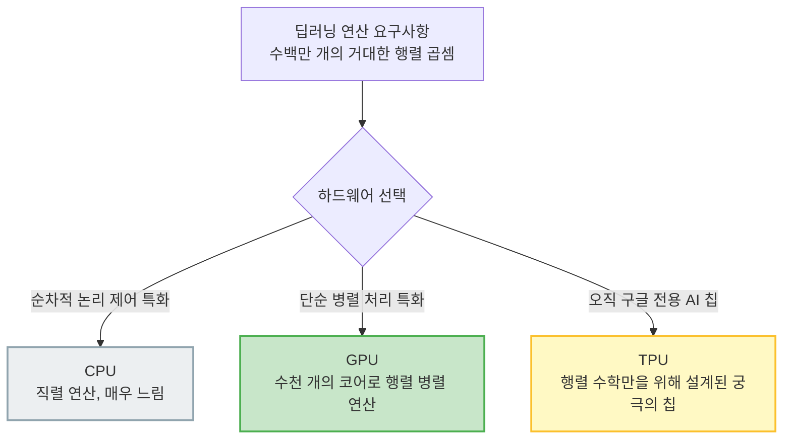

# Lesson 1.6: 실전 코딩 환경 구축 완벽 해부 (Jupyter, Colab, Docker)

지금까지 우리는 딥러닝의 위대한 역사와 내부의 위상수학적 원리를 눈으로 확인했습니다. 이제 드디어 이론을 넘어 실전(Hands-On) 코드를 직접 실행해 볼 차례입니다. 
이번 영상은 향후 모든 실습의 뼈대가 될 파이썬(Python) 기반의 주피터 노트북(Jupyter Notebook) 환경 세팅을 다룹니다.

강사는 환경 구축을 위해 크게 두 가지 옵션(Google Colab과 로컬 Docker)을 제안합니다. 
단순한 클릭 매뉴얼을 넘어, **왜 데이터 과학자들이 이 도구들을 사용하는지, Colab 뒤에서 어떤 클라우드 인프라가 돌아가고 있는지, 그리고 Docker 컨테이너화가 딥러닝 실무에서 왜 필수적인지** 전공자 수준으로 아주 깊숙이 파헤쳐 보겠습니다.

---

## 🐍 1. 실습 언어와 도구의 선택: 파이썬과 주피터 노트북

강사는 모든 실습 코드를 파이썬(Python)으로 작성했다고 밝힙니다.

### 1.1 파이썬이 데이터 과학의 표준이 된 이유
데이터 과학 커뮤니티에서 파이썬이 지배적인 이유는 단순한 문법 때문만이 아닙니다. 
데이터 수집, 전처리(Pandas), 딥러닝 모델링(TensorFlow/PyTorch), 그리고 백엔드 서버를 통한 상용화 서비스 배포(FastAPI, Django)까지 이어지는 전체 파이프라인(End-to-End)을 단일 언어로 매끄럽게 연결할 수 있는 **압도적인 생태계(Ecosystem)**를 갖추고 있기 때문입니다.

### 1.2 주피터 노트북(Jupyter Notebook)의 아키텍처
우리가 사용할 주피터 노트북은 단순히 코드를 치는 메모장이 아닙니다.
*   **REPL (Read-Eval-Print Loop) 방식의 진화**: 코드를 한 줄 또는 블록 단위(Cell)로 실행하고, 즉각적으로 데이터를 시각화(그래프, 표)하여 확인할 수 있습니다. 
*   **분리된 아키텍처**: 웹 브라우저(Front-end)와 코드를 실제로 실행하는 엔진인 커널(Kernel, Back-end)이 네트워크로 분리되어 있습니다. 덕분에 내 컴퓨터의 브라우저를 통해 저 멀리 구글 클라우드 서버의 커널을 원격으로 조종하는 것이 가능합니다.

---

## ☁️ 2. 옵션 A: 가장 빠르고 쉬운 선택, Google Colab

강사가 가장 먼저 추천하는 방법은 구글 클라우드 서버에서 동작하는 **Google Colab(Colaboratory)**입니다.

### 2.1 Colab의 압도적 장점 (하드웨어 가속기)
복잡한 리눅스나 패키지 설치 과정 없이 구글 계정 하나만 있으면 수백만 원짜리 인프라를 무료로 빌려 씁니다. 특히 메뉴의 '런타임 유형 변경'을 통해 **GPU(Graphic Processing Unit)**와 **TPU(Tensor Processing Unit)**를 클릭 한 번에 장착할 수 있다는 것이 핵심입니다.



### 2.2 Colab의 치명적 단점 (의존성 제어 불가와 세션 한계)
*   **버전 통제 불가**: 구글이 사전 설치해둔 라이브러리 버전을 강제로 써야 합니다. (트랜스크립트에서 강사가 TF 1.14를 TF 2.0으로 억지로 업그레이드하기 위해 `!pip install tensorflow==2.0.0-beta0`를 치고 런타임을 껐다 켜는 불편한 과정을 겪은 이유가 이것입니다.)
*   **세션 타임아웃**: 무료로 제공되는 대신, 일정 시간(통상 12시간)이 지나거나 사용자가 화면에서 눈을 떼면 구글이 서버 인스턴스를 강제로 폭파해 버립니다. (가상화폐 채굴 악용 방지 목적). 즉, 며칠이 걸리는 초거대 AI 모델의 기업용 학습에는 절대 쓸 수 없습니다.

---

## 🐳 3. 옵션 B: 가장 완벽한 실무 표준, Docker 로컬 설치

"환경이 내 의도대로 100% 작동함을 보장받고 싶다면, 도커(Docker)를 이용한 컨테이너화를 강력히 권장합니다."

강사가 맥OS(Mac OS) 터미널을 열고 명령어(`git clone`, `docker build`, `source rundocker`)를 무심하게 치는 과정은, 현재 구글이나 넷플릭스 등 모든 글로벌 IT 기업들이 모델을 배포하는 실무 표준(De Facto Standard) 방식 그 자체입니다.

```mermaid
flowchart LR
    subgraph 과거의 문제점 (Dependency Hell)
    A1[내 노트북 환경<br/>Python 3.6, TF 1.x] -->|버전 충돌 발생!| B1(강사의 실습 코드<br/>Python 3.8, TF 2.x 요구)
    end

    subgraph 현대의 기술: 도커 컨테이너화 (Containerization)
    A2[내 노트북 환경<br/>Mac/Windows] --> B2{도커 엔진<br/>Docker Engine}
    B2 --> C2[투명한 격리 박스<br/>완벽하게 복제된 강사의 컴퓨터 환경]
    C2 --> D2[기존 시스템과 일절 충돌 없이 깔끔하게 코드 실행]
    end
    
    style B1 fill:#ffcdd2,stroke:#d32f2f,stroke-width:2px
    style C2 fill:#bbdefb,stroke:#1976d2,stroke-width:2px
```

*   **컨테이너화(Containerization)란?**: 강사의 컴퓨터 환경 전체(운영체제 수준의 설정, 파이썬 버전, 설치된 수많은 라이브러리 세팅들)를 투명한 플라스틱 박스(Container)에 통째로 얼려서 담아오는 마법 같은 기술입니다.
*   내 컴퓨터에 원래 깔려있던 파이썬이나 다른 업무용 프로그램들과 **전혀 얽히지 않고(충돌 방지)**, 완벽하게 격리된 가상 공간 안에서만 코드를 안전하고 깨끗하게 실행할 수 있습니다.

### 3.1 실무 팁: .gitignore 설정과 서브모듈(Submodule) 방지
강사의 깃허브 원본 코드(`DLTFpT`)를 `git clone`으로 내 작업 폴더 안에 다운로드할 때 주의할 점이 있습니다. 내 작업 폴더가 이미 깃허브(`.git`)에 연결되어 있다면, 강사의 코드가 내 저장소에 통째로 섞여서 올라가는 대참사가 발생할 수 있습니다. 
따라서 다운로드 직후 반드시 `.gitignore` 파일을 생성하고 파일 내용에 `DLTFpT/`라고 적어주어, 강사의 무거운 폴더가 내 깃허브 커밋 기록을 오염시키지 않도록 철저히 차단(Ignore)하는 것이 깔끔한 실무 개발자의 기본 소양입니다.

### 3.2 실무 트러블슈팅: 폴더명 띄어쓰기(공백)와 Docker 볼륨 마운트 에러
도커를 실행할 때 초보자들이 가장 많이 겪는 에러 중 하나가 바로 **"invalid reference format: repository name must be lowercase"** 에러입니다.
*   **에러 원인**: 강사의 명령어 `docker run -v $(pwd):/home/jovyan/work`에서 `$(pwd)`는 현재 폴더 경로를 뜻합니다. 만약 현재 폴더 이름에 `Deep Learning`처럼 **띄어쓰기(공백)**가 포함되어 있다면, 도커 엔진은 띄어쓰기를 만난 순간 경로가 끝났다고 착각해버리고 뒤에 남은 단어(`Learning`)를 이미지 이름으로 잘못 인식하여 에러를 뱉어냅니다.
*   **해결책**: 명령어의 경로 부분을 반드시 **큰따옴표(" ")**로 감싸주어야 합니다. 
    `sudo docker run -v "$(pwd)":/home/jovyan/work -it --rm -p 8888:8888 jonkrohn/dltfpt-stack:videos`
    이렇게 따옴표 처리를 해주는 것이 어떤 악조건의 디렉토리명에서도 끄떡없는 가장 완벽하고 방어적인 쉘 프로그래밍(Defensive Shell Programming) 습관입니다.

---

## 📖 4. 트랜스크립트 구문별 상세 해설 (Missing Details Fully Explained)

> *"In these LiveLessons, we're using TensorFlow 2.0. So let's have a look at the situation if we import TensorFlow as TF."*
*   **해설**: 파이썬에서 딥러닝 라이브러리를 불러오는 표준 약어 방식(`import tensorflow as tf`)입니다. 이 짧은 코드 한 줄을 실행하는 순간, 파이썬 이면에서는 C++와 CUDA로 짜여진 어마어마한 수학적 연산 엔진과 GPU 드라이버 통신 모듈을 시스템 메모리에 거대하게 적재하는 무거운 과정이 진행됩니다. 

> *"You can use an exclamation mark (!) in Jupyter notebooks to run commands on the outside system. And so I'm going to run PIP freeze, to see what libraries I have installed. And then I'm gonna use grep..."*
*   **해설**: 주피터 노트북의 매직 커맨드(Magic Command) 기능입니다. 원래 주피터의 각 셀(Cell)은 파이썬 코드를 실행하지만, 맨 앞에 느낌표(`!`)를 붙이는 순간 이 셀은 파이썬이 아닌 리눅스(Linux) 운영체제의 터미널(Bash)에게 직접 시스템 명령을 내리는 창구로 변신합니다. 
    `!pip freeze | grep tensorflow`라는 구문은, 현재 리눅스 OS에 깔려있는 수백 개의 파이썬 패키지 목록을 모조리 뽑아낸 뒤(`pip freeze`), 리눅스 파이프라인(`|`)을 통해 그중 'tensorflow'라는 글자가 포함된 줄만 예쁘게 걸러내어(`grep`) 보여달라는 아주 훌륭한 실무자용 리눅스 조합 명령어입니다.

> *"When that finishes installing TensorFlow 2.0, click the restart runtime button."*
*   **해설**: 패키지를 새로 설치했는데 귀찮게 왜 런타임을 굳이 재시작해야 할까요? 파이썬 커널(Kernel) 프로그램은 주피터가 켜질 때 이미 구버전(TF 1.14)을 RAM 메모리에 싹 올려둔 상태입니다. `!pip install` 명령어를 통해 하드디스크의 텍스트 파일은 2.0 버전으로 덮어썼지만, 이미 메모리 상에서 돌아가고 있는 뇌(커널 프로세스)를 강제로 껐다가 다시 켜야만(Restart) 방금 설치된 하드디스크의 새로운 2.0 버전을 제대로 읽어올 수 있기 때문입니다.

> *"change directory into your home directory, which you can do by specifying tilde (~)."*
*   **해설**: 유닉스/리눅스(그리고 Mac OS) 시스템에서 물결표(`~`) 기호는 현재 로그인한 사용자의 최상위 개인 홈 디렉토리(Home Directory)를 지칭하는 절대 불변의 OS 단축키(Alias)입니다. 

> *"build the Docker image... be sure that you include this trailing period (.)"*
*   **해설**: 강사가 터미널에서 `docker build -t dltfpt .` 명령어를 칠 때 마지막에 점(`.`)을 빼먹지 말라고 신신당부하는 데는 치명적인 이유가 있습니다. 이 점(`.`)은 터미널 상에서 **현재 작업 디렉토리(Current Working Directory)**를 의미하며, 도커 엔진 프로세스에게 "이 이미지를 조립하기 위한 설계도 파일(Dockerfile)이 바로 지금 내가 서 있는 이 폴더 안에 있다!"라고 위치 컨텍스트를 넘겨주는 필수 인자이기 때문입니다.

---

## 🚀 5. 실무 적용 및 시사점: MLOps의 위대한 태동

이번 영상은 단순히 '실습 폴더 여는 법'을 넘어서, 현대 AI 실무 현장에서 개발자들이 피를 토하는 가장 골치 아픈 난제, **'환경 재현성(Environment Reproducibility)'** 문제를 본질적으로 찌르고 있습니다.
"어? 내 노트북에서는 완벽하게 돌아가는데 네 컴퓨터(또는 실서버)에서는 왜 에러가 터지지?"라는 끔찍한 의존성 지옥(Dependency Hell)은 개발자들의 영원한 악몽이었습니다. 
이를 해결하기 위해 등장한 구원자가 바로 **Docker**이며, 이 컨테이너 개념이 무섭게 진화하여 오늘날 구글의 수백만 개 컨테이너를 지휘하는 **쿠버네티스(Kubernetes)**와 데이터 파이프라인 전체를 관리하는 **MLOps(Machine Learning Operations)**라는 거대한 현대 실무 철학으로 발전하게 되었습니다.

---

## ✍️ 6. 핵심 요약 및 실전 이해도 점검 (Beginner to Pro)

**[핵심 요약]**
1. **Google Colab**: 가장 쉽고 로그인만 하면 무료로 초고가 GPU를 쓸 수 있는 혁신적인 클라우드 도구이지만, 버전 관리가 내 마음대로 되지 않고 장시간 학습 시 구글이 서버 전원을 끊어버리는 치명적인 단점이 있습니다.
2. **리눅스 명령어의 융합**: 주피터 셀에서 `!`를 붙이면 OS의 쉘(Shell)에 직접 명령을 내릴 수 있어, 파이썬과 시스템 인프라를 오가며 작업할 수 있습니다. (예: `!pip install tensorflow==2.0.0`)
3. **Docker 컨테이너의 가치**: 내 컴퓨터를 지저분하게 만들거나 환경 충돌을 일으키지 않고, 강사와 100% 똑같은 환경을 내 컴퓨터 안에 무균실 박스 형태로 구축해 주는 MLOps 시대의 핵심 척추 기술입니다.

**🤔 실전 점검 질문 (비즈니스 시나리오):**
당신은 사내 딥러닝 리서치 팀에 갓 입사한 패기 넘치는 신입 연구원입니다. 팀장님이 당신에게 "기존 우수 고객들의 구매 이력 데이터 500GB를 분석하여, 향후 3일간 절대 멈추지 않고 딥러닝 모델을 딥하게 학습시켜야 하는 거대한 프로젝트"를 지시했습니다. 이 모델은 회사의 기밀 고객 데이터를 활용해야 하며, 최신 버전이 아닌 과거 특정 버전의 파이썬 패키지(예: TensorFlow 1.15) 환경에서만 완벽히 돌아가도록 레거시 코드로 짜여 있습니다.

Q1. 당신은 이 거대한 모델을 학습시키기 위해 강사가 극찬한 **Google Colab**을 선택하는 것이 옳을까요? (Colab이 가진 3가지 치명적 단점과 정책을 근거로 불가능한 이유를 논리적으로 설명해 보세요.)
Q2. 만약 당신이 회사 로컬의 초고성능 GPU 서버(Linux)를 지급받았다면, 기존 서버에 이미 깔려있던 최신 패키지 선배들의 코드들과 충돌을 피하면서 팀장님의 구버전(TF 1.15) 코드를 가장 안전하고 깔끔하게 구동하기 위해 당신이 팀장님께 요청해야 할 '가장 스마트한 마법의 기술'은 무엇입니까?

---

### 💡 실전 점검 질문 모범 답안 

*   **모범 답안 (Q1)**: 아무리 훌륭한 툴이라도 Google Colab은 이 비즈니스 프로젝트에 절대 적합하지 않으며, 다음과 같은 3가지 치명적 이유가 있습니다. 
    1) **세션 강제 타임아웃**: Colab은 가상화폐 채굴 방지를 위해 장시간(12시간 이상) 연속 학습을 허용하지 않고 강제로 런타임을 폭파해 버리므로, 3일짜리 학습 자체가 물리적으로 불가능합니다.
    2) **심각한 보안 위반 (Security Issue)**: 최고 기밀인 은행/기업 고객의 프라이빗 데이터를 구글의 퍼블릭 클라우드 드라이브에 올려서 학습시키는 것은 사내망 보안 정책을 정면으로 위반하는 치명적인 행위입니다.
    3) **환경 제어의 한계**: 구글이 강제하는 최신 환경을 지우고 구버전인 TF 1.15 환경으로 매번 억지로 다운그레이드해서 맞추기 번거롭고, 서버가 타임아웃되어 재시작될 때마다 이 고통스러운 세팅을 계속 반복해야 합니다.
*   **모범 답안 (Q2)**: 사내 공용 로컬 서버에 기존 설치된 최신 환경들과의 피 튀기는 의존성 충돌(Dependency Hell)을 막기 위해 **"도커(Docker) 컨테이너 기술"**을 적극 활용해야 합니다. 팀장님이 과거에 작성해 두신 `Dockerfile` 혹은 빌드된 도커 이미지만 넘겨받으면, 내 서버에 투명하고 안전한 무균 격리 공간(Container)을 즉시 만들어내어 기존 서버 시스템을 전혀 더럽히지 않고 완벽하게 구버전 모델 코드를 안전하게 구동할 수 있습니다.

---

### 🔥 [전공자/전문가용] 심화 보충 설명 (Deep Dive: The Architecture behind the Tools)

강사가 가볍게 클릭 몇 번으로 훑고 넘어간 클라우드 인프라와 프레임워크의 이면을, 컴퓨터 공학 전공자 및 클라우드 AI 엔지니어 수준으로 깊숙이 파헤쳐 봅니다.

#### 1. TensorFlow 1.x에서 2.x로의 패러다임 전환의 본질 (Paradigm Shift)
강사가 Colab 환경에서 굳이 귀찮게 `TF 1.14`를 삭제하고 베타 버전인 `TF 2.0`을 꾸역꾸역 설치하면서까지 실습을 진행하려 한 진짜 이유는 무엇일까요? 이는 단순한 소프트웨어 버전업이 아닌 **컴퓨테이셔널 그래프(Computational Graph) 실행 방식의 근본적인 철학적 혁명**이었기 때문입니다.
*   **과거: TF 1.x (Define-and-Run 방식)**: 모든 신경망의 수학적 연산 그래프 구조를 사전에 완벽하게 코드로 정의(Define)하고 전체를 컴파일한 뒤에야 비로소 데이터를 흘려보내며 블랙박스처럼 한 번에 실행(Run)하는 '정적 그래프(Static Graph)' 방식이었습니다. 기계 입장에서는 C++ 단에서 최적화가 잘 되어 성능은 미치도록 빨랐으나, 코딩이 너무 난해하고 중간 과정에서 에러가 터졌을 때 변수 안의 값을 확인하는 디버깅이 사실상 불가능해 수많은 초보자들이 딥러닝을 포기하게 만드는 주범이었습니다.
*   **현재: TF 2.0 (Eager Execution 모드 도입)**: 경쟁 프레임워크인 파이토치(PyTorch)의 대성공에 자극을 받아 텐서플로우 진영이 항복하고 채택한 방식입니다. 코드를 한 줄 칠 때마다 즉시 메모리에 연산 결과가 나오는 **동적 실행(Eager Execution)**을 기본 모드로 채택했습니다. 이 거대한 아키텍처 변화 덕분에 우리는 파이썬의 표준 디버거와 주피터 노트북의 즉각적인 셀 단위 실행 기능을 100% 활용하여 직관적이고 쉬운 딥러닝 연구가 비로소 가능해진 것입니다.

#### 2. CPU vs GPU vs TPU의 딥러닝 하드웨어 아키텍처적 차이
강사가 런타임 유형에서 클릭 한 번으로 넘나들던 하드웨어들의 태생적 차이는 딥러닝 행렬 연산 구조 최적화에 맞닿아 있습니다.
*   **CPU (Central Processing Unit)**: 소수의 아주 똑똑하고 강력한 코어(Core)들이 운영체제의 복잡한 논리 제어와 분기문(If-Else)을 지연 시간(Latency) 없이 가장 빠르게 처리하도록 설계되었습니다. (비유: 고급 수학 교수 4명이 모인 집단). 하지만 딥러닝의 거대한 행렬 곱셈에는 비효율적입니다.
*   **GPU (Graphic Processing Unit)**: 수천 개의 상대적으로 멍청하지만 단순 연산에 특화된 쪼그만 코어(ALU)들이 병렬(Parallel)로 수백만 개의 화면 픽셀 연산을 한 번에 처리하는 데스크탑 그래픽 기술(SIMT 아키텍처)입니다. (비유: 초등학생 4천 명이 모여서 동시에 구구단을 외우는 집단). 이 무식하게 코어 수를 늘린 병렬 연산 구조가, 공교롭게도 신경망의 거대한 가중치 행렬 곱셈($W \times x + b$)을 처리하는 수학적 로직과 기적처럼 완벽하게 박자가 맞아떨어져 오늘날의 AI 혁명을 견인했습니다.
*   **TPU (Tensor Processing Unit)**: 구글이 오직 자사의 딥러닝 모델 생태계 장악을 위해 아예 실리콘 반도체 단에서부터 자체 설계한 괴물급 ASIC(주문형 반도체)입니다. GPU조차도 태생적으로는 '그래픽 렌더링용'이라는 범용성을 띄고 있다면, TPU는 아예 레지스터 단에서부터 거대한 행렬의 곱셈과 덧셈(MAC 연산)을 공장 컨베이어 벨트 파이프라인처럼 한 큐에 밀어버리는 무시무시한 행렬 곱셈 전용 유닛(Matrix Multiply Unit, MXU)을 하드웨어 칩으로 박아 넣은, 순수한 인공지능 수학용 전용 엔진입니다.

#### 3. Docker 컨테이너화의 커널 공유 격리 원리 (Namespaces and cgroups)
도커(Docker)가 과거 무겁고 느렸던 가상 머신(VM, Virtual Machine)을 제치고 클라우드 생태계를 장악한 기술적 원리는 무엇일까요?
*   **전통적 가상 머신(VM)**은 하드웨어 자체를 가상화(Hypervisor)하여 그 위에 거대한 게스트 OS(윈도우나 우분투 리눅스 전체)를 수십 GB 크기로 아예 무식하게 통째로 새로 올리는 방식입니다. 부팅 시간도 길고 리소스 낭비가 극심합니다.
*   반면 **Docker 컨테이너**는 호스트 컴퓨터(내 노트북) OS의 핵심 심장인 **리눅스 커널(Kernel)을 그대로 공유**하면서, 리눅스 OS 내부의 논리적인 얇은 벽돌 격리 기술인 **Namespaces(프로세스 ID, 마운트, 네트워크 격리)**와 **cgroups(CPU 및 메모리 자원 할당량 격리)**만을 절묘하게 이용합니다. 
*   결론적으로, 강사가 다운로드하라고 제공한 Docker 이미지는 수십 GB의 거대한 운영체제를 무식하게 들고 다니는 것이 아닙니다. 텐서플로우와 파이썬 실행 환경이라는 '얇은 소프트웨어 실행 껍데기'들만 수백 MB 수준으로 가볍게 압축 포장해 둔 것입니다. 
    때문에 우리가 터미널에서 `source rundocker`를 치는 순간, 가상 머신처럼 몇 분을 기다릴 필요 없이 단 1~2초 만에 강사와 완벽하게 똑같이 세팅된 격리된 연구실 환경 프로세스가 내 컴퓨터 메모리에 마법처럼 부팅되어 안전하게 실행될 수 있는 것입니다.
