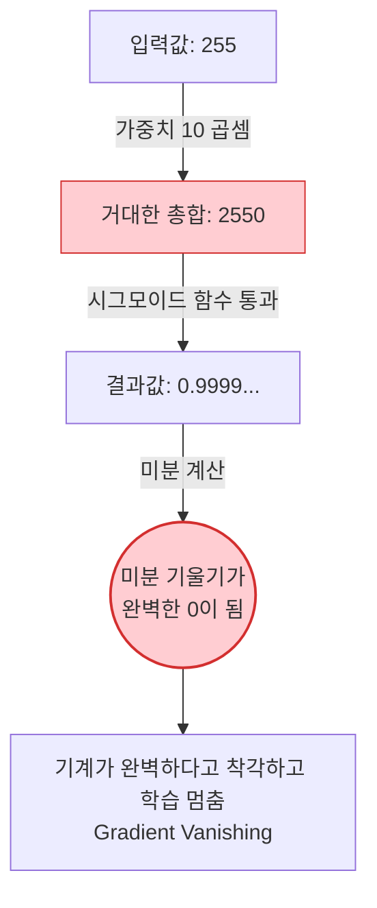

# Lesson 1.7: 텐서플로우와 케라스를 활용한 첫 번째 인공 신경망 (Part 1)

지금까지 우리는 딥러닝의 위상수학적 개념과 실습 인프라(Docker, Colab) 구축법을 마스터했습니다. 이제 드디어 첫 번째 인공 신경망을 바닥부터 직접 코딩해 볼 차례입니다.

강사는 **"지루한 수학적 이론을 먼저 추상적으로 배우기보다는, 작동하는 파이썬 코드를 먼저 눈으로 보고 그 코드 라인 하나하나에 이론을 접목시키는 역발상(Unconventional) 접근법"**을 채택했다고 밝힙니다. 이번 섹션에서는 AI 업계의 'Hello World'라 불리는 MNIST 데이터셋을 불러오고, 이를 학습하기 위한 얕은 신경망(Shallow Net)의 뼈대를 설계해 봅니다.

---

## 🔢 1. MNIST 데이터셋 완벽 해부 (The "Hello World" of Deep Learning)

### 1.1 MNIST란 무엇인가?
1990년대, 얀 르쿤(Yann LeCun)과 동료들이 미국 우체국(USPS)의 우편번호 자동 인식 시스템을 개발할 때 사용했던 전설적인 손글씨 숫자(0~9) 데이터셋입니다. 
*   **출처**: 미국 국립표준기술연구소(NIST)가 고등학생과 인구조사국 직원들이 쓴 손글씨를 수집한 방대한 원본(NIST) 데이터를, 머신러닝 학습에 알맞게 정제하고 수정(Modified)했다고 하여 **M**NIST라고 부릅니다.
*   **구성**: 기계에게 정답을 알려주며 학습시킬 **훈련용(Training) 데이터 6만 장**, 그리고 기계가 처음 보는 낯선 필체로 시험을 치르게 할 **검증용(Validation/Test) 데이터 1만 장**으로 완벽하게 나뉘어 있습니다.

### 1.2 왜 하필 MNIST인가? (The Sweet Spot)
*   **가벼운 용량**: 노트북이나 구형 스마트폰의 CPU만으로도 몇 분 안에 학습을 끝낼 수 있을 만큼 가볍습니다.
*   **적절한 난이도(Sweet Spot)**: 악필, 휘갈겨 쓴 글씨 등 사람의 다양한 필체가 섞여 있어 구형 알고리즘으로는 100%를 달성하기 어렵지만, 설계가 잘 된 딥러닝 모델이라면 사람에 필적하는 거의 완벽한(Faultless) 정확도에 도달할 수 있는 가장 이상적인 난이도를 가졌습니다.

### 1.3 이미지의 수학적 실체 (8-bit Grayscale)
우리의 눈에는 '3'이라는 숫자로 보이지만, 컴퓨터(파이썬)에게 이미지는 단순한 엑셀 표(Matrix)에 불과합니다.
*   가로 28칸 $\times$ 세로 28칸의 픽셀(Pixel)로 이루어져 있습니다. ($28 \times 28 = 784$개의 픽셀)
*   각 픽셀은 **8비트(8-bit)** 정보를 담고 있습니다. $2^8 = 256$이므로, 0부터 255까지의 정수 값을 가집니다.
*   `0`은 완전한 흰색(여백)을, `255`는 완전한 검은색(잉크)을 의미하며, 그 사이의 숫자들은 점점 진해지는 회색 음영(Shades of gray)을 나타냅니다.

---

## 🏗️ 2. 얕은 신경망(Shallow Neural Network)의 아키텍처 설계

강사는 이번 시간에 딥러닝(Deep Learning)이 아닌 **얕은 신경망(Shallow Net)**을 먼저 만들겠다고 선언합니다. 이전 강의에서 배웠듯, 'Deep'이라는 칭호를 얻으려면 은닉층이 최소 3개(총 5개 층) 이상이어야 하지만, 지금 만들 모델은 단 1개의 은닉층만 가지기 때문입니다.


*   **입력층 (Input Layer, 784 차원)**: 예를 들어 숫자 '3'이 적힌 28x28짜리 정사각형 이미지를, 1줄짜리 긴 기차(1차원 배열)로 길게 쭉 폅니다. 즉, `[0, 0, ..., 255, 128, ... 0]` 처럼 784개의 픽셀 밝기 숫자들이 한 줄로 나열됩니다.
*   **은닉층 (Hidden Layer, 64 뉴런)**: 입력층의 784개 숫자가 어떻게 은닉층으로 넘어갈까요? 은닉층의 각 뉴런은 입력된 784개의 픽셀 값에 각각 '가중치(Weight, 중요도)'를 곱해서 모두 더합니다. 
    *   **예시**: "1번 픽셀 밝기(255) $\times$ 가중치(0.5) + 2번 픽셀 밝기(0) $\times$ 가중치(-0.1) + ... = 총합(10.5)"
    *   이 총합을 바탕으로 특정 뉴런은 "오, 왼쪽 위에 둥근 선이 있군!" 하고 강하게 반응(활성화)합니다. 이런 분석가 역할을 하는 뉴런이 64개가 모여있는 곳이 은닉층입니다.
*   **출력층 (Output Layer, 10 차원)**: 64명의 분석가(은닉층 뉴런)들의 의견을 종합하여, 최종적으로 10개의 뉴런(숫자 0~9 담당)이 각자의 '확신도'를 점수로 매깁니다. 그리고 **소프트맥스(Softmax)**라는 마법의 함수를 거치면, 이 10개의 점수들이 **"다 합쳐서 100%가 되는 확률 값"**으로 변환됩니다.

**[🔍 예시로 보는 데이터 흐름도: 숫자 '3'을 맞추는 과정]**


---

## 💻 3. 주피터 노트북 실전 코드와 X, y의 비밀

강사가 짠 실전 코드를 라인별로 분석하고, 그 이면에 숨겨진 작동 원리를 파헤쳐 보겠습니다.
*(참고: **주피터 노트북(Jupyter Notebook)**은 파이썬 코드를 한 줄씩 실행하고 표나 그래프를 그려주는 '소프트웨어 프로그램' 자체를 의미합니다. 반면 **구글 코랩(Google Colab)**은 이 주피터 노트북 소프트웨어를 구글의 거대한 클라우드 서버에 미리 깔아두고, 우리가 깡통 컴퓨터의 웹 브라우저로 접속해서 공짜로 빌려 쓸 수 있게 해주는 '온라인 대여 서비스'입니다. 즉, 구글 문서(Google Docs)처럼 클라우드에서 돌아가는 주피터 노트북이라고 이해하시면 됩니다!)*

### 3.1 딥러닝 코드의 전체 흐름
회원님께서 실습하신 전체 코드는 아래와 같습니다.

```python
# 1. 라이브러리(Dependencies) 불러오기
import tensorflow
from tensorflow.keras.datasets import mnist
from tensorflow.keras.utils import to_categorical
from tensorflow.keras.models import Sequential
from tensorflow.keras.layers import Dense
from tensorflow.keras.optimizers import SGD
from matplotlib import pyplot as plt

# 2. 데이터 불러오기 (마법의 한 줄)
(X_train, y_train), (X_valid, y_valid) = mnist.load_data()

# 3. 데이터 형태(Shape) 및 내용물 확인
print(X_train.shape) # 출력: (60000, 28, 28)
print(y_train.shape) # 출력: (60000,)
print(y_train[0:12]) # 출력: array([5, 0, 4, 1, 9, 2, 1, 3, 1, 4, 3, 5], dtype=uint8)

# 4. 이미지 시각화하기
plt.figure(figsize=(5,5))
for k in range(12):
    plt.subplot(3, 4, k+1)
    plt.imshow(X_train[k], cmap='Greys')
    plt.axis('off')
plt.tight_layout()
plt.show()
```

### 3.2 의문점 해결: 나는 6만 장의 이미지를 다운로드 한 적이 없는데?
회원님께서 아주 예리한 질문을 주셨습니다. *"나는 6만 장의 이미지를 직접 드래그해서 넣은 적이 없는데 어떻게 로드가 되는 건가?"*

비밀은 바로 `mnist.load_data()`라는 **케라스(Keras)의 내장형 헬퍼(Helper) 함수**에 있습니다.
*   텐서플로우/케라스 제작진은 사람들이 MNIST를 워낙 많이 쓰다 보니, 아예 구글의 클라우드 서버 어딘가에 이 6만 장의 이미지를 압축 파일(`mnist.npz`)로 예쁘게 올려두었습니다.
*   우리가 파이썬에서 저 함수를 실행하는 순간, 파이썬이 **알아서 백그라운드에서 인터넷을 타고 구글 서버에 접속하여 11MB짜리 압축 파일을 내 컴퓨터의 숨김 폴더(`~/.keras/datasets/`)에 몰래 다운로드** 받습니다.
*   그리고 압축을 풀어 훈련용 데이터와 검증용 데이터 두 덩어리로 예쁘게 쪼갠 뒤 파이썬 변수에 넘겨주는 것입니다! (두 번째 실행할 때부터는 이미 다운로드되어 있으므로 인터넷 없이 0.1초 만에 불러옵니다.)

### 3.3 대문자 $X$와 소문자 $y$의 암묵적 룰 (Convention)
데이터를 받아온 변수를 보면 앞부분은 `X`를 대문자로, 뒷부분은 `y`를 소문자로 썼습니다.
*   **`X_train` (특징 텐서, Feature Tensor)**: 픽셀들의 밝기 숫자 값입니다. 대문자를 쓰는 이유는 수학적으로 1차원이 아닌, 여러 차원이 겹겹이 쌓인 거대한 덩어리(행렬/텐서)이기 때문입니다. 실제로 `X_train.shape`를 찍어보면 `(60000, 28, 28)`이 나옵니다. 이는 "60,000장의 이미지가 뭉쳐있으며, 각각의 이미지는 가로 28칸 $\times$ 세로 28칸의 표로 이루어진 3차원 입체 형태"라는 뜻입니다.
*   **`y_train` (라벨, Labels)**: 해당 이미지가 실제로 나타내는 정답 숫자입니다. 소문자를 쓰는 이유는 각 이미지당 정답이 '5'나 '0' 같은 단일 숫자 하나(스칼라, Scalar)뿐이기 때문입니다. `y_train.shape`를 보면 `(60000,)`처럼 단순히 정답 6만 개가 1차원 줄서기를 하고 있음을 알 수 있습니다.

### 3.4 Matplotlib 시각화 코드 해설 (그림 그리기)
코드 맨 밑의 `plt`로 시작하는 부분은 숫자로만 된 텐서를 사람이 볼 수 있게 그림으로 그려주는 코드입니다.
*   `plt.figure(figsize=(5,5))`: 그림을 그릴 가로 5인치, 세로 5인치짜리 텅 빈 도화지를 꺼냅니다.
*   `for k in range(12):`: 0부터 11까지 총 12번 반복문을 돌리면서 첫 12장의 이미지를 차례대로 꺼냅니다.
*   `plt.subplot(3, 4, k+1)`: 도화지를 가로 3줄, 세로 4칸짜리 격자(Grid)로 나눈 뒤, `k+1`번째 칸에 그림을 그리겠다고 지정합니다. (엑셀 표의 셀을 찾아가는 것과 같습니다.)
*   `plt.imshow(X_train[k], cmap='Greys')`: `X_train`에 담긴 픽셀 숫자 데이터들을 가져와 색을 칠합니다. 이때 `cmap='Greys'`를 통해 0을 하얀색으로, 255를 까만색으로 칠하는 흑백 지시를 내립니다.
*   마지막으로 출력된 그림을 보면, `y_train[0:12]`에서 찍혔던 정답 배열 `[5, 0, 4, 1, ...]` 과 완벽하게 똑같은 순서대로 흑백 손글씨 이미지가 나타남을 눈으로 확인할 수 있습니다.

---

## ✍️ 4. 핵심 요약 및 실전 이해도 점검 (Beginner to Pro)

**[핵심 요약]**
1. **역발상 학습**: 복잡한 미적분 공식을 먼저 외우는 대신, 텐서플로우/케라스 코드를 먼저 실행해 보고 코드의 각 라인에 이론을 매핑하는 실전 지향형 접근법입니다.
2. **MNIST의 본질**: 28x28 해상도의 8비트 흑백 손글씨 이미지 데이터로, 딥러닝 알고리즘의 성능을 검증하는 AI 업계의 가장 완벽한 입문용 표준(Standard) 데이터셋입니다.
3. **네트워크 설계**: 입력(784) -> 은닉층(64) -> 출력층(10)으로 이어지는 '얕은(Shallow)' 구조를 통해 입력된 픽셀 값이 확률 값으로 매핑(Mapping)되는 과정을 구현합니다.

**🤔 실전 점검 질문 (비즈니스 시나리오):**
당신은 사물인터넷(IoT) 스마트 초인종을 만드는 스타트업의 AI 엔지니어입니다. 카메라에 찍힌 방문객의 얼굴을 인식해 가족인지 외부인인지 판별하는 AI를 만들고자 합니다. 이번 MNIST 수업에서 배운 얕은 신경망(1 Input, 1 Hidden, 1 Output) 구조를 그대로 차용하여 모델을 짰습니다. 카메라의 해상도는 1920x1080 픽셀(FHD)이며 풀 컬러(RGB)입니다.

Q1. 이 FHD 컬러 이미지를 MNIST 때처럼 1차원 배열로 길게 쭉 펴서(Flatten) 입력층에 넣는다면, 입력층(Input Layer)의 뉴런 개수는 정확히 몇 개가 되어야 할까요? (식과 답을 도출해 보세요.)
Q2. 만약 이 모델을 그대로 학습시켰을 때 성능이 끔찍하게 낮게 나온다면, 그 이유는 무엇일까요? (강사가 이 모델을 딥러닝(Deep)이 아니라 얕은(Shallow) 모델이라고 불렀던 이유와 결부 지어 설명해 보세요.)

---

### 💡 실전 점검 질문 모범 답안 

*   **모범 답안 (Q1)**: 뉴런 개수는 **6,220,800개**가 되어야 합니다. 
    *   **이유**: 가로 1920 $\times$ 세로 1080 픽셀 = 2,073,600개의 픽셀이 있습니다. 그런데 흑백이었던 MNIST와 달리, 컬러 이미지는 빛의 삼원색인 R, G, B 3개의 채널(Channel)을 가지므로 $2,073,600 \times 3 = 6,220,800$개의 입력 뉴런(특징)이 필요합니다.
*   **모범 답안 (Q2)**: 은닉층이 단 1개뿐인 **'얕은 신경망(Shallow Net)'** 구조이기 때문입니다. 사람의 얼굴처럼 눈, 코, 입의 위치와 빛의 반사, 각도 등 극도로 복잡하고 고차원적인 패턴(Hierarchy of Features)을 추출하려면, 은닉층이 수십~수백 개 쌓여있는 심층 신경망(Deep Neural Network, 예: ResNet)이 필수적입니다. 은닉층 1개짜리 얕은 네트워크는 단순한 선이나 윤곽선 정도밖에 인식하지 못하므로, 복잡한 FHD 얼굴 인식 문제에서는 치명적인 과소적합(Underfitting)을 일으킵니다.

---

### 🔥 [전공자/전문가용] 심화 보충 설명 (Deep Dive: The Math and Architecture)

이번 트랜스크립트 이면에 숨겨져 있는 수학적 텐서(Tensor) 구조와 데이터 파이프라인의 실무적 통찰을 파헤칩니다.

#### 1. 평탄화(Flattening)의 비극과 합성곱(CNN) 신경망의 탄생 배경
강사는 `28x28` 이미지 행렬을 `784` 길이의 1차원 벡터로 '길게 편다(Collapse down)'고 쉽게 말했지만, 실무 관점에서 이는 엄청난 **'공간적 정보(Spatial Information)의 영구적 파괴'**를 의미합니다. 

이해가 쉽도록 아래 시각화 자료를 살펴보겠습니다. 2차원 이미지에서는 눈(Eye)을 구성하는 픽셀 A와 B가 위아래로 찰칵 붙어있습니다. 하지만 이를 1차원으로 쭉 펴버리면(Flattening), A와 B 사이에 갑자기 다른 27개의 픽셀들이 끼어들면서 거리가 멀어집니다.

```mermaid
flowchart LR
    subgraph 2차원 이미지 (공간 정보 유지)
    A1[픽셀 A]
    B1[픽셀 B]
    C1[픽셀 C]
    D1[픽셀 D]
    A1 ---|바로 아래 붙어있음| C1
    B1 --- D1
    end

    subgraph 1차원으로 펴진 텐서 (공간 정보 파괴)
    A2[픽셀 A] --> B2[픽셀 B] --> E[상관없는 픽셀들...] --> C2[픽셀 C] --> D2[픽셀 D]
    end
    
    C1 -.->|1차원으로 강제로 찢어짐| C2
```

기계(신경망) 입장에서는 "원래 A 바로 밑에 C가 있었구나"라는 공간적 기하학 형태를 파악하기가 극도로 어려워집니다. 
이러한 1차원 평탄화의 치명적 한계를 극복하고, 2차원 이미지를 찢지 않고 그대로 돋보기(필터)를 대고 훑어가며 공간적 특징을 추출하기 위해 고안해 낸 위대한 아키텍처가 바로 **합성곱 신경망(CNN, Convolutional Neural Network)** 입니다.

#### 2. 대문자 $X$와 소문자 $y$: 지도학습(Supervised Learning)의 수학적 본질
머신러닝 코딩에서 왜 항상 `X_train`과 `y_train`을 변수로 강박적으로 분리할까요? 
이는 통계학의 지도학습이 근본적으로 **$y = f(X) + \epsilon$** 이라는 함수 추정(Function Approximation)의 철학에 뿌리를 두고 있기 때문입니다.
*   $X$ (디자인 행렬, Design Matrix): 머신러닝의 다차원 입력 피처들을 담고 있는 통계학적 행렬 기호입니다. 6만 장의 이미지를 $N$개, 차원 크기 784를 $D$라고 할 때, $X \in \mathbb{R}^{N \times D}$ 형태의 고차원 유클리드 공간 데이터입니다.
*   $y$ (종속 변수, Dependent Variable): 모델이 맞혀야 하는 목표 벡터입니다. $y \in \mathbb{Z}^N$ (0부터 9까지의 정수 집합).
*   신경망이 하는 일은 결국 수백만 번의 반복 계산(경사 하강법)을 통해, 거대한 다차원 공간 $X$를 10개의 확률 공간 $y$로 우그러뜨리고 매핑(Mapping)시키는 궁극의 만능 마법 함수 $f(\cdot)$ 의 내부 가중치(Weights) 톱니바퀴들을 미세하게 조율해 내는 최적화 과정입니다.

#### 3. 8비트 데이터(0~255)의 함정과 정규화(Normalization)의 필요성
강사는 아직 코드에 반영하지 않았지만, 이미지가 $0 \sim 255$의 픽셀 값을 가진다는 설명 속에는 딥러닝 실무의 커다란 폭탄이 숨어 있습니다. 어떻게 문제가 발생하는지 구체적인 예시로 확인해 보겠습니다.

초보자들은 이 0~255 값을 딥러닝의 입력층 784개에 그대로 밀어 넣습니다.
*   **문제 상황**: 입력값이 255(완전 검은색 픽셀)이고 가중치(W)가 10이라고 가정해 봅시다. 은닉층 뉴런은 이 둘을 곱해 `255 * 10 = 2550`이라는 아주 거대한 숫자를 받게 됩니다.
*   **시그모이드(Sigmoid) 함수의 한계**: 은닉층은 이 '2550'이라는 값을 시그모이드 함수에 넣습니다. 시그모이드 함수는 값이 5만 넘어가도 결과값을 무조건 `0.9999...`로 평평하게 뭉개버립니다. 즉, 숫자가 5든 2550이든 10000이든 똑같이 최대치로 취급해버립니다.



*   미분(기울기)이 0이 되면 모델은 "아, 완벽하구나. 더 이상 가중치를 고칠 필요가 없네!"라고 착각하고 **학습을 영원히 멈춰버립니다.** 이를 치명적인 **기울기 소실(Gradient Vanishing)** 현상이라고 합니다.
*   **해결책**: 따라서 실전 코드를 짤 때는 반드시 $0 \sim 255$ 값을 255로 나누어 $0 \sim 1$ 사이의 아주 작은 소수점 값(예: 0.5, 0.1)으로 스케일링하는 **정규화(Normalization)** 전처리 과정이 필수적으로 선행되어야 합니다.
