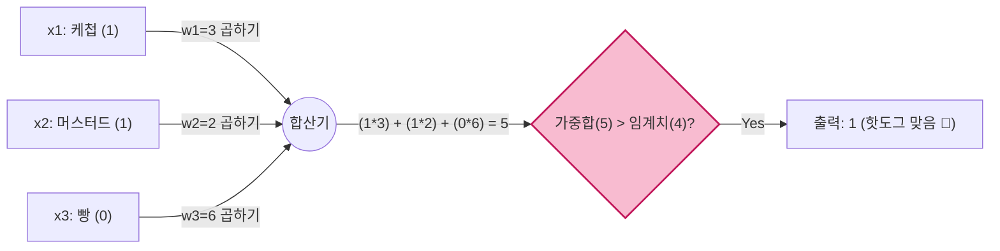

# Lesson 2.1: 인공 뉴런의 탄생과 퍼셉트론 (Neural Units - Part 1)

이전 Lesson 1에서 우리는 텐서플로우와 케라스를 이용해 얕은 신경망을 직접 코딩하고, 실전 모델의 작동 방식을 '탑다운(Top-down)' 방식으로 체험했습니다. Lesson 2부터는 본격적으로 딥러닝 내부의 기계 부품들을 하나하나 뜯어보는 **'바텀업(Bottom-up)' 로우레벨(Low-level) 이론**으로 깊게 들어갑니다.

가장 먼저 살펴볼 부품은 인공 신경망(Artificial Neural Network)을 구성하는 가장 작은 레고 블록, 바로 **'인공 뉴런(Artificial Neuron)'**입니다.

---

## 🧠 1. 생물학적 뉴런 vs 인공 뉴런의 평행이론

인공 신경망은 원래 인간의 뇌 신경세포인 '생물학적 뉴런(Biological Neuron)'의 작동 방식에서 영감을 받아 만들어졌습니다. 두 뉴런의 작동 방식을 비교해 보면 놀라운 평행이론을 발견할 수 있습니다.

### 1.1 생물학적 뉴런의 3단계 작동 원리
1. **입력 수신 (수상돌기, Dendrites)**: 수천 개의 수상돌기가 다른 뉴런들로부터 전달되는 전기적 신호를 받아들입니다.
2. **정보 종합 (세포체, Cell Body)**: 어떤 신호는 전압을 높이고(+), 어떤 신호는 전압을 낮춥니다(-). 세포체는 이 모든 미세한 전압 변화들을 하나로 합산(Aggregate)합니다.
3. **신호 발사 (축삭돌기, Axon)**: 합산된 전압이 평상시(-70mV)를 넘어 특정 임계치(Threshold, -55mV)를 돌파하면, '활동 전위(Action Potential)'라는 전기 스파크를 발생시켜 다음 뉴런으로 신호를 강하게 쏘아 보냅니다.

### 1.2 프랭크 로젠블랫의 '퍼셉트론(Perceptron)'
1950년대 후반, 미국의 신경생물학자 프랭크 로젠블랫(Frank Rosenblatt)은 이 생물학적 원리를 컴퓨터 알고리즘으로 완벽하게 번역한 최초의 인공 뉴런, **'퍼셉트론(Perceptron)'**을 발표했습니다.

퍼셉트론 역시 정확히 3단계로 작동합니다.
1. 여러 개의 다른 뉴런(변수)으로부터 **입력값(Input)**을 받습니다.
2. 각 입력값에 중요도(Weight)를 곱한 뒤 전부 더하는 **가중합(Weighted Sum)** 연산을 수행합니다.
3. 이 가중합이 특정 **임계치(Threshold)**를 넘으면 신호(1)를 출력하고, 넘지 못하면(0) 무시합니다.

```mermaid
flowchart TD
    subgraph 생물학적 뉴런
    B1[수상돌기 신호 수신] --> B2[세포체에서 전압 합산]
    B2 --> B3{임계치 돌파?}
    B3 -->|Yes| B4[축삭돌기로 신호 발사]
    B3 -->|No| B5[무시]
    end

    subgraph 인공 뉴런 (퍼셉트론)
    A1[입력값 x 수신] --> A2[가중합 계산: w1x1 + w2x2...]
    A2 --> A3{가중합 > 임계치?}
    A3 -->|Yes| A4[출력값: 1]
    A3 -->|No| A5[출력값: 0]
    end

    style B3 fill:#ffebee,stroke:#c62828
    style A3 fill:#e3f2fd,stroke:#1565c0
```

---

## 🌭 2. 실전 예제: 핫도그 판독기 (Hotdog Detector)

퍼셉트론의 원리를 완벽하게 이해하기 위해, 어떤 물체가 주어졌을 때 **"이것이 핫도그인가, 아닌가?"**를 판별하는 인공 뉴런(퍼셉트론)을 만들어 보겠습니다.

> [!WARNING] 
> **퍼셉트론의 치명적인 제약조건**
> 초기 모델인 퍼셉트론은 오직 **이진 데이터(0 또는 1)**만 입력으로 받을 수 있고, 출력 역시 이진(0 또는 1)으로만 내보낼 수 있습니다.

### 2.1 입력 변수(Input)와 가중치(Weight) 세팅
퍼셉트론에게 3가지 특징(Feature)을 이진 값(있으면 1, 없으면 0)으로 물어봅니다. 그리고 각 특징이 핫도그를 결정짓는 데 얼마나 중요한지 '가중치(Weight)'를 임의로 부여해 보겠습니다.

*   $x_1$ (케첩이 있는가?): 가중치 $w_1 = 3$ (중간 중요도)
*   $x_2$ (머스터드가 있는가?): 가중치 $w_2 = 2$ (낮은 중요도)
*   $x_3$ (빵이 있는가?): 가중치 $w_3 = 6$ (가장 높은 중요도!)
*   **임계치(Threshold)**: $4$ (가중합이 4를 넘어야만 핫도그로 인정함)

### 2.2 Case 1: 케첩과 머스터드만 뿌려져 있고 빵은 없는 경우
$x_1=1$, $x_2=1$, $x_3=0$ 일 때의 연산 과정입니다.


결론: 가중합이 5이고, 이는 임계치 4보다 크기 때문에 퍼셉트론은 당당하게 "이것은 핫도그다!"라고 외칩니다.

### 2.3 Case 2: 빵과 머스터드는 없지만 케첩만 있는 경우
$x_1=1$, $x_2=0$, $x_3=0$ 일 때, 가중합은 $(1 \times 3) + (0 \times 2) + (0 \times 6) = 3$ 입니다. 
가중합 3은 임계치 4를 넘지 못하므로 퍼셉트론은 **"0 (핫도그가 아님)"**을 출력합니다.

---

## 🧮 3. 딥러닝의 위대한 수학적 도약: 편향(Bias)의 탄생

앞선 핫도그 예제의 수학 공식은 다음과 같이 쓸 수 있습니다.
$$ w_1x_1 + w_2x_2 + w_3x_3 > \text{Threshold} $$

과학자들은 이 수식이 너무 길고 직관적이지 않다고 생각하여 2가지 수학적 트릭을 사용하여 식을 압축합니다.

### 3.1 내적 (Dot Product)
$w_1x_1 + w_2x_2 + w_3x_3$ 처럼 끼리끼리 곱해서 전부 더하는 행위를 선형대수학에서는 **'내적(Dot Product)'**이라고 부르며, 간단히 $w \cdot x$ 로 표기합니다.

### 3.2 편향 (Bias)의 도입
수식 우변에 있는 양수 $\text{Threshold}$(예: 4)를 좌변으로 넘겨 음수로 만듭니다. 즉, $-\text{Threshold}$를 하나의 변수로 묶어서 **편향(Bias, $b$)**이라고 부르기로 약속합니다. (예: $b = -4$)

이렇게 되면 수식은 다음과 같이 딥러닝 역사상 가장 중요한, 압도적으로 간결한 우주 방면 공식으로 진화합니다.

> [!IMPORTANT] 
> **인공 신경망의 절대 공식**
> $$ w \cdot x + b > 0 $$ 
> *(가중치와 입력의 내적 + 편향이 0보다 크면 1을 출력하고, 아니면 0을 출력하라!)*

이 공식을 반드시 기억하셔야 합니다. 우리가 앞으로 만나게 될 수십억 개의 파라미터를 가진 거대한 챗GPT 같은 모델조차도, 결국 그 내면의 심장에는 이 3개의 변수 $w, x, b$ 가 끊임없이 곱해지고 더해지는 연산이 숨어있기 때문입니다.

---

## 📉 4. 퍼셉트론의 몰락과 한계

이토록 훌륭한 퍼셉트론은 왜 현대 딥러닝(Lesson 1 실습 코드 등)에서 쓰이지 않고 `Sigmoid`나 `Softmax` 뉴런으로 대체되었을까요? 강사님이 지적한 퍼셉트론의 치명적인 단점은 다음과 같습니다.

1. **연속된 값을 처리하지 못함**: 퍼셉트론은 입력도 무조건 0 아니면 1이어야 합니다. 키(175.5cm)나 온도, 주식 가격 같은 '연속적인(Continuous)' 데이터를 그대로 소화할 수 없습니다.
2. **학습(Learning)이 불가능에 가까움**: 퍼셉트론의 출력은 0 아니면 1, 즉 계단(Step)처럼 극단적으로 변합니다. 미적분을 기반으로 가중치를 조금씩 부드럽게 깎아 내려가는(Gradient Descent) 딥러닝의 학습 방식에서는, 이렇게 출력이 0과 1로 딱딱하게 부러지는 구조에서는 '미분 기울기'를 구할 수 없어 기계가 학습을 할 수 없습니다.

*(**💡 [현업 실무자의 시선]** 실무에서 우리가 퍼셉트론을 직접 구현할 일은 0%에 수렴합니다. 하지만 '가중합을 구하고(w*x) 편향(b)을 더한다'는 퍼셉트론의 철학은 Dense Layer 연산의 근간입니다. 면접에서도 "뉴런의 기본 연산식을 설명해보라"는 질문에 퍼셉트론의 $wx+b$ 구조를 설명하고 이것이 왜 Sigmoid로 진화했는지 한계점을 논리적으로 답변하면 엄청난 가산점을 받습니다.)*

---

## ✍️ 5. 핵심 요약 및 실전 이해도 점검 (Beginner to Pro)

**[핵심 요약]**
1. **생체 모방 로직**: 인공 뉴런(퍼셉트론)은 인간의 뉴런 구조(수상돌기-세포체-축삭돌기)를 입력값, 가중합, 임계치라는 수학 모델로 완벽하게 번역해 낸 알고리즘입니다.
2. **$wx + b$ 공식**: 가중치와 입력값의 곱셈을 모두 더하고(내적), 임계치를 뒤집어 편향(Bias)으로 만들어 더해준 결과가 0보다 큰지 판별하는 딥러닝 최고의 핵심 공식입니다.
3. **바이너리의 비극**: 퍼셉트론은 오직 이진(Binary) 데이터만 뱉어내는 융통성 없는 성질 때문에, '미분'이라는 미세한 언어를 알아듣지 못해 현대 딥러닝 학습에서 퇴출당했습니다.

**🤔 실전 점검 질문 (비즈니스 시나리오):**
당신은 은행의 신용대출 승인 AI를 기획하고 있습니다. 초기 아이디어로, 고객의 데이터를 받아 "대출 승인(1)" 또는 "대출 거절(0)"만을 뱉어내는 완고한 퍼셉트론 모델을 제안했습니다. 
데이터 사이언티스트가 이 기획안을 보더니 "은행 비즈니스 관점에서도, AI 학습 관점에서도 퍼셉트론은 최악의 선택입니다."라며 기획안을 반려했습니다. 

Q1. 비즈니스 관점에서 "승인(1) 아니면 거절(0)"만 내뱉는 모델이 왜 은행 대출 시스템에서 부적절한지 설명해 보세요. (힌트: 은행은 대출자의 리스크를 관리해야 합니다.)
Q2. 수학적 관점에서 퍼셉트론 모델이 왜 데이터를 보고 스스로 발전(학습)하는 데 치명적인 결함을 가지고 있는지 '미분'의 성질과 결부 지어 설명해 보세요.

---

### 💡 실전 점검 질문 모범 답안 

*   **모범 답안 (Q1)**: 은행 비즈니스에서는 극단적인 0과 1의 결과보다는, **"이 고객이 대출을 갚을 확률이 85%입니다"**처럼 '연속적인 확률 값(Continuous Probability)'을 아는 것이 핵심입니다. 그래야 85%일 때는 우대금리를 적용하고, 51%일 때는 고금리를 적용하는 등 세밀한 리스크 타겟팅 전략을 세울 수 있기 때문입니다. 퍼셉트론은 이러한 유연한 확률을 뱉지 못합니다.
*   **모범 답안 (Q2)**: 기계가 학습(최적화)한다는 것은 가중치를 조금씩 건드려보았을 때 결과값이 얼마나 미세하게 변하는지(미분 기울기)를 측정하여 방향을 잡아가는 과정입니다. 하지만 퍼셉트론은 가중치를 아무리 미세하게 조정해도 결과값이 무조건 '0'에 머물러 있다가 어느 순간 갑자기 '1'로 폭등해 버리는 계단(Step) 형태를 띱니다. 즉, 계단의 평탄한 부분에서는 미분 기울기가 완전히 0이 되어, 컴퓨터가 자신이 정답에 가까워지고 있는지 멀어지고 있는지 단서(피드백)를 전혀 얻을 수 없어 눈을 가린 채 미로를 걷는 것과 같아집니다.

---

### 🔥 [전공자/전문가용] 심화 보충 설명 (Deep Dive: 편향 Bias의 기하학적 의미)

퍼셉트론 수식 $wx + b > 0$ 에서, 가중치($w$)는 알겠는데 왜 하필 임계치(Threshold)를 굳이 편향($b$)이라는 이름으로 바꾸어 수식에 강제로 포함시켰을까요? 이것은 단순한 표기법 변경이 아니라, 공간을 다루는 기하학적 관점에서 엄청난 혁신이었습니다.

#### 1. 선형 변환 관점에서의 가중치($w$)의 역할
만약 편향 $b$가 아예 없는 세상이라면 수식은 $wx > 0$ 이 됩니다. 
2차원 그래프로 생각하면 이는 무조건 **'원점(0, 0)을 통과하는 직선'**으로만 데이터를 자를 수 있다는 뜻입니다. 가중치 $w$의 값을 아무리 바꾸어도 직선의 '기울기'만 팽팽 돌 뿐, 직선이 원점에 묶여있어 데이터를 자유롭게 분류할 공간적 자유도가 심각하게 제한됩니다.

#### 2. 공간을 찢어버리는 편향($b$)의 힘
하지만 상수 $b$를 더해주어 $wx + b = 0$ 이라는 기준선을 만들면 수학적 기적이 일어납니다.
직선 방정식 $y = ax + b$ 에서의 y절편과 똑같은 역할입니다. 즉, 편향 $b$의 값이 커지거나 작아짐에 따라 직선이 **위아래(상하좌우)로 평행 이동**을 할 수 있게 됩니다.
*   가중치($w$): 기준선의 **각도(기울기)**를 조절합니다.
*   편향($b$): 기준선의 **위치(상하 평행이동)**를 조절합니다.

이처럼 편향을 도입함으로써, 인공 뉴런은 원점이라는 수학적 구속에서 벗어나 데이터를 가장 완벽하게 두 동강 낼 수 있는 최적의 선(Hyperplane)을 자유자재로 그릴 수 있게 된 것입니다. 현업 딥러닝 모델의 파라미터를 요약(`model.summary()`)해 볼 때, 은닉층 뉴런 수가 64개라면 가중치 외에도 뉴런마다 1개씩 총 64개의 편향(Bias) 파라미터가 반드시 숨어 있는 이유가 바로 이 공간적 자유도를 부여하기 위함입니다.
