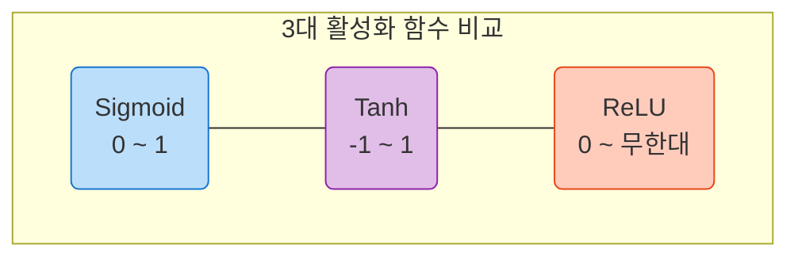

# Lesson 2.2: 인공 뉴런의 진화와 활성화 함수 (Neural Units - Part 2)

지난 시간에 배운 인공 신경망의 최고 핵심 수식은 **$w \cdot x + b$ (가중치와 입력의 내적 + 편향)** 이었습니다.
이번 강의부터 우리는 이 긴 수식을 수학적으로 한 글자로 줄여 **$z$** 라고 부르겠습니다. 즉, $z = w \cdot x + b$ 입니다.

Lesson 2.2 에서는 과거의 유물인 퍼셉트론(Perceptron)이 왜 역사 속으로 사라졌는지 그 치명적 약점을 다시 한번 짚어보고, 이를 극복하기 위해 등장한 현대 딥러닝의 핵심 부품인 **활성화 함수(Activation Functions)** 3총사(Sigmoid, Tanh, ReLU)에 대해 완벽하게 파헤쳐 봅니다.

---

## 🛑 1. 퍼셉트론의 치명적 결함: "섬세함이 없는 극단주의자"

퍼셉트론은 $z$ 값이 0보다 작으면 무조건 0을, 단 0.00001이라도 0보다 크면 무조건 1을 출력합니다.
즉, 퍼셉트론은 **"아예 침묵(0)하거나, 아니면 목청껏 소리 지르거나(1)"** 둘 중 하나의 극단적인 행동만 합니다. 

> [!WARNING] 
> **기계가 '학습'을 할 수 없는 이유**
> 딥러닝에서 '학습'이란, 정답에 가까워지기 위해 가중치($w$)와 편향($b$)을 아주 미세하게(Slight adjustments) 조절하며 결과값이 부드럽게 변하는지 피드백을 받는 과정입니다.
> 하지만 퍼셉트론은 $w$와 $b$를 아무리 정교하게 조절해도 결과값이 계속 0에 머물다가, 어느 순간 갑자기 1로 확(Whopping drastic swing) 튀어버립니다. 즉, **섬세함(Finesse)이 전혀 없기 때문에 기계는 자신이 올바른 길로 가고 있는지 피드백(미분 기울기)을 받을 수 없습니다.**

---

## 🌊 2. 활성화 함수(Activation Function)의 등장

이러한 퍼셉트론의 극단성을 부드럽게 깎아내기 위해, 출력값을 조절해 주는 특별한 수학 필터를 달기 시작했습니다. 이를 **활성화 함수(Activation Function)**라고 부르며, 수식에서는 주로 $a$ (Activation의 약자)로 표기합니다.

### 2.1 시그모이드 (Sigmoid, $\sigma$)
시그모이드 함수는 극단적인 0과 1 사이를 부드러운 S자 곡선(Gentle curve)으로 이어주는 최초의 돌파구였습니다.

*   **수식**: $a = \sigma(z) = \frac{1}{1 + e^{-z}}$ ($e$는 약 2.718의 자연 상수)
*   **특징**: $z$가 0일 때 정확히 0.5를 출력하며, 출력값의 범위는 항상 **0에서 1 사이**에 갇혀 있습니다.
*   **한계점 (뉴런 포화 현상, Neuron Saturation)**:
    $z$ 값이 +10,000처럼 엄청나게 크거나 -10,000처럼 극단적으로 작아지면, 시그모이드 곡선의 끝부분이 완벽한 수평선(0 또는 1)에 수렴해 버립니다. 평탄한 수평선에서는 변화율(기울기)이 0이 되므로, 결국 퍼셉트론과 똑같이 **학습이 멈춰버리는 끔찍한 정체 현상(Saturation)**이 발생합니다.

### 2.2 하이퍼볼릭 탄젠트 (Tanh)
시그모이드의 사촌 격인 Tanh(탄에이치) 함수입니다. 시그모이드와 거의 똑같이 생겼지만, 한 가지 거대한 차이점이 있습니다.

*   **특징**: 출력값의 범위가 0~1이 아니라, **-1에서 1 사이**입니다.
*   **강점 (Zero-Centered)**: $z$가 0일 때 출력값도 0입니다. 즉, 출력값의 평균이 0에 맞춰져(Zero-centered) 있습니다. 뒤의 딥다이브에서 자세히 설명하겠지만, 이 0을 중심으로 한 대칭 구조 덕분에 시그모이드보다 **네트워크가 훨씬 빠르고 효율적으로 학습**할 수 있습니다.

### 2.3 렐루 (ReLU: Rectified Linear Unit)
딥러닝의 역사를 바꾼 21세기 최고의 발명품입니다. 2012년 이미지 인식 대회(ImageNet)를 제패한 전설적인 모델 'AlexNet'이 바로 이 ReLU를 탑재하여 세상을 놀라게 했습니다.

*   **수식**: $a = \max(0, z)$
*   **특징**: 수식이 충격적일 정도로 단순합니다. $z$가 음수면 무조건 0을 출력하고, 양수면 $z$를 그대로(Linear) 출력합니다. 
*   **강점**: 시그모이드나 Tanh처럼 복잡한 지수 함수($e^{-z}$)를 계산할 필요 없이, 단순히 0보다 큰지만 비교하면 되므로 **컴퓨터(GPU) 연산 속도가 미치도록 빠릅니다.** 또한, 양수 부분은 아무리 값이 커져도 수평선으로 꺾이지 않고 쭉 뻗어나가므로 양수 구간에서는 **기울기 소실(Saturation) 문제가 절대 발생하지 않습니다.**

---

## 🏆 3. 실무 활성화 함수 추천 랭킹 (강사의 조언)

인공 신경망의 은닉층(Hidden Layer)에는 어떤 활성화 함수든 자유롭게 끼워 넣을 수 있습니다. 강사(Jon Krohn)가 실무 경험을 바탕으로 매긴 티어(Tier)는 다음과 같습니다.

1.  🥇 **1위 (강력 추천): ReLU**
    현존하는 거의 모든 딥러닝 모델의 은닉층(Hidden Layer)의 표준입니다. 속도가 가장 빠르고 모델의 정확도를 가장 짧은 시간 안에 올려줍니다.
2.  🥈 **2위 (좋은 대안): Tanh**
    ReLU가 통하지 않는 특정 상황이나 시계열 데이터(RNN) 등에서 여전히 강력하게 쓰이는 훌륭한 함수입니다.
3.  🥉 **3위 (제한적 사용): Sigmoid**
    은닉층에 쓰기엔 학습 속도가 너무 느려서 이제는 거의 쓰이지 않습니다. 다만, 모델의 '맨 마지막 출력층(Output Layer)'에서 **0% ~ 100% 확률**을 뽑아내야 할 때만 제한적으로 사용합니다. (예: Lesson 1.8의 `activation='sigmoid'`)
4.  ☠️ **최하위 (사용 금지): Perceptron**
    역사책에만 존재하며 딥러닝 코드에서는 절대 쓰지 않습니다.

---

## ✍️ 4. 핵심 요약 및 실전 이해도 점검 (Beginner to Pro)

**[핵심 요약]**
1. **섬세함의 필요성**: 기계가 조금씩 학습하기 위해서는 입력값이 살짝 변했을 때 출력값도 부드럽게 변하는(미분 가능한) '섬세한 곡선'이 필요합니다.
2. **비선형성(Non-linearity)의 마법**: 시그모이드나 ReLU 같은 함수들은 직선(Linear)이 아닌 비선형(Non-linear) 구조입니다. 딥러닝에 이러한 비선형 함수가 겹겹이 쌓이면, 우주의 어떤 복잡한 굴곡(함수)이라도 100% 흉내 낼 수 있게 됩니다. 이를 수학계에서는 **보편적 근사 정리(Universal Approximation Theorem)**라고 부릅니다.
3. **ReLU의 지배**: 지수 연산을 제거하여 연산 효율의 극한을 달성하고 기울기 소실을 막은 ReLU가 현대 딥러닝의 업계 표준입니다.

**🤔 실전 점검 질문 (비즈니스 시나리오):**
당신은 사내 해커톤에서 '고양이 사진 판별기' 딥러닝 모델을 만들고 있습니다. 은닉층 10개를 겹겹이 쌓아 올린 꽤 깊은 딥러닝 모델을 만들었는데, 활성화 함수로 전부 `Sigmoid`를 사용했습니다. 코드를 실행해 보니 24시간이 지나도록 정확도가 10%에 머물며 전혀 학습이 되지 않고 있습니다. (이른바 딥러닝의 악몽, 기울기 소실입니다.)

Q1. 은닉층 깊은 곳에 Sigmoid를 10번이나 연속으로 쓰면 왜 연산이 망가지는지, 앞서 배운 '뉴런 포화 현상(Neuron Saturation)'과 연관 지어 그 이유를 설명해 보세요.
Q2. 이 코드를 가장 빠르게 고쳐서 모델을 부활시킬 수 있는 1초짜리 해결책(활성화 함수 교체)은 무엇이며, 왜 그 함수가 이 문제를 해결해 주는지 설명해 보세요.

---

### 💡 실전 점검 질문 모범 답안 

*   **모범 답안 (Q1) - [왜 실패하는가? 기울기 소실의 함정]**: Sigmoid 함수는 $z$값이 조금만 크거나 작아져도 양 끝단이 평탄한 수평선(기울기 0)으로 뻗어버립니다(뉴런 포화 현상). 게다가 Sigmoid 함수를 미분했을 때 나올 수 있는 '최대 기울기 값'은 고작 **0.25**밖에 되지 않습니다.
    *   **예시 (학습 실패)**: 은닉층이 10개 겹쳐져 있다고 가정해 봅시다. 딥러닝의 학습(역전파) 과정에서는 각 층의 기울기를 뒤에서부터 계속 곱해나가야 합니다. 운이 매우 좋아 매번 최대 기울기인 0.25가 나온다고 해도, `0.25 × 0.25 × 0.25 ... (10번 곱함) = 0.00000095` 가 됩니다.
    *   결과적으로 10층 맨 앞단에 있는 초기 뉴런들은 자신이 어떻게 바뀌어야 하는지 알려주는 피드백(업데이트 신호)이 0.00000095로 완전히 소멸(Vanishing)해버립니다. 피드백이 0이니 가중치 조절이 불가능해져, 컴퓨터가 24시간을 돌아도 영원히 초기 상태(정확도 10%)에 머물게 됩니다.
*   **모범 답안 (Q2) - [왜 성공하는가? ReLU의 구원]**: 모든 은닉층의 `activation='sigmoid'`를 `activation='relu'`로 교체하면 1초 만에 마법처럼 학습이 시작됩니다.
    *   **예시 (학습 성공)**: ReLU 함수는 양수 구간($z>0$)에서 입력값을 꺾지 않고 그대로 반환하는 직선($y=x$)입니다. 직선 $y=x$의 미분 기울기는 **항상 1**입니다.
    *   따라서 은닉층 10개를 거슬러 올라가며 기울기를 곱하더라도 `1 × 1 × 1 ... (10번 곱함) = 1` 이 되어, 학습 신호가 전혀 깎이거나 소실되지 않고 100% 온전히 앞단까지 전달됩니다. 덕분에 10층이든 100층이든 모델이 아무리 깊어져도 가중치가 빠르고 거침없이 업데이트되며 학습에 성공하게 됩니다.

---

### 🔥 [전공자/전문가용] 심화 보충 설명 (Deep Dive)

수학적 깊이를 더해, 현업에서 면접 질문으로 자주 나오는 두 가지 고급 개념을 파헤쳐 봅니다.

#### 1. 왜 0을 중심으로 하는(Zero-centered) Tanh가 Sigmoid보다 성능이 좋을까?
Sigmoid의 치명적 단점 중 하나는 출력값이 **항상 양수(0~1)**라는 점입니다.
어떤 뉴런 집단이 항상 양수만 뱉어서 다음 층(Layer)으로 넘겨준다고 가정해 봅시다. ($x > 0$)
역전파(Backpropagation) 학습을 할 때, 가중치 $w$를 업데이트하는 미분 궤적을 수식으로 뜯어보면 기울기의 방향이 $x$의 부호에 완벽하게 종속됩니다. 
즉, 입력 $x$가 전부 양수이면, 가중치 $w$들이 업데이트될 때 **다 같이 한 번에 커지거나 다 같이 한 번에 작아져야만 하는 지그재그(Zig-zag) 구속**에 빠집니다. 마치 운전할 때 핸들을 왼쪽 끝 아니면 오른쪽 끝으로만 꺾을 수 있는 차를 모는 것과 같아 최적화 속도가 극도로 느려집니다.
반면 **Tanh**는 -1에서 1까지 골고루 뱉어주어 다음 층에 양수와 음수를 섞어서 공급하므로, 이 지그재그 현상이 사라져 훨씬 빠르고 효율적인 최적화가 가능합니다.

#### 2. 완벽해 보이는 ReLU의 그림자: 'Dying ReLU' 문제
ReLU $\max(0, z)$ 는 완벽해 보이지만, 음수 구간에서는 무조건 0을 뱉어버린다는 살벌한 부작용이 있습니다.
학습 도중 어쩌다 운이 나빠서 어떤 뉴런의 가중치($w$)가 크게 마이너스 방향으로 튀어버렸다고 가정해 봅시다. 그러면 그 뉴런에 들어오는 $z$ 값은 항상 음수가 되고, ReLU는 영원히 0만 출력하게 됩니다.
결과가 0이 되면 미분 기울기도 0이 되므로, 이 뉴런은 죽을 때까지 다시는 가중치를 업데이트받지 못하고 영원히 식물인간 상태에 빠집니다. 이를 **'Dying ReLU (죽은 렐루)' 현상**이라고 부릅니다.
*(현업 실무자의 시선: 이를 방지하기 위해 음수 구간을 완전히 0으로 죽이지 않고 0.01처럼 미세한 기울기를 남겨두는 `Leaky ReLU`나 `Parametric ReLU(PReLU)` 같은 고급 변형 함수들이 랭킹 1위 자리를 위협하며 등장하게 되었습니다.)*
