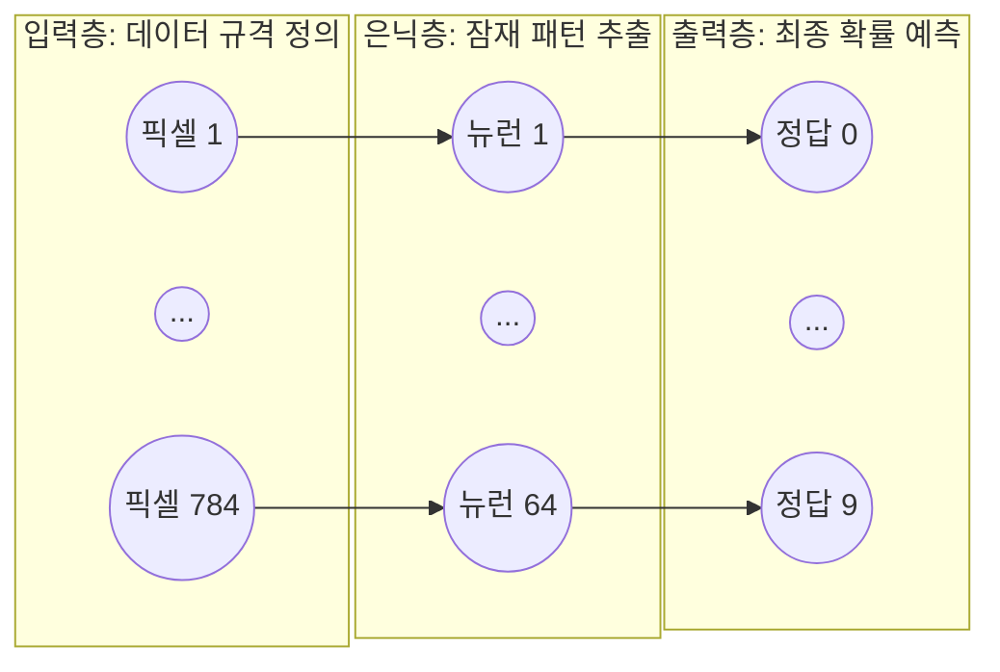
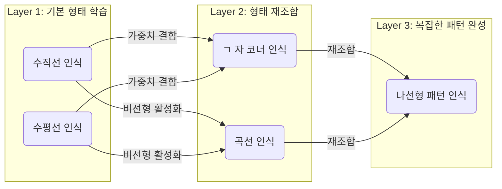

# Lesson 2.3: 인경 신경망의 구조와 연결 (Neural Networks - Part 1)

지금까지 우리는 딥러닝을 구성하는 가장 작은 단위인 '인공 뉴런(Artificial Neuron)' 하나하나의 해부학적 구조(가중치, 편향, 활성화 함수)를 뜯어보았습니다.
이제는 이 낱개의 뉴런들을 수십, 수백 개씩 거미줄처럼 연결하여 거대한 **'인공 신경망(Artificial Neural Network)'**으로 조립하는 방법을 배울 차례입니다.

---

## 🏗️ 1. 신경망의 3대 핵심 계층 (Layers)

인공 신경망은 완벽한 분업화 시스템을 갖추고 있으며, 크게 세 가지 종류의 층(Layer)으로 나뉩니다.

### 💡 신경망의 3대 핵심 계층 한눈에 보기



### 1.1 입력층 (Input Layer)
*   **역할**: 데이터가 처음으로 들어오는 정문(문지기) 역할입니다.
*   **특징 (전문적 관점)**: 입력층에 있는 뉴런들은 **어떠한 수학적 계산(가중합, 활성화 함수 등)도 수행하지 않습니다.** 오직 우리가 집어넣을 데이터의 형태(Shape, 텐서 차원)를 유지하기 위한 **'빈 그릇(Placeholder)'** 역할만 합니다. 
*   *(예시)*: MNIST 이미지(28x28 픽셀)를 넣을 때 입력층 뉴런 개수는 정확히 784개가 됩니다. 텐서플로우 코드에서는 `input_shape=(784,)` 형태로 정의됩니다.

### 1.2 은닉층 (Hidden Layer)
*   **역할**: 데이터의 겉모습(픽셀) 속에 숨겨진 의미 있는 패턴(잠재 표현, Latent Representation)을 미친 듯이 연산하여 찾아내는 신경망의 진짜 '두뇌'입니다.
*   **특징 (전문적 관점)**: 이 층에 존재하는 뉴런들은 앞서 배운 활성화 함수(ReLU, Tanh 등)를 탑재하여 비선형성(Non-linearity)을 만들어냅니다. 은닉층을 얼마나 깊고(Deep) 넓게(Wide) 쌓느냐가 모델의 표현력(Capacity)을 결정짓는 핵심 구간입니다.

### 1.3 출력층 (Output Layer)
*   **역할**: 은닉층이 밤새워 추상화한 잠재 데이터를 바탕으로 최종 결론(예측값)을 내뱉는 출구입니다.
*   **특징 (전문적 관점)**: 비즈니스 목적(Task)에 따라 활성화 함수가 엄격하게 결정됩니다.
    *   *이진 분류 (예: 암 양성/음성)*: `Sigmoid` (0~1 사이의 확률값)
    *   *다중 분류 (예: 0~9 숫자 판별)*: `Softmax` (전체 확률의 합이 100%가 되도록 분배)
    *   *회귀 예측 (예: 내일의 주가, 집값)*: 활성화 함수를 쓰지 않거나 `Linear` 사용

*(**💡 [현업 실무 트렌드]** 과거에는 입력부터 출력까지 전부 밀집층(Dense)으로 덮는 것이 유행이었으나, 현재 실무에서는 이미지 처리를 위한 CNN, 자연어 처리를 위한 Transformer(Attention) 등 '특화된 은닉층'이 주류를 이룹니다. 하지만 **아무리 복잡한 최신 인공지능 모델이라 할지라도, 마지막 최종 결론을 내리는 출력단 앞에는 반드시 이 밀집층(Dense Layer)을 배치**하여 정보를 통합하고 정답을 찍어내는 것이 업계의 불문율입니다.)*

---

## 🕸️ 2. 밀집층 (Dense Layer) / 완전 연결층 (Fully Connected Layer)

Lesson 1 실습 코드에서 우리는 `Dense`라는 코드를 사용해 은닉층을 만들었습니다. 딥러닝에서 가장 기본적이고 널리 쓰이는 형태가 바로 **밀집층(Dense Layer)**입니다.

> [!NOTE] 
> **밀집층(Dense Layer)의 정의**
> 어떤 층에 있는 '모든 뉴런'이, 그 바로 **'이전 층에 있는 모든 뉴런'**과 하나도 빠짐없이 1:1로 선이 연결되어(Fully connected) 있는 상태를 말합니다.

### 2.1 연결선(가중치) 개수 계산하기
밀집층의 어마어마한 연산량을 직관적으로 이해해 봅시다.
*   **입력층**에 뉴런이 2개 있고, 다음 **은닉층**에 뉴런이 8개 있다고 가정해 보겠습니다.
*   은닉층의 1번 뉴런은 입력층의 1번, 2번 뉴런 모두와 연결됩니다 (2개 연결).
*   은닉층의 2번 뉴런도 입력층의 1번, 2번 뉴런 모두와 연결됩니다 (2개 연결).
*   이렇게 8개의 뉴런이 모두 2개씩 연결선을 가지므로, **총 가중치(연결선) 개수는 2 × 8 = 16개**가 됩니다.

만약 Lesson 1의 MNIST 모델(입력층 784개, 은닉층 64개)이라면?
$784 \times 64 = \mathbf{50,176}$개의 선(가중치)이 존재하게 됩니다. 이 거대한 거미줄 구조가 밀집층의 본질입니다.

---

## 🧩 3. 비선형 재조합 (Non-linear Recombination)의 마법

텐서플로우 플레이그라운드(TensorFlow Playground) 도구를 통해, 신경망이 층(Layer)을 깊게 쌓을수록 데이터를 어떻게 이해해 나가는지 그 과정을 시각적으로 뜯어보겠습니다.

은닉층은 뒤로 갈수록 이전 층의 정보를 **'비선형적으로 재조합(Non-linearly recombine)'**하여 점점 더 복잡한 특징을 스스로 학습합니다.



1.  **초기화 (Random Initialization)**:
    *(트랜스크립트 보충)* 기계가 학습을 시작하기 전, 모든 가중치($w$)와 편향($b$)은 0이 아닌 **'0에 매우 가까운 무작위 값(Random near-zero values, 예: -0.23, 0.1)'**으로 초기화됩니다. 

2.  **첫 번째 은닉층 (First Hidden Layer - 8개의 ReLU 뉴런)**: 
    입력 데이터(X, Y 좌표 2개)를 받아 아주 단순한 패턴만 인식합니다. 강한 양수 가중치(파란 선)와 강한 음수 가중치(주황 선)를 곱해가며, 공간을 대각선이나 수직선으로 한 번 자르는 단순한 선형 경계를 만듭니다.

3.  **두 번째 은닉층 (Second Hidden Layer - 8개의 ReLU 뉴런)**: 
    첫 번째 층이 보내준 단순한 '선'들을 이리저리 조합(가중합)합니다. 특정 선들은 강한 양수 가중치로 취합하고, 불필요한 선들은 강한 음수 가중치로 억제(Suppress)합니다. 이 가중합이 ReLU라는 비선형 함수를 통과하며 선이 구부러져, 비로소 **'코너(Corner)'나 '곡선(Curve)'** 같은 2차원적 특징으로 진화합니다.

4.  **깊은 은닉층 (Deeper Hidden Layers - 4개 -> 2개 ReLU 뉴런)**: 
    층이 깊어질수록 앞선 층들의 '곡선'과 '코너'들을 다시 융합합니다. 텐서플로우 플레이그라운드에서 3층(4개 뉴런)과 4층(2개 뉴런)을 거치면, 최종적으로 파란 점과 주황 점을 완벽하게 가르는 '나선형 궤적(Spiral)'이나 복잡한 원형 경계라는 **매우 복잡하고 정교한 특징(Elaborate features)**을 기계 스스로 파악하게 됩니다.

```mermaid
flowchart TD
    subgraph 은닉층 1: 선 추출
    L1[단순한 대각선]
    L2[단순한 수직선]
    end

    subgraph 은닉층 2: 비선형 곡선/코너 생성
    L3[강한 양수/음수 가중치 결합<br>+ ReLU 활성화]
    L1 -.->|강한 긍정 가중치 (파란선)| L3
    L2 -.->|강한 부정 가중치 (주황선)| L3
    end

    subgraph 은닉층 3~4: 복잡한 나선형 경계
    L4[고차원 공간의 복잡한 원형/나선형 곡선]
    L3 ==> L4
    end

    style L3 fill:#fff3e0,stroke:#e65100,stroke-width:2px
    style L4 fill:#e3f2fd,stroke:#1565c0,stroke-width:2px
```

*(**💡 [현업 실무자의 시선]** 실무에서 "왜 딥러닝은 굳이 은닉층을 깊게(Deep) 쌓아야 하나요? 넓게 하나만 깔면 안 되나요?"라는 질문의 완벽한 모범 답안이 바로 이 **'계층적 특징 추출(Hierarchical Feature Extraction)'**입니다. 얕고 넓은 신경망은 단순한 선을 수만 개 그릴 뿐이지만, 층이 깊어지면 저차원의 단순한 선들을 레고 블록처럼 재조합하여 고차원의 복잡한 개념(얼굴, 자동차, 나선형 경계 등)을 기계 스스로 '추상화(Abstraction)'할 수 있기 때문입니다. 이는 현대 딥러닝이 머신러닝을 압도하는 가장 근본적인 이유입니다.)*

---

## ✍️ 4. 핵심 요약 및 실전 이해도 점검 (Beginner to Pro)

**[핵심 요약]**
1. **입력층의 본질**: 어떠한 계산도 하지 않는, 오직 데이터의 규격(Shape)을 정의하기 위한 '빈 껍데기(Placeholder)' 층입니다.
2. **밀집층(Dense Layer)**: 이전 층의 모든 뉴런과 현재 층의 모든 뉴런이 빠짐없이 교차로 연결된 딥러닝의 기본 뼈대입니다. 
3. **비선형 재조합**: 은닉층을 거칠수록 활성화 함수(Non-linear)를 통해 단순한 선분들이 곡선, 패턴, 구체적 형상으로 끊임없이 진화(Recombine)하며 학습의 깊이를 만듭니다.

**🤔 실전 점검 질문 (수학적 직관):**
당신은 자율주행 회사의 AI 엔지니어입니다. 센서로부터 들어오는 데이터의 입력값은 10개입니다. (입력층 뉴런 10개)
이 데이터를 분석하기 위해 바로 다음 층에 **은닉층 뉴런을 50개** 배치한 완전 연결 밀집층(Dense Layer)을 구성했습니다.

Q1. 이 두 층 사이(입력층 -> 첫 번째 은닉층)를 이어주는 연결선(가중치 $w$)은 총 몇 개가 생성될까요?
Q2. (심화) 가중치(연결선) 외에, 은닉층 뉴런들이 독립적인 공간 자유도를 가지기 위해 부여받는 **편향(Bias, $b$)**은 총 몇 개일까요?

---

### 💡 실전 점검 질문 모범 답안 

*   **모범 답안 (Q1)**: **500개**입니다. 
    입력층 뉴런 10개가 각각 은닉층 뉴런 50개와 하나도 빠짐없이 거미줄처럼 연결되므로, 총 가중치(Weight)의 개수는 $10 \times 50 = 500$개가 됩니다.
*   **모범 답안 (Q2)**: **50개**입니다.
    편향(Bias)은 연결선마다 부여되는 것이 아니라, 전기를 받아들이는 목적지인 **'뉴런 본체' 1개당 1개씩**만 존재합니다. 따라서 은닉층에 뉴런이 50개 있다면, 편향 파라미터도 정확히 50개 생성됩니다. (최종적으로 이 층의 총 파라미터 수는 가중치 500 + 편향 50 = 550개가 됩니다.)
