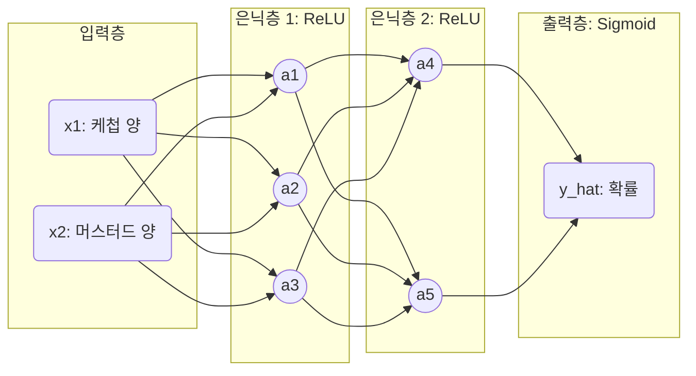

# Lesson 2.4: 순전파(Forward Propagation)와 다중 분류(Softmax) (Neural Networks - Part 2)

이번 강의에서는 단순한 하나의 뉴런을 넘어, 여러 개의 뉴런이 겹겹이 쌓인 완전한 '밀집 신경망(Dense Network)' 안에서 데이터가 어떻게 흐르고 정답을 찾아가는지 그 과정을 추적합니다. 

이 흐름의 끝에는 이진 분류(Sigmoid)를 넘어 여러 개의 정답(다중 분류) 중 하나를 고르는 마법의 함수, **소프트맥스(Softmax)**가 기다리고 있습니다.

---

## 🌊 1. 순전파 (Forward Propagation): 데이터의 대항해

Lesson 2.1에서 만들었던 '단일 뉴런' 핫도그 판독기를 기억하시나요? 이제 우리는 이를 거대한 신경망으로 확장합니다. 

*   **입력 변수**: 퍼셉트론 시대의 제약(무조건 0 아니면 1)에서 벗어나, 이제는 $x_1$(케첩의 양 ml), $x_2$(머스터드의 양 ml) 같은 '연속적인(Continuous)' 데이터를 입력으로 받을 수 있습니다.
*   **신경망 구조**: 
    *   입력층: 2개 ($x_1, x_2$)
    *   은닉층 1: 3개의 ReLU 뉴런 ($a_1, a_2, a_3$)
    *   은닉층 2: 2개의 ReLU 뉴런 ($a_4, a_5$)
    *   출력층: 1개의 Sigmoid 뉴런 ($\hat{y}$)

### 1.1 차별화된 관점: 왜 뉴런을 여러 개 둘까요?
은닉층 1에 있는 3개의 뉴런($a_1, a_2, a_3$)은 모두 **정확히 똑같은 입력 데이터**($x_1, x_2$)를 받습니다. 그런데도 3개의 뉴런은 각자 완전히 다른 계산 결과를 뱉어냅니다. 그 이유는 **각 뉴런이 자신만의 '고유한 가중치($w$)'와 '고유한 편향($b$)'**을 가지고 있기 때문입니다.

즉, $a_1$ 뉴런은 케첩을 중요하게 생각하는 뉴런일 수 있고, $a_3$ 뉴런은 머스터드를 극도로 혐오하는 뉴런일 수 있습니다. 똑같은 데이터를 봐도 각자 다른 시각으로 판단하여 그 결과를 다음 층으로 넘겨주는 것입니다.

### 1.2 데이터의 흐름 (Forward Propagation)



1.  **은닉층 1의 연산**: $x_1$과 $x_2$가 들어오면, $a_1$ 뉴런은 $w \cdot x + b = z$ 를 계산하고, 이를 ReLU 함수에 통과시켜 활성화 값 $a_1$을 만들어냅니다.
2.  **릴레이 전달**: 이 $a_1, a_2, a_3$ 값들은 다시 **다음 층(은닉층 2)의 입력값($x$) 역할**을 하게 됩니다. 은닉층 2의 $a_4$ 뉴런은 $a_1, a_2, a_3$를 받아 자신만의 가중치를 곱하고 편향을 더해 또 다른 값을 만듭니다.
3.  **최종 예측 ($\hat{y}$)**: 마지막 출력층의 Sigmoid 뉴런은 이 모든 여정을 거친 데이터를 받아 **0과 1 사이의 확률값**을 뱉어냅니다. 
    *   출력값이 0.9 라면? ➔ "90% 확률로 핫도그가 확실합니다!"
    *   이처럼 입력층부터 출력층까지 데이터가 끊임없이 흘러가며 예측값($\hat{y}$)을 만들어내는 전체 과정을 **순전파(Forward Propagation)**라고 부릅니다.

---

## 🍕 2. 다중 분류의 구원자: 소프트맥스 (Softmax)

Sigmoid 함수는 '핫도그인가 아닌가?(합격/불합격)' 같은 이진 분류(Binary Classification)에는 완벽하지만, 세상의 많은 문제는 선택지가 3개 이상입니다.
만약 신경망이 주어진 사진을 보고 **[핫도그, 햄버거, 피자]** 3개 중 하나로 분류해야 한다면 어떻게 될까요? 이때 출력층에 **소프트맥스(Softmax)**라는 새로운 활성화 함수가 등판합니다.

### 2.1 소프트맥스의 3단계 작동 원리
어떤 피자 사진이 들어왔고, 신경망의 마지막 계산 결과($z$)가 다음과 같이 나왔다고 가정해 봅시다.
*   핫도그 점수 ($z_1$): `-1`
*   햄버거 점수 ($z_2$): `1`
*   피자 점수 ($z_3$): `5`

이 숫자들만 봐서는 "피자가 핫도그보다 몇 배나 더 확실한 건지" 확률적으로 와닿지 않습니다. 이를 확률(%)로 바꿔주는 것이 소프트맥스의 마법입니다.

1.  **Step 1: 지수화 (Exponential, $e^z$)**
    모든 점수를 자연 상수 $e$(약 2.718)의 지수승으로 올립니다. 음수 찌꺼기를 날리고 차이를 극대화하기 위함입니다.
    *   핫도그: $e^{-1} = 0.4$
    *   햄버거: $e^1 = 2.72$
    *   피자: $e^5 = 148.4$
2.  **Step 2: 총합 구하기 (Sum)**
    방금 구한 지수 값들을 모두 더합니다. ($0.4 + 2.72 + 148.4 = \mathbf{151.52}$)
3.  **Step 3: 확률로 나누기 (Proportion)**
    각 지수 값을 총합(151.52)으로 나눕니다. 이 과정을 통해 **전체 확률의 합이 정확히 100%(1.0)**가 되도록 분배됩니다.
    *   핫도그: $0.4 / 151.52 = 0.002$ **(0.2%)**
    *   햄버거: $2.72 / 151.52 = 0.018$ **(1.8%)**
    *   피자: $148.4 / 151.52 = 0.980$ **(98.0%)**

*(참고: 파이썬에서 이 지수 계산은 `from math import exp` 모듈을 불러와 `exp(z)` 형태로 간단하게 구현할 수 있습니다.)*

### 2.2 실무적 관점: '신뢰 임계치(Confidence Threshold)'의 중요성

> [!TIP] 
> **왜 이름이 Softmax 일까?**
> 가장 점수가 높은(Max) 피자에게 100%를 '하드(Hard)'하게 다 몰아주지 않고, 핫도그(0.2%)나 햄버거(1.8%)에게도 아주 미세한 가능성을 남겨두며 **'부드럽게(Soft) 최댓값을 뽑아주기'** 때문에 붙여진 이름입니다.

소프트맥스가 확률을 '부드럽게(여지를 남겨두고)' 분배해주는 덕분에, 실무에서는 **'신뢰 임계치(Confidence Threshold)'**라는 매우 중요한 비즈니스 로직을 적용할 수 있습니다.

```mermaid
flowchart TD
    subgraph 비즈니스 도메인별 임계치 차이
    direction LR
    A[Softmax 최고 확률] --> B{도메인 리스크 판별}
    B -->|패스트푸드 판별 앱| C(임계치 낮음: 50%만 넘어도 '피자'로 확정)
    B -->|의료 종양(Tumor) 진단| D(임계치 매우 높음: 99%가 넘어야 확진,<br>그 이하는 '재검사' 판정)
    end
    style C fill:#d4edda,stroke:#28a745,stroke-width:2px
    style D fill:#f8d7da,stroke:#dc3545,stroke-width:2px
```

단순히 "가장 높은 확률이 나온 것을 무조건 정답으로 채택하자!"가 아니라, 해결하려는 문제의 치명도(Risk)에 따라 AI의 판단을 수용할 기준선을 정해야 합니다. 
*   **리스크가 낮은 도메인**: 가벼운 피자/핫도그 분류기라면 Softmax 결과가 51%만 나와도 정답으로 인정할 수 있습니다.
*   **리스크가 높은 도메인**: 하지만 생명이 직결된 의료 인공지능(종양 검출 등)에서는 Softmax 결과가 95%나 99% 이상일 때만 AI의 판단을 수용하고, 그 미만이라면 "AI도 확신하지 못함"으로 간주하여 의사가 직접 재검토하도록 설계하는 것이 AI 실무 기획의 정석입니다.

---

## 🧮 3. 실무 파라미터 계산: `model.summary()`의 비밀 풀기

우리가 Lesson 1에서 아무 생각 없이 지나쳤던 `model.summary()` 코드의 결과를 이제는 완벽하게 해독할 수 있습니다. 

*   **입력 데이터**: 784개 (28x28 이미지 픽셀)
*   **은닉층 (Dense)**: 64개 뉴런 (ReLU 활성화)
*   **출력층 (Dense)**: 10개 뉴런 (Softmax 다중 분류 - 0부터 9까지의 숫자)

이 네트워크의 '파라미터(가중치+편향)'는 총 몇 개일까요?

1.  **은닉층 파라미터 계산**:
    *   가중치: $784 \text{ (입력)} \times 64 \text{ (뉴런)} = 50,176$ 개
    *   편향: $64 \text{ (뉴런 1개당 1개의 편향)} = 64$ 개
    *   **합계: 50,240 개**
2.  **출력층 파라미터 계산**:
    *   가중치: $64 \text{ (이전 층 뉴런)} \times 10 \text{ (출력 뉴런)} = 640$ 개
    *   편향: $10 \text{ (출력 뉴런 개수)} = 10$ 개
    *   **합계: 650 개**
3.  **총 파라미터 (Total Params)**: $50,240 + 650 = \mathbf{50,890}$ 개

불과 은닉층 하나짜리 얕은 신경망조차 5만 개가 넘는 파라미터를 갖습니다. 수십억~수조 개의 파라미터를 가진 GPT 모델들의 스케일이 얼마나 경이로운지 엿볼 수 있습니다.

---

## ✍️ 4. 핵심 요약 및 실전 이해도 점검 (Beginner to Pro)

**[핵심 요약]**
1. **순전파(Forward Propagation)**: 입력 데이터가 수많은 가중치($w$)와 편향($b$)을 곱하고 더하는 과정을 거치며 신경망을 통과하여 최종 확률($\hat{y}$)을 뱉어내는 전체 과정입니다.
2. **독립적인 뉴런들**: 은닉층의 뉴런들은 똑같은 데이터를 받더라도, 각자 고유한 가중치와 편향을 가지고 있어 완전히 다른 시각으로 데이터를 분석(잠재 표현 추출)합니다.
3. **Softmax 함수**: 다중 분류 문제에서, 여러 개의 점수($z$)를 지수승으로 뻥튀기한 뒤 비율을 계산하여 전체 합이 100%가 되는 확률값으로 예쁘게 바꿔주는 마법의 함수입니다.

**🤔 실전 점검 질문 (비즈니스 시나리오):**
당신은 병원의 엑스레이(X-ray) 사진을 보고 환자의 흉부 질환을 예측하는 AI 모델을 기획 중입니다. 질환의 카테고리는 [정상, 폐렴, 결핵, 폐암] 총 4가지입니다. 그런데 개발팀 신입사원이 출력층 설계를 다음과 같이 제안했습니다.

*   *"팀장님! 출력층 뉴런을 4개로 만들고, 각 뉴런의 활성화 함수를 `Sigmoid`로 달면 될 것 같습니다! 4개 질병 각각에 대해 0~1 사이의 확률이 나오니까요!"*

Q1. 다중 분류 문제에서 출력층에 `Sigmoid`를 다는 것은 왜 수학적/논리적으로 부적절한지, `Softmax`와 비교하여 설명해 보세요.
Q2. 만약 자율주행 자동차가 앞차의 '속도(km/h)'라는 연속적인 실수값을 예측해야 한다면(회귀 문제), 출력층의 활성화 함수는 무엇을 써야 할까요?

---

### 💡 실전 점검 질문 모범 답안 

*   **모범 답안 (Q1)**: `Sigmoid`는 각 뉴런이 **독립적**으로 0~100% 확률을 뱉어냅니다. 즉, [정상 90%, 폐렴 80%, 결핵 90%, 폐암 80%] 처럼 확률의 합이 100%를 아득히 초과하는 모순적인 상황이 발생합니다. "이 환자는 정상일 확률도 90%고 결핵일 확률도 90%야"라는 결론은 병원(비즈니스)에서 쓸 수 없습니다. 
    반면 `Softmax`는 전체 파이를 나눠 갖는 구조이므로 [정상 80%, 폐렴 10%, 결핵 7%, 폐암 3%] 처럼 합이 정확히 100%가 떨어지는 상호 배타적인(Mutually exclusive) 확률 분포를 만들어주어 가장 확률이 높은 질병 하나를 확정 지을 수 있게 해줍니다.
*   **모범 답안 (Q2)**: 속도나 가격 같은 무한한 연속값(Regression)을 예측할 때는 확률로 찌그러뜨리는 활성화 함수가 필요 없습니다. 따라서 활성화 함수를 아예 달지 않거나, 수학적으로 있는 그대로를 뱉어내는 **`Linear` (선형 활성화 함수, $a=z$)**를 사용하는 것이 정석입니다.
