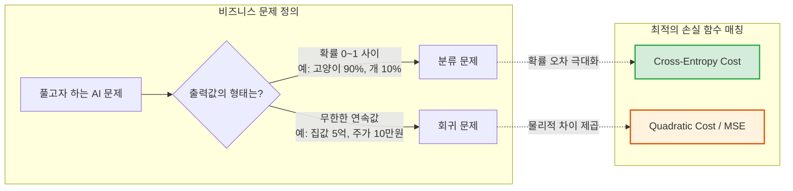

# Lesson 2.5: 신경망의 훈련과 손실 함수 (Training Deep Neural Networks - Part 1)

지금까지 우리는 데이터가 입력층에서 시작해 은닉층을 거쳐 출력층에서 예측값($\hat{y}$)으로 나오기까지의 과정, 즉 **순전파(Forward Propagation)**에 대해 배웠습니다. 

하지만 이전 강의들에서 사용했던 가중치($w$)와 편향($b$)은 우리가 임의로 지어낸 '가짜(Fabricated) 숫자'들이었습니다. 실제 비즈니스 환경에서 이 수만, 수백만 개의 파라미터는 사람이 수동으로 입력할 수 없습니다. 신경망은 **데이터를 통해 스스로 최적의 파라미터를 '학습(Learn)'**해야 합니다.

이번 챕터에서는 기계가 스스로 학습하기 위한 첫 번째 단추, **"내가 얼마나 틀렸는가?"**를 수학적으로 채점하는 **비용 함수(Cost Function)**에 대해 알아봅니다.

---

## ⚖️ 1. 완벽함에서 끔찍함까지: 예측 모델의 채점표

신경망이 열심히 데이터를 굴려 예측값 $\hat{y}$를 내놓았습니다. 만약 정답($y$)이 핫도그($y=1$)일 때 신경망의 예측 결과에 따라 우리는 다음과 같이 느낄 것입니다.

*   **완벽 (Perfect)**: $\hat{y} = 1.0$ (정답과 100% 일치)
*   **매우 만족 (Quite Pleased)**: $\hat{y} = 0.9997$ (차이가 극도로 미미함)
*   **허용 가능 (Acceptable)**: $\hat{y} = 0.9$ (나쁘지 않음)
*   **실망 (Disappointing)**: $\hat{y} = 0.6$ (조금 헷갈려 함)
*   **끔찍함 (Awful)**: $\hat{y} = 0.1192$ (완전히 틀려버림)

이 감정의 스펙트럼(완벽함 ~ 끔찍함)을 컴퓨터가 이해할 수 있는 '숫자'로 정량화(Quantify)해주는 수학적 도구를 **비용 함수(Cost Function)** 또는 **손실 함수(Loss Function)**라고 부릅니다. 

---

## 📉 2. 2차 비용 함수 (Quadratic Cost / Mean Squared Error)

가장 직관적이고 널리 쓰이는 손실 함수 중 하나는 **평균 제곱 오차(Mean Squared Error, MSE)**라고도 불리는 **2차 비용 함수(Quadratic Cost)**입니다.

$$ C = \frac{1}{n} \sum (y_i - \hat{y}_i)^2 $$

### 2.1 제곱을 하는 2가지 핵심 이유
1.  **양수화**: 예측값이 정답보다 크든 작든, 오차를 항상 양수(+)로 만들어 방향에 상관없이 '크기'만 평가하기 위함입니다.
2.  **가중 처벌 (Penalize)**: 오차가 작을 때는 손실도 작게 냅두지만, 정답과 예측값의 차이가 벌어지면 제곱의 힘으로 손실값을 **기하급수적으로 증폭(Exponential increase)**시켜 모델에게 강력한 페널티를 부여합니다.

### 2.2 `quadratic_cost.ipynb` 코드 시뮬레이션
파이썬 코드로 이 함수의 위력을 직관적으로 확인할 수 있습니다.
```python
def squared_error(y, yhat):
    return (y - yhat)**2

# 정답(y)은 1일 때, 예측값(yhat)이 낮아질수록 오차가 폭증합니다.
print(squared_error(1, 0.9))     # 결과: 0.010 (오차가 작음)
print(squared_error(1, 0.6))     # 결과: 0.160 (오차가 16배 폭증!)
print(squared_error(1, 0.1192))  # 결과: 0.775 (오차가 77배 폭증!)
```

### 2.3 치명적인 약점: 뉴런 포화 (Neuron Saturation)
2차 비용 함수는 완벽해 보이지만, 깊은 신경망에서는 치명적인 결함이 있습니다. 바로 **뉴런 포화 현상**입니다. 
활성화 함수(예: Tanh, Sigmoid)의 양 끝단은 꼬리가 평평해집니다. 이 극단적인 구간에 도달하면, 모델이 틀려서 가중치를 수정하려고 해도 활성화 값이 쥐꼬리만큼 변합니다(Teensy weensy changes).
즉, **"내가 틀린 건 알겠는데, 어떻게 고쳐도 변화가 없으니 그냥 학습을 포기할래"** 상태가 되며 **학습 속도가 굼벵이처럼 느려집니다(Slows to a crawl).**

---

## 🚀 3. 구원투수: 교차 엔트로피 비용 함수 (Cross-Entropy Cost)

뉴런 포화 상태에 빠져 허우적대는 신경망을 구원하기 위해 등장한 것이 바로 **교차 엔트로피(Cross-Entropy Cost)**입니다. 

$$ C = -[y \log(\hat{y}) + (1-y) \log(1-\hat{y})] $$

### 3.1 어떻게 포화 문제를 해결하는가?
교차 엔트로피의 가장 위대한 특징은 **"많이 틀렸을수록, 더 빠르고 강력하게 학습한다"**는 것입니다. 
제곱($x^2$) 대신 자연로그($\log$)를 사용한 이 함수는, 예측값이 정답에서 멀어질수록 2차 비용 함수보다 훨씬 더 급격하게 손실값을 키웁니다. 이는 포화된 뉴런에게 아주 강력한 전기 충격(Gradient)을 가하여, 평평한 늪에서 단숨에 빠져나오게 만듭니다.

```mermaid
flowchart TD
    subgraph 학습 속도와 손실 함수의 관계
    direction TB
    A[정답과 예측값의 큰 차이] --> B{손실 함수 종류}
    B -->|Quadratic Cost (MSE)| C[포화 영역 진입 시 기울기 0에 수렴<br>👉 학습 속도 극도로 저하 🐌]
    B -->|Cross-Entropy| D[로그(log)의 성질로 강력한 오차 신호 발생<br>👉 틀릴수록 엄청나게 빠른 학습 🚀]
    end
    style C fill:#fff3e0,stroke:#e65100
    style D fill:#e3f2fd,stroke:#1565c0,stroke-width:2px
```

### 3.2 `cross_entropy_cost.ipynb` 코드 시뮬레이션
파이썬의 `numpy.log`를 활용해 교차 엔트로피의 폭발력을 확인해 보겠습니다.
```python
from numpy import log

def cross_entropy(y, a):
    # a는 예측값 y-hat과 동일한 의미입니다.
    return -1 * (y * log(a) + (1 - y) * log(1 - a))

# 정답이 1인데 0.1192라고 터무니없이 대답했을 때
# MSE에서는 0.775 였던 손실값이, Cross-Entropy에서는 2.126 으로 훨씬 강하게 처벌합니다.
print(cross_entropy(1, 0.1192))  # 결과: 2.1269
```

### 3.3 💡 [현업 실무 트렌드] 분류엔 Cross-Entropy, 회귀엔 MSE를 쓰는 진짜 이유

실무에서 AI 엔지니어들은 기계적으로 **"분류(Classification) = Cross-Entropy"**, **"회귀(Regression) = MSE"** 공식을 따릅니다. 그 이면에는 아주 명확한 수학적, 비즈니스적 이유가 있습니다.



1. **분류(Classification)에 Cross-Entropy를 쓰는 이유**:
   분류 모델은 정답을 '확률(0~1)'로 대답해야 합니다. 만약 정답이 1(고양이)인데 기계가 0.01(1%)이라고 완전 헛발질을 했다고 가정해 봅시다.
   *   **MSE의 솜방망이 처벌**: $(1 - 0.01)^2 = 0.9801$. 기계 입장에서는 "음, 페널티가 0.98밖에 안 되네? 천천히 고치지 뭐."라며 안일하게 학습합니다. 확률은 0~1 사이이므로 오차가 아무리 커도 페널티가 1.0을 넘을 수 없습니다.
   *   **Cross-Entropy의 불벼락 처벌**: $-\log(0.01) \approx 4.60$. 만약 0.0001(0.01%)이라고 대답했다면 $-\log(0.0001) \approx 9.21$로 **페널티가 무한대(∞)로 치솟습니다.** 즉, 확률 싸움에서 기계가 틀린 답을 강하게 확신할수록 상상 초월의 페널티를 부여하여, 순식간에 정신을 차리고 정답으로 궤도를 수정하게 만듭니다.

2. **회귀(Regression)에 MSE를 쓰는 이유**:
   내일의 주가, 강남 아파트 가격 같은 연속적인 숫자(예: 5억 원)를 맞추는 문제에서는 애초에 **Cross-Entropy를 쓸 수 없습니다** (로그 함수 안에 5억 같은 큰 숫자를 넣거나, 확률 구조에 끼워 맞출 수 없기 때문입니다).
   대신 MSE는 "5억 원짜리 집을 3억 원이라고 예측했을 때의 오차(2억)"를 있는 그대로 제곱하여 처리하므로, 예측 스케일에 상관없이 실제 물리적인 차이(Distance) 자체를 줄여나가는 데 압도적으로 유리합니다. 특히 터무니없는 가격을 예측하는 이상치(Outlier)에 대해 '제곱'의 힘으로 강력한 철퇴를 내릴 수 있어 회귀 문제의 1티어 손실 함수로 군림하고 있습니다.

---

## ✍️ 4. 요약 및 다음 예고

**[핵심 요약]**
1. **손실 함수(Cost Function)**: 신경망의 예측($\hat{y}$)이 실제 정답($y$)과 얼마나 빗나갔는지를 하나의 숫자로 채점해 주는 함수입니다.
2. **MSE의 한계**: 평균 제곱 오차는 직관적이지만, 깊은 신경망의 활성화 함수(Sigmoid/Tanh)와 만나면 뉴런이 포화(Saturation)되어 학습이 멈춰버리는 늪에 빠집니다.
3. **Cross-Entropy의 마법**: 정답과 멀리 떨어질수록 더 빠르고 크게 가중치를 업데이트하도록 유도하여 포화 문제를 극복합니다. 오늘날 분류 모델의 압도적 표준입니다.

손실 함수를 통해 "우리가 얼마나 틀렸는지(Cost)"를 계산하는 법을 알았으니, 이제 다음 챕터에서는 이 틀린 오차를 바탕으로 가중치와 편향을 요리조리 수정해 나가는 궁극의 학습 알고리즘, **경사 하강법(Gradient Descent)과 역전파(Back Propagation)**를 만나게 될 것입니다!
