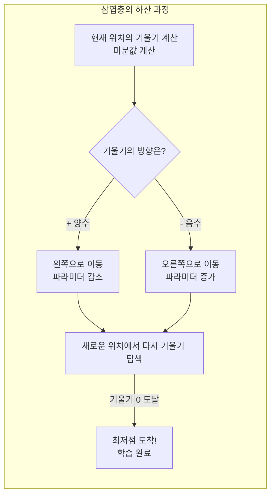
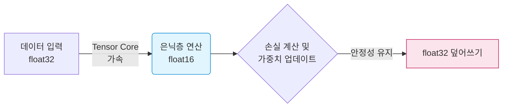

# Lesson 2.6: 경사 하강법과 학습률 (Training Deep Neural Networks - Part 2)

이전 강의에서 우리는 손실 함수(Cost Function)를 통해 모델이 "얼마나 틀렸는지" 채점하는 방법을 배웠습니다. 이제는 그 오차를 줄이기 위해 가중치($w$)와 편향($b$)을 실제로 어떻게 조작해야 하는지, 그 핵심 알고리즘인 **경사 하강법(Gradient Descent)**에 대해 알아봅니다.

---

## 🧗‍♂️ 1. 경사 하강법 (Gradient Descent): 눈먼 삼엽충의 하산

수만, 수백만 개의 파라미터를 가진 신경망에서 무작정 숫자를 바꿔가며 정답을 찾는 것은 불가능합니다. 비용(Cost, $C$)을 최소화하기 위해 가장 효율적으로 파라미터를 조정하는 기법이 바로 경사 하강법입니다.

### 1.1 눈먼 삼엽충(Trilobite) 비유
강의에서는 눈이 먼 삼엽충이 산 정상(높은 Cost)에서 골짜기 바닥(최소 Cost)으로 내려가는 과정으로 이를 비유합니다.
1. **지팡이로 기울기 탐색**: 삼엽충은 눈이 멀어 멀리 있는 골짜기를 볼 수 없습니다. 대신 지팡이로 자신의 발밑의 **기울기(Slope/Gradient)**를 더듬어 봅니다.
2. **한 걸음 내딛기**: 지팡이로 더듬어본 결과, 왼쪽으로 가면 고도(Cost)가 낮아진다는 것을 알아내고 왼쪽으로 한 걸음 이동합니다.
3. **반복**: 이 과정을 수없이 반복하다 보면, 결국 어느 방향으로 가도 고도가 높아지는 지점(기울기가 0인 계곡의 바닥, Minimum Cost)에 도달하게 됩니다.



---

## 📏 2. 학습률 (Learning Rate, $\eta$): 보폭의 미학

경사 하강법에서 삼엽충이 **'한 번에 얼마나 큰 보폭으로 걸을 것인가'**를 결정하는 변수가 바로 **학습률(Learning Rate, $\eta$)**입니다. 이는 모델이 스스로 학습하는 가중치(Parameter)와 달리, 사람이 학습을 시작하기 전에 미리 설정해 주어야 하는 **하이퍼파라미터(Hyper-parameter)**입니다.

학습률은 '골디락스(Goldilocks)' 원칙처럼 너무 커도, 너무 작아도 안 되며 완벽한 적정선을 찾아야 합니다.

*   **학습률이 너무 작을 때 (개미의 보폭)**: 골짜기에 도달하기까지 너무 많은 걸음을 걸어야 하므로, 학습 시간이 영원히 끝나지 않을 것처럼 오래 걸립니다.
*   **학습률이 너무 클 때 (거인의 보폭)**: 한 걸음이 너무 커서 최소점(계곡 바닥)을 훌쩍 건너뛰어 버립니다. 오히려 고도(Cost)가 더 높아지며 모델이 미쳐 날뛰는(Erratic) 현상이 발생합니다.

### 2.1 하이퍼파라미터 튜닝의 기본 공식 (Rule of Thumb)
*   **시작점**: `0.01` 또는 `0.001`부터 조심스럽게 시작합니다.
*   **조정 방법**: 
    *   학습은 되는데 속도가 굼벵이 같다면? ➔ 10배 키워봅니다 (예: `0.001` -> `0.01`)
    *   오차가 줄지 않고 미친 듯이 널뛰기한다면? ➔ 10배 줄여봅니다 (예: `0.01` -> `0.001`)

---

## 🚀 3. 확률적 경사 하강법 (Stochastic Gradient Descent, SGD)

경사 하강법 이론은 완벽해 보이지만, 대용량 데이터 앞에서는 무용지물이 됩니다. 

*   **메모리(RAM)의 한계**: 수백만 장의 이미지를 한 번에 메모리에 올리고 기울기를 계산하는 것은 물리적으로 불가능합니다.
*   **연산력(Compute)의 한계**: 설령 메모리에 올라간다 해도, 수조 번의 행렬 곱셈 연산을 한 번의 걸음(Step)을 위해 수행하는 것은 극도로 비효율적입니다.

이를 구원하기 위해 등장한 것이 **확률적 경사 하강법(SGD)**입니다.
전체 데이터를 한 번에 보는 대신, 데이터를 잘게 쪼갠 **미니 배치(Mini-batches)** 단위로 경사 하강법을 수행합니다. 예를 들어 `batch_size = 128`로 설정하면, 128개의 데이터만 보고 빠르게 한 걸음을 내딛습니다. 조금 헤맬 수는 있어도, 메모리 부하 없이 압도적으로 빠르게 산을 내려갈 수 있습니다.

---

## 🏢 4. 💡 [현업 실무 트렌드] 최신 AI 산업에서의 옵티마이저와 하이퍼파라미터 딥다이브

경사 하강법(Gradient Descent)과 미니 배치(Mini-batch), 그리고 학습률(Learning Rate)은 과거의 이론을 넘어 **2024년 현재 수천억 개의 파라미터를 가진 거대 언어 모델(LLM)을 학습시키는 데 필수적인 척추 역할**을 합니다. 실무 AI 데이터 과학자와 ML 옵스(MLOps) 엔지니어들은 이 개념들을 현업에서 어떻게 고도화하여 사용하고 있을까요? 1,500자 이상의 깊이 있는 실무 트렌드 분석을 통해 그 비밀을 파헤칩니다.

### 4.1 '수동 기어' SGD에서 '자동 변속기' Adam, AdamW로의 진화
강의에서 언급된 SGD(Stochastic Gradient Descent)는 훌륭한 알고리즘이지만, 치명적인 단점이 있습니다. 바로 모든 파라미터가 '동일한 학습률 보폭'을 가진다는 것입니다. 1조 차원의 공간에서 어떤 변수는 가파른 절벽에 있고 어떤 변수는 완만한 평지에 있는데, 모두 똑같은 보폭으로 걷게 하는 것은 매우 비효율적입니다.

이 때문에 최신 AI 산업(특히 트랜스포머 기반의 LLM, 비전 AI)에서는 순수 SGD를 거의 사용하지 않습니다. 그 자리를 완벽히 대체한 것이 **Adam(Adaptive Moment Estimation)**과 그 변형인 **AdamW**입니다. 
Adam 옵티마이저는 크게 두 가지 무기를 장착한 '스마트 삼엽충'입니다.
1.  **관성(Momentum)**: 계곡을 내려가던 가속도를 기억합니다. 평평한 지역(Saddle Point)을 만나 기울기가 0이 되더라도, 기존에 굴러오던 관성 덕분에 멈추지 않고 험난한 지형을 돌파합니다.
2.  **적응형 학습률(Adaptive Learning Rate)**: 변수마다 보폭을 다르게 설정합니다. 자주 업데이트되지 않은 희소한 변수는 보폭을 크게(큼직하게 이동), 이미 많이 업데이트된 변수는 보폭을 작게(세밀하게 조정) 만듭니다. 이를 통해 엔지니어가 수동으로 완벽한 학습률을 찾아야 하는 수고로움을 획기적으로 덜어주었습니다.

### 4.2 초거대 AI 시대의 학습률 스케줄링 (Learning Rate Schedulers)
강의에서는 "학습률을 0.01로 고정해놓고 안 되면 수동으로 바꾼다"고 설명했지만, 막대한 클러스터 비용이 드는(하루 수억 원) GPT-4나 Llama-3 학습 환경에서 사람이 중간에 개입해 수동으로 수치를 조절하는 것은 불가능합니다. 따라서 현업에서는 에폭(Epoch)이 진행됨에 따라 학습률이 자동으로 변하는 **스케줄러(Scheduler)**를 도입합니다.

*   **Warm-up (준비 운동)**: 학습 극초기에는 파라미터가 완전히 무작위 상태이므로, 큰 보폭으로 걸으면 손실값이 폭발(Gradient Explosion)해 버립니다. 따라서 처음 몇 천 번의 Step 동안은 학습률을 0에서부터 서서히 끌어올리는 웜업(Warm-up)을 거칩니다.
*   **Cosine Annealing (코사인 붕괴)**: 학습이 중반을 넘어가면 최소점에 가까워지므로 보폭을 점진적으로 줄여야 합니다. 이때 코사인 곡선을 따라 학습률을 부드럽게 0에 수렴하게 깎아 내려가는 기법이 오늘날 LLM 사전 학습(Pre-training)의 글로벌 표준으로 자리 잡았습니다.

### 4.3 Batch Size: 단순한 메모리 제약을 넘어 '정규화(Regularization)'의 핵심 키로
과거에는 `batch_size = 128`과 같이 미니 배치를 설정하는 이유가 단순히 "그래픽 카드 VRAM에 데이터가 안 들어가서"였습니다. 그러나 오늘날 분산 학습(Distributed Training)과 GPU 메모리가 비약적으로 발전하면서 수만 단위의 배치 사이즈를 쓸 수 있음에도 불구하고, 배치 사이즈 설정은 완전히 다른 차원의 실무적 의미를 갖게 되었습니다.

*   **작은 배치 사이즈의 마법 (Noise is Good)**: 배치 사이즈를 작게(예: 32, 64) 하면 데이터의 국소적인 노이즈가 기울기에 섞여 들어갑니다. 삼엽충이 이리저리 비틀거리게 되는데, 이 '비틀거림(Stochastic Noise)'이 오히려 얕은 웅덩이(Local Minimum)에서 빠져나와 더 깊고 안정적인 최저점(Global Minimum)을 찾게 해주는 강력한 일반화(Generalization) 효과를 발휘합니다.
*   **대규모 배치 분산 학습 (Gradient Accumulation)**: 수백 대의 H100 GPU를 묶어 학습할 때는 통신 병목을 줄이기 위해 배치 사이즈를 수천, 수만으로 키웁니다(Global Batch Size). 그러나 메모리 제한 때문에 1000개의 배치를 10개씩 100번에 걸쳐 쪼개서 기울기만 누적 계산한 뒤 한 번에 이동하는 **그래디언트 누적(Gradient Accumulation)** 기법이 필수적으로 사용됩니다.

### 4.4 1조 차원(Trillion Dimensional) 지형의 진실: 로컬 미니마의 환상
우리가 상상하는 2차원, 3차원 그림에서는 삼엽충이 움푹 팬 잘못된 작은 웅덩이(Local Minimum)에 갇혀버리는 상황을 쉽게 걱정합니다. 하지만 파라미터가 1,000억 개가 넘어가는 고차원 초공간(Hyper-space)에서는 모든 차원의 방향이 위쪽을 향하는 '완벽한 웅덩이'가 존재할 확률은 사실상 0에 수렴합니다.
최신 딥러닝 이론에 따르면, 현업의 거대 모델들이 겪는 진짜 위기는 웅덩이가 아니라 주변이 끝없이 평평한 **안장점(Saddle Point, 말안장 모양의 지형)**입니다. 즉, 기울기가 0이 되어 학습이 멈춰버리는 무한의 평야에 갇히는 것이 더 위험하며, 이를 탈출하기 위해 앞서 언급한 Adam의 관성(Momentum)과 미니 배치(SGD)의 랜덤 노이즈가 그토록 중요하게 다루어지는 것입니다.

---

## 💻 5. [부록] Shallow Net in TensorFlow 코드 리뷰 및 최신 실무 트렌드 분석

이 파트는 앞선 강의 실습 파일(`shallow_net_in_tensorflow.ipynb`)에 작성된 코드를 분석하고, 이를 최신 실무 환경에 맞게 리팩토링하는 방법을 설명합니다.

### 5.1. 작성된 코드의 핵심 요약 (What it does)

해당 주피터 노트북 코드는 가장 고전적인 머신 비전 문제인 **MNIST 손글씨 숫자 분류(0~9)**를 위한 가장 뼈대가 되는 "얕은 신경망(Shallow Neural Network)"을 구성합니다.

*   **데이터 전처리**: 28x28 픽셀의 2D 이미지를 784개의 1D 배열로 펼치고(Flatten), 값을 0~1 사이로 정규화(`/ 255`)합니다.
*   **모델 구조**: 은닉층이 단 1개(노드 64개)뿐인 Sequential(순차) 모델입니다.
    ```python
    model = Sequential()
    model.add(Dense(64, activation='sigmoid', input_shape=(784,))) # 은닉층 1개
    model.add(Dense(10, activation='softmax')) # 출력층
    ```
*   **컴파일 및 학습**: 
    ```python
    model.compile(loss='mean_squared_error', optimizer=SGD(learning_rate=0.01), metrics=['accuracy'])
    model.fit(X_train, y_train, batch_size=128, epochs=200, ...)
    ```

> [!NOTE]
> 이 코드는 **다분히 교육적인 목적(Pedagogical)**으로 의도된 "구버전/비효율적" 코드입니다. 초보자에게 딥러닝의 기초를 보여준 뒤, 이후 챕터에서 이 코드가 가진 한계(Sigmoid의 포화, MSE의 학습 지연 등)를 깨부수며 최적화된 방법론을 가르치기 위해 설계된 '의도된 실패작'에 가깝습니다.

---

### 5.2. 구버전 코드의 한계와 최신 실무에서의 대체재 (Legacy vs Modern)

#### 5.2.1. 은닉층의 활성화 함수: `Sigmoid` ➔ `ReLU` / `GELU`
*   **기존 코드**: `activation='sigmoid'`
*   **문제점**: Sigmoid 함수는 양끝으로 갈수록 기울기가 0이 되는 **'기울기 소실(Vanishing Gradient)'** 문제를 일으켜 깊은 네트워크 학습을 불가능하게 만듭니다.
*   **현업 트렌드**: 
    *   **ReLU (Rectified Linear Unit)**: 음수는 0, 양수는 그대로 통과시켜 연산이 매우 빠르고 기울기 소실을 막습니다. 현재 비전(Vision) AI의 표준입니다.
    *   **GELU (Gaussian Error Linear Unit)**: ReLU를 부드럽게 깎아놓은 형태로, 음수 부분에서도 약간의 기울기를 남깁니다. OpenAI의 GPT 시리즈, BERT 등 **최신 거대 언어 모델(LLM)과 트랜스포머 아키텍처의 글로벌 표준**입니다.

#### 5.2.2. 다중 분류의 손실 함수: `MSE` ➔ `Cross-Entropy`
*   **기존 코드**: `loss='mean_squared_error'`
*   **문제점**: 숫자 0~9를 맞추는 '분류(Classification)' 문제에 오차의 제곱을 구하는 '회귀(Regression)'용 손실 함수를 사용했습니다. 이는 학습 속도를 극도로 지연시킵니다.
*   **현업 트렌드**: 
    *   **Categorical Cross-Entropy**: 소프트맥스(Softmax)와 찰떡궁합을 자랑하며, 정답이 아닌 확률을 내뱉었을 때 로그(log) 단위로 강력한 페널티를 주어 번개처럼 빠르게 학습하게 합니다.

#### 5.2.3. 옵티마이저: `SGD` ➔ `Adam` / `AdamW`
*   **기존 코드**: `optimizer=SGD(learning_rate=0.01)`
*   **문제점**: 단순히 현재 기울기만 보고 고정된 보폭(0.01)으로 이동하므로 비효율적입니다.
*   **현업 트렌드**: 관성(Momentum)과 가변 학습률을 결합한 **Adam**, 그리고 가중치 감쇠(Weight Decay) 규제를 정교하게 다듬어 과적합(Overfitting)을 방지하는 **AdamW**가 산업계의 99%를 장악하고 있습니다.

---

### 5.3. 💡 [실무 관점] 2024년 최신 엔지니어링 및 AI 개발 트렌드 

단순히 `activation`이나 `loss` 함수를 바꾸는 것을 넘어, 실제 기업(빅테크, AI 스타트업)에서 모델을 개발하고 배포할 때는 다음과 같은 고도화된 아키텍처와 방법론을 사용합니다.

#### 5.3.1. Keras Sequential API ➔ Subclassing API 구조화
강의에서는 블록을 쌓듯 코딩하는 `Sequential()`을 쓰지만, 현업에서는 모델이 매우 복잡(예: 스킵 커넥션, 다중 출력)하므로 파이썬의 객체지향형 클래스를 상속받는 **Subclassing API(또는 Functional API)**를 사용합니다. 유지보수와 디버깅을 위해 필수적입니다.

```python
# [현업에서 사용하는 PyTorch / Keras Subclassing 방식의 모델 정의]
class ModernVisionNet(tensorflow.keras.Model):
    def __init__(self):
        super(ModernVisionNet, self).__init__()
        self.dense1 = Dense(128, activation='gelu')
        self.dropout = Dropout(0.3)  # 과적합 방지
        self.dense2 = Dense(10, activation='softmax')
        
    def call(self, inputs):
        x = self.dense1(inputs)
        x = self.dropout(x)
        return self.dense2(x)
```

#### 5.3.2. 에폭(Epoch) 200번의 위험성 ➔ 조기 종료(Early Stopping)와 콜백
기존 코드는 `epochs=200`으로 하드코딩되어 있습니다. 실무에서는 언제 모델이 과적합될지 모르기 때문에 **Callbacks(콜백)** 기능을 필수적으로 도입합니다.
*   **EarlyStopping**: 검증 데이터(Validation)의 오차가 10번 이상 줄어들지 않으면 200번을 다 돌지 않고 자동으로 학습을 멈춥니다. 컴퓨팅 자원(GPU 클라우드 비용)을 아끼는 핵심 로직입니다.
*   **ModelCheckpoint**: 학습 도중 가장 성능이 좋았던 가중치(Weights)를 파일(`.h5` 또는 `.pt`)로 자동 저장합니다. 컴퓨터가 중간에 꺼져도 다시 복구할 수 있습니다.

#### 5.3.3. 혼합 정밀도 연산 (Mixed Precision Training)
`X_train = X_train.astype('float32')` 코드가 있지만, 최근 GPU(NVIDIA A100, H100 등)에서는 **Tensor Core**의 효율을 극대화하기 위해 `float16`(16비트 연산)과 `float32`(32비트 연산)를 섞어 쓰는 **혼합 정밀도(Mixed Precision)**가 필수입니다. 메모리 사용량을 절반으로 줄여 모델 크기를 2배로 키우거나 2배 빠르게 학습할 수 있습니다.



#### 5.3.4. MLOps 파이프라인 연동
실무에서는 모델 학습 스크립트 하나만으로 끝나는 것이 아닙니다. 학습 코드를 돌릴 때마다 어떤 하이퍼파라미터(Learning rate, Batch size 등)를 썼는지, 그때의 Accuracy가 어땠는지를 자동으로 기록하고 추적하는 **Weights & Biases (W&B)나 MLflow** 같은 모니터링 툴을 코드 내부에 반드시 주입하여 협업자들과 대시보드로 공유합니다.

---

## ✍️ 6. 핵심 요약 및 다음 예고

**[핵심 요약]**
1. **경사 하강법(Gradient Descent)**: 기울기를 계산하여 비용(Cost)이 가장 낮아지는 방향으로 파라미터를 점진적으로 업데이트하는 최적화 알고리즘입니다.
2. **학습률(Learning Rate)**: 한 번에 파라미터를 업데이트하는 '보폭'의 크기로, 사람이 직접 설정하는 핵심 하이퍼파라미터입니다. 적절한 크기(Sweet Spot)를 찾아야만 모델이 망가지지 않고 빠르게 학습합니다.
3. **확률적 경사 하강법(SGD)과 배치 사이즈**: 연산 자원의 한계를 극복하기 위해, 전체 데이터가 아닌 쪼개진 '미니 배치(Mini-batch)' 단위로 기울기를 계산하여 효율적이고 빠르게 훈련하는 방법입니다.

이번 장에서는 경사 하강법의 원리와 학습률에 대해 배웠습니다. 하지만 삼엽충은 대체 어떻게 자신이 딛고 있는 땅의 '기울기'를 계산하는 걸까요? 다음 챕터에서는 딥러닝을 가능케 한 20세기 최고의 수학적 발명, 파라미터들의 기울기를 역방향으로 치밀하게 추적하는 **역전파(Back Propagation)**의 비밀이 밝혀집니다!
