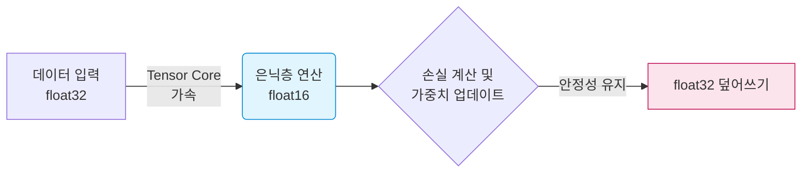

# 🧐 부록: Shallow Net in TensorFlow 코드 리뷰 및 최신 실무 트렌드 분석

이 문서는 `DLTFpT/notebooks/shallow_net_in_tensorflow.ipynb` 파일에 작성된 딥러닝 코드를 분석하고, 해당 코드가 현재 실무에서 어떻게 발전하여 사용되고 있는지 전문적으로 설명하기 위한 특별 부록입니다.

---

## 1. 작성된 코드의 핵심 요약 (What it does)

해당 주피터 노트북 코드는 가장 고전적인 머신 비전 문제인 **MNIST 손글씨 숫자 분류(0~9)**를 위한 가장 뼈대가 되는 "얕은 신경망(Shallow Neural Network)"을 구성합니다.

*   **데이터 전처리**: 28x28 픽셀의 2D 이미지를 784개의 1D 배열로 펼치고(Flatten), 값을 0~1 사이로 정규화(`/ 255`)합니다.
*   **모델 구조**: 은닉층이 단 1개(노드 64개)뿐인 Sequential(순차) 모델입니다.
    ```python
    model = Sequential()
    model.add(Dense(64, activation='sigmoid', input_shape=(784,))) # 은닉층 1개
    model.add(Dense(10, activation='softmax')) # 출력층
    ```
*   **컴파일 및 학습**: 
    ```python
    model.compile(loss='mean_squared_error', optimizer=SGD(learning_rate=0.01), metrics=['accuracy'])
    model.fit(X_train, y_train, batch_size=128, epochs=200, ...)
    ```

> [!NOTE]
> 이 코드는 **다분히 교육적인 목적(Pedagogical)**으로 의도된 "구버전/비효율적" 코드입니다. 초보자에게 딥러닝의 기초를 보여준 뒤, 이후 챕터에서 이 코드가 가진 한계(Sigmoid의 포화, MSE의 학습 지연 등)를 깨부수며 최적화된 방법론을 가르치기 위해 설계된 '의도된 실패작'에 가깝습니다.

---

## 2. 구버전 코드의 한계와 최신 실무에서의 대체재 (Legacy vs Modern)

### 🚨 2.1. 은닉층의 활성화 함수: `Sigmoid` ➔ `ReLU` / `GELU`
*   **기존 코드**: `activation='sigmoid'`
*   **문제점**: Sigmoid 함수는 양끝으로 갈수록 기울기가 0이 되는 **'기울기 소실(Vanishing Gradient)'** 문제를 일으켜 깊은 네트워크 학습을 불가능하게 만듭니다.
*   **현업 트렌드**: 
    *   **ReLU (Rectified Linear Unit)**: 음수는 0, 양수는 그대로 통과시켜 연산이 매우 빠르고 기울기 소실을 막습니다. 현재 비전(Vision) AI의 표준입니다.
    *   **GELU (Gaussian Error Linear Unit)**: ReLU를 부드럽게 깎아놓은 형태로, 음수 부분에서도 약간의 기울기를 남깁니다. OpenAI의 GPT 시리즈, BERT 등 **최신 거대 언어 모델(LLM)과 트랜스포머 아키텍처의 글로벌 표준**입니다.

### 🚨 2.2. 다중 분류의 손실 함수: `MSE` ➔ `Cross-Entropy`
*   **기존 코드**: `loss='mean_squared_error'`
*   **문제점**: 숫자 0~9를 맞추는 '분류(Classification)' 문제에 오차의 제곱을 구하는 '회귀(Regression)'용 손실 함수를 사용했습니다. 이는 학습 속도를 극도로 지연시킵니다.
*   **현업 트렌드**: 
    *   **Categorical Cross-Entropy**: 소프트맥스(Softmax)와 찰떡궁합을 자랑하며, 정답이 아닌 확률을 내뱉었을 때 로그(log) 단위로 강력한 페널티를 주어 번개처럼 빠르게 학습하게 합니다.

### 🚨 2.3. 옵티마이저: `SGD` ➔ `Adam` / `AdamW`
*   **기존 코드**: `optimizer=SGD(learning_rate=0.01)`
*   **문제점**: 단순히 현재 기울기만 보고 고정된 보폭(0.01)으로 이동하므로 비효율적입니다.
*   **현업 트렌드**: 관성(Momentum)과 가변 학습률을 결합한 **Adam**, 그리고 가중치 감쇠(Weight Decay) 규제를 정교하게 다듬어 과적합(Overfitting)을 방지하는 **AdamW**가 산업계의 99%를 장악하고 있습니다.

---

## 3. 💡 [실무 관점] 2024년 최신 엔지니어링 및 AI 개발 트렌드 

단순히 `activation`이나 `loss` 함수를 바꾸는 것을 넘어, 실제 기업(빅테크, AI 스타트업)에서 모델을 개발하고 배포할 때는 다음과 같은 고도화된 아키텍처와 방법론을 사용합니다.

### 🏢 3.1. Keras Sequential API ➔ Subclassing API 구조화
강의에서는 블록을 쌓듯 코딩하는 `Sequential()`을 쓰지만, 현업에서는 모델이 매우 복잡(예: 스킵 커넥션, 다중 출력)하므로 파이썬의 객체지향형 클래스를 상속받는 **Subclassing API(또는 Functional API)**를 사용합니다. 유지보수와 디버깅을 위해 필수적입니다.

```python
# [현업에서 사용하는 PyTorch / Keras Subclassing 방식의 모델 정의]
class ModernVisionNet(tensorflow.keras.Model):
    def __init__(self):
        super(ModernVisionNet, self).__init__()
        self.dense1 = Dense(128, activation='gelu')
        self.dropout = Dropout(0.3)  # 과적합 방지
        self.dense2 = Dense(10, activation='softmax')
        
    def call(self, inputs):
        x = self.dense1(inputs)
        x = self.dropout(x)
        return self.dense2(x)
```

### ⏱️ 3.2. 에폭(Epoch) 200번의 위험성 ➔ 조기 종료(Early Stopping)와 콜백
기존 코드는 `epochs=200`으로 하드코딩되어 있습니다. 실무에서는 언제 모델이 과적합될지 모르기 때문에 **Callbacks(콜백)** 기능을 필수적으로 도입합니다.
*   **EarlyStopping**: 검증 데이터(Validation)의 오차가 10번 이상 줄어들지 않으면 200번을 다 돌지 않고 자동으로 학습을 멈춥니다. 컴퓨팅 자원(GPU 클라우드 비용)을 아끼는 핵심 로직입니다.
*   **ModelCheckpoint**: 학습 도중 가장 성능이 좋았던 가중치(Weights)를 파일(`.h5` 또는 `.pt`)로 자동 저장합니다. 컴퓨터가 중간에 꺼져도 다시 복구할 수 있습니다.

### ⚡ 3.3. 혼합 정밀도 연산 (Mixed Precision Training)
`X_train = X_train.astype('float32')` 코드가 있지만, 최근 GPU(NVIDIA A100, H100 등)에서는 **Tensor Core**의 효율을 극대화하기 위해 `float16`(16비트 연산)과 `float32`(32비트 연산)를 섞어 쓰는 **혼합 정밀도(Mixed Precision)**가 필수입니다. 메모리 사용량을 절반으로 줄여 모델 크기를 2배로 키우거나 2배 빠르게 학습할 수 있습니다.



### 🛠 3.4. MLOps 파이프라인 연동
실무에서는 모델 학습 스크립트 하나만으로 끝나는 것이 아닙니다. 학습 코드를 돌릴 때마다 어떤 하이퍼파라미터(Learning rate, Batch size 등)를 썼는지, 그때의 Accuracy가 어땠는지를 자동으로 기록하고 추적하는 **Weights & Biases (W&B)나 MLflow** 같은 모니터링 툴을 코드 내부에 반드시 주입하여 협업자들과 대시보드로 공유합니다.
