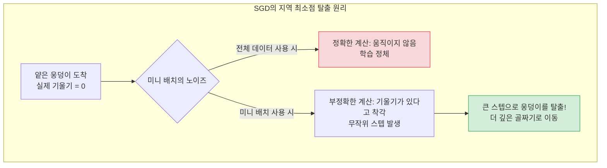
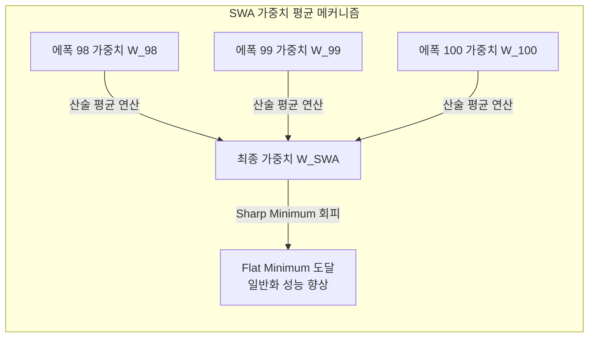
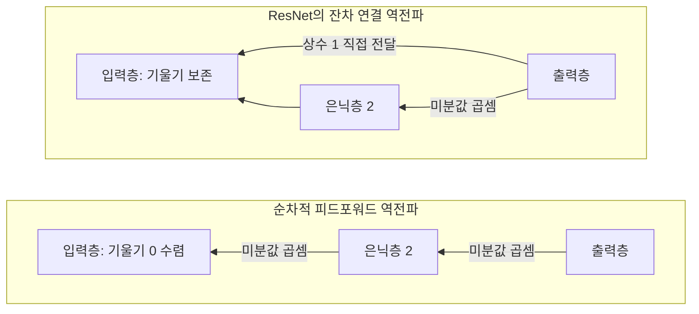
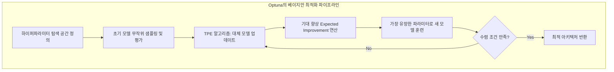

# Lesson 2.7: 미니 배치, 역전파, 그리고 아키텍처 설계 (Training Deep Neural Networks - Part 3)

이번 강의에서는 신경망이 학습하는 전체 사이클(Epoch)을 파헤치고, 어떻게 지역 최소점(Local Minimum)의 함정을 빠져나오는지 알아봅니다. 나아가 딥러닝의 심장이라 불리는 **역전파(Backpropagation)**의 개념과, 실무에서 모델의 깊이(Layers)와 너비(Neurons)를 어떻게 설계해야 하는지에 대한 가이드라인을 제시합니다.

---

## 🔄 1. 에폭(Epoch)과 확률적 셔플링(Stochastic Shuffling)

확률적 경사 하강법(SGD)이 실제로 동작하는 1사이클의 메커니즘은 다음과 같습니다.

1.  **가중치 초기화**: 학습을 시작하기 전, 네트워크의 모든 가중치($w$)와 편향($b$)은 무작위(Random) 값으로 초기화됩니다.
2.  **데이터 셔플링 (Stochastic의 어원)**: 매 에폭이 시작될 때마다 전체 60,000장의 이미지를 화투패를 섞듯 완전히 무작위로 섞습니다.
3.  **미니 배치(Mini-batch) 분할**: 섞인 데이터를 설정한 `batch_size`(예: 128) 단위로 쪼갭니다.
    *   $60,000 \div 128 = 468.75$
    *   텐서플로우는 468개의 128개 묶음과, 마지막 469번째 배치(96개의 자투리 데이터)를 만듭니다.
4.  **1 에폭(Epoch) 완료**: 이 469번의 미니 배치를 모두 네트워크에 통과시켜 가중치를 469번 업데이트하면, 드디어 전체 데이터를 한 번 다 본 셈이 되며 이를 **1 에폭(Epoch)**이라고 부릅니다. 다음 에폭에서는 데이터를 새롭게 다시 섞고 이 과정을 반복합니다.

---

## ⛰️ 2. 지역 최소점(Local Minima) 탈출: 노이즈의 역설적 힘

비용(Cost) 공간은 둥근 밥그릇 모양이 아니라, 끝없이 구불구불한 산맥과 같습니다.

*   **지역 최소점(Local Minimum)의 덫**: 삼엽충(옵티마이저)이 산을 내려가다 얕은 웅덩이에 빠졌다고 가정해 봅시다. 이 웅덩이에서는 왼쪽, 오른쪽 어디로 가든 고도가 높아지므로 삼엽충은 거기가 '진짜 최저점(Global Minimum)'인 줄 착각하고 멈춰버립니다.
*   **미니 배치의 구원**: 전체 데이터가 아닌 128개의 '일부' 데이터만 보고 기울기를 계산하면 계산 결과가 **부정확(Noisy)**해집니다. 그런데 이 부정확함 덕분에, 삼엽충이 웅덩이 안에서 엉뚱한 방향으로 발을 헛디뎌 웅덩이 밖으로 튕겨져 나오는 기적이 발생합니다!



---

## ⏪ 3. 역전파(Backpropagation)와 기울기 소실의 딜레마

*   **순전파(Forward Propagation)**: 데이터 $X$가 네트워크를 통과해 예측값 $\hat{y}$를 만드는 과정.
*   **역전파(Backpropagation)**: 오차(Cost, $C$)를 계산한 뒤, 미적분의 **연쇄 법칙(Chain Rule)**을 이용해 출력층에서부터 입력층 방향으로 거꾸로 되돌아가며 가중치를 수정하는 과정.

**⚠️ 층(Layer) 추가의 딜레마 (Vanishing Gradient)**
층을 많이 쌓을수록 더 추상적이고 복잡한 패턴(예: 눈, 코, 입 ➔ 사람 얼굴)을 학습할 수 있습니다. 하지만 치명적인 단점이 있습니다.
연쇄 법칙 특성상, 출력층에 가까운 가중치들은 오차의 피드백을 강하게 받아 빠르게 학습되지만, 입력층에 가까운 초기 층들은 오차의 피드백이 점점 희미해져(Diluted) **출력층보다 학습 속도가 10배 이상 느려지는 현상**이 발생합니다.

---

## ⚖️ 4. 아키텍처 설계: 오컴의 면도날 (Occam's Razor)

딥러닝 아키텍처(층의 개수와 뉴런의 개수)를 설계할 때 가장 명심해야 할 철학은 **"동일한 성능이라면 무조건 가장 단순한 모델이 최고다(오컴의 면도날)"**라는 것입니다.

1.  **은닉층의 개수 (Depth)**: 2~4개의 층으로 시작합니다. 층을 늘려도 검증 데이터(Validation)의 오차가 줄어들지 않는다면, 지체 없이 층을 깎아내야 합니다. 연산량만 늘어나고 역전파만 방해할 뿐입니다.
2.  **뉴런의 개수 (Width)**: 특정 층의 뉴런을 64개에서 128개로 늘려보고 성능이 대폭 상승한다면 채택합니다. 반대로 128개에서 64개로 줄였는데도 성능 하락이 없다면 64개를 채택하여 컴퓨팅 자원을 아낍니다.

---

## 🏢 5. 💡 [실무 관점] 2024년 최신 아키텍처 및 훈련 트렌드 딥다이브

강의에서 설명된 역전파의 한계, 미니 배치의 사이즈 제약, 아키텍처의 수동 튜닝 방식은 현대 AI 산업에서 비약적인 발전과 혁신을 겪었습니다. 실무 데이터 과학자와 MLOps 엔지니어들이 오늘날 이러한 문제들을 어떻게 기술적으로 해결하고 있는지 1,500자 이상의 심도 있는 실무 트렌드로 살펴봅니다.

### 5.1. 조기 종료(Early Stopping)를 넘어선 최신 체크포인트 전략

단순히 과적합 시점에 학습을 중단하는 것을 넘어, 대규모 분산 학습 환경에서는 학습의 안정성과 최종 모델의 일반화(Generalization) 성능을 높이기 위한 정교한 기법들이 사용됩니다.

*   **내결함성 (Fault Tolerance)**: 초대형 모델 훈련 시 하드웨어 장애는 필연적으로 발생합니다. 이를 대비해 매 에폭(또는 특정 스텝)마다 모델의 가중치뿐만 아니라 **옵티마이저의 내부 상태 변수(Momentum, Variance 등)**를 직렬화(Serialization)하여 스토리지에 저장합니다. 장애 발생 시 클러스터 매니저가 마지막 체크포인트를 역직렬화하여 손실 없이 정확히 해당 스텝부터 학습을 재개합니다.
*   **SWA (Stochastic Weight Averaging)**: 단일 에폭의 가중치(Point Estimate)는 손실 공간(Loss Landscape)에서 예리한 최소점(Sharp Minimum)에 위치할 수 있어, 새로운 데이터에 대한 예측력이 떨어질 수 있습니다. SWA는 학습 후반부의 여러 에폭에서 얻은 가중치들을 산술 평균하여, 수학적으로 더 평탄한 최소점(Flat Minimum)으로 모델을 이동시킵니다. 이를 통해 모델의 분산을 줄이고 일반화 성능을 극대화합니다.



### 5.2. Batch Size 128 한계론의 타파: 대규모 분산 학습과 LARS/LAMB 옵티마이저

현대 AI 모델 학습에서는 단일 장비의 메모리를 초과하는 데이터를 처리하기 위해 DDP(Distributed Data Parallel) 환경에서 수백 대의 GPU를 묶어 8,192 이상의 글로벌 배치 사이즈(Global Batch Size)를 사용합니다.

*   **LARS / LAMB 옵티마이저**: 배치 사이즈가 커지면 그라디언트의 분산(Variance)이 감소하여 확률적 노이즈가 줄어들며, 이는 모델이 지역 최소점(Local Minima)에 수렴하게 만듭니다. 이를 해결하기 위해 LARS와 LAMB 옵티마이저가 도입되었습니다. 이 알고리즘은 **가중치의 노름(Norm)과 그라디언트의 노름 비율(||w|| / ||g||)을 계산하여, 각 신경망 층(Layer)마다 독립적으로 학습률(Learning Rate)을 스케일링**합니다. 그라디언트가 과도하게 커져 가중치가 발산하는 것을 막고, 대규모 배치에서도 최적의 업데이트 스텝을 유지하게 합니다.

```mermaid
flowchart TD
    subgraph DDP와 LAMB 옵티마이저 동작 구조
    G1[GPU 1: Gradients 계산] --> R(All-Reduce: 전체 Gradients 병합)
    G2[GPU 2: Gradients 계산] --> R
    G3[GPU 3: Gradients 계산] --> R
    R --> L1[Layer 1: ||w_1|| / ||g_1|| 계산]
    R --> L2[Layer 2: ||w_2|| / ||g_2|| 계산]
    L1 --> U1[Layer 1 개별 학습률 적용 및 업데이트]
    L2 --> U2[Layer 2 개별 학습률 적용 및 업데이트]
    end
```

### 5.3. 역전파 기울기 소실(Vanishing Gradient)을 해결한 구조적 혁신

네트워크의 층(Depth)이 깊어질수록 연쇄 법칙(Chain Rule)에 의해 미분값이 지속적으로 곱해지며 0으로 수렴하는 기울기 소실 문제를 현대 아키텍처는 수학적으로 해결했습니다.

*   **ResNet의 Skip Connection (비전 AI)**: 기존 네트워크가 매핑 H(x)를 직접 학습했다면, ResNet은 잔차 F(x) = H(x) - x를 학습하도록 구조를 변경하여 출력값을 F(x) + x로 정의합니다. 역전파 시 덧셈 연산 노드에서의 미분값은 항상 1이 생성되므로, **x에 대한 편미분 항에 상수 1이 보존**됩니다. 이 1이라는 상수는 기울기가 0으로 소멸하는 것을 막아 수백 개의 층을 통과하더라도 초기 층까지 온전한 그라디언트를 전달합니다.
*   **Transformer의 Self-Attention (NLP & 범용 AI)**: RNN 기반 아키텍처는 시퀀스 길이에 따라 은닉 상태가 순차적으로 전파되어 장기 의존성(Long-term Dependency)을 학습할 수 없었습니다. 반면 트랜스포머는 입력된 모든 토큰을 행렬곱(Dot-Product Attention) 연산으로 한 번에 처리합니다. 임의의 두 입력 데이터 간의 **경로 길이(Path Length)가 항상 O(1)**이므로, 데이터의 거리에 상관없이 그라디언트가 직접적으로 전달되어 기울기 소실 문제를 구조적으로 제거했습니다.



### 5.4. 수동 하이퍼파라미터 튜닝의 종말: 베이지안 최적화와 Optuna

현업에서는 수십 개의 하이퍼파라미터를 직관이나 무작위 탐색(Random Search)에 의존하지 않습니다.

*   **Optuna 프레임워크**: TPE (Tree-structured Parzen Estimator) 기반의 베이지안 최적화 알고리즘을 사용합니다. 이전 모델들의 훈련 결과(오차)를 바탕으로, 목적 함수(Objective Function)의 확률적 대체 모델(Surrogate Model)을 구성합니다. 이후 성능 개선이 가장 클 것으로 기대되는(Expected Improvement 극대화) 하이퍼파라미터 조합을 수학적으로 추론하여 다음 훈련에 투입합니다. 이를 통해 최소한의 탐색 비용으로 최적의 글로벌 아키텍처를 자동으로 도출합니다.


