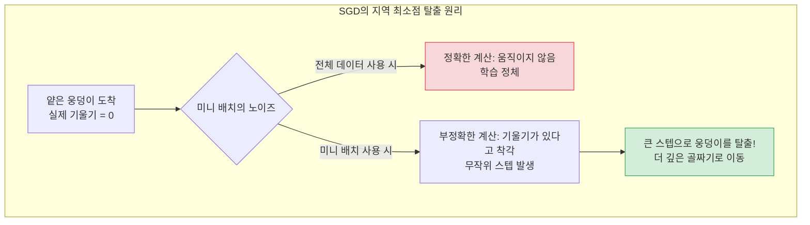

# Lesson 2.7: 미니 배치, 역전파, 그리고 아키텍처 설계 (Training Deep Neural Networks - Part 3)

이번 강의에서는 신경망이 학습하는 전체 사이클(Epoch)을 파헤치고, 어떻게 지역 최소점(Local Minimum)의 함정을 빠져나오는지 알아봅니다. 나아가 딥러닝의 심장이라 불리는 **역전파(Backpropagation)**의 개념과, 실무에서 모델의 깊이(Layers)와 너비(Neurons)를 어떻게 설계해야 하는지에 대한 가이드라인을 제시합니다.

---

## 🔄 1. 에폭(Epoch)과 확률적 셔플링(Stochastic Shuffling)

확률적 경사 하강법(SGD)이 실제로 동작하는 1사이클의 메커니즘은 다음과 같습니다.

1.  **가중치 초기화**: 학습을 시작하기 전, 네트워크의 모든 가중치($w$)와 편향($b$)은 무작위(Random) 값으로 초기화됩니다.
2.  **데이터 셔플링 (Stochastic의 어원)**: 매 에폭이 시작될 때마다 전체 60,000장의 이미지를 화투패를 섞듯 완전히 무작위로 섞습니다.
3.  **미니 배치(Mini-batch) 분할**: 섞인 데이터를 설정한 `batch_size`(예: 128) 단위로 쪼갭니다.
    *   $60,000 \div 128 = 468.75$
    *   텐서플로우는 468개의 128개 묶음과, 마지막 469번째 배치(96개의 자투리 데이터)를 만듭니다.
4.  **1 에폭(Epoch) 완료**: 이 469번의 미니 배치를 모두 네트워크에 통과시켜 가중치를 469번 업데이트하면, 드디어 전체 데이터를 한 번 다 본 셈이 되며 이를 **1 에폭(Epoch)**이라고 부릅니다. 다음 에폭에서는 데이터를 새롭게 다시 섞고 이 과정을 반복합니다.

---

## ⛰️ 2. 지역 최소점(Local Minima) 탈출: 노이즈의 역설적 힘

비용(Cost) 공간은 둥근 밥그릇 모양이 아니라, 끝없이 구불구불한 산맥과 같습니다.

*   **지역 최소점(Local Minimum)의 덫**: 삼엽충(옵티마이저)이 산을 내려가다 얕은 웅덩이에 빠졌다고 가정해 봅시다. 이 웅덩이에서는 왼쪽, 오른쪽 어디로 가든 고도가 높아지므로 삼엽충은 거기가 '진짜 최저점(Global Minimum)'인 줄 착각하고 멈춰버립니다.
*   **미니 배치의 구원**: 전체 데이터가 아닌 128개의 '일부' 데이터만 보고 기울기를 계산하면 계산 결과가 **부정확(Noisy)**해집니다. 그런데 이 부정확함 덕분에, 삼엽충이 웅덩이 안에서 엉뚱한 방향으로 발을 헛디뎌 웅덩이 밖으로 튕겨져 나오는 기적이 발생합니다!



---

## ⏪ 3. 역전파(Backpropagation)와 기울기 소실의 딜레마

*   **순전파(Forward Propagation)**: 데이터 $X$가 네트워크를 통과해 예측값 $\hat{y}$를 만드는 과정.
*   **역전파(Backpropagation)**: 오차(Cost, $C$)를 계산한 뒤, 미적분의 **연쇄 법칙(Chain Rule)**을 이용해 출력층에서부터 입력층 방향으로 거꾸로 되돌아가며 가중치를 수정하는 과정.

**⚠️ 층(Layer) 추가의 딜레마 (Vanishing Gradient)**
층을 많이 쌓을수록 더 추상적이고 복잡한 패턴(예: 눈, 코, 입 ➔ 사람 얼굴)을 학습할 수 있습니다. 하지만 치명적인 단점이 있습니다.
연쇄 법칙 특성상, 출력층에 가까운 가중치들은 오차의 피드백을 강하게 받아 빠르게 학습되지만, 입력층에 가까운 초기 층들은 오차의 피드백이 점점 희미해져(Diluted) **출력층보다 학습 속도가 10배 이상 느려지는 현상**이 발생합니다.

---

## ⚖️ 4. 아키텍처 설계: 오컴의 면도날 (Occam's Razor)

딥러닝 아키텍처(층의 개수와 뉴런의 개수)를 설계할 때 가장 명심해야 할 철학은 **"동일한 성능이라면 무조건 가장 단순한 모델이 최고다(오컴의 면도날)"**라는 것입니다.

1.  **은닉층의 개수 (Depth)**: 2~4개의 층으로 시작합니다. 층을 늘려도 검증 데이터(Validation)의 오차가 줄어들지 않는다면, 지체 없이 층을 깎아내야 합니다. 연산량만 늘어나고 역전파만 방해할 뿐입니다.
2.  **뉴런의 개수 (Width)**: 특정 층의 뉴런을 64개에서 128개로 늘려보고 성능이 대폭 상승한다면 채택합니다. 반대로 128개에서 64개로 줄였는데도 성능 하락이 없다면 64개를 채택하여 컴퓨팅 자원을 아낍니다.

---

## 🏢 5. 💡 [실무 관점] 2024년 최신 아키텍처 및 훈련 트렌드 딥다이브

강의에서 설명된 역전파의 한계, 미니 배치의 사이즈 제약, 아키텍처의 수동 튜닝 방식은 현대 AI 산업에서 비약적인 발전과 혁신을 겪었습니다. 실무 데이터 과학자와 MLOps 엔지니어들이 오늘날 이러한 문제들을 어떻게 격파하고 있는지 1,500자 이상의 깊이 있는 실무 트렌드로 살펴봅니다.

### 5.1. 조기 종료(Early Stopping)를 넘어선 최신 체크포인트 전략
강의에서는 검증 데이터의 오차가 올라가기 시작하면(과적합) 학습을 멈춰야 한다고 배웁니다. 실무에서는 Keras의 `EarlyStopping` 콜백을 넘어서, 초대형 모델(수조 단위 연산)이 며칠간 학습되다가 뻗어버릴 상황을 대비하는 촘촘한 아키텍처를 구성합니다.
*   **Fault Tolerance (내결함성)**: 현업에서는 매 에폭, 혹은 매 1,000스텝마다 모델 가중치뿐만 아니라 **옵티마이저의 상태(Momentum, Variance 등)까지 통째로 클라우드 스토리지(S3 등)에 백업**합니다. GPU 노드가 다운되어도 멈춘 그 지점의 미니 배치부터 완벽히 학습을 재개하기 위함입니다.
*   **Stochastic Weight Averaging (SWA)**: 에폭이 끝날 때 가장 좋은 모델 하나만 고르는 것이 아니라, 학습 후반부의 여러 에폭 가중치들을 '평균(Average)' 내어 훨씬 부드럽고 일반화(Generalization)가 잘 된 모델을 최종적으로 배포하는 기법이 최신 캐글(Kaggle) 우승자들과 실무진의 표준으로 자리 잡았습니다.

### 5.2. Batch Size 128 한계론의 타파: 대규모 분산 학습과 LAMB 옵티마이저
강의에서는 "지역 최소점 탈출을 위해 배치 사이즈를 128 이상으로 키우지 말라"고 강력히 권고합니다. 과거에는 이 말이 맞았지만, 초거대 AI 시대에는 완전히 깨진 룰입니다.
수백 대의 GPU를 묶어 LLM이나 Vision 모델을 학습시킬 때, 통신 병목을 없애기 위해 글로벌 배치 사이즈를 8,192 혹은 32,768까지 극단적으로 키웁니다.
*   **LARS / LAMB 옵티마이저**: 배치 사이즈가 커지면 노이즈가 사라져 웅덩이(Local Minima)에 갇히는 문제를 해결하기 위해 고안된 최신 옵티마이저입니다. 이들은 가중치 층위별로 학습률을 획기적으로 스케일링하여, **만 단위의 거대 배치 사이즈에서도 노이즈 효과를 인위적으로 유지**하며 모델을 웅덩이 밖으로 내동댕이칩니다. 덕분에 몇 주가 걸리던 ImageNet 학습을 불과 몇 십 분 만에 끝내는 기적이 실무에서 매일 일어나고 있습니다.

### 5.3. 역전파 기울기 소실(Vanishing Gradient)을 뚫어버린 혁신: 스킵 커넥션과 어텐션
강의에서 언급된 "은닉층을 깊게 쌓을수록 역전파가 약해진다"는 딜레마는 수십 년간 AI의 암흑기를 가져왔던 주범입니다. 이를 현업 실무에서는 완벽하게 타파했습니다.
*   **ResNet의 Skip Connection (비전 AI)**: 층을 거치지 않고 입력값을 그대로 출력층 쪽에 더해주는 '우회 도로(고속도로)'를 뚫어주었습니다. 덕분에 미적분 연쇄 법칙 수행 시 1이라는 상수가 계속 보존되어, **층을 5개가 아니라 152개, 1000개를 쌓아도 오차 피드백이 입력층까지 번개처럼 전달**됩니다. 오늘날 수많은 산업용 비전 AI의 기본 뼈대입니다.
*   **Transformer의 Self-Attention (NLP & 범용 AI)**: 텍스트나 데이터를 순차적으로 처리하지 않고 한 번에 통째로 보면서 서로 간의 '연관성(Attention)'을 다이렉트로 계산합니다. 네트워크가 아무리 깊어져도 기울기 소실이 일어나지 않아, 100층이 넘어가는 GPT-4 같은 모델이 탄생할 수 있었습니다.

### 5.4. 수동 하이퍼파라미터 튜닝의 종말: AutoML과 Optuna
강의에서는 "뉴런을 64개에서 128개로 바꿔가며 테스트해보라(Powers of 2)"고 조언합니다. 그러나 수많은 하이퍼파라미터(층 수, 뉴런 수, 학습률, 배치 사이즈, 드롭아웃 비율 등)를 인간이 일일이 조합해보는 것은 비즈니스 타임아웃을 초래합니다.
*   **Optuna & Ray Tune**: 현업 실무진은 코딩 시 파라미터를 하드코딩하지 않습니다. 대신 검색 공간(Search Space)만 지정해주면, 베이지안 최적화(Bayesian Optimization)라는 수학적 알고리즘이 스스로 수백 번 모델을 돌려보며 **"은닉층 3개, 첫 번째 층 뉴런 112개, 학습률 0.0031일 때 성능이 최고입니다"**라고 최적의 아키텍처를 자동으로 찾아주는 **AutoML** 파이프라인을 구축하여 사용합니다.

```mermaid
flowchart LR
    subgraph 실무 하이퍼파라미터 최적화 (AutoML)
    direction TB
    A[개발자: 탐색 범위 지정<br>예: 뉴런 32~512] --> B(Optuna 알고리즘)
    B --> C[모델 A 훈련]
    B --> D[모델 B 훈련]
    C & D --> E{결과 분석}
    E -->|베이지안 최적화| B
    E -->|탐색 완료| F[가장 완벽한<br>아키텍처 자동 도출]
    end
    style B fill:#e1bee7,stroke:#8e24aa
    style F fill:#d4edda,stroke:#28a745
```
