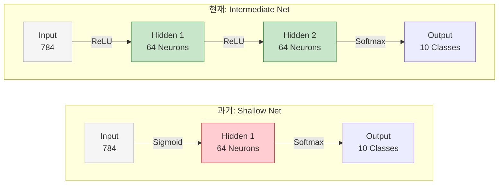
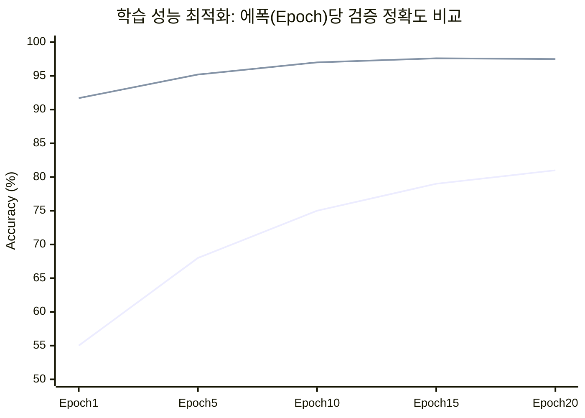

# Lesson 2.8: 중급 신경망 구현 및 하이퍼파라미터 최적화 실습 (Intermediate Neural Net)

지금까지 우리는 딥러닝이 어떻게 학습하는지에 대한 핵심 이론(역전파, 손실 함수, 경사 하강법, 학습률, 미니 배치 등)을 배웠습니다. 이번 강의는 이러한 이론적 지식을 바탕으로, 86%의 정확도에 머물렀던 기존의 **'얕은 신경망(Shallow Net)'** 코드를 리팩토링하여 압도적으로 우수한 성능을 내는 **'중급 신경망(Intermediate Net)'**으로 업그레이드하는 실습 과정을 다룹니다.

---

## 🏗️ 1. 신경망 아키텍처의 진화: 얕은 신경망에서 중급 신경망으로

기존 코드에서는 입력층과 출력층 사이에 단 1개의 은닉층(Hidden Layer)만이 존재했으며, 활성화 함수 또한 낡은 방식인 Sigmoid를 사용했습니다. 이를 최신 트렌드에 맞게 다음과 같이 수정합니다.

1.  **은닉층(Hidden Layer)의 추가**: 더 추상적이고 복잡한 패턴을 추출하기 위해 은닉층을 2개로 늘립니다.
2.  **활성화 함수(Activation Function) 변경**: 기울기 소실(Vanishing Gradient)을 유발하는 `sigmoid` 대신, 현대 딥러닝의 표준인 `ReLU`를 사용합니다.

### 코드의 변화
```python
# [과거] 얕은 신경망 (Shallow Net)
model.add(Dense(64, activation='sigmoid', input_shape=(784,)))
model.add(Dense(10, activation='softmax'))

# [현재] 중급 신경망 (Intermediate Net)
model.add(Dense(64, activation='relu', input_shape=(784,))) # 첫 번째 은닉층
model.add(Dense(64, activation='relu'))                     # 두 번째 은닉층 추가!
model.add(Dense(10, activation='softmax'))                  # 출력층
```

### 아키텍처 시각화 비교



---

## ⚙️ 2. 컴파일 설정의 진화: 크로스 엔트로피와 학습률 부스팅

네트워크의 뼈대를 고쳤다면, 이제 신경망이 **오차를 측정하고 학습하는 방식**을 최적화할 차례입니다.

1.  **손실 함수(Loss Function)**: 분류 문제에 적합하지 않았던 오차 제곱합(`mean_squared_error`)을 버리고, 정보 이론에 기반한 **교차 엔트로피(`categorical_crossentropy`)**로 변경합니다. 오답에 대해 훨씬 강력한 페널티를 부여하여 학습 속도가 비약적으로 상승합니다.
2.  **학습률(Learning Rate) 스케일업**: 모델 구조가 좋아지고 손실 함수가 강력해졌으므로, 삼엽충(옵티마이저)이 더 넓은 보폭으로 걸어도 웅덩이에 빠지지 않습니다. 학습률을 기존 `0.01`에서 `0.1`로 10배(1 Order of Magnitude) 증가시킵니다.

### 코드의 변화
```python
# [과거] 잘못된 손실 함수와 느린 학습률
model.compile(loss='mean_squared_error', optimizer=SGD(learning_rate=0.01), metrics=['accuracy'])

# [현재] 올바른 손실 함수와 과감한 학습률
model.compile(loss='categorical_crossentropy', optimizer=SGD(learning_rate=0.1), metrics=['accuracy'])
```

---

## 📈 3. 놀라운 성능 향상과 에폭(Epoch)의 단축

위의 변경 사항들을 적용한 뒤 모델을 학습시키면, 기하급수적인 성능 향상을 목격할 수 있습니다.

*   **과거 (Shallow Net)**: 무려 **200 에폭**을 돌려야 간신히 **86%**의 정확도(Accuracy)에 도달했습니다.
*   **현재 (Intermediate Net)**: 단 **1 에폭** 만에 이미 91.7%를 달성하며, **10~20 에폭** 내외로 **97.6%**라는 엄청난 정확도를 기록합니다. 에폭 수를 기존 200번에서 20번으로 대폭 줄여 컴퓨팅 자원을 10분의 1로 절약했습니다.



---

## ⚠️ 4. 과적합(Overfitting)의 첫 목격

놀라운 성능 향상 이면에는 우리가 반드시 해결해야 할 새로운 문제가 도사리고 있습니다. 바로 **과적합(Overfitting)**입니다.
강의 후반부에서 훈련 손실(Training Loss)과 검증 손실(Validation Loss)의 지표를 분석해보면 다음 현상이 나타납니다.

1.  **훈련 손실 (Training Loss)**: 에폭이 진행될수록 0을 향해 끝없이 떨어집니다. 모델이 훈련 데이터의 정답을 완벽하게 외워버리고 있다는 뜻입니다.
2.  **검증 손실 (Validation Loss)**: 어느 순간(약 13 에폭 부근)부터 손실이 더 이상 떨어지지 않고 고원(Plateau) 지대에 정체되거나 오히려 증가하기 시작합니다.

이는 모델이 훈련 데이터라는 '기출문제'에만 너무 최적화된 나머지, 처음 보는 '실전 문제(검증 데이터)'에 대한 대응 능력을 잃어가고 있다는 명백한 증거입니다.

---

## 💡 5. [실무 관점] 실무 엔지니어링에서의 교훈 및 다음 스텝

이번 실습은 단순한 코드 수정을 넘어, 딥러닝 현업에서 모델을 튜닝할 때 거치는 **표준 파이프라인(Standard Pipeline)**의 축소판입니다.

1.  **병목(Bottleneck)의 정확한 진단**: 모델의 성능이 나오지 않을 때, 실무진은 층(Layer)만 무작정 늘리지 않습니다. 손실 함수가 문제의 도메인(분류 vs 회귀)과 일치하는지, 활성화 함수가 기울기 소실을 유발하지 않는지를 가장 먼저 점검합니다. 이 실습은 Cross-Entropy와 ReLU의 결합이 얼마나 치명적인 성능 향상을 가져오는지를 명확히 보여줍니다.
2.  **모니터링 지표의 분리**: 단순히 "훈련 정확도(Training Accuracy)가 99%다"라고 기뻐하는 것은 아마추어의 가장 큰 실수입니다. 실무 모델 배포의 유일한 기준은 '처음 보는 데이터'에 대한 성능, 즉 **검증 손실(Validation Loss)**입니다. 검증 손실이 정체되는 순간 학습을 즉시 중단하는 결단력(Early Stopping)이 서버 비용을 절약하고 모델의 품질을 높이는 핵심입니다.

이제 우리는 딥러닝의 기본적인 작동 원리와 최적화 방법을 모두 통달했습니다. 하지만 이번 장의 마지막에 마주친 **과적합(Overfitting)**이라는 벽을 넘지 못하면 진정한 실무용 AI를 만들 수 없습니다. 이어지는 다음 챕터에서는 모델이 기출문제만 외우는 것을 방지하고 진정한 추론 능력을 기르게 만드는 강력한 제약 기법, **정규화(Regularization)와 드롭아웃(Dropout)** 기술에 대해 배우게 됩니다.
