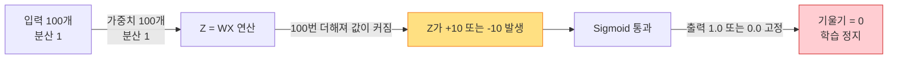
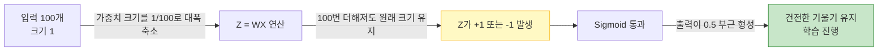
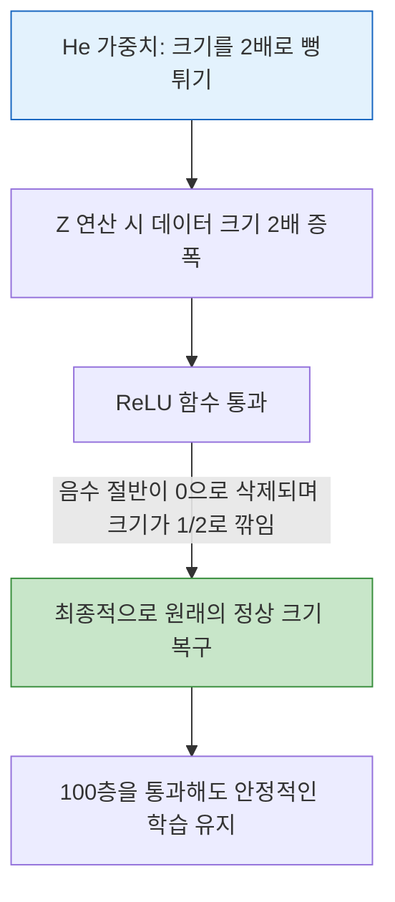

# Lesson 3.1: 가중치 초기화 (Weight Initialization) 완전 정복: 원리부터 2026년 실무 트렌드까지

이 문서는 딥러닝 초보자도 완벽하게 이해할 수 있도록, 수식과 추상적인 비유를 최소화하고 **실제 숫자와 직관적인 예시**를 통해 가중치 초기화의 원리를 설명합니다. 또한 2026년 현재 현업 데이터 과학자들이 사용하는 최신 초기화 기법까지 다룹니다.

---

## 1. 가중치 초기화란 무엇인가?

신경망은 입력 데이터($X$)에 가중치($W$)를 곱하고 편향($b$)을 더해 결과값($Z$)을 만듭니다. ($Z = W \times X + b$)
이때 학습을 시작하기 전, 가중치 $W$에 **처음 어떤 숫자를 넣을 것인가**를 결정하는 과정이 '초기화(Initialization)'입니다.

### 📊 실무적 예시
집값을 예측하는 인공지능이 있다고 가정해 봅시다. 입력 데이터 $X$는 '방의 개수'입니다. (예: 방 3개)
*   **초기 가중치 $W$가 10,000으로 너무 클 때**: 연산 결과 $Z = 3 \times 10,000 = 30,000$이 됩니다. 인공지능은 학습을 하기도 전에 무조건 "집값이 매우 비싸다"라고 강하게 확정지어 버립니다. 수학적으로 너무 큰 숫자가 발생하여 시스템이 멈출 수 있습니다.
*   **초기 가중치 $W$가 0에 가까울 때**: $Z = 3 \times 0.01 = 0.03$이 됩니다. 인공지능은 아직 방 개수와 집값의 관계를 모르기 때문에 판단을 보류하고, 데이터를 보면서 천천히 올바른 숫자를 찾아갈 준비를 합니다.

```mermaid
flowchart LR
    X[입력 데이터 X = 3] -->|곱하기 W| Z[결과값 Z = W * 3]
    subgraph W가 10,000일 때
    Z -->|수학적 폭발| A[Z = 30,000<br>학습 전부터 강한 확정]
    end
    subgraph W가 0.01일 때
    Z -->|판단 보류| B[Z = 0.03<br>데이터를 보며 점진적 학습 가능]
    end
    style A fill:#ffcdd2,stroke:#d32f2f
    style B fill:#c8e6c9,stroke:#388e3c
```

---

## 2. 잘못된 초기화 방식들의 문제점

초기화 숫자를 잘못 선택하면 학습 자체가 진행되지 않습니다. 그 이유를 구체적인 예시로 알아봅니다.

### 2.1. 모든 가중치를 0으로 설정할 때 (Zero Initialization)

"가중치를 0으로 시작하면 안전하지 않을까?"라고 생각할 수 있지만, 이는 치명적인 오류를 낳습니다.

**📊 실무적 예시**
고양이와 강아지를 구분하는 인공지능에 뉴런 A와 뉴런 B가 있습니다. 뉴런 A는 고양이의 귀 모양을, 뉴런 B는 꼬리 모양을 각각 다르게 학습해야 합니다.
그러나 모든 가중치 $W$를 0으로 설정하면, 입력 데이터가 들어올 때 뉴런 A와 뉴런 B가 수행하는 연산이 완벽하게 똑같아집니다 ($0 \times X = 0$). 
결과값이 같으므로 정답과의 오차(Error)도 똑같이 계산되고, 오차를 고치는 업데이트 과정에서도 두 뉴런은 **항상 똑같은 숫자로 수정**됩니다. 

1,000개의 뉴런을 만들더라도 결국 1,000개 모두가 완벽한 '복제인간'이 되어버리며, 각기 다른 특징을 학습하지 못합니다. 이를 **대칭성 파괴(Symmetry Breaking)의 실패**라고 부릅니다.

```mermaid
flowchart TD
    X[입력 데이터 X] --> NA[뉴런 A (W=0)]
    X --> NB[뉴런 B (W=0)]
    NA -->|출력=0| ErrorA[오차 계산]
    NB -->|출력=0| ErrorB[오차 계산]
    ErrorA -->|업데이트 적용| W_A[뉴런 A 가중치: 0.5로 변경]
    ErrorB -->|똑같이 적용| W_B[뉴런 B 가중치: 0.5로 변경]
    W_A -.-> |영원히 똑같이 동작| W_B
```

### 2.2. 정규 분포(N(0,1))로 임의의 숫자를 넣을 때의 포화(Saturation) 현상

대칭성을 깨기 위해, 평균이 0이고 흩어진 정도(분산)가 1인 정규 분포에서 무작위로 숫자를 뽑아 가중치로 넣습니다. (예: 1.2, -0.8, 2.1 등)

**📊 실무적 예시**
입력 데이터 $X$가 100개라고 가정합시다. $Z = W_1X_1 + W_2X_2 + ... + W_{100}X_{100}$ 입니다.
입력값도 1 정도의 크기이고, 가중치도 1 정도의 크기라면, 이를 100번 더했을 때 결과값 $Z$는 대략 -10 이나 +10 같은 큰 숫자가 됩니다.

문제는 **활성화 함수(Sigmoid)**입니다. Sigmoid 함수는 $Z$가 10일 때 0.99995를 출력하고, -10일 때 0.00004를 출력합니다. 즉, 입력값이 조금이라도 크거나 작으면 무조건 1 아니면 0으로 값을 극단적으로 밀어버립니다. 
이러한 극단적인 상태에서는 입력 데이터가 변해도 출력값이 변하지 않으므로 기울기(미분값)가 0이 됩니다. 기울기가 0이 되면 모델은 오차를 고칠 방향을 잃고 학습을 영구히 정지합니다. 이를 **포화(Saturation) 현상**이라고 합니다.



---

## 3. Xavier (Glorot) 초기화의 해결책

2010년 Xavier Glorot은 층을 통과하더라도 $Z$의 값이 폭발하지 않고 일정하게 유지되게 만드는 수학적 규칙을 발견했습니다.

**📊 실무적 예시**
이전의 문제는 100개의 데이터를 더하면서 값이 100배로 팽창했다는 것입니다. Xavier는 아주 단순한 해결책을 제시했습니다. 
"더하는 데이터의 개수가 100개라면, 처음 가중치를 뽑을 때 숫자의 크기(분산)를 **100분의 1 (0.01)**로 확 줄여서 뽑자."

분산이 0.01인 아주 작은 가중치들을 100번 곱하고 더하면, $Z$의 최종 분산은 다시 1로 돌아옵니다. 즉, $Z$의 값이 10이나 -10이 아니라, 원래 의도했던 +1 이나 -1 근처의 건전한 숫자로 유지됩니다.
이 숫자가 Sigmoid를 통과하면 출력이 0이나 1로 쏠리지 않고 중간값인 0.5 근처에 머뭅니다. 이 구간은 기울기가 가장 가파르기 때문에 학습이 정상적으로 빠르게 진행됩니다.



---

## 4. 💡 [2026년 실무 관점] 최신 엔지니어링 및 가중치 초기화 트렌드 딥다이브

앞서 설명한 Xavier 초기화는 과거 Sigmoid나 Tanh 함수를 쓰던 시절의 기술입니다. 2026년 현재 딥러닝 실무에서는 AI 모델의 층이 수십~수백 층으로 깊어졌고, 사용하는 함수와 구조도 완전히 바뀌었기 때문에 새로운 표준을 따릅니다.

### 4.1. ReLU 함수와 He (Kaiming) 초기화의 탄생

현재 실무에서 인공지능의 뼈대(MLP, CNN 등)를 만들 때, 구형인 Sigmoid를 쓰는 경우는 사실상 없습니다. 대신 효율이 압도적인 **ReLU (Rectified Linear Unit)** 함수를 사용합니다.

그러나 ReLU는 한 가지 독특한 특징이 있습니다. **"입력값이 0보다 작으면 무조건 0으로 만들어버린다"**는 것입니다.
**📊 실무적 예시**
100개의 $Z$ 값이 만들어졌을 때 절반은 양수이고 절반은 음수입니다. ReLU를 통과하면 음수 절반이 통째로 0으로 삭제(Truncation)됩니다.
층을 한 번 지날 때마다 데이터의 절반이 사라지므로(분산이 절반으로 감소), 층을 10번만 통과해도 남는 데이터가 없어서 학습이 멈춰버립니다.

2015년 Kaiming He는 이를 해결하기 위해 **He 초기화(He Initialization)**를 제안했습니다.
해결책: **"어차피 ReLU가 데이터의 절반을 날려버릴 테니, 처음에 가중치의 크기를 2배로 뻥튀기해서 주자."**
Xavier 초기화 식에 단순히 상수 2를 곱해 분산을 키워주었더니, 100층이 넘는 깊은 네트워크에서도 데이터가 소멸되지 않고 완벽하게 학습되었습니다. 2026년 현재 ReLU 계열을 사용할 경우 He 초기화는 전 세계적인 표준입니다.



### 4.2. 대형 언어 모델(LLM)과 Transformer에서의 특수 초기화

2026년 현재 AI 산업의 핵심인 GPT-5, Llama-4와 같은 초거대 언어 모델(Transformer 아키텍처)에서는 단어 임베딩 차원(Embedding Dimension)이 8,192에 달하고 층수도 100층을 훌쩍 넘습니다. 여기서는 더욱 정밀한 수학적 조율이 들어갑니다.

*   **비정상적인 가중치 차단 (Truncated Normal Distribution)**: 초거대 모델은 처음에 무작위로 뽑힌 수십억 개의 가중치 중 단 1개라도 재수 없게 극단적으로 큰 숫자가 나오면 시스템 전체가 마비(NaN 에러)됩니다. 이를 막기 위해 가중치를 뽑을 때 정상 범위(표준편차의 2배)를 넘어가는 이상한 숫자가 나오면 가차 없이 버리고 다시 뽑는(Truncate) 방식을 사용합니다.
*   **스케일링 튜닝 (Scaling by Dimension)**: 단어의 연관성(Attention Score)을 계산할 때, 8,192개의 숫자를 한 번에 더하게 됩니다. Xavier의 원리와 비슷하게, 더하는 숫자가 8,192개라면 합산 결과를 8,192의 제곱근(약 90.5)으로 강제로 나누어주어 숫자가 폭발하는 것을 막습니다.

### 4.3. 2026년 실무 프레임워크의 자율 제어 시스템

과거 엔지니어들은 코드에 `kernel_initializer='he_normal'`처럼 일일이 타이핑을 해야 했습니다. 하지만 2026년 TensorFlow/Keras 3.0 및 PyTorch 2.x 환경에서는 실무자가 이 옵션을 직접 적는 일이 크게 줄었습니다.

**📊 실무적 예시**
엔지니어가 코드에 `layer = Dense(256, activation='relu')` 라고만 적으면, AI 프레임워크가 백그라운드에서 "아, ReLU를 썼으니 여기는 무조건 He 초기화를 써야 데이터가 날아가지 않겠군" 하고 알아서 **최적의 초기화 공식을 자동 매핑(Auto-Mapping)**합니다. 
따라서 2026년의 실무자는 모델의 수식을 직접 맞추는 고된 작업에서 해방되어, 더 큰 아키텍처 구조 설계나 양질의 데이터 확보에만 에너지를 집중할 수 있게 되었습니다.
