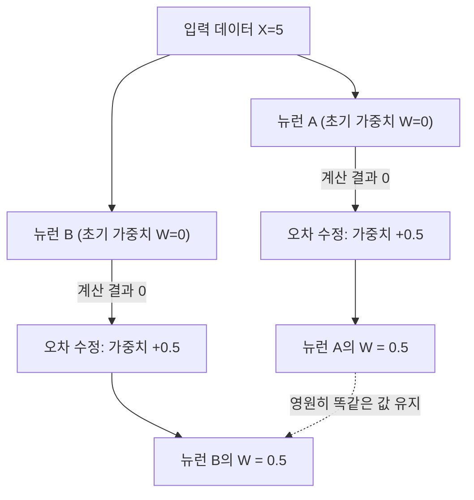
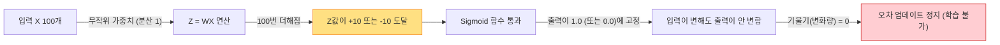
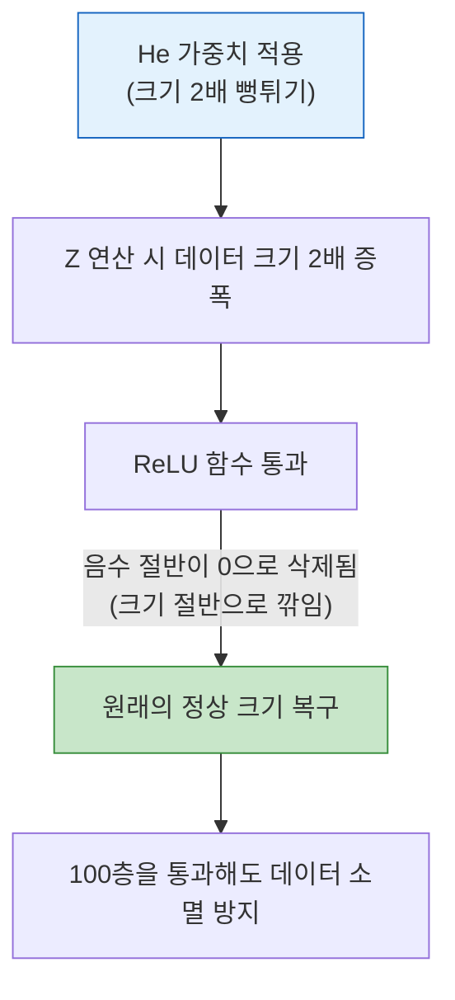

# Lesson 3.1: 가중치 초기화 (Weight Initialization) 완전 정복: 원리부터 2026년 실무 트렌드까지

이 문서는 신경망 학습을 처음 접하는 초보자도 쉽게 이해할 수 있도록, 딥러닝의 핵심인 **가중치 초기화(Weight Initialization)**를 구체적인 수치와 예시를 들어 단계별로 설명합니다. 실습 파일(`weight_initialization.ipynb`)의 코드 분석과 2026년 최신 개발 트렌드까지 모두 포함하고 있습니다.

---

## 1. Z값의 정체와 가중치 초기화의 기본 개념

딥러닝의 뉴런 1개가 수행하는 연산은 다음 공식으로 요약됩니다.

*   **$Z = (W_1 \times X_1) + (W_2 \times X_2) + \dots + b$**

여기서 **$X$**는 우리가 넣어주는 '데이터'(예: 이미지 픽셀 값)이고, **$W$**는 컴퓨터가 학습해야 할 '가중치'입니다. 
**$Z$**는 데이터와 가중치를 곱하고 더해서 나온 **날것의 계산 결과(Raw Score)**입니다. 이 $Z$값이 활성화 함수(Sigmoid, ReLU 등)를 거쳐 최종 출력값이 됩니다.

학습을 시작할 때 가중치 $W$에 **처음으로 어떤 숫자를 채워 넣을 것인가**를 결정하는 것이 바로 **'가중치 초기화'**입니다.

### ❓ 분산(Variance)이란 무엇인가요?
앞으로 '분산'이라는 단어가 자주 등장합니다. 분산은 숫자들이 0을 기준으로 **얼마나 넓게 퍼져 있는지(흩어진 정도)**를 나타내는 수치입니다.
*   분산이 **작을 때 (0.01)**: 숫자들이 0.1, -0.05, 0.02 등 0 근처에 아주 조밀하게 모여 있습니다.
*   분산이 **클 때 (100)**: 숫자들이 8.5, -9.2, 11.4 등 큰 범위로 퍼져 있게 됩니다. (분산의 제곱근인 '표준편차'가 $\sqrt{100}=10$ 이므로, 주로 -10 에서 +10 사이의 값들이 나옵니다.)

---

## 2. 왜 초기화 값을 잘못 넣으면 학습이 망가질까요?

### 2.1. 모든 가중치를 0으로 넣었을 때 발생하는 문제

"가장 깔끔하게 모든 가중치 $W$를 0으로 시작하면 안 될까?"라고 생각할 수 있습니다. 하지만 이는 수학적으로 학습을 완전히 망가뜨립니다.

**[구체적인 예시]**
우리가 뉴런 A와 뉴런 B, 2개를 만들었다고 합시다. 데이터 $X$가 5로 들어옵니다.
*   뉴런 A의 계산: $Z = W \times X = 0 \times 5 = 0$
*   뉴런 B의 계산: $Z = W \times X = 0 \times 5 = 0$

두 뉴런의 출력값이 완전히 똑같습니다. 오차를 고치는 역전파(Backpropagation) 과정에서도 컴퓨터는 "뉴런 A와 뉴런 B의 상태가 똑같으니, 업데이트할 숫자도 똑같이 0.5씩 더해주자"라고 판단합니다.
*   업데이트 후: 뉴런 A의 $W=0.5$, 뉴런 B의 $W=0.5$

뉴런을 1,000개, 10,000개 만들어도 모든 뉴런이 영원히 똑같은 연산만 수행하는 **복제 뉴런**이 되어버립니다. 이를 **대칭성 파괴(Symmetry Breaking)의 실패**라고 부릅니다. 따라서 가중치 $W$는 무조건 **서로 다른 무작위(Random) 숫자**로 시작해야 합니다.



### 2.2. 무작위 정규 분포를 썼을 때의 '포화(Saturation)'와 '기울기 0' 문제

대칭성을 깨기 위해 가중치 $W$에 1.2, -0.8 등 평균이 0이고 분산이 1인 무작위 숫자들을 넣었다고 가정해 봅시다.

**[구체적인 예시]**
입력 데이터 $X$가 100개 들어옵니다. (모두 대략 1 정도의 크기라고 가정)
$Z = W_1X_1 + W_2X_2 + \dots + W_{100}X_{100}$
데이터 1개당 분산이 1인데, 이를 100번 더하면 수학적으로 **Z의 분산은 100**이 됩니다. (분산 100 = 표준편차 $\sqrt{100}=10$)
결과적으로 $Z$는 **+10 이나 -10 근처의 매우 큰 숫자**가 되어버립니다. 100번 더했으므로 값이 폭발한 것입니다.

이 $Z$값이 활성화 함수인 **Sigmoid**를 통과하면 심각한 문제가 발생합니다.
*   $Z = +10$ 일 때, Sigmoid 출력값 = **0.99995**
*   $Z = +11$ 일 때, Sigmoid 출력값 = **0.99998**
*   $Z = -10$ 일 때, Sigmoid 출력값 = **0.00004**

보시다시피 $Z$값이 10이 넘어가면 출력이 무조건 1에 딱 붙어버립니다(이를 **포화 상태로 밀어버린다**고 표현합니다). 
입력이 10에서 11로 크게 변해도, 출력은 0.99995에서 0.99998로 고작 0.00003밖에 변하지 않습니다.

**기울기(미분값)란 "입력이 변할 때 출력이 얼마나 변하는가"**를 뜻합니다. 출력의 변화가 거의 없으므로 **기울기가 0**이 됩니다. 역전파 과정에서 기울기가 0이 되면 컴퓨터는 "가중치를 바꿔도 결과가 안 바뀌네? 그럼 가중치를 업데이트할 필요가 없군"이라며 학습을 영구적으로 중단해 버립니다.



---

## 3. 실습 코드와 Xavier (Glorot) 초기화의 해결책

2010년 자비에(Xavier Glorot)는 수학적으로 아주 단순하고 완벽한 해결책을 냈습니다.

**"100개를 더해서 분산이 100배로 팽창한다면, 애초에 가중치를 뽑을 때 분산을 100분의 1 (0.01)로 줄여서 아주 작은 숫자들만 뽑자."**

분산이 0.01인 숫자들을 100번 더하면 최종 Z의 분산은 $0.01 \times 100 = 1$이 됩니다. Z값이 10이나 -10으로 커지지 않고 +1 이나 -1 부근의 건전한 숫자를 유지합니다. 이 값들은 Sigmoid를 통과해도 출력이 0.5 부근에 형성되므로, 기울기가 살아서 학습이 매우 빠르게 진행됩니다.

### 💻 `weight_initialization.ipynb` 실습 코드 분석
```python
from tensorflow.keras.initializers import RandomNormal, glorot_normal
from tensorflow.keras.layers import Dense

# ❌ 나쁜 예시: 무작위 정규 분포 (분산 폭발 유발)
# Z값이 커져서 학습이 멈춤
w_bad = RandomNormal(stddev=1.0) 
model.add(Dense(256, kernel_initializer=w_bad, activation='sigmoid'))

# ✅ 좋은 예시: Xavier(Glorot) 정규 분포 초기화
# 데이터 개수(노드 수)를 계산하여 가중치 크기를 자동으로 줄여줌
w_good = glorot_normal() 
model.add(Dense(256, kernel_initializer=w_good, activation='sigmoid'))
```

---

## 4. 💡 [실무 관점] 2026년 최신 딥러닝 트렌드와 He 초기화

지금까지 배운 Xavier 초기화는 과거 Sigmoid 시절의 공식입니다. 2026년 현재 실무에서는 뼈대가 되는 함수가 모두 **ReLU**로 바뀌었으므로 새로운 규칙이 적용됩니다.

### 4.1. ReLU의 특징과 He 초기화
ReLU 함수는 **음수 데이터가 들어오면 무조건 0으로 만들어버립니다.** 
100개의 데이터 중 절반이 양수이고 절반이 음수라면, ReLU를 통과하는 순간 데이터의 절반이 0으로 날아갑니다. (분산이 정확히 절반으로 감소) 층을 통과할수록 데이터가 깎여나가 결국 학습이 멈추게 됩니다.

이를 해결하기 위해 Kaiming He는 **"ReLU가 절반을 날려버릴 테니, 처음부터 가중치 크기(분산)를 2배로 뻥튀기해서 곱해주자"**라고 제안했습니다. 이것이 현대 딥러닝의 전 세계적 표준인 **He 초기화(He Initialization)**입니다.



### 4.2. 2026년 프레임워크의 자율 제어 시스템 (Auto-Mapping)
과거에는 실무 엔지니어들이 코드에 `kernel_initializer='glorot_normal'`이나 `'he_normal'`을 일일이 적어주었습니다.
하지만 2026년 최신 버전의 Keras(TensorFlow 3.0 등)와 PyTorch에서는 실무자가 이 옵션을 명시적으로 적지 않습니다.

**[2026년 최신 실무 코드 형태]**
```python
# 초기화 방식을 개발자가 적지 않습니다.
model.add(Dense(256, activation='relu')) 
```
프레임워크가 백그라운드에서 코드를 분석하여 **"개발자가 활성화 함수로 'relu'를 선언했네? 그럼 백그라운드에서 안전하게 He 초기화를 몰래 적용해야겠다"**라고 자동으로 최적의 초기화 공식을 매핑(Mapping)해 줍니다. 

덕분에 현대의 엔지니어들은 어려운 수학 공식을 일일이 계산하여 적을 필요 없이, 데이터의 전처리나 아키텍처 구조 자체에만 집중할 수 있게 되었습니다.
