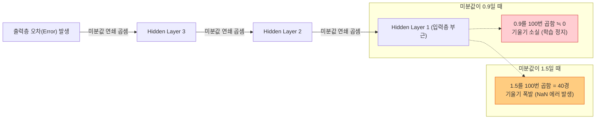
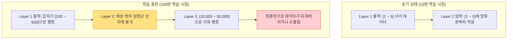
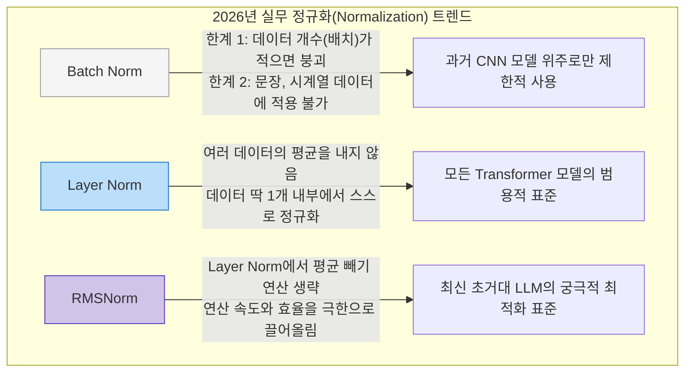

# Lesson 3.2: 불안정한 그라디언트와 배치 정규화 (Unstable Gradients & Batch Normalization)

이 문서는 깊은 인공신경망이 학습할 때 필연적으로 겪게 되는 붕괴 현상인 **불안정한 그라디언트(Unstable Gradients)**와 데이터 분포가 뒤틀리는 **내부 공변량 편향(Internal Covariate Shift)**의 발생 원리를 누구나 이해할 수 있게 한 단계씩 풀어서 설명합니다. 또한, 이를 완벽하게 해결해 딥러닝 혁명을 이끈 **배치 정규화(Batch Normalization)**의 연산 과정과 2026년 최신 정규화 트렌드를 상세히 다룹니다.

---

## 1. 불안정한 그라디언트 (Unstable Gradients)의 발생 원리

신경망은 학습을 할 때 **'역전파(Backpropagation)'**라는 과정을 거칩니다. 역전파란, 정답과 예측값 사이의 '오차(Error)'를 구한 뒤, 맨 마지막 출력층에서부터 맨 앞 입력층으로 거꾸로 되돌아가며 **"이 오차가 누구 탓인지"** 책임(미분값, 기울기)을 묻고 가중치를 수정하는 과정입니다.

문제는 층이 10층, 50층, 100층으로 깊어지면, 이 책임을 묻는 과정에서 미분값을 **계속해서 곱해 나가야 한다(연쇄 법칙, Chain Rule)**는 것입니다. 

### 1.1. 기울기 소실 (Vanishing Gradients)
곱하는 미분값이 1보다 아주 조금이라도 작다면 어떻게 될까요?
각 층에서 계산된 미분값이 **0.9**라고 가정해 봅시다. 
1.  마지막 층에서 생긴 오차의 크기가 10이라고 해봅니다.
2.  한 층 밑으로 내려가면 $10 \times 0.9 = 9$ 가 됩니다.
3.  그 밑으로 내려가면 $9 \times 0.9 = 8.1$ 이 됩니다.
4.  이 짓을 100번 반복해서 100층 아래(입력층 부근)까지 내려가면? $0.9^{100} = 0.000026...$ 이 됩니다.

결국 입력층 근처에 도달한 미분값은 사실상 **$0$**이 되어버립니다. 기울기가 0이므로 가중치를 수정할 수 없고, **입력층에 가까운 파라미터들은 학습이 영구적으로 멈춰버립니다.** 이를 '기울기 소실'이라고 합니다. 초반 층이 눈과 귀의 역할을 하는데, 이곳이 학습되지 않으니 전체 인공지능이 바보가 됩니다.

### 1.2. 기울기 폭발 (Exploding Gradients)
반대로, 연쇄 법칙을 탈 때 미분값이 1보다 조금이라도 크다면 어떻게 될까요? (과거의 순환 신경망 RNN 등에서 자주 발생했습니다.)
각 층의 미분값이 **1.1**이라고 해봅시다.
1.  $1.1^{100} = 13,780.6...$
2.  조금 더 커서 **1.5**라면? $1.5^{100} = 40경$이라는 말도 안 되는 우주적인 숫자가 나옵니다.

층이 깊어질수록 곱셈이 누적되어 기울기가 기하급수적으로 팽창합니다. 가중치가 한 번에 수억 배씩 변동하면서 컴퓨터 메모리가 숫자를 감당하지 못해 **NaN(Not a Number)**이라는 에러를 띄우며 시스템이 파괴됩니다. 이를 '기울기 폭발'이라고 합니다.

---

## 2. 내부 공변량 편향 (Internal Covariate Shift)

학습을 시작할 때는 앞서 배운 Xavier나 He 초기화 덕분에, 모든 층에 들어가는 데이터가 깔끔한 상태(평균이 0, 분산이 1인 분포)를 유지합니다. 하지만 학습이 진행되면서 문제가 발생합니다.

**[상세한 예시 과정]**
1. 1번 층이 열심히 가중치를 업데이트하면서 데이터를 가공해 냅니다. 학습 초반에는 1번 층이 뱉어내는 결괏값들이 주로 **1 ~ 5 사이**였습니다.
2. 2번 층은 "아, 나한테 들어오는 데이터는 1 ~ 5 사이구나"라고 생각하고, 그 숫자에 딱 맞게 자신의 가중치를 세팅하며 학습을 진행합니다.
3. 그런데 1번 층도 계속 똑똑해지며 학습을 하다 보니, 가공하는 방식이 바뀌어 갑자기 결괏값으로 **100 ~ 500 사이**의 숫자를 뱉어내기 시작했습니다.
4. **2번 층 입장에서는 완전히 날벼락**입니다. 1 ~ 5에 맞춰서 세팅을 끝내놨는데 갑자기 100배 큰 숫자 폭탄이 떨어지니, 2번 층이 지금까지 학습했던 가중치 규칙이 모두 무용지물이 됩니다. 

이처럼 **학습 도중 층을 통과할 때마다 데이터의 스케일(평균과 분산)이 제멋대로 이동(Shift)하여 다음 층의 학습을 방해하는 현상**을 '내부 공변량 편향(Internal Covariate Shift)'이라고 합니다.

---

## 3. 배치 정규화 (Batch Normalization)의 작동 원리

이 문제를 완벽하게 해결한 것이 바로 **배치 정규화(Batch Normalization)**입니다. 
원리는 아주 단순하면서도 무식합니다. **"1번 층이 어떤 이상한 스케일의 숫자를 뱉어내든 상관없이, 2번 층에 들어가기 직전에 검문소를 세워서 강제로 숫자를 정돈(정규화)해버리자."**는 것입니다.

### 3.1. 강제로 정돈하는 3단계 과정
딥러닝은 보통 128개 정도의 데이터를 한 묶음(Mini-batch)으로 처리합니다.
1.  **평균 구하기 및 빼기**: 128개 데이터의 평균을 구한 뒤, 모든 데이터에서 그 평균을 빼줍니다. 이렇게 하면 데이터들의 중심점이 항상 **0**으로 맞춰집니다. (평균 100이던 데이터가 모두 0 근처로 이동합니다.)
2.  **분산 구하기 및 나누기**: 데이터들이 얼마나 퍼져있는지(분산)를 구한 뒤, 그 수치로 데이터를 나누어줍니다. 이렇게 하면 10,000씩 퍼져있던 데이터가 조밀하게 압축되어 **분산이 1**로 고정됩니다.
3.  **정규화 완료**: 이제 어떤 층에서 데이터가 폭주하더라도, 다음 층에 들어갈 때는 무조건 **'평균은 0, 분산은 1'**인 아주 안전하고 깔끔한 상태로 들어가게 됩니다.

### 3.2. 정규화의 약점과 해결책 (감마 $\gamma$ 와 베타 $\beta$)
하지만 이렇게 모든 데이터를 '평균 0, 분산 1'로 꽉 묶어버리면 치명적인 부작용이 생깁니다.
활성화 함수(예: Sigmoid)를 보면 평균 0 부근의 구간은 거의 일직선(선형)입니다. 인공지능이 똑똑한 이유는 구불구불한 굴곡(비선형성)을 이용해 복잡한 패턴을 학습하기 때문인데, 데이터를 직선 구간에만 억지로 가둬버리면 인공지능이 바보가 됩니다.

그래서 배치 정규화는 검문소를 통과한 데이터에 **감마($\gamma$, 스케일 곱하기)**와 **베타($\beta$, 중심 이동하기)**라는 두 개의 특별한 손잡이를 달아줍니다. 
이 손잡이는 사람이 돌리는 게 아니라 **인공지능이 스스로 튜닝**합니다.
만약 인공지능이 학습하다가 "아, 이 층에서는 데이터가 좀 더 오른쪽으로 쏠려 있고 조금 더 넓게 퍼져 있어야 정답을 더 잘 맞출 수 있네"라고 깨달으면, 스스로 $\gamma$와 $\beta$의 숫자를 바꿔서 데이터의 모양을 자기 입맛에 맞게 풀어줍니다.
즉, **"데이터가 제멋대로 폭주하는 것은 검문소에서 막아주되, 인공지능 스스로 통제할 수 있는 권한($\gamma$, $\beta$)은 남겨주는 것"**이 핵심입니다.

---

## 4. 배치 정규화가 딥러닝에 가져온 3가지 마법

배치 정규화 필터를 각 층마다 달아주자 기적 같은 일들이 벌어졌습니다.

1.  **과감한 보폭(높은 학습률)으로 초고속 학습 가능**: 예전에는 조금만 가중치를 크게 업데이트해도 기울기가 폭발해 에러가 났습니다. 하지만 이제 검문소(배치 정규화)가 숫자가 커지는 것을 원천 차단해 주므로, 업데이트 보폭(학습률)을 마음껏 크게 설정할 수 있습니다. 덕분에 일주일 걸리던 학습이 하루 만에 끝날 정도로 빨라졌습니다.
2.  **레이어 간의 완전한 독립 보장**: 1번 층이 숫자를 100 ~ 500으로 폭주시켰던 과거와 달리, 이제 1번 층이 무슨 짓을 하든 검문소에서 다 정돈되어 2번 층으로 넘어갑니다. 따라서 2번 층은 1번 층 눈치를 보지 않고 자기 학습에만 100% 집중할 수 있습니다.
3.  **과적합(Overfitting) 방지 효과**: 128개짜리 미니 배치로 그때그때 평균을 구하다 보니, 진짜 전체 데이터(예: 100만 개)의 완벽한 평균과는 미세하게 숫자가 다릅니다. 이 '미세한 오차(노이즈)'가 오히려 약이 됩니다. 인공지능이 훈련 데이터를 기계적으로 완벽하게 외워버리는 현상(과적합)을 방해하여, 나중에 처음 보는 실전 데이터가 들어와도 훨씬 더 정답을 잘 맞추게 됩니다.

---

## 5. 💡 [2026년 실무 관점] 트랜스포머 시대를 맞이한 최신 정규화 트렌드

배치 정규화(Batch Norm)는 이미지 분석(CNN)에서는 신과 같은 존재였지만, 2026년 현재 가장 핫한 초거대 AI(LLM)나 텍스트 분석 환경에서는 한계를 맞이하여 새로운 기술로 대체되었습니다.

### 5.1. Batch Norm의 치명적 한계: 배치 사이즈 의존성
배치 정규화는 미니 배치가 '128개'일 때는 훌륭하지만, 컴퓨터 메모리가 부족해서 배치 사이즈를 '2개'로 줄이면 어떻게 될까요?
데이터 단 2개만 가지고 평균과 분산을 구하면 그 숫자는 전체 데이터를 대표할 수 없는 엉터리 통계가 됩니다. 엉터리 통계로 숫자를 묶어버리니 모델의 성능이 바닥으로 곤두박질칩니다.

### 5.2. 트랜스포머(Transformer)의 절대 표준: Layer Normalization (LN)
글자 수가 제각각인 문장(NLP)을 다룰 때, 여러 문장을 한데 묶어서 평균을 내는 것은 수학적으로 앞뒤가 맞지 않습니다. 
그래서 등장한 것이 **Layer Normalization (LayerNorm)**입니다.

LayerNorm은 128개의 데이터를 모아서 평균을 내는 짓을 포기합니다. 대신, **데이터 단 1개(예: 문장 1개)가 층을 통과할 때, 그 문장이 가진 내부의 속성값들끼리만 평균과 분산을 구해서 정규화**합니다.
*   **장점**: 다른 데이터의 눈치를 볼 필요가 없습니다. 배치 사이즈가 1이든 10,000이든 연산 방식이 똑같습니다. 이 특성 덕분에 현재 GPT, Llama 같은 모든 트랜스포머 모델의 핵심 정규화 기법으로 100% 사용되고 있습니다.

### 5.3. 2026년 극한의 속도 최적화: RMSNorm 
2026년 최근에는 모델이 너무 거대해지면서 연산 속도를 1초라도 단축하는 것이 생명줄이 되었습니다.
엔지니어들은 놀라운 사실을 발견했습니다. "LayerNorm에서 굳이 '평균을 구해서 빼는 작업'을 생략하고, 그냥 분산만 맞춰줘도(RMS 연산) 성능은 거의 똑같은데 계산 속도가 무려 20%나 빨라진다"는 것입니다.
결과적으로 최근 출시되는 대부분의 고성능 LLM 아키텍처들은 평균 연산을 제거한 **RMSNorm**을 새로운 실무 표준으로 채택하고 있습니다.

