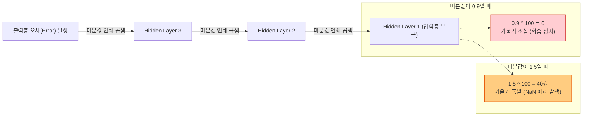

# Lesson 3.2: 불안정한 그라디언트와 배치 정규화 (Unstable Gradients & Batch Normalization)

이 문서는 깊은 인공신경망이 필연적으로 겪게 되는 수학적 붕괴 현상인 **불안정한 그라디언트(Unstable Gradients)**와 **내부 공변량 편향(Internal Covariate Shift)**의 발생 원리를 엄밀하게 분석합니다. 또한 이를 완벽하게 해결하여 딥러닝의 대중화를 이끈 핵심 기술인 **배치 정규화(Batch Normalization)**의 수학적 연산 과정과, 2026년 현재 대규모 모델에서 사용하는 정규화 기술의 최신 트렌드를 매우 깊이 있게 다룹니다.

---

## 1. 불안정한 그라디언트 (Unstable Gradients)의 수학적 발생 원리

신경망이 10층, 50층, 100층으로 깊어지면, 이전 장에서 완벽하게 가중치를 초기화(Weight Initialization)했음에도 불구하고 네트워크 하단(입력층에 가까운 층)에서 학습이 멈추거나 시스템이 파괴되는 현상이 발생합니다.

이는 역전파(Backpropagation)가 미적분의 **연쇄 법칙(Chain Rule)**을 통해 수십 개의 기울기(편미분 값)를 **계속해서 곱해 나가는 연산**이기 때문입니다.

### 1.1. 기울기 소실 (Vanishing Gradients)
출력층에서 오차를 계산한 후, 입력층으로 되돌아가며 미분값을 계속해서 곱합니다.
만약 각 층에서 계산된 미분값이 **0.9**라고 가정해 봅시다. 이 값이 100개의 층을 거치며 누적해서 곱해진다면 어떻게 될까요?
*   $0.9^{100} = 0.000026...$
출력층 근처(예: 99번째 층)는 미분값이 커서 가중치가 빠르게 업데이트되지만, 입력층 근처(예: 1번째 층)에 도달한 미분값은 $0.000026$으로 사실상 $0$에 수렴합니다. 즉, **입력층에 가까운 파라미터일수록 기울기가 소실되어 가중치 업데이트가 완전히 멈춰버리는 현상**을 기울기 소실이라고 합니다.

### 1.2. 기울기 폭발 (Exploding Gradients)
반대로, 특정 아키텍처(예: 과거의 순환 신경망 RNN)에서는 연쇄 법칙을 탈 때 미분값이 1보다 큰 경우가 발생합니다.
만약 각 층의 미분값이 **1.1**이라면 어떻게 될까요?
*   $1.1^{100} = 13,780.6...$
*   $1.5^{100} = 406,561,177,535,215,200...$
층이 깊어질수록 기울기가 기하급수적으로 팽창합니다. 업데이트되는 가중치의 변동폭이 비정상적으로 커지면서 값의 오버플로우가 발생해, 컴퓨터 메모리상에 **NaN(Not a Number)**을 띄우며 학습 시스템이 붕괴됩니다. 이를 기울기 폭발이라고 합니다.



---

## 2. 내부 공변량 편향 (Internal Covariate Shift)

학습 초기에는 가중치 초기화(예: He 초기화) 덕분에 모든 층에 들어가는 데이터(Activation)의 평균이 0, 분산이 1인 이상적인 표준 정규 분포를 유지합니다.
그러나 학습이 진행되면서 1번 층의 가중치가 업데이트되고, 2번 층의 가중치가 업데이트됩니다. 

**[구체적 예시]**
1. 1번 층의 가중치가 변경되면서 1번 층의 출력 결과(2번 층의 입력) 분포가 평균이 0에서 **5**로, 분산이 1에서 **10**으로 통째로 이동(Shift)해 버립니다.
2. 2번 층은 원래 평균 0, 분산 1인 데이터가 들어올 것이라고 예상하고 자신의 가중치를 세팅해 두었는데, 갑자기 엉뚱한 스케일의 데이터가 들어옵니다.
3. 이 충격으로 인해 2번 층의 출력값은 더욱 왜곡되어 3번 층으로 전달됩니다. 
4. 층이 깊어질수록 분포의 붕괴는 누적되며, 결국 최종 활성화 함수(ReLU, Sigmoid)의 비선형 구간을 벗어나거나 포화(Saturation) 상태에 빠집니다.

이처럼 **학습 도중 층을 통과할 때마다 데이터의 분포(평균과 분산)가 계속해서 널뛰기하듯 변하는 현상**을 '내부 공변량 편향(Internal Covariate Shift)'이라고 정의합니다.

```mermaid
flowchart TD
    subgraph 초기 상태 (Epoch 0)
    L1_0["Layer 1 출력: 평균 0, 분산 1"] --> L2_0["Layer 2 입력: 평균 0, 분산 1"]
    end
    
    subgraph 학습 진행 중 (Epoch 10)
    L1_10["Layer 1 출력: 평균 5, 분산 10"] --> L2_10["Layer 2: 예상과 다른 분포 입력에 붕괴"]
    L2_10 --> L3_10["Layer 3: 평균 20, 분산 100 으로 증폭"]
    L3_10 --> Sat["활성화 함수 포화 및 그라디언트 붕괴"]
    end
    style L2_10 fill:#ffe082,stroke:#f57f17
    style Sat fill:#ffcdd2,stroke:#d32f2f
```

---

## 3. 배치 정규화 (Batch Normalization)의 수학적 작동 원리

2015년 제안된 **배치 정규화(Batch Normalization, 이하 BatchNorm)**는 내부 공변량 편향 문제를 근본적으로 해결한 혁명적인 기법입니다. 
핵심 아이디어는 **"데이터의 분포가 널뛰기를 한다면, 층과 층 사이에 필터를 달아서 들어오는 데이터를 매번 강제로 평균 0, 분산 1로 재정렬(Normalize)해버리자"**는 것입니다.

### 3.1. BatchNorm의 연산 과정 (Mini-batch 기준)
미니배치 크기가 128이라고 가정할 때, BatchNorm은 다음과 같은 수학 연산을 각 층의 입력(또는 Z 연산 직후)마다 수행합니다.

1.  **배치 평균($\mu$) 계산**: 128개 데이터의 평균을 구합니다.
2.  **배치 분산($\sigma^2$) 계산**: 128개 데이터의 분산을 구합니다.
3.  **정규화 (Normalization)**: 128개의 데이터 각각에서 평균을 빼고, 분산의 제곱근(표준편차)으로 나누어 줍니다. 이 과정을 거치면 데이터는 무조건 **평균이 0이고 분산이 1인 상태(표준 정규 분포)**로 교정됩니다.
4.  **스케일(Scale) 및 시프트(Shift) 적용**: 이 부분이 가장 중요합니다. 정규화가 완료된 데이터에 **$\gamma$(감마)**를 곱하고 **$\beta$(베타)**를 더합니다.

### 3.2. $\gamma$와 $\beta$ 파라미터는 왜 필요한가?
만약 모든 층의 입력 데이터를 강제로 평균 0, 분산 1로만 만들어버리면 치명적인 문제가 발생합니다. 활성화 함수(예: Sigmoid)의 경우 평균 0 부근은 완전히 '직선(선형)' 구간입니다. 딥러닝이 강력한 이유는 구불구불한 '비선형성(Non-linearity)' 덕분인데, 데이터를 0 부근의 직선 구간에만 가두어 버리면 딥러닝 모델의 복잡한 표현력(Representation Power)이 박탈당합니다.

이를 막기 위해 BatchNorm은 $\gamma$(스케일)와 $\beta$(이동)라는 **학습 가능한 추가 파라미터 2개**를 층마다 도입합니다. 
신경망은 학습 과정에서 오차 역전파를 통해 스스로 $\gamma$와 $\beta$값을 조작합니다. 만약 신경망이 판단하기에 "현재 층에서는 평균을 2로, 분산을 1.5로 만드는 것이 학습에 더 유리하다"고 판단하면 $\gamma=1.5, \beta=2$로 학습시킵니다.
즉, **분포가 맘대로 널뛰는 것은 막되, 신경망이 스스로 원할 때만 통제된 상태에서 분포를 변형시킬 수 있는 통제권**을 부여한 것입니다.


---

## 4. 배치 정규화가 가져온 3가지 극적인 효과

BatchNorm의 도입은 단순히 기울기 붕괴를 막는 것을 넘어 딥러닝 학습 효율을 기하급수적으로 끌어올렸습니다.

1.  **파격적인 학습률(Learning Rate) 상향 가능**: 과거에는 조금이라도 큰 학습률을 주면 기울기 폭발이 일어나 값이 $NaN$이 되었습니다. BatchNorm은 데이터 값이 커지는 것을 강제로 억제하므로, 기울기 폭발의 위험이 완벽히 사라집니다. 이에 따라 학습률을 기존 대비 10배, 100배 이상 크게 줄 수 있어 수렴(학습 완료) 속도가 엄청나게 빨라졌습니다.
2.  **레이어 간 학습의 독립성 (Decoupling)**: 1번 층의 가중치가 크게 변하더라도, BatchNorm 필터가 다음 층으로 넘어가는 데이터를 항상 정제해 줍니다. 즉, 2번 층은 1번 층의 변덕스러운 변화에 시달리지 않고 자신의 가중치 학습에만 독립적으로 집중할 수 있습니다.
3.  **자체적인 정규화(Regularization) 효과 (과적합 방지)**: 128개의 미니배치 단위로 평균과 분산을 구하다 보니, 전체 데이터셋의 진짜 평균과 분산과는 미세한 차이(Noise)가 발생합니다. 이 통계적 노이즈가 모델이 훈련 데이터를 완벽하게 외워버리는 과적합(Overfitting) 현상을 방해하여, 처음 보는 데이터(검증 데이터)에 대한 예측력을 높이는 정규화 효과를 제공합니다.

---

## 5. 💡 [2026년 실무 관점] 최신 정규화 패러다임과 아키텍처 딥다이브

2015년 등장한 Batch Normalization(BN)은 CNN(합성곱 신경망)의 표준으로 군림했습니다. 그러나 2026년 현재 초거대 AI, 시계열, 그리고 NLP 모델 환경에서는 Batch Norm의 치명적 한계가 드러났고, 이를 대체하는 새로운 기술이 표준이 되었습니다.

### 5.1. Batch Norm의 치명적 한계: 배치 사이즈 의존성
Batch Norm은 '미니배치(예: 128개)'의 통계(평균, 분산)에 의존합니다. 그러나 메모리 한계로 인해 배치 사이즈를 극단적으로 줄여 2나 4로 설정하게 되면 어떻게 될까요? 
단 2개의 데이터로 구한 평균과 분산은 전체 데이터를 대표할 수 없는 비정상적인 쓰레기 통계량이 됩니다. 이로 인해 배치 사이즈가 작을 경우 Batch Norm은 오히려 모델 성능을 심각하게 파괴합니다.

### 5.2. 트랜스포머(Transformer)와 NLP의 절대 표준: Layer Normalization (LN)
언어 모델(NLP)에서는 문장의 길이가 제각각이어서 배치 단위의 평균을 구하는 것이 수학적으로 매우 어렵습니다.
이를 해결하기 위해 등장한 것이 **Layer Normalization (LayerNorm)**입니다.

LayerNorm은 데이터 128개를 모아서 평균을 구하는 것이 아닙니다. **데이터 단 1개(예: 문장 1개) 내부에서, 해당 데이터가 가진 특징(Feature) 채널들의 평균과 분산을 계산하여 정규화**합니다.
*   **장점**: 배치 사이즈가 1이든 10,000이든 연산 결과가 완벽하게 동일합니다. 배치 통계에 전혀 의존하지 않으므로 RNN 계열과 초거대 Transformer 아키텍처(GPT-4, Llama 등)에서 무조건적으로 사용되는 핵심 정규화 기법입니다.

### 5.3. 2026년 비전(Vision) 아키텍처의 패러다임 전환: RMSNorm과 ConvNeXt
과거 비전(Vision) 분야의 CNN 모델(ResNet 등)은 Batch Norm을 고집했습니다. 그러나 최근 Vision Transformer(ViT)의 성공 이후, 차세대 합성곱 아키텍처인 **ConvNeXt** 등에서도 Batch Norm을 완전히 버리고 **LayerNorm을 채택**하는 패러다임 시프트가 일어났습니다.

또한, 연산 최적화가 극도로 중요한 최신 LLM 아키텍처에서는 LayerNorm에서 '평균 계산 연산'조차 생략하고 제곱평균제곱근(Root Mean Square)만을 이용하여 정규화하는 **RMSNorm**이 연산 속도를 10~20%가량 끌어올리는 새로운 실무 최적화 표준으로 자리매김했습니다.

```mermaid
flowchart TD
    subgraph 2026년 정규화(Normalization) 트렌드 비교
    direction LR
    B["Batch Norm (BN)"] --> |"한계 1: 작은 배치 사이즈에서 붕괴<br>한계 2: 가변 길이 시퀀스 처리 불가"| X["과거 CNN 위주 제한적 사용"]
    L["Layer Norm (LN)"] --> |"배치 사이즈 완벽 독립<br>데이터 개별 채널 내부 정규화"| T["Transformer 계열 범용적 표준"]
    R["RMSNorm"] --> |"LN에서 평균 계산을 생략<br>연산 비용 극강 최적화"| LLM["최신 초거대 LLM (Llama 등) 핵심 표준"]
    end
    style B fill:#f5f5f5,stroke:#9e9e9e
    style L fill:#bbdefb,stroke:#1976d2
    style R fill:#d1c4e9,stroke:#5e35b1
```
