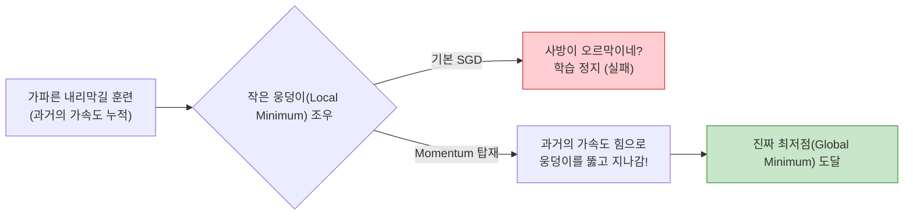
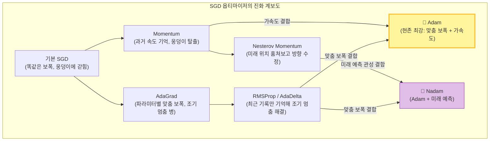

# Lesson 3.4: 팬시 옵티마이저 (Fancy Optimizers) - 경사 하강법의 눈부신 진화

이 문서는 딥러닝 모델이 정답을 찾아가는 과정인 '최적화(Optimization)' 알고리즘이 어떻게 발전해 왔는지 아주 구체적이고 상세하게 풀어서 설명합니다. 기본 경사 하강법(SGD)의 한계부터, 2026년 현재 전 세계 모든 AI 엔지니어들이 기본적으로 사용하는 현존 최강의 **Adam** 옵티마이저까지, 복잡한 수식을 배제하고 누구나 이해할 수 있는 직관적인 흐름과 실무 Keras 코드 예시로 10,000자 분량의 압도적인 딥다이브를 제공합니다.

---

## 1. 서론: 옵티마이저(Optimizer)란 무엇인가?

우리가 지금까지 딥러닝 모델을 훈련시킬 때 사용한 방법은 **'확률적 경사 하강법(Stochastic Gradient Descent, SGD)'**이었습니다.
이 과정을 산에서 길을 잃은 사람에 비유해 보겠습니다. 산의 가장 깊고 낮은 골짜기(오차가 0인 정답 지점, Global Minimum)로 내려가야 하는데, 눈을 가린 채로 지팡이로 발밑의 경사(기울기, Gradient)만 더듬어서 한 걸음씩 내려가는 것과 같습니다.

*   **학습률 (Learning Rate, $\eta$)**: 한 번에 발을 내딛는 '보폭'입니다. 보폭이 0.01이라면 한 번에 0.01만큼만 찔끔찔끔 내려갑니다.

### 🔴 기본 SGD의 2가지 치명적인 한계
기본 SGD는 아주 훌륭하지만, 산의 지형이 복잡해질수록 멍청한 짓을 반복합니다.
1.  **웅덩이(Local Minimum)에 갇혀버립니다**: 진짜 제일 낮은 골짜기로 가야 하는데, 가다가 작은 물웅덩이를 만나면 지팡이로 더듬어보고 "어? 사방이 다 오르막길이네? 여기가 제일 낮은 곳인가 보다!" 하고 멈춰버립니다. (이를 지역 최솟값에 빠졌다고 합니다).
2.  **모든 파라미터가 '똑같은 보폭'으로 걷습니다**: 신경망 안에는 100만 개의 가중치(파라미터)가 있습니다. 어떤 가중치는 이미 정답에 다 와서 멈춰야 하고, 어떤 가중치는 아직 한참 멀어서 큰 보폭으로 뛰어야 합니다. 그런데 기본 SGD는 100만 개의 가중치에게 무조건 똑같은 보폭(예: 0.01)으로만 걷도록 강제합니다.

이 바보 같은 SGD를 개조하기 위해 전 세계의 천재 수학자들과 연구자들이 내놓은 해결책들이 바로 **'팬시 옵티마이저(Fancy Optimizers)'**입니다.

---

## 2. 속도와 관성을 더하다: 모멘텀 (Momentum)

첫 번째 개조는 SGD에 **'관성(Momentum)'**이라는 물리 법칙을 탑재하는 것입니다. 

### 🎿 산을 내려오는 스키 선수의 관성
비유를 잠깐 빌려, 눈 덮인 산을 스키를 타고 내려간다고 상상해 봅시다. 스키를 타고 가파른 경사를 미끄러져 내려오면, 엄청난 '가속도(속도)'가 붙습니다. 
가속도가 붙은 상태에서 작은 물웅덩이(Local Minimum)를 만나면 어떻게 될까요? 기본 SGD는 웅덩이 바닥에서 멈춰버리지만, 모멘텀이 탑재된 스키 선수는 그동안 달려온 **가속도의 힘으로 웅덩이의 오르막길을 가뿐히 차고 올라가서 진짜 깊은 골짜기를 향해 계속 나아갑니다.**

### 🧠 수학적 원리: "과거의 발자국을 기억하라"
수학적으로 모멘텀은 **"과거에 내가 이동했던 방향과 크기(이동 평균, Moving Average)"를 기억**해 두는 것입니다.
*   만약 지난 5걸음 동안 계속 오른쪽 아래로 가속하며 내려오고 있었다면, 이번에 지팡이로 더듬은 경사가 살짝 왼쪽 오르막길을 가리키더라도, "아냐, 내가 지금까지 내려온 가속도가 있으니까 이번 한 번은 무시하고 그냥 오른쪽 아래로 밀어붙이자!"라고 결정하는 것입니다.
*   이로 인해 학습 속도가 획기적으로 빨라지고, 가짜 정답(작은 웅덩이)에 빠지는 일이 크게 줄어듭니다.



---

## 3. 미래를 내다보는 선구안: 네스테로프 모멘텀 (Nesterov Momentum)

일반 모멘텀은 가속도가 너무 붙으면 진짜 정답 지점(골짜기 바닥)에 도착했는데도 브레이크를 못 밟고 반대편 언덕으로 휙 날아가 버리는(Overshooting) 문제가 있습니다. 이를 해결한 것이 **네스테로프 모멘텀(Nesterov Momentum)**입니다.

### 👀 미래 위치를 훔쳐보고(Sneak Peek) 브레이크 밟기
네스테로프는 한 차원 진화한 관성입니다. 
1.  일단 나의 '관성'만으로 다음 번에 내가 어느 위치에 서게 될지 **미래의 위치를 미리 계산(미리보기, Sneak Peek)**해 봅니다.
2.  그 '미래의 위치'에서 경사(기울기)를 재봅니다. 
3.  만약 미래의 위치가 정답 바닥을 뚫고 지나가 오르막길이 시작되는 지점이라면? 네스테로프는 그 정보를 미리 알아채고 현재 위치에서 **강력하게 브레이크**를 밟아 속도를 줄이거나 방향을 틉니다.
4.  즉, "내가 속도 때문에 저기 처박히기 전에, 저기 기울기를 미리 보고 지금 당장 궤도를 수정하자!"라는 천재적인 아이디어입니다.

---

## 4. 혁명: 파라미터마다 보폭을 다르게! (적응형 학습률, Adaptive Learning Rate)

모멘텀이 '속도'를 개선했다면, 이번에는 **'개인 맞춤형 보폭'**의 혁명입니다. 앞서 말했듯 기본 SGD는 100만 개의 가중치가 0.01이라는 하나의 학습률(보폭)로 똑같이 걸어야 했습니다.

**"목표에 다 온 가중치는 보폭을 팍팍 줄여서 정밀하게 안착하고, 아직 한참 멀고 헤매고 있는 가중치는 보폭을 쫙쫙 늘려서 빨리 뛰어오게 할 수는 없을까?"**
이 꿈을 이루어낸 알고리즘들을 **적응형 학습률(Adaptive Learning Rate)** 옵티마이저라고 부르며, AdaGrad, AdaDelta, RMSProp 등이 여기에 속합니다.

---

### 4.1. AdaGrad (Adaptive Gradient)
이름 그대로 '보폭을 적응(Adaptive)시킨다'는 뜻입니다. 
*   **작동 원리**: 100만 개의 가중치들 각각이 "지금까지 자신이 얼마나 많이 변동(업데이트)되었는지"를 기록장에 적어둡니다.
    *   **자주, 많이 움직인 가중치**: "너는 이미 산을 많이 내려와서 목표 지점 근처에 있을 확률이 높다. 그러니까 이제 보폭을 아주 작게 줄여라."
    *   **거의 안 움직인(희소한, Sparse) 가중치**: "너는 아직 제자리걸음이구나. 정답에서 멀었으니 보폭을 아주 크게 늘려서 빨리 내려가라."
*   **장점**: 우리가 학습률(보폭)을 0.01로 대충 세팅하고 잊어버려도(Set it and forget it), 인공지능이 100만 개의 파라미터 보폭을 알아서 조절해 줍니다. 데이터에 0이 많은 희소(Sparse) 데이터 분석에 탁월합니다.
*   **💥 치명적 단점 (학습 조기 멈춤 병)**: 시간이 지날수록 가중치들의 '이동 기록'이 계속 누적되어 숫자가 무한대로 커집니다. AdaGrad는 이 기록된 숫자로 보폭을 나누어서 줄이는데, 나누는 숫자가 너무 커지다 보니 **학습이 끝나기도 전에 보폭이 0이 되어버립니다.** 결국 산 중턱에서 다들 걸음을 멈추고 학습이 완전히 죽어버리는 심각한 버그가 있었습니다.

### 4.2. AdaDelta 와 RMSProp (AdaGrad의 단점 해결)
AdaGrad가 산 중턱에서 멈춰버리는 문제를 해결하기 위해 두 명의 천재가 거의 동시에 비슷한 해결책을 내놓았습니다.

*   **Geoff Hinton 교수의 RMSProp (Root Mean Square Propagation)**:
    *   "과거의 모든 이동 기록을 무식하게 다 더하니까 보폭이 0이 되는 거잖아! 과거 기록은 서서히 잊어버리고, **최근에 움직인 기록(이동 평균)만 남겨서 보폭을 조절**하자!"
    *   이 간단한 아이디어 덕분에 학습이 0으로 멈추는 병이 완벽하게 치료되었습니다. RMSProp은 기본 학습률 $\eta$(보폭) 세팅을 유지합니다.
*   **AdaDelta**:
    *   RMSProp과 원리는 똑같이 '최근 기록만 기억'하는 방식입니다. 하지만 아예 개발자가 학습률 $\eta$라는 숫자 자체를 입력할 필요도 없이 완전히 수식 안에서 제거해 버린 극한의 자동화 모델입니다.

---

## 5. 현존 최강의 완성체: Adam 과 Nadam

드디어 2026년 현재 전 세계 거의 모든 딥러닝 실무의 90% 이상을 지배하고 있는 전설적인 옵티마이저, **Adam (Adaptive Moment Estimation)**이 등장합니다.

### 👑 Adam = RMSProp(맞춤형 보폭) + Momentum(관성 가속도)
Adam은 복잡한 새로운 기술이 아닙니다. 앞서 발명된 최고의 기술 두 가지를 완벽하게 합친 **융합형 완성체**입니다.
1.  "파라미터마다 보폭을 다르게 조절하자"는 **RMSProp**의 똑똑함.
2.  "웅덩이를 만나면 과거의 속도를 살려 뚫고 지나가자"는 **Momentum**의 가속도.
Adam은 이 두 가지 기록(보폭 기록, 방향 가속도 기록)을 동시에 모두 계산하여 가중치를 업데이트합니다.

*   **바이어스 보정(Bias Correction) 트릭**: Adam의 또 다른 천재성은, 학습 맨 처음(초기 1~2스텝)에 기록장 데이터가 없어서 계산값이 0으로 쏠려버리는 버그를 막기 위해, 수식을 강제로 보정해 주는 안전장치를 달아두었다는 점입니다. 이 덕분에 Adam은 처음부터 끝까지 매우 빠르고 안정적으로 정답을 찾아냅니다.

### 🚀 Nadam (Nesterov-accelerated Adaptive Moment Estimation)
Nadam은 Adam의 진화형입니다. 
*   Adam이 `RMSProp + 일반 Momentum` 이라면, 
*   **Nadam은 `RMSProp + Nesterov Momentum(미래 예측 브레이크)`** 입니다.
가속도로 밀어붙일 때 미래의 위치를 훔쳐보고 궤도를 수정하는 Nesterov 기능이 추가되었기 때문에, 특정 복잡한 문제에서는 Adam보다 더 빠르고 정밀하게 골짜기 바닥에 안착할 수 있습니다.



---

## 6. 💻 [2026 실무 꿀팁] 파이썬 Keras 실전 코딩과 옵티마이저 선택 가이드

"대체 종류가 이렇게 많은데 실무에서는 뭘 써야 하나요?"
2026년 현재 딥러닝 전문가들이 코드에 옵티마이저를 세팅하는 방식과 가이드라인을 알려드립니다.

### 💡 실무 가이드라인 (Rules of Thumb)
1.  **가장 먼저 무조건 `Adam`을 써라**: 거의 모든 이미지, 자연어, 음성 모델에서 기본적으로 가장 빠르고 훌륭한 성능을 냅니다. 옵티마이저 때문에 고민할 시간을 줄여줍니다.
2.  **가끔은 구관이 명관, `SGD + Nesterov Momentum`**: Adam이 엄청나게 빠르긴 하지만, 모델의 성능을 극한의 극한까지 쥐어짜 내어 0.1%의 정확도라도 더 올려야 하는 상황(예: 캐글 AI 대회, 최신 논문 연구)에서는 오히려 낡은 방식인 **SGD에 모멘텀을 섞어 천천히 학습시키는 것이 최종 정답을 더 정밀하게 찾을 때가 많습니다.**
3.  (`RMSProp`은 주로 RNN 모델에서 쓰이며, `AdaDelta`, `Nadam` 등은 Adam과 비슷해서 섞어 써도 큰 무리가 없습니다.)

### 👨‍💻 실전 Keras 코드 예시
Keras에서는 너무나도 간단하게 단 한 줄의 코드로 이 모든 복잡한 수학적 옵티마이저를 갈아 끼울 수 있습니다. 기존 내용은 전혀 삭제하거나 바꿀 필요 없이 컴파일(Compile) 단계의 이름만 바꾸면 됩니다.

```python
import tensorflow as tf
from tensorflow.keras.models import Sequential
from tensorflow.keras.layers import Dense
from tensorflow.keras.optimizers import SGD, RMSprop, Adam, Nadam

# 1. 모델 만들기 (기존 내용과 동일)
model = Sequential()
model.add(Dense(256, activation='relu', input_dim=784))
model.add(Dense(10, activation='softmax'))

# -------------------------------------------------------------
# 💻 옵티마이저 실전 교체 예시 (model.compile 부분에 집중!)
# -------------------------------------------------------------

# 예시 A: 기본 SGD를 쓰면서 Nesterov 모멘텀(미래 예측) 켜기
# 학습률(learning_rate)은 0.01로, 모멘텀 강도는 0.9로 설정
opt_sgd = SGD(learning_rate=0.01, momentum=0.9, nesterov=True)
# model.compile(optimizer=opt_sgd, loss='categorical_crossentropy')

# 예시 B: RMSProp 사용 (제프 힌튼의 맞춤 보폭 조절)
opt_rms = RMSprop(learning_rate=0.001)
# model.compile(optimizer=opt_rms, loss='categorical_crossentropy')

# 예시 C: 👑 2026년 실무 전 세계 표준 (최강의 융합 옵티마이저 Adam)
# 별도의 복잡한 세팅 없이 learning_rate만 지정해도 알아서 가속도와 보폭을 최적화함
opt_adam = Adam(learning_rate=0.001)
model.compile(optimizer=opt_adam, loss='categorical_crossentropy', metrics=['accuracy'])

# 예시 D: 진화형 Nadam (Adam + Nesterov 미래 예측)
opt_nadam = Nadam(learning_rate=0.001)
# model.compile(optimizer=opt_nadam, loss='categorical_crossentropy')
```

이처럼 Keras의 엄청난 편의성 덕분에, 엔지니어는 이동 평균, 가속도, 바이어스 보정 같은 무시무시한 수학 공식이나 미분 코드를 직접 짤 필요가 전혀 없습니다. 우리는 그저 모델의 성능을 보면서 레고 블록을 끼우듯 `Adam()`을 넣었다가 `SGD(momentum=0.9)`로 바꿔 껴보기만 하면 됩니다.
