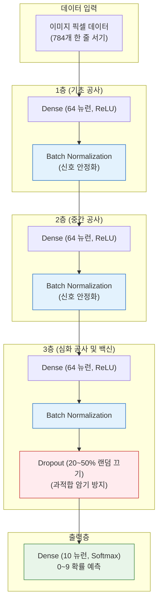

# Lesson 3.5: 마침내 완성한 첫 번째 딥러닝 모델 (A Deep Neural Net with TensorFlow and Keras)

이 문서는 우리가 앞서 고생하며 배운 세 가지 첨단 기술(**배치 정규화(Batch Normalization), 드롭아웃(Dropout), 그리고 팬시 옵티마이저(Nadam)**)을 모두 하나로 융합하여, 마침내 진짜 **'딥러닝(Deep Learning)'**이라고 부를 수 있는 거대한 인공신경망을 직접 코딩하고 분석하는 과정을 아주 상세하게 다룹니다.

---

## 1. 얕은 바다를 지나, 드디어 '심해(Deep)'로 진입하다

그동안 우리가 만들었던 신경망은 은닉층(Hidden Layer)이 1개이거나 2개인 얕은 신경망(Shallow Network 또는 Intermediate Network)이었습니다. 
하지만 이번 장에서 우리는 드디어 **은닉층을 3개 이상** 겹겹이 쌓아 올립니다. 입력층과 출력층을 제외하고 중간에 데이터를 생각하는 두뇌 층이 3개 이상이 될 때, 우리는 비로소 이 모델을 깊다(Deep)고 표현하며, **이것이 바로 '딥러닝(Deep Learning)'이라는 단어의 진짜 어원입니다.**

*   **왜 층을 깊게 쌓을까요?**: 층이 깊어질수록 인공지능은 더 복잡하고 추상적인 개념을 이해할 수 있습니다. 1층이 단순한 '선'을 이해한다면, 2층은 선들이 모인 '도형'을 이해하고, 3층은 도형들이 모인 '고양이의 얼굴'을 이해하게 됩니다.
*   **층이 깊어질 때의 부작용**: 앞서 배웠듯 층이 깊어지면 신호가 희미해지거나 폭주하는 불안정성(Unstable Gradients)이 생기고, 데이터를 억지로 외워버리는 과적합(Overfitting) 병에 걸립니다.
*   **해결책**: 그래서 우리는 이 부작용을 막기 위해 **배치 정규화(Batch Norm)**라는 안정제와 **드롭아웃(Dropout)**이라는 기억 지우개 백신을 함께 주사할 것입니다.

---

## 2. 딥러닝 아키텍처(Architecture) 완벽 해부

이제 Keras를 이용해 우리의 첫 번째 딥러닝 모델을 한 층씩 조립해 보겠습니다. 각 층에 어떤 부품이 들어가고, 왜 들어가는지 아주 쉽게 풀어보겠습니다.

### 🧱 1층 (첫 번째 은닉층: 기초 공사)
*   **부품**: 64개의 ReLU 뉴런 + **Batch Normalization (배치 정규화)**
*   **역할**: 이미지에서 아주 기초적인 특징들(직선, 점, 곡선 등)을 뽑아냅니다.
*   **Batch Norm의 역할**: 뉴런에서 계산된 신호들이 다음 층으로 넘어가기 전에, 신호들이 너무 크거나 작게 튀지 않도록 평균 0, 분산 1 근처로 예쁘게 **정렬시켜 주는 '정수기(필터)' 역할**을 합니다. 놀랍게도 이 Batch Norm은 인공 뉴런(가중치)이 아닙니다. 데이터의 스케일을 다듬어주는 '데이터 처리 전용 부품'일 뿐입니다.

### 🧱 2층 (두 번째 은닉층: 중간 공사)
*   **부품**: 64개의 ReLU 뉴런 + **Batch Normalization**
*   **역할**: 1층에서 넘겨받은 선과 점들을 조립해서 조금 더 복잡한 특징(동그라미 윗부분, 꺾인 각도 등)을 파악합니다. 여기서도 다음 층으로 넘기기 전에 Batch Norm 정수기를 한 번 더 통과시킵니다.

### 🧱 3층 (세 번째 은닉층: 심화 공사 + 과적합 방지)
*   **부품**: 64개의 ReLU 뉴런 + Batch Normalization + **Dropout (드롭아웃)**
*   **역할**: 드디어 숫자 모양의 전체적인 뉘앙스를 파악하는 가장 깊고 똑똑한 층입니다. 그런데 여기에만 특별히 **Dropout**을 투입합니다.

#### 💡 [매우 중요] 왜 Dropout을 1층과 2층에는 안 넣고, 3층에만 넣었을까요?
인공지능이 1층과 2층에서 파악하는 특징들은 아주 단순한 '직선이나 곡선'입니다. 이런 단순한 특징들은 훈련 데이터든 실전 데이터든 어디에나 공통적으로 존재하므로, 억지로 외울(과적합 될) 위험 자체가 거의 없습니다.
하지만 가장 깊은 **3층**에 도달하면, 뉴런들은 "특정 훈련 이미지에만 묻어있는 아주 미세한 얼룩"이나 "너무 구체적인 삐침 꼬리" 같은 쓸데없는 정보까지 완벽하게 외워버리려는(과적합) 습성을 보입니다. 
따라서 딥러닝 전문가들은 **가장 특징이 추상적이고 복잡해지는 신경망의 맨 뒷부분(출력층 바로 앞)**에만 선택적으로 Dropout(기억 지우개)을 투입하여, 모델이 데이터를 편식하고 암기하는 것을 막아냅니다.

### 🏁 4층 (출력층: 최종 결정)
*   **부품**: 10개의 Softmax 뉴런
*   **역할**: 최종적으로 0부터 9까지의 숫자 중 어느 것에 속하는지 100% 확률로 나누어 정답을 찍어냅니다.

---

## 3. 딥러닝 모델의 데이터 흐름도 (Mermaid)

위에서 설명한 모델 구조를 데이터가 128장씩 묶음(Batch)으로 들어와 통과하는 흐름으로 시각화했습니다.



---

## 4. 훈련의 시작: 팬시 옵티마이저 Nadam의 위력

모델의 뼈대를 완성했으니 이제 훈련을 시킬 차례입니다.

### 🚀 똑똑한 길잡이: Nadam 옵티마이저 탑재
과거의 바보 같은 기본 옵티마이저(SGD)는 버리고, 맞춤 보폭(RMSProp)과 미래 예측 관성(Nesterov Momentum)이 모두 결합된 최강의 진화형 옵티마이저인 **Nadam**을 투입합니다.

### ⏱️ 학습 시간(Epoch)의 단축과 딜레마
*   **훈련 횟수(Epoch)는 20번에서 10번으로 단축**: Nadam 옵티마이저가 너무나도 길을 빠르고 똑똑하게 잘 찾기 때문에, 굳이 20번이나 반복 학습을 시킬 필요가 없습니다. 10번만 돌아도 충분히 골짜기 바닥(최저 오차)에 도달합니다.
*   **하지만 1번 돌 때의 시간은 길어짐**: 층이 깊어지고 중간중간 배치 정규화(Batch Norm)와 드롭아웃(Dropout) 계산이 추가되었기 때문에, 컴퓨터가 역전파(Backpropagation)로 오차를 수정하며 거꾸로 올라갈 때 통과해야 할 관문이 훨씬 많아졌습니다. 그래서 Epoch 하나를 완료하는 체감 시간은 조금 더 묵직해집니다.

---

## 5. 결과 분석: 우리는 목표를 달성했을까요?

*   **과거의 얕은 신경망 (Intermediate Net)**: 최고 성능 **97.56%** (18번 Epoch)
*   **새로운 딥러닝 신경망 (Deep Net)**: 최고 성능 **97.65%** (9번 Epoch)

놀랍게도 층을 깊게 쌓고, 수많은 첨단 수학적 기법을 쏟아부었음에도 정확도는 고작 **0.1%** 오르는 데 그쳤습니다. 

### 🤔 왜 고작 0.1% 올랐을까요? 딥러닝의 한계일까요?
아닙니다. 문제는 우리가 사용하는 **'데이터 입력 방식'** 자체에 있습니다.
우리는 지금까지 28x28 형태의 2차원 그림(숫자 이미지)을 컴퓨터에 넣을 때, 가로와 세로의 공간적 배열을 무시하고 **784개의 1차원 픽셀을 한 줄로 길게 늘어뜨려서(Flatten)** 신경망에 밀어 넣었습니다. 

이렇게 이미지를 일렬로 길게 찢어서 밀어 넣으면, "숫자 '3'의 동그란 윗부분 곡선"이라는 위아래, 좌우의 공간적 정보(눈코입의 배치 등)가 완전히 박살 나버립니다. 아무리 훌륭한 딥러닝 층과 Nadam 옵티마이저를 써도, 애초에 박살 난 이미지를 보고 학습하는 데에는 명백한 한계가 존재합니다.

이 한계를 깨부수고 정확도를 99% 이상으로 폭발시키기 위해, **이미지의 가로세로 모양(공간 정보)을 파괴하지 않고 그대로 도장 찍듯이 학습하는 '머신 비전(Computer Vision)'의 꽃, CNN(합성곱 신경망)**이라는 궁극기가 다음 장에서 우리를 기다리고 있습니다.

---

## 6. 💻 실전 Keras 완성본 코드

본 단원의 모든 핵심 기술을 담아, 실무에서 그대로 복사/붙여넣기 하여 사용할 수 있는 Keras 딥러닝 파이프라인 코드를 작성했습니다.

```python
import tensorflow as tf
from tensorflow.keras.models import Sequential
from tensorflow.keras.layers import Dense, BatchNormalization, Dropout
from tensorflow.keras.optimizers import Nadam

# 1. 모델 아키텍처 (뼈대) 조립
model = Sequential()

# 첫 번째 은닉층 (1층)
model.add(Dense(64, activation='relu', input_shape=(784,)))
model.add(BatchNormalization()) # 입력값을 평균 0, 분산 1로 안정화시켜주는 필터

# 두 번째 은닉층 (2층)
model.add(Dense(64, activation='relu'))
model.add(BatchNormalization())

# 세 번째 은닉층 (3층 - Deep Layer)
model.add(Dense(64, activation='relu'))
model.add(BatchNormalization())
model.add(Dropout(0.2)) # 과적합을 막기 위해 뉴런의 20%를 무작위로 기절시킴 (출력층에 가까운 곳에 배치)

# 출력층 (10개의 클래스 예측)
model.add(Dense(10, activation='softmax'))

# -------------------------------------------------------------
# 🔍 꿀팁: model.summary()를 쳐보면 Non-trainable params가 보입니다.
# Batch Normalization은 스스로 학습하는 '가중치(Weight)'가 아니라 
# 단순히 데이터의 평균과 분산을 추적하는 부품이므로 
# '학습 불가능한 파라미터(Non-trainable params)' 숫자를 늘립니다.
# -------------------------------------------------------------

# 2. 모델 컴파일 (팬시 옵티마이저 Nadam 장착)
# SGD 대신 맞춤 보폭과 미래 예측 가속도를 지닌 Nadam으로 똑똑하게 훈련
model.compile(optimizer=Nadam(learning_rate=0.001), 
              loss='categorical_crossentropy', 
              metrics=['accuracy'])

# 3. 모델 훈련 (Epoch 단축)
# 훈련 효율이 워낙 좋아졌으므로 epochs를 20에서 10으로 줄여도 충분합니다.
history = model.fit(X_train, y_train, 
                    batch_size=128, 
                    epochs=10, 
                    verbose=1, 
                    validation_data=(X_valid, y_valid))
```
