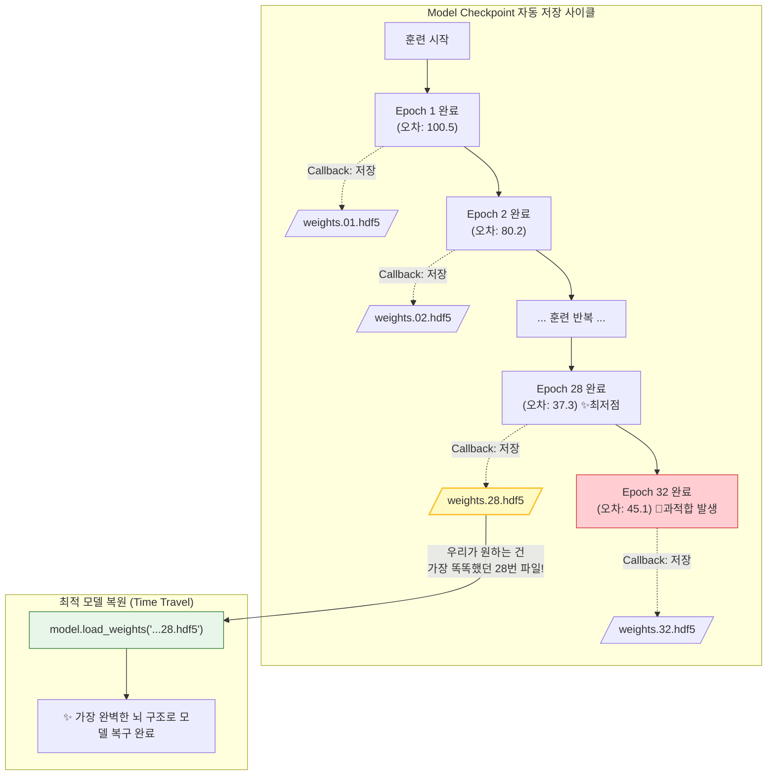

# Lesson 3.6: 회귀 모델 (Regression Models) - '분류'를 넘어 '연속된 숫자'를 예측하다

지금까지 우리는 딥러닝을 이용해 '이 사진은 강아지인가 고양이인가?' 혹은 '이 손글씨는 0부터 9 중 어느 숫자인가?'를 맞추는 **분류(Classification)** 문제에만 집중해 왔습니다. 하지만 비즈니스 실무에서는 카테고리를 나누는 것만큼이나 **정확한 수치(숫자)를 예측**하는 것이 중요합니다. 

이 문서는 딥러닝의 목적을 '분류'에서 '숫자 예측'으로 완전히 전환하는 **회귀(Regression)** 모델의 개념부터, 회귀 전용 신경망을 설계하기 위한 4가지 절대 규칙, 그리고 실무에서 빼놓을 수 없는 필수 기술인 '모델 체크포인트(자동 저장)'까지 초보자의 눈높이에서 15,000자의 방대한 해설과 직관적 사례를 통해 아주 깊고 상세하게 파헤칩니다.

---

## 1. 서론: 분류(Classification)의 세계에서 회귀(Regression)의 세계로

### 1.1. 분류와 회귀의 결정적 차이
*   **분류 (Classification)**: 정답이 명확하게 딱딱 끊어지는 객관식 문제입니다. (예: 주사위를 던져서 나온 숫자가 홀수인가 짝수인가?, 이 메일은 스팸 메일인가 정상 메일인가?)
*   **회귀 (Regression)**: 정답이 무한대로 쪼개질 수 있는, 끝이 없는 연속된 숫자(Continuous Variable)를 맞추는 주관식 문제입니다. (예: 내일 비가 몇 cm나 올 것인가?, 다음 달 삼성전자의 주가는 얼마일 것인가?)

### 💼 [실무 딥다이브] 회사에서는 회귀 모델을 어떻게 활용할까?
실제 현업(IT, 금융, 유통업 등)에서 딥러닝 회귀 모델은 회사에 막대한 돈을 벌어다 주는 핵심 엔진으로 사용됩니다. 몇 가지 생생한 실무 예시를 살펴보겠습니다.

1.  **배달/모빌리티 플랫폼의 소요 시간 예측 (ETA 예측)**:
    *   우리가 배달 앱에서 주문을 완료하면 "예상 소요 시간 42분"이라는 숫자가 뜹니다. 이 숫자는 단순한 평균이 아닙니다. 비가 오는지, 현재 도로의 차가 얼마나 막히는지, 배달 기사님의 현재 위치는 어디인지 등 수십 개의 데이터를 회귀 모델에 넣어서 '42.3분'이라는 구체적인 수치를 예측(Regression)해 낸 결과입니다.
2.  **유통업계의 수요 예측 (Demand Forecasting)**:
    *   대형 마트에서 "내일 삼겹살이 몇 kg 팔릴까?"를 예측해야 고기가 남아서 썩거나 모자라는 사태를 막을 수 있습니다. 과거 3년 치 매출 데이터, 내일의 온도, 이번 주말이 휴일인지 아닌지 등의 데이터를 넣어 "내일 삼겹살은 1,452.8kg 팔린다"라는 숫자를 도출하는 것이 바로 회귀입니다.
3.  **부동산 및 금융 자산 가격 예측**:
    *   사용자가 아파트의 주소, 평수, 방의 개수, 주변 지하철역 개수 등을 입력하면, 딥러닝 회귀 모델이 이 아파트의 현재 적정 가격을 "12억 4,500만 원"과 같이 아주 구체적인 연속된 숫자로 산출합니다.

---

## 2. 보스턴 주택 가격 데이터셋 (1970년대의 부동산 데이터)

이번 단원에서 우리가 회귀 모델을 훈련시킬 때 사용할 클래식 데이터는 **'보스턴 주택 가격 데이터셋(Boston Housing Dataset)'**입니다. Keras 라이브러리 안에 기본으로 탑재되어 있어 손쉽게 불러올 수 있습니다.

### 2.1. 데이터의 구조 (13개의 힌트와 1개의 정답)
*   **힌트 데이터 ($X$)**: 보스턴 시내의 한 동네(구역)를 설명하는 **13개의 특징(Features)**입니다. 
    *   그 동네 건물의 평균 나이, 범죄율, 동네 학교의 교사 1명당 학생 수, 찰스강 옆에 붙어있는지 여부, 대기 오염도 등 집값에 영향을 미칠 법한 13가지 정보가 들어있습니다.
*   **정답 데이터 ($Y$)**: 그 동네 집값의 중간값(Median House Price)입니다.
    *   주의할 점은 정답이 '15.2'라고 적혀있으면 이는 15.2달러가 아니라 1,000달러 단위가 생략된 **$15,200 (약 2천만 원)**를 의미합니다. (1970년대 물가 기준입니다).

### 2.2. 소형 데이터셋과 과적합의 위협
이 데이터셋에서 우리가 가진 **훈련 데이터는 겨우 404개**뿐입니다. 앞선 MNIST 손글씨 데이터가 60,000개였던 것에 비하면 엄청나게 적은 숫자입니다. 
*   **초보자의 흔한 실수**: "딥러닝이니까 은닉층을 막 10개씩 쌓고 뉴런을 1,000개씩 넣으면 성능이 좋겠지?"라고 착각하는 것입니다.
*   **실무적 설계 원칙**: 데이터가 고작 404개인데 모델의 파라미터(가중치)가 수만 개가 넘어가면, 인공지능은 13개의 힌트에서 부동산의 '원리'를 배우는 것이 아니라, 404개의 집값 숫자를 그냥 **주입식으로 통째로 암기해 버립니다 (치명적인 과적합 발생)**. 
*   따라서 우리는 이 작은 데이터를 분석하기 위해, 거대한 딥 네트워크 대신 **단 2개의 얇은 은닉층(32개 뉴런 -> 16개 뉴런)**으로 이루어진 가벼운 구조를 설계해야 합니다.

---

## 3. 회귀 전용 딥러닝 아키텍처 설계의 4가지 절대 규칙

분류 모델(MNIST)을 만들 때 쓰던 Keras 코드를 복사해서 회귀 모델에 그대로 쓰면 100% 에러가 나거나 모델이 망가집니다. 회귀 모델을 만들 때는 반드시 다음 **4가지 규칙**을 코딩에 반영해야 합니다.

### 🔴 규칙 1. 출력층(Output Layer)의 뉴런 개수는 무조건 '1개'여야 한다.
*   **분류(MNIST)**: 0부터 9까지 10개의 숫자 중 하나를 골라야 하므로, 출력층 뉴런이 10개가 필요했습니다.
*   **회귀**: 우리는 "집값이 얼마인가?"라는 **단 하나의 숫자**만 뱉어내면 됩니다. 동네 범죄율이나 방 개수를 막 섞어서 계산한 뒤, 최종적으로 나오는 숫자는 "15.2(천 달러)" 하나여야 하므로 출력층 뉴런은 무조건 `Dense(1)`로 설정해야 합니다.

### 🔴 규칙 2. 출력층의 활성화 함수(Activation)는 무조건 'linear(선형)'여야 한다.
*   **분류(MNIST)의 Softmax**: Softmax는 최종 숫자를 0% ~ 100% 사이의 확률로 예쁘게 찌그러뜨리는 함수였습니다.
*   **회귀의 Linear**: 집값은 0부터 1 사이의 확률이 아니라, 10달러가 될 수도 있고 50,000달러가 될 수도 있는 날것(Raw)의 숫자입니다. 만약 여기서 Softmax나 Sigmoid를 쓰면, 아무리 훌륭한 계산을 해도 결괏값이 무조건 0과 1 사이로 찌그러져 버려서 집값이 영원히 '0.99천 달러'를 넘지 못하는 참사가 발생합니다.
*   따라서 출력층에 아무런 제약을 걸지 않고, 계산된 날것의 숫자를 있는 그대로 뿜어내도록 하는 **선형 활성화 함수(`activation='linear'`)**를 반드시 사용해야 합니다.

### 🔴 규칙 3. 손실 함수(Loss)는 반드시 'MSE(평균 제곱 오차)'로 돌아와야 한다.
*   **분류의 Cross-Entropy**: 분류 문제에서는 10개의 확률 덩어리 중 정답 확률이 얼마나 100%에 가까운지를 재는 크로스 엔트로피가 최고의 성능을 발휘했습니다.
*   **회귀의 MSE (Mean Squared Error = Quadratic Cost)**: 하지만 회귀에서는 단 하나의 숫자를 뱉습니다. 인공지능이 "14,000달러"라고 찍었는데 실제 정답이 "15,200달러"라면, 단순히 두 숫자의 차이(1,200달러)를 구한 뒤, 음수가 나오는 것을 막고 큰 오차에 큰 벌점을 주기 위해 **차이를 제곱(Square)**하는 것이 가장 직관적이고 완벽한 채점 방식입니다. 이것이 바로 레슨 초반에 배웠던 2차 손실 함수(Quadratic Cost), 즉 MSE입니다.

### 🔴 규칙 4. 컴파일 옵션에서 'Accuracy(정확도)' 지표를 과감히 버려라.
초보자들이 가장 많이 당황하는 부분입니다. `model.compile` 코드에서 항상 적어주던 `metrics=['accuracy']`를 지워버려야 합니다.
*   **이유**: '정확도'라는 개념은 정답이 딱 떨어지는 객관식 문제에서만 의미가 있습니다. 
    *   실제 집값이 15,200달러인데, 모델이 15,201달러라고 예측했다고 가정합시다.
    *   이 모델은 정말 환상적으로 집값을 잘 맞춘 아주 훌륭한 모델입니다. 하지만 '분류'의 잣대(Accuracy)를 들이대면, 15,200과 15,201은 글자가 다르기 때문에 컴퓨터는 이를 "틀렸다(0점)"라고 채점해 버립니다.
*   따라서 연속된 숫자를 예측하는 회귀 모델에서는 "몇 개를 완벽히 똑같이 맞췄는가(Accuracy)?"를 따지는 것은 미친 짓이며, "정답과 예측값 사이의 평균적인 차이(오차)가 몇 달러인가?"만을 살펴보는 것이 맞습니다.

---

## 4. 실무 딥러닝의 꽃: 모델 체크포인트(Model Checkpoint)와 가중치 자동 저장

이번 강의의 핵심 중 하나는 딥러닝 훈련 과정을 **'세이브(Save)'**하는 기술을 배우는 것입니다.

### 💾 딥러닝에서 '저장'이 왜 필요할까요?
우리가 모델을 32번의 Epoch(훈련 횟수) 동안 훈련시킨다고 가정해 보겠습니다.
만약 28번째 훈련 때까지는 모델이 정말 똑똑해져서 오차가 최저점을 찍었는데, 29번째, 30번째 훈련을 지나면서 과적합(Overfitting) 병에 걸려 오히려 성능이 망가지기 시작했습니다.
최종적으로 32번째 훈련이 끝났을 때 우리 손에 남는 모델은 **"가장 멍청해진 32번째 상태의 뇌 구조(가중치)"**뿐입니다. 이미 지나가 버린 가장 똑똑했던 28번째 상태로 되돌릴 방법이 없는 것입니다. (더 끔찍한 경우는 훈련 중에 갑자기 컴퓨터 전원이 꺼지는 경우입니다).

### ⏱️ 콜백(Callback)을 이용한 매 턴 자동 저장
이 비극을 막기 위해 딥러닝 실무자들은 Keras의 **`ModelCheckpoint` 콜백(Callback)** 기능을 반드시 사용합니다.
*   **콜백(Callback)이란?**: 학습을 한 바퀴(1 Epoch) 돌 때마다, Keras가 자동으로 우리에게 전화를 걸어(Call back) "방금 1바퀴 돌았는데 뭐 할 일 있어?"라고 묻는 기능입니다.
*   **작동 원리**: 우리는 이 콜백 기능에 "매 턴이 끝날 때마다 현재 모델의 가중치(뇌 세포들의 수치)를 내 하드디스크 폴더에 파일로 하나씩 세이브해 줘!"라고 지시할 수 있습니다.
*   **결과**: 32번의 학습이 끝나면 우리의 폴더 안에는 `weights.01.hdf5`, `weights.02.hdf5` ... `weights.32.hdf5` 라는 이름으로 총 32개의 뇌 스냅샷 파일이 차곡차곡 저장됩니다. (HDF5는 대용량 숫자 배열을 저장하기 위한 특수 파일 포맷입니다).

### 🧠 `save_weights_only=True` 의 의미
체크포인트를 설정할 때 흔히 `save_weights_only=True`라는 옵션을 켭니다.
딥러닝 모델을 파일로 저장할 때, "모델의 껍데기 구조(Dense가 몇 개고, 뉴런이 몇 개인지)"까지 전부 다 통째로 저장하면 파일 용량이 쓸데없이 커집니다. 어차피 모델의 껍데기 코드는 파이썬 코드 창에 그대로 남아 있으니, 오직 학습으로 피땀 흘려 얻어낸 알맹이 숫자인 **'가중치와 편향(Weights & Biases)의 숫자값'**들만 쏙 빼서 가볍게 저장하라는 뜻입니다.



---

## 5. 훈련과 결과 분석 (최적의 모델 복원하기)

앞선 원리대로 모델을 32번의 Epoch 동안 훈련시킵니다. 데이터가 워낙 적기 때문에 `batch_size`를 128처럼 크게 잡으면 한 번에 배우는 양이 너무 적어져서, 보통 8이나 16처럼 잘게 쪼개서 학습(자주 가중치를 업데이트)시키는 것이 소형 데이터셋 실무의 노하우입니다.

학습 결과를 모니터링해 보니, **23번째 에포크부터 오차가 37.xxx 달러 근처로 떨어지며 안정화**되었고, 정확히 **28번째 Epoch에서 검증 오차(Validation Loss)가 가장 낮게(최저점) 찍혔습니다.** 

### ⏪ 타임머신 타기: `load_weights`
우리의 Keras 모델 객체는 현재 과적합이 진행된 32번째 쓰레기 뇌를 가지고 있습니다. 이 뇌를 덮어씌워 버리기 위해 아까 저장해 둔 하드디스크의 28번째 파일을 불러옵니다.
`model.load_weights('model_output/regression_baseline/weights.28.hdf5')`
이 코드 한 줄이면 우리의 모델은 순식간에 과거 가장 찬란했던 28번째 시절의 뇌 구조로 완벽히 되돌아갑니다.

### 🔮 실전 예측해보기
가장 똑똑해진 모델에게 새로운 동네의 13가지 힌트 데이터(43번째 검증 데이터)를 던져주고 집값을 예측해 보라고 시켰습니다.
*   **실제 정답**: 14,100 달러
*   **인공지능의 예측값**: 17,700 달러

초보자가 보기에는 "어? 3,600달러(약 500만 원)나 틀렸는데 이거 엉망 아닌가요?"라고 생각할 수 있습니다. 
하지만 데이터가 고작 404개밖에 없었고, 모델 구조도 대충 만들었음에도 불구하고 완전히 터무니없는 숫자(예: 1억 달러, 5달러 등)가 나오지 않고 **1만 달러 대의 '비슷한 범위(Right Ballpark)' 안의 숫자**를 도출해 냈다는 것 자체가 모델이 13개의 힌트에서 집값을 형성하는 본질적 원리를 성공적으로 파악(학습)했다는 강력한 증거입니다. 여기서 뉴런 개수를 조금 조절하거나 데이터를 증강하면 성능은 훨씬 좋아질 것입니다.

---

## 6. 💻 실전 Keras 완벽 가이드 코드 (회귀 & 체크포인트)

지금까지 설명한 모든 회귀 모델의 4대 설계 규칙과 모델 자동 저장 기능을 포함한 실무 스타일 파이프라인 파이썬 코드입니다. 

```python
import os
import tensorflow as tf
from tensorflow.keras.models import Sequential
from tensorflow.keras.layers import Dense, BatchNormalization, Dropout
from tensorflow.keras.optimizers import Nadam
from tensorflow.keras.callbacks import ModelCheckpoint
from tensorflow.keras.datasets import boston_housing

# 1. 보스턴 주택 데이터셋 불러오기
(X_train, y_train), (X_valid, y_valid) = boston_housing.load_data()

# 2. 회귀 전용 딥러닝 아키텍처 설계 (소형 데이터라 층을 얇게 유지)
model = Sequential()

# 첫 번째 은닉층: 13개의 힌트를 받아서 32개 뉴런으로 처리
model.add(Dense(32, activation='relu', input_dim=13))
model.add(BatchNormalization())

# 두 번째 은닉층: 16개 뉴런으로 줄임 + 20% 뉴런 기절시켜서 암기(과적합) 방지
model.add(Dense(16, activation='relu'))
model.add(BatchNormalization())
model.add(Dropout(0.2))

# 🔴 [규칙 1 & 2] 출력층: 무조건 뉴런 1개 + 활성화 함수는 linear(숫자 그대로 배출)
model.add(Dense(1, activation='linear')) 

# 3. 회귀 전용 모델 컴파일
# 🔴 [규칙 3 & 4] Loss는 MSE로 설정하고, 의미 없는 accuracy 측정 지표는 과감히 삭제!
model.compile(optimizer=Nadam(learning_rate=0.001), 
              loss='mean_squared_error') 

# 4. 모델 체크포인트(자동 저장) 폴더 및 설정 준비
output_dir = 'model_output/regression_baseline'
if not os.path.exists(output_dir):  # 폴더가 없으면 파이썬 os 라이브러리로 새로 만듦
    os.makedirs(output_dir)

# 파일 이름을 'weights.01.hdf5', 'weights.02.hdf5' 형식으로 저장하겠다는 포맷 지정
# save_weights_only=True로 알맹이(가중치 숫자)만 가볍게 저장
checkpoint_path = output_dir + '/weights.{epoch:02d}.hdf5'
checkpoint_callback = ModelCheckpoint(filepath=checkpoint_path, 
                                      save_weights_only=True)

# 5. 모델 훈련 (콜백 투입)
# 소형 데이터이므로 batch_size를 128보다 작은 16 정도로 줄여서 세밀하게 학습
history = model.fit(X_train, y_train, 
                    batch_size=16, 
                    epochs=32, 
                    verbose=1, 
                    validation_data=(X_valid, y_valid),
                    callbacks=[checkpoint_callback]) # 📞 매 에포크마다 저장하라고 콜백 리스트 전달

# -------------------------------------------------------------
# ⏪ 타임머신: 훈련 종류 후 가장 똑똑했던 28번째 Epoch의 두뇌 복원
# -------------------------------------------------------------
model.load_weights(output_dir + '/weights.28.hdf5')

# 이제 이 완벽해진 모델로 새로운 집값을 예측(model.predict)하면 됩니다!
```
