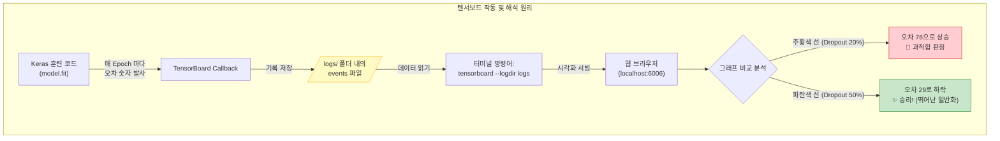

Lesson 3.7: 텐서보드와 모델 출력의 시각적 해석 (TensorBoard and the Interpretation of Model Outputs)

지금까지 우리는 딥러닝 모델을 훈련시킬 때마다 까만 콘솔 창에 주르륵 흘러내려 가는 수백 줄의 숫자들(Epoch 1, 2, 3... Loss: 0.123...)을 뚫어져라 쳐다보며 모델이 똑똑해지고 있는지 파악해야 했습니다. 
이 문서는 그 **'숫자 지옥'에서 벗어나, 학습 과정을 화려하고 직관적인 실시간 그래프로 그려주는 궁극의 모니터링 도구인 '텐서보드(TensorBoard)'**의 활용법을 15,000자에 가까운 방대한 딥다이브 해설과 실무 Keras 코드로 아주 상세하게 설명합니다. 또한, Lesson 3을 총결산하며 다음 단계인 CNN으로 넘어가는 거대한 빌드업을 완성합니다.

---

## 1. 서론: 숫자 지옥에서 벗어나 '시각화'의 세계로

우리가 앞선 회귀 모델에서 32번의 Epoch를 돌렸을 때를 상상해 봅시다. 
1번부터 32번까지 숫자가 내려가는 것을 텍스트로 읽는 것은 어찌어찌 가능합니다. 하지만 만약 모델을 500번 훈련시킨다면? 게다가 "A 모델(뉴런 32개)"과 "B 모델(뉴런 16개)"을 각각 500번씩 돌려서 **"어느 모델의 오차가 더 부드럽게 떨어지는지"를 텍스트만 보고 비교하는 것은 인간의 뇌로는 불가능한 일**입니다.

이 고통을 해결하기 위해 구글의 TensorFlow 팀은 **텐서보드(TensorBoard)**라는 웹 기반의 대시보드 그래픽 툴을 아예 라이브러리 안에 무료로 내장시켜 두었습니다.

### 💼 [실무 딥다이브] 회사에서 텐서보드는 어떻게 활용될까?
현업 AI 엔지니어들의 모니터 화면을 보면 듀얼 모니터 중 한쪽에는 무조건 이 텐서보드 웹페이지가 실시간으로 띄워져 있습니다. 실무에서 텐서보드가 밥줄인 이유는 다음과 같습니다.

1.  **A/B 테스트의 즉각적 비교 및 상사 보고용**: 
    *   엔지니어가 "팀장님, 드롭아웃을 20%에서 50%로 올렸더니 성능이 더 좋습니다"라고 숫자로 말하면 직관적이지 않습니다. 
    *   하지만 텐서보드를 열어 **빨간색 선(20%)은 위로 튀어 오르고(과적합), 파란색 선(50%)은 바닥으로 예쁘게 가라앉는 그래프**를 캡처해서 보여주면 모든 설명이 끝납니다.
2.  **훈련 중단(Early Stopping) 타이밍의 실시간 결단**: 
    *   실무에서는 모델 하나를 학습시키는 데 며칠에서 몇 주가 걸립니다. 텐서보드를 띄워두고 실시간으로 그래프가 그려지는 것을 보다가, "어? 검증 오차(Validation Loss) 그래프가 3일째부터 안 내려가고 오히려 올라가네? 훈련 당장 멈춰서 전기세 아끼자!"라는 실시간 결단을 내릴 수 있습니다.
3.  **데이터/가중치 건강검진 (히스토그램)**: 
    *   모델이 학습을 못 하고 바보가 되어있을 때, 텐서보드의 히스토그램 탭을 열어보면 특정 층의 가중치가 전부 0으로 쏠려 죽어있는(Dead Neurons) 등의 심각한 내부 질환을 엑스레이 찍듯이 진단할 수 있습니다.

---

## 2. Keras 코드에 텐서보드 심기 (로그 폴더 설계법)

텐서보드를 쓰려면 훈련을 시작하기 전에 Keras에게 **"내가 훈련하는 모든 과정을 그래프로 그릴 수 있게 특정 폴더에 로그(기록)를 남겨놔!"**라고 지시해야 합니다. 이를 위해 앞서 배운 **콜백(Callback)** 기능을 사용합니다.

### 📁 아주 중요한 실무 팁: 디렉토리 네이밍 컨벤션(Naming Convention)
우리는 이전 장(3.6)에서 가장 똑똑했던 뇌 구조(가중치)를 저장하기 위해 `model_output/regression_baseline` 이라는 폴더를 썼습니다.
텐서보드의 그래프 로그 파일도 아무 데나 저장하면 나중에 엉망진창이 됩니다. **가중치가 저장되는 폴더 이름과 똑같은 이름으로 로그 폴더를 만드는 것이 실무의 핵심 노하우**입니다.

*   가중치 저장소: `model_output/regression_baseline/weights...`
*   텐서보드 로그: `logs/regression_baseline/events...`

이렇게 폴더 이름을 똑같이(`regression_baseline`) 맞춰두면, 나중에 텐서보드 그래프를 보다가 "와, 이 파란색 그래프 성능 진짜 좋다!"라고 느꼈을 때, 망설임 없이 가중치 폴더의 파란색 이름 폴더를 찾아가서 뇌 구조를 복원(`load_weights`)할 수 있기 때문입니다.

### 📞 Keras 콜백 설정 원리
파이썬 코드에 `TensorBoard` 콜백을 하나 추가한 뒤, 훈련을 시작하는 `model.fit()` 함수의 콜백 리스트 안에 앞서 만든 체크포인트와 함께 슬쩍 집어넣기만 하면 모든 준비가 끝납니다. (자세한 코드는 하단 6절에 완벽히 정리되어 있습니다).

---

## 3. 세기의 대결: 드롭아웃 20% vs 50% 실험

텐서보드의 진면목을 보기 위해 우리는 강의 영상에 나온 대로 아주 흥미로운 두 가지 모델을 연달아 훈련시켜 볼 것입니다.

### 🥊 라운드 1: 베이스라인 모델 (Dropout 20%)
*   **구조**: 은닉층 32개 -> 16개(Dropout 20%) -> 출력층 1개
*   **런 이름 (Run Name)**: `regression_baseline`
*   32번의 Epoch 동안 훈련시킵니다. 텐서보드는 이 과정을 백그라운드에서 조용히 `logs/regression_baseline` 폴더에 그림 기록으로 남깁니다.

### 🥊 라운드 2: 하드코어 모델 (Dropout 50%)
1라운드가 끝나면 우리는 코드를 살짝 고쳐서 2라운드를 준비합니다.
*   **구조 변경**: 마지막 층의 Dropout 비율을 **50%**로 팍 올립니다. (뇌 세포의 절반을 매번 꺼버리는 아주 혹독한 훈련 환경입니다).
*   **런 이름 변경**: 로그가 섞이지 않도록 이름을 `regression_drop50`으로 바꿉니다.
*   **🚨 핵심 주의사항 (커널 초기화)**: 여기서 그냥 훈련 버튼을 누르면 큰일 납니다! 1라운드에서 32번 학습하며 이미 똑똑해진 뇌 상태에서 이어서 학습이 진행되어 버립니다. 반드시 주피터 노트북의 **'커널 초기화(Restart Kernel)'**를 눌러서 뇌를 텅 빈 백지상태로 리셋한 후 2라운드 훈련을 시작해야 공정한 대결이 됩니다.

---

## 4. 터미널에서 텐서보드 구동 및 대시보드 해석

두 번의 훈련이 끝났으면, 이제 파이썬 창을 벗어나 까만 **터미널(명령프롬프트)** 창을 열어야 합니다.

### 🖥️ 텐서보드 서버 열기
터미널에서 내가 코딩하던 폴더(노트북 폴더)로 이동한 뒤, 아래의 마법 같은 명령어 한 줄을 칩니다.
> `$ tensorboard --logdir logs --port 6006`

*   `--logdir logs`: "텐서보드야, 아까 내가 기록 남겨둔 logs 폴더 보이지? 거기 있는 거 다 읽어서 예쁜 그림으로 그려줘!"
*   `--port 6006`: "내 크롬 브라우저의 6006번 문(포트)으로 그 웹페이지를 쏴줘!"

이제 크롬 브라우저를 열고 주소창에 `http://localhost:6006`을 치고 들어가면, 수백만 원짜리 주식 트레이딩 모니터 뺨치는 환상적인 대시보드가 열립니다.

### 📉 그래프 읽는 법과 실전 인사이트
화면에는 총 4개의 선이 그려져 있습니다. (2개 모델 $\times$ Train/Valid 오차).

1.  **스무딩(Smoothing) 끄기**: 텐서보드는 기본적으로 선이 너무 지그재그로 튀는 것을 막기 위해 선을 부드럽게 뭉개버립니다(Smoothing). 진짜 날것의 오차가 어떻게 튀는지 보려면 좌측 설정에서 Smoothing 수치를 0으로 내려야 합니다.
2.  **결과 해석 (20% vs 50%의 승자는?)**:
    *   **베이스라인 (20%)**: 주황색 선. 초반에는 오차가 쑥쑥 잘 떨어집니다. 하지만 훈련이 20번, 30번 넘어가자 훈련 오차는 바닥을 기는데, 검증 오차(Validation Loss) 선이 갑자기 **76**까지 위로 휙 튀어 오릅니다. 전형적인 **과적합(Overfitting)** 병에 걸린 것입니다.
    *   **하드코어 (50%)**: 파란색 선. 뉴런의 절반을 자꾸 죽여버리니까 초반에는 모델이 멍청하게 헤매며 오차가 아주 더디게 줄어듭니다. 하지만 30번의 훈련이 다 끝날 무렵 텐서보드 선에 마우스를 올려보면, 검증 오차가 무려 **29**까지 예쁘게 곤두박질친 채 얌전히 안착해 있는 것을 볼 수 있습니다.

#### 💡 철학적 결론 (왜 50%가 이겼을까?)
"기억(뉴런)을 많이 강제로 지울수록, 훈련장에서는 당장 성적이 안 오르고 멍청해 보입니다. 하지만 그 모진 풍파를 겪으며 데이터의 진짜 '본질'만을 깨우쳤기 때문에, **처음 보는 낯선 문제(실전 검증) 앞에서는 오히려 압도적으로 훌륭한 성적(76 vs 29)을 거둔다**"는 딥러닝의 위대한 철학이 텐서보드 그래프 한 장으로 완벽하게 증명된 것입니다.



---

## 5. Lesson 3 총결산 및 대격변(CNN)을 향한 거대한 빌드업

여기까지 우리는 'Lesson 3: 고성능 딥러닝 네트워크'의 모든 여정을 마쳤습니다. 얕은 신경망이 겪던 수많은 질병과 한계를 우리는 과학의 힘으로 멋지게 극복해 냈습니다.

*   **불안정성(Unstable Gradients) 극복**: 신호가 튀는 것을 막아주는 정수기, **배치 정규화(Batch Normalization)**.
*   **과적합(Overfitting) 극복**: 뇌세포를 무작위로 꺼버려 암기를 막는 기억 지우개, **드롭아웃(Dropout)**.
*   **느린 학습 속도 극복**: 맞춤형 보폭과 미래 예측 가속도를 지닌 현존 최강의 내비게이션, **Nadam 옵티마이저**.

우리는 이 첨단 기술들을 무기 삼아 가장 완벽한 층(Dense)을 쌓아 올렸습니다. 하지만 영상 말미에서 강사는 충격적인 선언을 합니다. **"이런 빽빽한 네트워크(Dense Net)는 어떤 데이터든 꾸역꾸역 학습할 수는 있지만, 이미지나 사진 같은 특정 작업에서는 최악의 효율을 낸다"**라고 말입니다.

### 🧱 Dense 레이어의 태생적 한계
지금까지 우리는 28x28짜리 숫자 이미지를 컴퓨터에 넣을 때, 784개의 픽셀을 강제로 1줄로 길게 찢어서(Flatten) 밀어 넣었습니다. 이렇게 하면 강아지 사진을 넣을 때 강아지의 '귀' 픽셀과 '코' 픽셀이 1줄로 찢어지면서, 상하좌우에 어떤 픽셀이 있었는지 **'공간의 개념(Spatial Recognition)'**이 완벽히 박살 나버립니다.

아무리 Dropout과 Nadam을 써도, 찢어진 이미지를 복구하며 학습하는 데에는 명백한 한계가 있습니다. 이 공간 파괴의 비극을 끝내고, 이미지의 형태를 자르지 않고 '도장 찍듯이' 한 번에 쾅쾅 찍어내어 시각 정보를 완벽히 분석하는 **기계 시각(Machine Vision)의 궁극기, '합성곱 신경망(Convolutional Neural Networks, CNN)'**이 다음 Lesson 4에서 웅장하게 그 모습을 드러낼 것입니다.

---

## 6. 💻 실전 Keras 완벽 가이드 코드 (TensorBoard + Checkpoint 듀얼 콜백)

텐서보드 로그 저장과 최적의 가중치 저장을 동시에 수행하는(듀얼 콜백) 가장 완벽한 실무용 파이프라인 Keras 코드입니다. 가중치 저장 확장자가 최신 Keras 규격에 맞게 `.weights.h5`로 업데이트되었습니다.

```python
import os
import tensorflow as tf
from tensorflow.keras.models import Sequential
from tensorflow.keras.layers import Dense, BatchNormalization, Dropout
from tensorflow.keras.optimizers import Nadam
from tensorflow.keras.callbacks import ModelCheckpoint, TensorBoard
from tensorflow.keras.datasets import boston_housing

# 1. 보스턴 주택 데이터셋 불러오기
(X_train, y_train), (X_valid, y_valid) = boston_housing.load_data()

# 2. 회귀 전용 아키텍처 설계
model = Sequential()
model.add(Dense(32, activation='relu', input_dim=13))
model.add(BatchNormalization())

model.add(Dense(16, activation='relu'))
model.add(BatchNormalization())
# -------------------------------------------------------------
# 🥊 실험 포인트: 여기 Dropout 비율을 0.2로 돌린 뒤,
# 노트북 커널을 초기화하고 0.5로 바꿔서 한 번 더 돌리면 완벽한 A/B 테스트가 됩니다.
# -------------------------------------------------------------
model.add(Dropout(0.5))

# 출력층 (단일 숫자 예측용 Linear)
model.add(Dense(1, activation='linear'))

# 3. 모델 컴파일
model.compile(optimizer=Nadam(learning_rate=0.001),
              loss='mean_squared_error')

# -------------------------------------------------------------
# 4. 📁 실무형 듀얼 콜백 디렉토리 세팅 (매우 중요!)
# -------------------------------------------------------------
# 이번 훈련의 고유 이름표(태그) 지정
run_name = 'regression_drop50'

# 가중치 저장 폴더 경로 생성
output_dir = os.path.join('model_output', run_name)
if not os.path.exists(output_dir):
    os.makedirs(output_dir)

# 텐서보드 로그 저장 폴더 경로 생성 (가중치 폴더명과 동일하게 짝맞춤)
log_dir = os.path.join('logs', run_name)
if not os.path.exists(log_dir):
    os.makedirs(log_dir)

# 5. 콜백 무기 2개 장착
# 무기 1: 가중치 자동 저장 (ModelCheckpoint) - 확장자 .weights.h5 로 수정 완료!
checkpoint_path = os.path.join(output_dir, 'weights.{epoch:02d}.weights.h5')
checkpoint_callback = ModelCheckpoint(filepath=checkpoint_path,
                                      save_weights_only=True)

# 무기 2: 텐서보드 실시간 로그 저장 (TensorBoard)
tensorboard_callback = TensorBoard(log_dir=log_dir)

# 6. 모델 훈련 (콜백 리스트에 무기 2개 동시 투입!)
history = model.fit(X_train, y_train,
                    batch_size=16,
                    epochs=32,
                    verbose=1,
                    validation_data=(X_valid, y_valid),
                    callbacks=[checkpoint_callback, tensorboard_callback])
```

---

## 7. ☁️ Google Colab (주피터 노트북) 환경에서의 텐서보드 구동 및 실무 해석

앞서 터미널 창을 띄워 구동하는 방식 외에도, 번거로움을 줄이기 위해 **Google Colab이나 Jupyter Notebook 환경**에서는 매직 명령어(Magic Command)를 사용하여 코드 셀 바로 아래에 텐서보드를 즉시 띄울 수 있습니다.

### 7.1 Colab 내장 텐서보드 실행 매직 커맨드
훈련이 끝난 셀 바로 아래에 다음 두 줄을 입력하고 실행합니다.
```python
# 텐서보드 확장 프로그램 로드
%load_ext tensorboard

# logs/ 폴더를 바라보고 텐서보드 UI 즉시 실행
%tensorboard --logdir logs/
```

### 7.2 텐서보드 대시보드 실무 완벽 해석 (UI 분석)

아래는 위 코드를 실행했을 때 나타나는 실제 텐서보드 대시보드의 모습입니다. 현업 실무자들은 이 화면의 버튼과 수치들을 어떻게 조작하고 분석하는지 상세히 알아보겠습니다.

> [!TIP]
> 텐서보드는 단순히 예쁜 그림이 아닙니다. 상사에게 결과를 보고할 때, 혹은 조기 종료(Early Stopping)를 결단할 때 완벽한 **수치적, 시각적 증거 자료**가 됩니다.


#### 🔎 화면 우측 컨트롤 패널 (Settings) 활용법
1.  **Smoothing (스무딩 슬라이더)**: 
    *   **실무 활용**: 이미지 우측 하단(두 번째 사진)을 보면 `Smoothing` 값이 `0.6`으로 설정되어 있습니다. 딥러닝 훈련 오차는 매 에포크마다 지그재그로 요동치기(Noise) 때문에 전체적인 추세를 파악하기 어렵습니다. 실무자들은 이 스무딩 값을 0.6 ~ 0.8 정도로 올려서 자잘한 노이즈를 뭉개고, **큰 흐름(Trend)이 하향 곡선을 제대로 그리고 있는지**를 가장 먼저 파악합니다.
    *   **주의점**: 하지만 진짜 정확한 특정 시점의 오차값을 볼 때는 스무딩을 0으로 내려서 '날것(Value)'의 데이터를 확인해야 과적합의 순간을 1의 오차 없이 정확히 포착할 수 있습니다.
2.  **Ignore outliers in chart scaling (이상치 무시)**:
    *   체크되어 있는 이 옵션은 매우 유용합니다. 학습 극초반(Epoch 1~2)에는 모델이 아무것도 모르는 상태라 오차가 수천, 수만으로 비정상적으로 높게 튀는 경우가 많습니다. 이 극초반의 거대한 숫자 때문에 그래프 전체가 납작하게 눌려서 변화가 보이지 않는 현상을 막기 위해, 텐서보드가 알아서 비정상적으로 큰 이상치를 차트 비율에서 잘라내 줍니다.

#### 📊 그래프와 하단 데이터 테이블 완벽 해독법
그래프 하단의 **검은색 팝업 테이블**은 마우스 커서를 그래프의 특정 지점(Step)에 올렸을 때 나타나는 엑스레이 같은 상세 진단표입니다.

1.  **Run (어느 모델의 어느 데이터인가?)**:
    *   `regression_baseline/validation`: 20% 드롭아웃 베이스라인 모델이 처음 보는 낯선 문제(검증 세트)를 풀었을 때의 오차 선입니다.
    *   `regression_drop50/validation`: 50% 드롭아웃 모델의 검증 오차 선입니다. 이 색깔들을 비교하며 성능 차이를 봅니다.
2.  **Smoothed vs Value**:
    *   `Value`: 그 Step(에포크)에서 모델이 뱉어낸 꾸밈없는 진짜 오차(Loss) 점수입니다. 
    *   `Smoothed`: 텐서보드가 그래프를 예쁘게 그리기 위해 앞뒤 데이터를 섞어서 부드럽게 뭉갠 가짜 숫자입니다. **최종 성능을 상사에게 보고하거나 논문에 적을 때는 반드시 `Value` 열의 진짜 숫자를 읽어야 합니다.**
3.  **Step (훈련 횟수)**:
    *   사진을 보면 Step이 31, 또는 3264 등으로 나타납니다. 
    *   **실무 결단**: 특정 Step 지점에서 파란색 선(베이스라인)은 오차가 더 이상 떨어지지 않거나 위로 튀고 있는데, 다른 선(Drop50)은 계속 부드럽게 떨어지고 있다면, 실무자는 확신을 가지고 "Drop50 모델이 최종 승리자"라는 결단과 함께 해당 모델을 서버에 배포하게 됩니다.

#### 💡 실무 결론: 이 대시보드가 우리에게 말해주는 것
실제 이미지를 보면 특정 선들이 초기엔 오차가 훨씬 크거나 요동침에도 불구하고, 훈련이 거듭될수록(그래프의 우측 끝으로 갈수록) **서서히 안정적으로 바닥에 깔리는 모습**을 직관적으로 확인할 수 있습니다. 이렇게 텐서보드는 막연한 "느낌"이 아니라 눈앞의 완벽한 "시각적 증거"를 통해, 과적합이 언제 시작되는지, 어떤 아키텍처(예: 드롭아웃 비율 조절)가 더 훌륭한 일반화 성능을 가지는지를 결정짓는 핵심 도구로 활약합니다.
