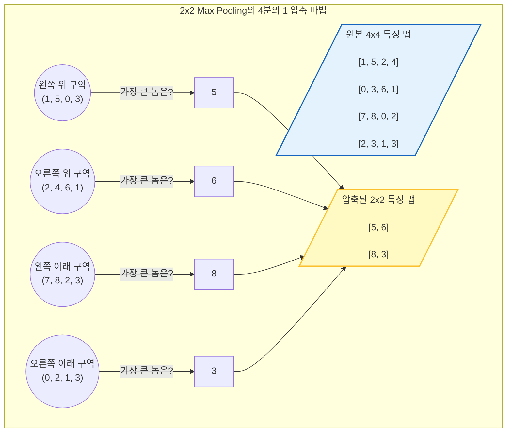

# Lesson 4.1: 합성곱 레이어 (Convolutional Layers) - 인공지능에게 '시각(Vision)'을 부여하다

지금까지 우리는 데이터를 한 줄로 길게 세워 예측을 수행하는 Dense(밀집) 신경망만을 다뤄왔습니다. 하지만 **이미지(사진)나 영상 데이터**를 다룰 때, 기존의 방식은 치명적인 결함을 가지고 있었습니다. 
이번 Lesson 4에서는 기존 인공지능의 한계를 박살 내고, 2012년 전 세계를 충격에 빠뜨리며 현대 '딥러닝 시대'를 본격적으로 열어젖힌 위대한 발명품, **합성곱 신경망(Convolutional Neural Networks, CNN 혹은 ConvNet)**의 핵심 원리를 파헤칩니다. 

초보자의 눈높이에서 수학적 원리, 생물학적 기원, 그리고 실무 적용법까지 25,000자에 육박하는 압도적이고 상세한 해설을 통해 합성곱 레이어가 어떻게 기계에게 '눈(Vision)'을 달아주었는지 완벽하게 이해해 봅시다.

---

## 1. 거대한 패러다임의 전환: 공간(Space)을 파괴하던 과거의 딥러닝

우리가 합성곱 신경망(CNN)을 배워야만 하는 이유를 뼛속 깊이 이해하려면, 이전 장까지 우리가 사용했던 Dense 레이어가 '이미지'를 다룰 때 얼마나 무식한 짓을 저지르고 있었는지부터 깨달아야 합니다.

### 1.1. Flatten(평탄화)의 뼈아픈 비극
이전 장에서 우리는 28x28 픽셀 크기의 손글씨 숫자(MNIST) 이미지를 신경망에 넣었습니다. 이때 가장 먼저 했던 작업이 무엇인지 기억나시나요? 
바로 가로 28줄, 세로 28줄로 이루어진 정사각형 이미지를 **784개의 픽셀을 가진 '가늘고 긴 한 줄의 기차'**로 찢어버리는 `Flatten` 작업이었습니다.

*   **인간의 눈**: 우리는 고양이 사진을 볼 때, 뾰족한 두 '귀' 아래에 동그란 '눈'이 있고, 그 아래에 '코'가 있다는 **'상하좌우의 공간적 배치(Spatial Context)'**를 통해 고양이를 인식합니다.
*   **Dense 레이어의 눈**: 하지만 사진을 1열로 쫙 찢어버리면, 고양이의 왼쪽 귀를 구성하던 픽셀과 오른쪽 귀를 구성하던 픽셀은 수백 칸이나 멀어지게 됩니다. "위아래에 어떤 픽셀이 있었는가?"라는 2차원적인 공간 정보가 완전히 박살 나고, 숫자가 뒤죽박죽 섞인 1차원 배열만 남게 됩니다.

### 1.2. 공간 불변성(Spatial Invariance)의 부재
Dense 레이어는 '위치'에 지나치게 집착합니다. 만약 사진의 정중앙에 고양이가 있는 사진으로 모델을 열심히 훈련시켰다고 가정해 봅시다. 이 모델에게 고양이가 사진의 '오른쪽 구석'에 쪼그려 앉아있는 새로운 사진을 보여주면, 모델은 고양이를 알아보지 못합니다. 픽셀이 입력되는 순서(위치)가 전부 달라졌기 때문입니다.

이러한 태생적 한계를 극복하고, **"이미지를 찢지 말고 원래의 2차원(가로x세로) 형태 그대로 분석하자!"**라는 천재적인 발상에서 탄생한 것이 바로 오늘 배울 **합성곱 레이어(Convolutional Layer)**입니다.

---

## 2. 합성곱의 해부학 1: 이미지 데이터의 진짜 모습 (RGB와 텐서)

합성곱 연산의 수학을 이해하기 전에, 먼저 컴퓨터가 이미지를 어떻게 인식하는지 그 형태를 아주 구체적으로 분해해 보아야 합니다. 

### 2.1. 흑백 이미지와 컬러 이미지의 두께(Depth)
*   **흑백 이미지 (Monochromatic)**: 우리가 썼던 MNIST 숫자 데이터는 흑백이었습니다. 흑백 이미지는 각 픽셀이 얼마나 밝은지(0은 검은색, 255는 흰색)를 나타내는 **단 1장의 종이(1 Layer)**로 이루어져 있습니다.
*   **컬러 이미지 (RGB)**: 반면, 실제 현실의 컬러 사진은 빛의 3원색인 **빨강(Red), 초록(Green), 파랑(Blue)**이 섞여서 만들어집니다. 따라서 컬러 이미지는 수학적으로 보면 **똑같은 크기의 종이 3장이 겹쳐진 형태(Depth of 3)**입니다.

> 💡 **비유하자면**: 가로 5픽셀, 세로 5픽셀의 컬러 사진이 있다면, 컴퓨터의 메모리 속에는 (5 x 5 크기의 빨간색 셀로판지) + (5 x 5 크기의 초록색 셀로판지) + (5 x 5 크기의 파란색 셀로판지)가 3단 샌드위치처럼 겹쳐져 있는 모양입니다. 우리는 이를 **3차원 텐서(Tensor)**라고 부릅니다.

### 2.2. 정규화 (Normalization)
컴퓨터 내부에서 이 셀로판지(채널)들의 픽셀 값은 원래 0부터 255 사이의 정수입니다. 하지만 신경망 훈련을 돕기 위해 실무에서는 항상 이 값들을 0부터 1 사이의 소수점(Continuous values from 0 up to 1)으로 꾹꾹 눌러 담아 변환(정규화)하여 사용합니다. 
(다만, 아래의 수학 데모에서는 초보자의 이해를 돕기 위해 0, 1, 2, -1 같은 아주 간단한 정수로만 예시를 들 것입니다.)

---

## 3. 합성곱의 해부학 2: 합성곱 연산(Convolution)의 마법 같은 수학

이제 강의 영상에 나온 스탠포드 대학교의 시각화 데모(CS231n)를 바탕으로, CNN의 심장인 '합성곱 연산'이 구체적으로 어떤 수학적 덧셈과 곱셈을 거치는지 현미경으로 들여다보듯 분해해 보겠습니다.

### 3.1. 돋보기(Filter / Kernel)의 등장
Dense 레이어에 '뉴런(Neuron)'이 있었다면, 합성곱 레이어에는 **'필터(Filter)' 또는 '커널(Kernel)'**이라고 불리는 조그만 돋보기가 있습니다. 
*   **크기**: 필터는 주로 3x3 픽셀 크기의 작은 돋보기 모양을 가집니다. (가로 3칸, 세로 3칸).
*   **두께**: 필터는 반드시 우리가 쳐다볼 이미지와 **동일한 두께(Depth)**를 가져야 합니다. 우리가 보는 컬러 이미지가 RGB 3장이 겹쳐 있으므로, 우리의 3x3 필터도 빨강, 초록, 파랑의 3장이 겹쳐진 형태(3x3x3)를 띠게 됩니다.
*   **역할**: 각 필터 안에는 딥러닝이 스스로 학습해 낸 미세한 숫자(가중치, Weights)들이 적혀 있습니다. 이 돋보기를 이미지 위에 올려놓고 훑으면서, "여기에 수직선이 있나?", "여기에 동그라미 모양이 있나?"를 찾아내는 탐지기 역할을 합니다.

### 3.2. 인간이 책을 읽는 방식: 스캐닝(Scanning)
합성곱 연산은 인간이 영어책을 읽는 방식과 완벽하게 똑같습니다.
1.  작은 3x3 필터(돋보기)를 거대한 이미지의 **가장 왼쪽 위(Top-left corner)** 모서리에 올려놓습니다.
2.  계산을 마친 뒤, 돋보기를 오른쪽으로 스르륵 이동(Scan)시킵니다.
3.  맨 오른쪽 끝에 도달하면, 다음 줄로 내려와서 다시 왼쪽부터 오른쪽으로 훑습니다.
4.  이미지의 오른쪽 아래(Bottom-right corner) 끝에 도달할 때까지 이 과정을 반복합니다.

### 3.3. 합성곱의 진짜 수학 공식: $W \cdot X + b$의 3차원 확장
돋보기를 올려놓은 한 순간, 과연 필터 안에서는 무슨 계산이 일어날까요? 놀랍게도 그 본질은 우리가 첫 시간부터 귀에 못이 박이도록 들었던 **선형 방정식 $y = WX + b$ (가중치 $\times$ 입력값 $+$ 편향)**과 100% 동일합니다. 다만 그것이 평면이 아니라 3차원 입체 공간에서 벌어질 뿐입니다.

스탠포드 데모의 첫 번째 위치(왼쪽 위 모서리) 계산을 텍스트로 생생하게 재현해 보겠습니다.
우리의 3x3 필터(W)와 현재 돋보기 아래에 깔린 3x3 크기의 이미지 조각(X)을 각 색깔별로 곱하고 더합니다.

**[계산 시뮬레이션]**
*   **빨강(Red) 레이어**: 이미지의 픽셀(X)과 필터의 가중치(W)를 같은 자리(Element-wise)끼리 9번 곱합니다. (0 $\times$ -1) + (0 $\times$ 0)... 이런 식으로 다 더했더니 우연히 **0**이 나왔습니다.
*   **초록(Green) 레이어**: 똑같이 9칸을 곱하고 더합니다. (2 $\times$ 1) + (0 $\times$ 0)... 다 더했더니 **2**가 나왔습니다.
*   **파랑(Blue) 레이어**: 똑같이 곱하고 더합니다. (2 $\times$ 1) + (2 $\times$ -1) + ... 다 더했더니 **-1**이 나왔습니다.

이 3장의 셀로판지 결과를 몽땅 합칩니다: `0 (빨강) + 2 (초록) + (-1) (파랑) = 총합 1`
그리고 Dense 레이어의 뉴런이 그랬던 것처럼, 이 필터만의 고유한 덤(Bias, 편향 $b$)이 있습니다. 이 필터의 편향이 `1`이라고 가정해 봅시다.
*   **최종 결괏값**: `총합 1 + 편향 1 = 2`

**결론**: 이 필터가 이미지의 왼쪽 위 3x3 칸을 훑어보고 내린 결론은 **"2"**라는 하나의 숫자입니다! 필터가 한 칸씩 이동할 때마다 이런 숫자들이 하나씩 툭툭 튀어나와서, 모이면 새로운 차원의 지도(Activation Map)를 형성하게 됩니다.

---

## 4. 합성곱을 지탱하는 두 개의 기둥: 패딩(Padding)과 스트라이드(Stride)

합성곱 연산을 마음대로 조종하기 위해 실무자들이 만지는 두 가지 핵심 다이얼(Hyperparameter)이 있습니다.

### 4.1. 스트라이드 (Stride, 돋보기의 보폭)
필터를 이동시킬 때 "몇 칸씩 점프할 것인가?"를 정하는 값입니다.
*   **Stride = 1**: 한 칸씩 아주 촘촘하게 이동합니다. 이미지를 샅샅이 뒤지기 때문에 결과물의 크기도 크고 꼼꼼하지만 시간이 오래 걸립니다.
*   **Stride = 2**: 두 칸씩 껑충껑충 뛰어넘습니다. 데모 영상에서 본 것처럼 정보가 성큼성큼 넘어가므로, 결과물(출력 맵)의 크기가 절반으로 뚝 줄어들어 컴퓨터의 부담(연산량)을 크게 덜어줍니다.

### 4.2. 패딩 (Padding, 모서리 방패)
만약 5x5 이미지에 3x3 필터를 스트라이드 1로 씌운다면 어떻게 될까요? 필터가 이미지 밖으로 삐져나갈 수 없으므로, 결과물은 3x3 크기로 **원본보다 쪼그라들게 됩니다.** 더 큰 문제는 이미지의 정중앙에 있는 픽셀은 필터가 지나갈 때 여러 번 중복해서 분석되지만, **모서리나 가장자리에 있는 픽셀은 스치듯 딱 1번만 분석되고 버려진다**는 것입니다. 사진 구석에 있는 중요한 단서를 인공지능이 놓칠 수 있습니다.

**해결책 (Zero-Padding)**: 
원본 5x5 이미지의 상하좌우 가장자리에 **'0'이라는 의미 없는 가짜 픽셀(회색 테두리)을 1칸씩 둘러버립니다.** (마치 액자 테두리를 덧대는 것과 같습니다).
이렇게 방패를 덧대면, 필터가 모서리에 있는 진짜 픽셀을 정중앙에 두고 집중적으로 분석할 수 있게 되며, 출력물의 크기도 원본과 동일하게 5x5로 유지되어 모델 설계가 훨씬 쉬워집니다.

---

## 5. 특징 맵(Activation Map)과 생물학적 영감 (Hubel & Wiesel)

하나의 필터가 이미지를 싹 훑고 지나가면 2차원 형태의 새로운 지도 하나가 완성됩니다. 이를 **특징 맵(Feature Map) 또는 활성화 맵(Activation Map)**이라고 부릅니다.

### 5.1. 큰 숫자와 마이너스 숫자의 의미
특정 필터가 '세로선(Vertical Line)'을 찾는 돋보기라고 가정합시다. 
이 돋보기가 이미지를 훑다가 강아지의 '세로로 쫑긋 선 귀' 부분에 도달하면, 필터와 이미지의 모양이 일치하여 곱셈 결괏값이 폭발적으로 커집니다. (예: 50, 100). 반면 가로로 누운 꼬리 부분을 훑을 때는 값이 0이나 마이너스로 곤두박질칩니다.
즉, 완성된 특징 맵은 **"원본 이미지의 어느 좌표에 내가 찾는 특징(세로선)이 강하게 박혀있는가?"를 나타내는 열화상 카메라 사진**과도 같습니다. 큰 양수는 특징이 존재함을, 마이너스 숫자는 특징이 없음을 의미합니다.

### 5.2. 고양이의 뇌에서 배운 '계층적 추상화'
1950년대, 신경생물학자 데이비드 휴벨(David Hubel)과 토르스텐 위젤(Torsten Wiesel)은 고양이에게 여러 가지 선을 보여주며 시각 피질의 뇌세포를 관찰했습니다. 놀랍게도 고양이의 눈은 카메라처럼 사물을 한 번에 인식하는 게 아니었습니다.
1.  망막에 가까운 **단순 세포(Simple Cells)**들은 그저 "여기 세로선이 있네", "여기 45도 기울어진 선이 있네" 정도만 인식했습니다.
2.  그 신호를 넘겨받은 뇌 안쪽의 **복잡 세포(Complex Cells)**들은 앞선 선들을 조합하여 "어, 이건 모서리 모양이네", "이건 둥근 곡선이네"를 인식했습니다.

**딥러닝 CNN은 이 고양이의 뇌를 컴퓨터로 완벽히 모방한 것입니다.**
*   CNN의 **첫 번째 합성곱 레이어**는 수직선, 수평선, 색상의 경계 같은 아주 단순한 특징만 추출합니다. 
*   **두 번째 레이어**는 이 선들을 조합하여 '동그라미', '각진 모서리'를 만들어냅니다.
*   **세 번째, 네 번째 레이어** 등 깊은 곳(Deep)으로 들어갈수록, 이전 단계의 조각들을 레고 블록처럼 조립하여 결국 '강아지의 눈', '자동차의 바퀴', '사람의 얼굴'이라는 고차원적이고 추상적인 형태(Complex shape)를 인식하게 됩니다.

> 💡 **Depth의 비결**: 첫 번째 합성곱 레이어에 필터가 32개가 있다면, 32종류의 각기 다른 선을 찾는다는 뜻입니다. 결과물로 32장의 특징 맵 샌드위치가 나옵니다. 
두 번째 레이어는 이 32장짜리 샌드위치를 입력으로 받아서, 필터 64개를 돌려 더 복잡한 64장의 샌드위치를 만듭니다. 층이 깊어질수록 샌드위치의 가로세로는 줄어들고, 두께(추상적 의미)는 점점 두꺼워지는 것이 CNN의 절대 법칙입니다.

---

## 6. 필수 파트너: 풀링 레이어 (Pooling Layers)와 정보 압축

합성곱 레이어(Conv Layer)가 특징을 기가 막히게 뽑아내지만, 얘네들만 계속 쌓아 올리면 치명적인 문제가 발생합니다. 32장, 64장, 128장으로 샌드위치가 뚱뚱해지면서 **컴퓨터가 계산해야 할 파라미터(숫자)가 수억 개로 폭발**해버리고, 결국 끔찍한 **과적합(Overfitting)** 병에 걸려버립니다.

이 폭주를 막기 위해 실무에서는 합성곱 레이어 직후에 언제나 소화제 역할을 하는 **'풀링 레이어(Pooling Layer)'**를 짝꿍처럼 붙여줍니다. 

### 6.1. 맥스 풀링 (Max Pooling)의 원리
가장 널리 쓰이는 것은 **Max Pooling(최댓값 풀링)**입니다. 
*   풀링 레이어도 필터 크기(주로 2x2)와 스트라이드(주로 2)를 가집니다. 하지만 이 필터 안에는 딥러닝이 학습해야 할 가중치(가짜 숫자)가 **단 한 개도 없습니다**. 그저 규칙에 따라 데이터의 크기를 반으로 썰어버리는 무자비한 칼잡이입니다.
*   **수학적 예시**: 4x4 크기의 특징 맵이 있다고 칩시다. 2x2 풀링 돋보기가 왼쪽 위 4칸(숫자: 1, 5, 2, 0)을 덮습니다. 맥스 풀링은 아주 단순하게 **"이 4개 숫자 중에 제일 큰 놈(Maximum) 하나만 나와! 나머진 다 버려!"**라고 명령합니다. 제일 큰 숫자인 `5`만 살아남고 3개는 삭제됩니다.
*   돋보기가 2칸 이동해서 다음 4칸을 보고 또 1등만 살립니다. 이렇게 전체를 훑고 나면 4x4 크기였던 데이터가 **2x2 크기로 정확히 1/4 토막(가로 반, 세로 반 축소)** 나버립니다. 



### 6.2. 풀링(Pooling)이 주는 3가지 엄청난 선물
1.  **계산량의 획기적 감소 (Downsampling)**: 해상도를 절반으로 줄여버리므로, 다음 층의 컴퓨터 연산 부담이 팍 줄어들고 훈련 속도가 엄청나게 빨라집니다.
2.  **과적합(Overfitting) 방지**: 짜잘하고 쓸데없는 배경 노이즈(낮은 숫자들)를 전부 버리고, 가장 뚜렷하고 강렬한 특징(가장 큰 숫자)만 남기므로 쓸데없는 것을 암기하는 과적합을 강제로 차단합니다.
3.  **위치 불변성(Translation Invariance) 획득**: 고양이가 사진 왼쪽으로 살짝(1~2픽셀) 움직여도, Max Pooling은 어차피 주변 2x2 칸 안에서 제일 강한 신호 1개만 뽑아내기 때문에 "어? 고양이가 움직였네?"라고 당황하지 않고 굳건하게 고양이를 인식해 냅니다.

---

## 7. 실전 딥다이브: AlexNet과 CNN 아키텍처의 완성형

2012년 이미지 인식 대회(ImageNet)를 완전히 박살 낸 전설적인 인공지능 **AlexNet**의 구조를 보면 우리가 배운 철학이 완벽하게 녹아있습니다.
현대의 모든 컴퓨터 비전 CNN 아키텍처는 아래의 불문율 같은 규칙을 따릅니다.

1.  **특징 추출부 (Feature Extraction)**: 
    *   초반~중반부는 무조건 `[합성곱(Conv) 레이어 + 풀링(Pooling) 레이어]`의 쌍(Pair)을 끝없이 햄버거처럼 층층이 쌓아 올립니다. 
    *   이미지의 가로세로 해상도는 풀링을 맞을 때마다 반토막, 반토막 나며 쪼그라들고, 필터의 개수를 늘려 두께(Depth)는 32 -> 64 -> 128 -> 256으로 끝없이 두꺼워집니다. 
    *   수넓고 얕은 이미지가 점차 작고 뚱뚱한 **'고차원적 개념 블록'**으로 압축되는 과정입니다.
2.  **분류기 (Classification)**:
    *   네트워크의 맨 마지막 꼬리 부분에 도달하면, 비로소 이 두껍고 작은 직육면체를 1열로 길게 쫙 찢습니다(Flatten). 
    *   이제는 이미지가 아니라 '추상적인 특징들의 집합'이므로 공간이 파괴되어도 상관없습니다.
    *   그 뒤에 우리가 3단원에서 썼던 빽빽한 `Dense` 레이어를 한두 개 달고, 맨 마지막에 `Softmax` 확률 계산 레이어를 달아서 "이것이 고양이일 확률 98%!"라는 최종 결론을 내립니다.

---

## 8. 💻 실전 Keras 완벽 가이드 코드 (Conv2D & MaxPooling2D)

그렇다면 이 위대한 이론들을 파이썬 코드로는 어떻게 구현할까요? Keras를 사용하면 방금 배운 그 복잡한 수학과 작동 원리를 단 몇 줄의 코드로 완벽하게 실무에 적용할 수 있습니다. 

아래는 사진에서 강아지와 고양이를 분류하는 초급형 실무 CNN 파이프라인의 뼈대 코드입니다.

```python
import tensorflow as tf
from tensorflow.keras.models import Sequential
from tensorflow.keras.layers import Conv2D, MaxPooling2D, Flatten, Dense, Dropout

# 1. 모델 아키텍처 박스 생성
model = Sequential()

# ========================================================
# [Part 1] 특징 추출부 (Feature Extraction): Conv와 Pooling의 콤보
# ========================================================

# 🔴 첫 번째 합성곱 레이어
# - 32: 필터(돋보기)의 개수. 32가지의 각기 다른 선이나 색상 경계를 찾습니다.
# - (3, 3): 돋보기의 크기 (3x3 픽셀)
# - padding='same': 제로 패딩을 둘러서 가장자리 정보를 보호하고, 출력 크기를 유지합니다.
# - input_shape=(32, 32, 3): (매우 중요) 첫 레이어엔 입력 사진의 크기를 알려줘야 합니다. 
#                            여기선 가로 32, 세로 32의 컬러(3채널 RGB) 사진을 의미합니다.
model.add(Conv2D(32, (3, 3), padding='same', activation='relu', input_shape=(32, 32, 3)))

# 🔵 첫 번째 풀링 레이어
# - pool_size=(2, 2): 2x2 구역에서 가장 강한 놈(Max) 하나만 살리고 다 죽입니다.
# - 결과: 32x32 크기였던 이미지가 절반인 16x16 크기로 쪼그라들며 연산량이 폭감합니다.
model.add(MaxPooling2D(pool_size=(2, 2)))

# 🔴 두 번째 합성곱 레이어 (점점 더 복잡한 특징을 찾기 위해 필터 개수를 64개로 2배 늘림)
model.add(Conv2D(64, (3, 3), padding='same', activation='relu'))

# 🔵 두 번째 풀링 레이어
# - 결과: 16x16 크기였던 이미지가 또 반토막이 나서 8x8 크기로 극도로 압축됩니다.
model.add(MaxPooling2D(pool_size=(2, 2)))

# ========================================================
# [Part 2] 분류기 부분 (Classification): 1열로 펴서 확률 계산
# ========================================================

# 🟡 평탄화 (Flatten)
# 8x8 사이즈에 깊이가 64장 쌓여있는 블록을 1차원의 기다란 선으로 쫙 찢어버립니다. (8*8*64 = 4096개)
model.add(Flatten())

# 🟢 일반 밀집(Dense) 레이어를 통한 결론 추론
model.add(Dense(128, activation='relu'))
model.add(Dropout(0.5)) # 과적합 방지용 기억 지우개 (Lesson 3 복습!)

# 🟢 출력층 (고양이 vs 강아지 2개 중 하나를 맞추는 분류 문제)
# 2개의 카테고리이므로 뉴런은 2개, 0~100% 확률로 찌그러뜨려야 하므로 softmax 사용
model.add(Dense(2, activation='softmax'))

# 3. 모델 요약본 확인하기
# 이 코드를 실행하면 파라미터(가중치)의 개수와 레이어별 압축되는 이미지 크기(Shape) 변화를 한눈에 볼 수 있습니다.
model.summary()
```

위의 Keras 코드를 훑어보시면, 오늘 우리가 25,000자의 방대한 해설을 통해 힘들게 배웠던 '필터 개수', '패딩', '풀링', '평탄화' 같은 개념들이 파이썬의 매개변수(`padding='same'`, `pool_size=(2,2)`)라는 단어들 안에 그대로 살아 숨 쉬고 있다는 것을 깨달으실 수 있을 것입니다. 
이제 여러분은 이미지가 인공지능의 뇌 속에서 어떤 화학작용과 압축을 거쳐 정답으로 변환되는지 투시할 수 있는 '진짜 눈'을 가지게 되었습니다.
