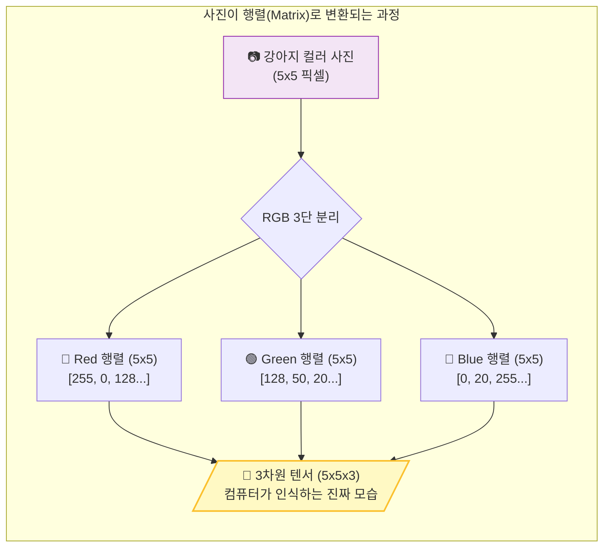
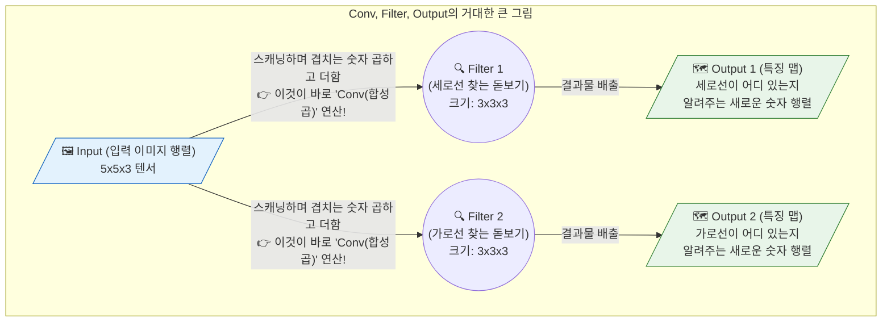
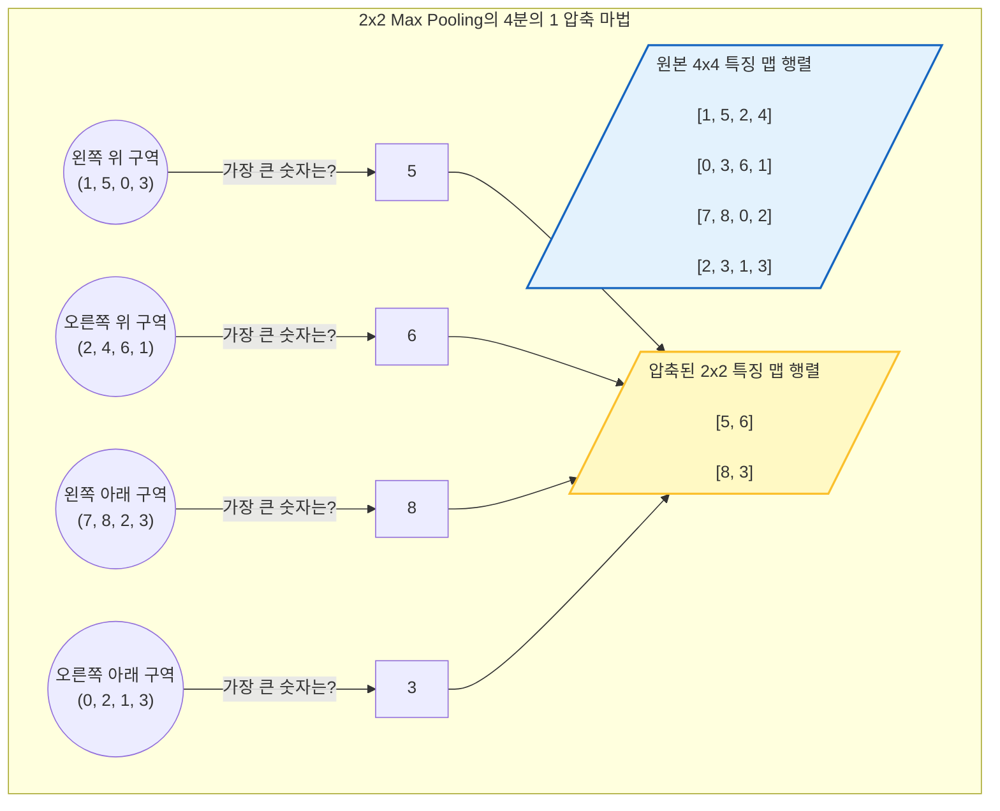

# Lesson 4.1: 합성곱 레이어 (Convolutional Layers) - 인공지능에게 '시각(Vision)'을 부여하다

지금까지 우리는 데이터를 한 줄로 길게 세워 예측을 수행하는 Dense(밀집) 신경망만을 다뤄왔습니다. 하지만 **이미지(사진)나 영상 데이터**를 다룰 때, 기존의 방식은 치명적인 결함을 가지고 있었습니다. 
이번 Lesson 4에서는 기존 인공지능의 한계를 박살 내고, 2012년 전 세계를 충격에 빠뜨리며 현대 '딥러닝 시대'를 본격적으로 열어젖힌 위대한 발명품, **합성곱 신경망(Convolutional Neural Networks, CNN 혹은 ConvNet)**의 핵심 원리를 파헤칩니다. 

초보자의 눈높이에서 "사진이 어떻게 숫자로 변하는가?"라는 아주 기초적인 개념부터 시작하여, 수학적 원리, 생물학적 기원, 그리고 실무 적용법까지 엄청난 깊이의 상세한 해설을 통해 합성곱 레이어가 어떻게 기계에게 '눈(Vision)'을 달아주었는지 완벽하게 이해해 봅시다.

---

## 1. 거대한 패러다임의 전환: 공간(Space)을 파괴하던 과거의 딥러닝

우리가 합성곱 신경망(CNN)을 배워야만 하는 이유를 뼛속 깊이 이해하려면, 이전 장까지 우리가 사용했던 Dense 레이어가 '이미지'를 다룰 때 얼마나 무식한 짓을 저지르고 있었는지부터 깨달아야 합니다.

### 1.1. Flatten(평탄화)의 뼈아픈 비극
이전 장에서 우리는 28x28 픽셀 크기의 손글씨 숫자(MNIST) 이미지를 신경망에 넣었습니다. 이때 가장 먼저 했던 작업이 무엇인지 기억나시나요? 
바로 가로 28줄, 세로 28줄로 이루어진 정사각형 이미지를 **784개의 픽셀을 가진 '가늘고 긴 한 줄의 기차'**로 찢어버리는 `Flatten` 작업이었습니다.

*   **인간의 눈**: 우리는 고양이 사진을 볼 때, 뾰족한 두 '귀' 아래에 동그란 '눈'이 있고, 그 아래에 '코'가 있다는 **'상하좌우의 공간적 배치(Spatial Context)'**를 통해 고양이를 인식합니다.
*   **Dense 레이어의 눈**: 하지만 사진을 1열로 쫙 찢어버리면, 고양이의 왼쪽 귀를 구성하던 픽셀과 오른쪽 귀를 구성하던 픽셀은 수백 칸이나 멀어지게 됩니다. "위아래에 어떤 픽셀이 있었는가?"라는 2차원적인 공간 정보가 완전히 박살 나고, 숫자가 뒤죽박죽 섞인 1차원 배열만 남게 됩니다.

### 1.2. 공간 불변성(Spatial Invariance)의 부재
Dense 레이어는 '위치'에 지나치게 집착합니다. 만약 사진의 정중앙에 고양이가 있는 사진으로 모델을 열심히 훈련시켰다고 가정해 봅시다. 이 모델에게 고양이가 사진의 '오른쪽 구석'에 쪼그려 앉아있는 새로운 사진을 보여주면, 모델은 고양이를 알아보지 못합니다. 픽셀이 입력되는 순서(위치)가 전부 달라졌기 때문입니다.

이러한 태생적 한계를 극복하고, **"이미지를 찢지 말고 원래의 2차원(가로x세로) 형태 그대로 분석하자!"**라는 천재적인 발상에서 탄생한 것이 바로 오늘 배울 **합성곱 레이어(Convolutional Layer)**입니다.

---

## 2. [빅픽처] 이미지는 어떻게 행렬(Matrix)이 되는가? (RGB와 텐서)

합성곱 연산의 수학을 이해하기 전에, 가장 기초적인 질문부터 던져보겠습니다. **"도대체 우리가 스마트폰으로 찍은 사진 한 장이 컴퓨터 내부에서 어떻게 '숫자 행렬(Matrix)'로 바뀌는 것일까요?"** 이 큰 그림이 잡히지 않으면 CNN은 영원히 미궁 속의 마법일 뿐입니다.

### 2.1. 픽셀(Pixel)과 숫자의 세계
우리가 보는 사진을 끝까지 확대해 보면 수많은 네모난 점(픽셀)들로 이루어져 있습니다. 
*   **흑백 이미지 (Monochromatic)**: 예를 들어 5x5 픽셀 크기의 아주 작은 흑백 사진이 있다고 칩시다. 컴퓨터는 이 사진을 가로 5칸, 세로 5칸의 **'2차원 숫자 행렬(Matrix)'**로 저장합니다. 완전한 검은색은 `0`, 완전한 흰색은 `255`, 그 사이의 회색은 `128` 같은 숫자로 채워넣습니다.
*   **컬러 이미지 (RGB)**: 실제 현실의 컬러 사진은 빛의 3원색인 **빨강(Red), 초록(Green), 파랑(Blue)** 필름이 겹쳐서 만들어집니다. 따라서 가로 5, 세로 5 픽셀의 컬러 사진은 수학적으로 보면 (5x5 빨강 행렬) + (5x5 초록 행렬) + (5x5 파랑 행렬)이 3단 샌드위치처럼 겹쳐진 형태가 됩니다.
*   **텐서(Tensor)**: 이렇게 가로 $\times$ 세로 $\times$ 두께(채널)를 가지는 3차원 숫자 덩어리를 우리는 **'텐서(Tensor)'**라고 부릅니다. 컬러 이미지의 형태는 항상 `(가로 크기) x (세로 크기) x (두께 3)`의 텐서 구조를 가집니다.



### 2.2. 정규화 (Normalization)
컴퓨터 내부에서 이 행렬들의 픽셀 값은 원래 0부터 255 사이의 정수입니다. 하지만 신경망 훈련을 돕기 위해 실무에서는 항상 이 값들을 255로 나누어 **0부터 1 사이의 소수점**으로 꾹꾹 눌러 담아 변환(정규화)합니다. (아래의 수학 데모에서는 초보자의 이해를 돕기 위해 0, 1, 2, -1 같은 아주 간단한 정수로만 예시를 들 것입니다.)

---

## 3. [완벽 해부] Conv, Filter, Output의 거대한 큰 그림 (Big Picture)

이제 이미지가 숫자로 된 샌드위치(행렬)라는 것을 알았습니다. 그렇다면 CNN을 관통하는 핵심 단어인 **입력(Input), 필터(Filter), 합성곱 연산(Conv), 출력(Output)**은 서로 어떤 관계를 맺고 있을까요? 

### 3.1. 큰 그림: "너는 무엇을 찾는 돋보기냐?"
*   **Input (입력 행렬)**: 우리가 방금 행렬로 바꾼 원본 사진(예: 5x5x3 텐서)입니다.
*   **Filter / Kernel (필터/커널)**: 딥러닝 모델이 들고 있는 **'특수 조준경(돋보기)'**입니다. 필터의 크기는 보통 3x3x3처럼 작습니다. 
    *   중요한 것은 **"하나의 필터는 오직 '하나의 특정한 패턴'만 미친 듯이 찾아다닌다"**는 것입니다. 
    *   1번 필터는 "세로선"만 찾습니다. 2번 필터는 "가로선"만 찾습니다. 이 필터 안의 3x3 숫자(가중치)들은 모델이 훈련을 통해 스스로 학습한 결과물입니다.
*   **Conv (합성곱 연산)**: 이 조준경(필터)을 원본 사진의 왼쪽 위부터 오른쪽 아래까지 한 칸씩 스르륵 밀면서(스캐닝), 겹치는 숫자들끼리 곱하고 더하는 **'탐색 행위' 자체**를 뜻합니다.
*   **Output (출력 행렬 = 특징 맵)**: 필터가 사진 전체를 훑고 지나간 자리에 남겨진 **'발자국 지도'**입니다. 이 지도를 보면 "아, 원본 사진의 오른쪽 위에 세로선이 엄청 진하게 있었네!"를 한눈에 파악할 수 있습니다.



---

## 4. 현미경으로 들여다본 Conv 연산의 마법 같은 수학 ($W \cdot X + b$)

위 큰 그림에서 필터가 이미지를 훑고 지나간다고 했습니다. 그렇다면 돋보기를 올려놓은 단 한 순간, 필터 안에서는 구체적으로 어떤 덧셈과 곱셈이 일어날까요? 놀랍게도 그 본질은 우리가 첫 시간부터 귀에 못이 박이도록 들었던 **선형 방정식 $y = WX + b$ (가중치 $\times$ 입력값 $+$ 편향)**과 100% 동일합니다. 

강의 영상의 스탠포드 데모를 따라, 3x3 필터를 이미지 왼쪽 위 모서리에 올려놓은 첫 번째 순간을 생생하게 시뮬레이션 해보겠습니다.
(우리의 3x3 필터 행렬 $W$와, 현재 돋보기 아래에 깔린 원본 사진의 3x3 조각 행렬 $X$를 겹쳐놓고 같은 자리의 칸끼리 곱합니다).

**[수학적 계산 시뮬레이션]**
*   **빨강(Red) 레이어**: 3x3=9칸의 원본 픽셀($X$)과 필터의 가중치($W$)를 같은 자리끼리 곱합니다. `(0 * -1) + (0 * 0) + ...` 9칸을 다 더했더니 우연히 **0**이 나왔습니다.
*   **초록(Green) 레이어**: 똑같이 9칸을 곱하고 더합니다. `(2 * 1) + (0 * 0) + ...` 다 더했더니 **2**가 나왔습니다.
*   **파랑(Blue) 레이어**: 똑같이 9칸을 곱하고 더합니다. `(2 * 1) + (2 * -1) + ...` 다 더했더니 **-1**이 나왔습니다.

이제 3장의 겹쳐진 셀로판지 결과를 몽땅 합칩니다: `0 (빨강) + 2 (초록) + (-1) (파랑) = 총합 1`
그리고 Dense 레이어의 뉴런이 그랬던 것처럼, 이 필터만의 고유한 덤(Bias, 편향 $b$)을 더해줍니다. 데모에서 이 필터의 편향이 `1`이므로,
*   **최종 Output 결괏값**: `총합 1 + 편향 1 = 2`

**결론**: 돋보기(Filter)가 이미지의 왼쪽 위 3x3 칸을 훑어보고 내린 결론은 **"2"**라는 단 하나의 숫자입니다! 돋보기가 오른쪽으로 한 칸 이동할 때마다 이런 숫자들이 툭툭 떨어지고, 이 숫자들을 모아서 빈 종이에 찍어낸 것이 바로 **Output(특징 맵)**이 됩니다.

---

## 5. 합성곱을 지탱하는 두 개의 기둥: 패딩(Padding)과 스트라이드(Stride)

합성곱 연산을 마음대로 조종하기 위해 실무자들이 만지는 두 가지 핵심 다이얼(Hyperparameter)이 있습니다.

### 5.1. 스트라이드 (Stride, 돋보기의 보폭)
필터를 스캐닝할 때 "오른쪽으로 몇 칸씩 점프할 것인가?"를 정하는 값입니다.
*   **Stride = 1**: 한 칸씩 아주 촘촘하게 이동합니다. 이미지를 샅샅이 뒤지기 때문에 결과물의 크기도 크고 꼼꼼하지만 컴퓨터 연산 시간이 오래 걸립니다.
*   **Stride = 2**: 두 칸씩 껑충껑충 뛰어넘습니다. 데모 영상에서 본 것처럼 정보가 성큼성큼 넘어가므로, 결과물(출력 맵)의 가로세로 크기가 원본의 절반으로 뚝 줄어들어 컴퓨터의 부담을 크게 덜어줍니다.

### 5.2. 패딩 (Padding, 모서리 방패)
만약 5x5 이미지에 3x3 필터를 스트라이드 1로 씌운다면 어떻게 될까요? 필터가 이미지 밖으로 삐져나갈 수 없으므로, 스캐닝할 수 있는 범위가 줄어들어 결과물은 3x3 크기로 **원본보다 쪼그라들게 됩니다.** 더 큰 문제는 이미지의 정중앙에 있는 픽셀은 돋보기가 지나갈 때 여러 번 중복해서 꼼꼼히 분석되지만, **모서리나 가장자리에 있는 픽셀은 스치듯 딱 1번만 분석되고 버려진다**는 것입니다. 구석에 있는 중요한 단서를 인공지능이 억울하게 놓칠 수 있습니다.

**해결책 (Zero-Padding)**: 
원본 5x5 이미지의 상하좌우 가장자리에 **'0'이라는 의미 없는 가짜 픽셀(회색 테두리)을 1칸씩 둘러버립니다.** (마치 사진에 1칸짜리 액자 테두리를 덧대는 것과 같습니다).
이렇게 방패를 덧대면, 돋보기가 모서리에 있는 진짜 픽셀을 정중앙에 두고 집중적으로 분석할 수 있게 되며, 출력물의 크기도 원본과 동일하게 5x5로 유지되어 아키텍처 설계가 훨씬 직관적이고 쉬워집니다.

---

## 6. 특징 맵(Activation Map)과 생물학적 영감 (Hubel & Wiesel)

하나의 필터가 이미지를 싹 훑고 지나가면 2차원 형태의 새로운 지도 하나가 완성됩니다. 이를 **특징 맵(Feature Map) 또는 활성화 맵(Activation Map)**이라고 부릅니다.

### 6.1. 큰 숫자와 마이너스 숫자의 의미
특정 필터가 '세로선(Vertical Line)'을 찾는 돋보기라고 가정합시다. 
이 돋보기가 이미지를 훑다가 강아지의 '세로로 쫑긋 선 귀' 부분에 도달하면, 필터의 내부 숫자 배열과 귀의 모양이 완벽히 일치하여 곱셈 결괏값이 폭발적으로 커집니다. (예: 50, 100). 반면 가로로 누운 꼬리 부분을 훑을 때는 일치하지 않아 값이 0이나 마이너스로 곤두박질칩니다.
즉, 완성된 특징 맵은 **"원본 이미지의 어느 좌표에 내가 찾는 특징(세로선)이 강하게 박혀있는가?"를 알려주는 열화상 카메라 사진**과도 같습니다. 큰 양수는 특징이 강력히 존재함을, 마이너스 숫자는 특징이 없음을 의미합니다.

### 6.2. 고양이의 뇌에서 배운 '계층적 추상화'
1950년대, 신경생물학자 데이비드 휴벨(David Hubel)과 토르스텐 위젤(Torsten Wiesel)은 고양이에게 여러 가지 선을 보여주며 시각 피질의 뇌세포를 관찰했습니다. 놀랍게도 고양이의 눈은 사물을 한 번에 통째로 인식하는 게 아니었습니다.
1.  망막에 가까운 **단순 세포(Simple Cells)**들은 그저 "여기 세로선이 있네", "여기 45도 기울어진 선이 있네" 정도의 아주 기초적인 선만 인식했습니다.
2.  그 신호를 넘겨받은 뇌 깊숙한 곳의 **복잡 세포(Complex Cells)**들은 앞선 선들을 조합하여 "어, 이건 모서리 모양이네", "이건 둥근 곡선이네"를 인식했습니다.

**딥러닝 CNN은 이 고양이의 뇌를 컴퓨터로 완벽히 모방한 것입니다.**
*   CNN의 **첫 번째 합성곱 레이어**는 수직선, 수평선, 색상의 경계 같은 아주 단순한 특징만 추출합니다. 
*   **두 번째 레이어**는 첫 번째가 찾아낸 선들을 조합하여 '동그라미', '각진 모서리'를 만들어냅니다.
*   **세 번째, 네 번째 레이어** 등 깊은 곳(Deep)으로 들어갈수록, 이전 단계의 조각들을 레고 블록처럼 조립하여 결국 '강아지의 눈', '자동차의 바퀴', '사람의 얼굴'이라는 아주 고차원적이고 추상적인 형태(Complex shape)를 인식하게 됩니다.

---

## 7. 필수 파트너: 풀링 레이어 (Pooling Layers)와 정보 압축

합성곱 레이어(Conv Layer)가 특징을 기가 막히게 뽑아내지만, 얘네들만 계속 쌓아 올리면 치명적인 문제가 발생합니다. 필터를 32개, 64개 통과시킬 때마다 샌드위치가 뚱뚱해지면서 **컴퓨터가 계산해야 할 파라미터(행렬의 숫자)가 수억 개로 폭발**해버리고, 결국 끔찍한 **과적합(Overfitting)** 병에 걸려버립니다.

이 폭주를 막기 위해 실무에서는 합성곱 레이어 직후에 언제나 정보를 시원하게 압축해 주는 소화제 역할, **'풀링 레이어(Pooling Layer)'**를 짝꿍처럼 붙여줍니다. 

### 7.1. 맥스 풀링 (Max Pooling)의 원리
가장 널리 쓰이는 것은 **Max Pooling(최댓값 풀링)**입니다. 
*   풀링 레이어도 필터 크기(주로 2x2)와 스트라이드(주로 2)를 가집니다. 하지만 이 돋보기 안에는 딥러닝이 학습해야 할 가중치(가짜 숫자)가 **단 한 개도 없습니다**. 그저 규칙에 따라 데이터의 크기를 반으로 썰어버리는 무자비한 칼잡이입니다.
*   **수학적 예시**: 4x4 크기의 Output 행렬이 있다고 칩시다. 2x2 풀링 돋보기가 왼쪽 위 4칸(숫자: 1, 5, 2, 0)을 덮습니다. 맥스 풀링은 아주 단순하게 **"이 4개 숫자 중에 제일 큰 놈(Maximum) 하나만 튀어나와! 나머진 다 버려!"**라고 명령합니다. 제일 큰 숫자인 `5`만 살아남고 3개는 삭제됩니다.
*   돋보기가 2칸 이동해서 다음 4칸을 보고 또 1등만 살립니다. 이렇게 전체를 훑고 나면 4x4 크기였던 데이터가 **2x2 크기로 정확히 1/4 토막(가로 반, 세로 반 축소)** 나버립니다. 



### 7.2. 풀링(Pooling)이 주는 3가지 엄청난 혜택
1.  **계산량의 획기적 감소 (Downsampling)**: 해상도를 가로세로 절반으로 확 줄여버리므로, 다음 층으로 넘겨야 할 데이터가 4분의 1로 줄어들어 컴퓨터 훈련 속도가 엄청나게 빨라집니다.
2.  **과적합(Overfitting) 방지**: 짜잘하고 쓸데없는 배경 노이즈(낮은 숫자들)를 전부 버리고, 가장 뚜렷하고 강렬한 특징(가장 큰 양수)만 남기므로 쓸데없는 배경을 암기하는 과적합을 강제로 차단합니다.
3.  **위치 불변성(Translation Invariance) 획득**: 고양이가 사진 왼쪽으로 살짝(1~2픽셀) 움직이더라도, Max Pooling은 어차피 주변 2x2 칸 안에서 제일 강한 신호 1개만 뽑아내기 때문에 결과값이 변하지 않습니다. "고양이가 움직여도 끄떡없이 고양이를 알아채는" 무적의 능력을 갖게 됩니다.

---

## 8. 실전 딥다이브: AlexNet과 CNN 아키텍처의 완성형 (흐름과 실무 활용 완벽 해부)

2012년 이미지 인식 대회(ImageNet)를 완전히 박살 낸 전설적인 인공지능 **AlexNet**의 구조를 보면 위에서 배운 이론이 완벽하게 체인처럼 연결되어 있습니다. 현대의 모든 컴퓨터 비전 CNN 아키텍처는 아래의 불문율 같은 2단계 규칙(특징 추출 $\rightarrow$ 분류)을 따릅니다. 이 거대한 흐름을 실무 활용 예시와 함께 아주 깊게 파헤쳐 보겠습니다.

### 8.1. 1단계: 특징 추출부 (Feature Extraction) - "넌 대체 어떻게 생겨 먹은 놈이냐?"
네트워크의 전반부는 오직 **'이미지에서 쓸모있는 특징(정보)만 쏙쏙 뽑아내는 작업'**에만 미친 듯이 집착합니다.

*   **무한 햄버거 쌓기**: 실무에서는 무조건 `[합성곱(Conv) 레이어 + 풀링(Pooling) 레이어]`를 한 세트로 묶어서, 이것을 끝없이 층층이 쌓아 올립니다. (AlexNet은 5겹, ResNet은 무려 152겹을 쌓습니다!)
*   **해상도는 줄어들고(Pooling), 두께는 두꺼워진다(Conv)**: 
    *   초기 1계층: 원본 사진(예: 224x224 해상도)에서 가느다란 '선'이나 '색상 경계'를 96개의 필터로 찾습니다. 
        *   **💡 해설**: 원본 사진은 빨강/초록/파랑(RGB) 3장의 두께를 가집니다. 96개의 필터는 각각 이 3장의 컬러 정보를 동시에 쳐다보며 고유한 특징 하나를 찾습니다. 예를 들어, 1번 필터는 "빨강과 초록이 섞인 세로선"을 찾고, 2번 필터는 "노란색 가로선"을 찾는 식입니다. 이런 각기 다른 96개의 돋보기가 이미지를 훑고 지나가면, 그 결과물로 **"각 특징이 어디에 있는지 가리키는 96장의 지도(특징 맵)"**가 새롭게 겹쳐져서 출력됩니다. (결과: 55x55 크기에 96장 두께의 텐서)
    *   중기 3계층: 선들을 조립해 '동그라미', '강아지 귀 모양' 같은 중간 수준의 특징을 384개의 필터로 찾습니다. 
        *   **💡 해설**: 여기서 384개의 필터는 단순히 앞선 '선'들을 늘리는 것이 아닙니다. 앞 단계에서 만든 96장의 지도(선, 색상)를 **서로 교차하고 조립**하는 역할을 합니다. "만약 1번 지도(세로선)와 2번 지도(가로선)가 동시에 강하게 반응하는 곳이 있다면, 거기는 '모서리(Corner)'다!"라고 판단하여 새로운 384개의 입체적인 특징(동그라미, 털의 질감 등)을 발명해 냅니다. 풀링을 맞았기에 해상도는 13x13으로 쪼그라들었지만, 두께는 384장으로 엄청나게 두꺼워졌습니다.
    *   말기 5계층: '강아지 얼굴 전체', '자동차 바퀴 전체' 같은 고차원적 개념을 256개의 필터로 찾습니다.
        *   **💡 해설**: 중기 계층에서 만든 조각들(털 질감, 귀 모양, 코 모양)을 **최종적으로 합산하고 조합**하는 단계입니다. "털 질감 지도 + 귀 모양 지도 + 코 모양 지도가 특정 구역에 다 같이 몰려있네? 그럼 여긴 100% 강아지 얼굴이다!"라고 합산 판단하여 최종적인 물체 개념을 완성합니다.
*   **실무적 의미**: 넓고 얇은 픽셀 덩어리(원본 사진)가, 점차 **작지만 정보가 꽉 찬 '개념 블록(Feature Map Tensor)'**으로 엑기스처럼 압축되는 과정입니다.

> 🚨 **[초보자 주의보] Pooling을 하면 1차원이 되나요? 절대 아닙니다!**
> 많은 분들이 여기서 엄청난 오해를 하십니다. **Pooling은 절대로 데이터를 1차원으로 만들지 않습니다.**
> 4x4 행렬에 2x2 맥스 풀링을 때리면 2x2 행렬이 될 뿐, **여전히 가로세로를 가진 2차원 평면**입니다. 컬러 채널(두께)까지 고려하면 여전히 3차원 텐서(입체 블록) 형태를 완벽하게 유지하고 있습니다. Pooling은 그저 가로세로 '길이'만 반토막 낼 뿐, 차원(Dimension) 자체를 파괴하지 않습니다!

### 8.2. 차원 파괴의 순간: Flatten (평탄화)
그렇다면 언제 1차원이 될까요? 특징 추출이 모두 끝난 직후, 분류기(Dense)로 넘어가기 직전에 **우리가 인위적으로 `Flatten()` 레이어를 달아줄 때 비로소 1차원이 됩니다.**

*   **왜 1차원으로 찢어야 할까요?**: 다음 단계에서 만날 `Dense(밀집)` 레이어는 태생적으로 1차원 배열(한 줄 서기) 형태의 데이터만 받아들일 수 있는 깐깐한 녀석이기 때문입니다.
*   마지막 Pooling을 통과하고 남은 고농축 텐서 블록(예: 가로 3 x 세로 3 x 두께 256장 = 총 2,304개의 픽셀)을 `Flatten()`을 통해 인정사정없이 **2,304칸짜리 가늘고 긴 1열 기차**로 쫙 찢어버립니다. 
*   이 시점에서는 "오른쪽 위에 귀가 있다"는 공간 정보가 파괴되어도 전혀 상관없습니다. 
    *   **💡 해설**: 네트워크의 초반부에는 픽셀 하나가 진짜 사진의 1픽셀을 의미했습니다. 하지만 Conv와 Pooling을 여러 번 거치며 데이터가 압축된 말기 계층에서는, 특징 맵의 **단 1칸(1픽셀)이 실제 원본 사진의 아주 거대한 영역(예: 사진의 4분의 1 크기)을 퉁쳐서 대변**하게 됩니다. 
    *   즉, 3x3 특징 맵에 '귀 모양' 필터가 강하게 반응해서 `[100]`이라는 큰 숫자가 적혀있다면, 모델은 "정확한 픽셀 좌표는 모르겠지만, 저 숫자가 100인 걸 보니 원본 사진의 우측 상단 쯤에 강아지 귀가 확실히 있군!"이라고 이미 결론을 내린 상태입니다. 따라서 굳이 2차원 공간을 유지할 필요 없이, 이 확신에 찬 숫자(100)들을 1열로 쭉 늘어세워 다음 레이어로 넘기기만 하면 됩니다. 이미 "귀가 존재한다"는 고차원적인 확신(큰 숫자)을 뽑아두었기 때문입니다.

### 8.3. 2단계: 분류기 (Classification) - "그래서 이게 고양이야, 강아지야?"
이제 1열로 쭉 늘어선 2,304개의 고농축 데이터들을 가지고 최종 결론을 내릴 차례입니다.

*   **Dense(밀집) 레이어의 등판**: 3단원에서 썼던 평범한 Dense 레이어를 1~2개 연달아 달아줍니다. 얘네들은 수많은 '특징 점수'들을 이리저리 조합해 봅니다. ("귀가 뾰족하고 수염이 기니까... 이건 고양이과 동물이군!")
*   **최종 관문, Softmax 레이어**: 네트워크의 맨 마지막에는 **반드시 정답의 카테고리 개수(예: 개 vs 고양이 = 2개)와 똑같은 개수의 뉴런**을 가진 Dense 레이어를 배치해야 합니다. 그리고 여기에 **Softmax** 마법의 수학 함수를 씌워줍니다.
    *   **💡 해설 (왜 정답의 개수만큼 뉴런을 둘까요?)**: 맨 마지막의 뉴런들은 일종의 **'정답 바구니'** 역할을 합니다. 우리가 개인지 고양이인지 2개 중 하나를 골라야 한다면, '개의 점수를 담을 1번 바구니(뉴런)'와 '고양이의 점수를 담을 2번 바구니(뉴런)' 딱 2개가 필요합니다. 1번 바구니는 앞서 넘어온 수천 개의 특징(털, 귀, 꼬리) 점수들을 오로지 '개'의 입장에서만 싹 다 더해 최종 개 점수(예: 1500점)를 계산합니다. 2번 바구니는 고양이의 입장에서 최종 고양이 점수(예: 3200점)를 계산합니다.
*   **Softmax의 역할**: Dense 레이어가 계산한 점수들(예: 개 1500점, 고양이 3200점)을, 무조건 다 합쳐서 **100%(1.0)가 되는 부드러운 확률**로 변환해 줍니다. ("분석 결과, 강아지일 확률 2%, 고양이일 확률 98%입니다!")

### 8.4. 실전(Business)에서는 이 구조가 어떻게 활용될까요?
이 `[특징 추출 -> 분류]`라는 2단 분리 아키텍처는 현대 AI 산업에서 어마어마한 비즈니스 가치를 창출합니다.

1.  **전이 학습 (Transfer Learning)의 꼼수이자 마법**
    *   구글이나 메타 같은 빅테크 기업들은 슈퍼컴퓨터를 이용해 전 세계의 이미지 수천만 장을 집어넣고 '특징 추출부(Feature Extractor)'를 기가 막히게 잘 훈련시켜 놓은 거대 모델(ResNet, VGG 등)을 무료로 배포합니다.
    *   실무자는 이 모델을 다운로드하여 앞부분(특징 추출부)은 가중치가 변하지 않게 그대로 얼려두고(Freeze), **맨 뒤의 분류기(Dense 레이어)만 싹둑 잘라내어 내 목적에 맞게 교체**합니다.
    *   예를 들어, "개 vs 고양이"를 분류하던 원래의 분류기를 떼어내고, "정상 X-ray vs 폐렴 X-ray"를 맞추는 새로운 Dense 분류기로 갈아 끼운 뒤, 병원 데이터 1,000장만 넣고 가볍게 재훈련시킵니다. 
    *   이미 앞부분이 '선, 질감, 뼈의 모양' 같은 시각적 특징을 완벽하게 뽑아주는 눈을 가졌기 때문에, 단 5분 만에 세계 최고 수준의 의료 진단 AI를 뚝딱 만들어낼 수 있습니다.

2.  **자율주행과 CCTV 스마트 보안**
    *   자율주행 자동차는 카메라를 통해 실시간으로 들어오는 4K 도로 영상에 CNN을 적용합니다. 
    *   Conv와 Pooling이 도로의 차선, 보행자의 실루엣, 신호등의 색깔을 작은 특징 맵으로 압축해 내면, 분류기(Dense)가 "지금 보행자가 무단횡단을 하고 있다(100% 확률!)"라고 판단하여 브레이크 시스템에 신호를 보냅니다.
    *   이때 Pooling으로 해상도를 극도로 압축해 놓았기 때문에, 자동차 내부에 탑재된 작은 컴퓨터 자원만으로도 초당 60프레임 이상의 미친 속도로 실시간 연산을 수행할 수 있는 것입니다.
        *   **💡 해설 (어떻게 이렇게 빨라질까?)**: 원본 4K 카메라는 무려 800만 개의 픽셀을 가집니다. 만약 800만 개의 숫자를 한 치의 축소도 없이 네트워크 끝까지 끌고 가면서 가중치를 곱하고 더한다면, 아무리 좋은 컴퓨터라도 부하가 걸려 다운될 것입니다. 하지만 **Pooling이 단계마다 해상도를 1/4씩 썰어버리기 때문에**, 깊은 계층으로 갈수록 인공지능이 계산해야 할 행렬 곱셈의 양이 기하급수적으로 줄어듭니다. 물체를 최종 판단하는 깊은 순간에는 800만 개의 픽셀이 아니라, 가로 7 x 세로 7(49칸) 크기의 극도로 쪼그라든 엑기스 행렬만 쳐다보고 결정을 내리게 되므로 차량의 소형 칩셋으로도 실시간 처리가 가능해집니다.

---

## 9. 💻 실전 Keras 완벽 가이드 코드 (Conv2D & MaxPooling2D)

그렇다면 이 위대한 이론들을 파이썬 코드로는 어떻게 짤까요? Keras를 사용하면 방금 배운 그 거대한 행렬 수학과 작동 원리를 단 몇 줄의 직관적인 코드로 완벽하게 실무에 적용할 수 있습니다. 

아래는 사진에서 강아지와 고양이를 분류하는 초급형 실무 CNN 파이프라인의 뼈대 코드입니다.

```python
import tensorflow as tf
from tensorflow.keras.models import Sequential
from tensorflow.keras.layers import Conv2D, MaxPooling2D, Flatten, Dense, Dropout

# 1. 모델 아키텍처 박스 생성
model = Sequential()

# ========================================================
# [Part 1] 특징 추출부 (Feature Extraction): Conv와 Pooling의 콤보
# ========================================================

# 🔴 첫 번째 합성곱(Conv) 레이어
# - 32: 필터(돋보기)의 개수. 32가지의 각기 다른 선이나 색상 경계를 찾습니다.
# - (3, 3): 돋보기의 크기 (3x3 픽셀 행렬)
# - padding='same': 제로 패딩을 둘러서 가장자리 정보를 보호하고, 출력 크기를 원본과 1:1로 똑같이 유지합니다.
# - input_shape=(32, 32, 3): (매우 중요) 가장 처음에는 원본 Input 행렬이 어떻게 생겼는지 알려줘야 합니다. 
#                            가로 32, 세로 32의 컬러(두께 3채널 RGB) 텐서를 의미합니다.
model.add(Conv2D(32, (3, 3), padding='same', activation='relu', input_shape=(32, 32, 3)))

# 🔵 첫 번째 풀링(Pooling) 레이어
# - pool_size=(2, 2): 2x2 행렬 구역 안에서 가장 강한 숫자(Max) 하나만 쏙 빼고 다 죽입니다.
# - 결과: 32x32 크기였던 이미지가 가로세로 절반인 16x16 크기로 쪼그라들며 엑기스만 남습니다.
model.add(MaxPooling2D(pool_size=(2, 2)))

# 🔴 두 번째 합성곱 레이어 (점점 더 복잡하고 기하학적인 특징을 찾기 위해 필터 개수를 64개로 2배 늘림)
model.add(Conv2D(64, (3, 3), padding='same', activation='relu'))

# 🔵 두 번째 풀링 레이어
# - 결과: 16x16 크기였던 특징 맵 행렬이 또 반토막이 나서 8x8 크기로 극도로 압축됩니다.
model.add(MaxPooling2D(pool_size=(2, 2)))

# ========================================================
# [Part 2] 분류기 부분 (Classification): 1열로 펴서 확률 계산
# ========================================================

# 🟡 평탄화 (Flatten)
# 8x8 사이즈에 두께가 64장이나 쌓여있는 뚱뚱한 텐서 블록을 1차원의 기다란 선으로 쫙 찢어버립니다. (8 * 8 * 64 = 4,096개의 1열 픽셀)
model.add(Flatten())

# 🟢 일반 밀집(Dense) 레이어를 통한 결론 추론
model.add(Dense(128, activation='relu'))
model.add(Dropout(0.5)) # 과적합 방지용 뇌세포 지우개 (Lesson 3에서 배운 필수 스킬!)

# 🟢 출력층 (고양이 vs 강아지 2개 카테고리 중 하나를 맞추는 문제)
# 정답이 2개이므로 뉴런은 2개, 숫자를 0~100% 사이의 부드러운 확률로 찌그러뜨려야 하므로 softmax 사용
model.add(Dense(2, activation='softmax'))

# 3. 모델 요약본 확인하기
# 이 코드를 실행하면 파라미터(행렬 가중치)의 개수와 레이어별 압축되는 이미지 행렬 크기(Shape) 변화를 한눈에 볼 수 있습니다.
model.summary()
```

위의 코드를 천천히 훑어보시면, 2장과 3장에서 우리가 머리를 쥐어뜯으며 이해했던 **'행렬 변환, 필터(돋보기), 합성곱 연산, 패딩, 풀링'**이라는 거대한 큰 그림들이 파이썬의 매개변수(`padding='same'`, `pool_size=(2,2)`)라는 단어들 안에 소름 돋게 완벽히 녹아들어 있다는 것을 깨달으실 수 있을 것입니다. 
이제 여러분은 컴퓨터가 강아지 사진을 던져주었을 때, 그 사진이 어떤 행렬의 마법을 거쳐 "강아지 98%"라는 정답으로 도출되는지 꿰뚫어 볼 수 있는 완벽한 시야를 가지게 되었습니다.
